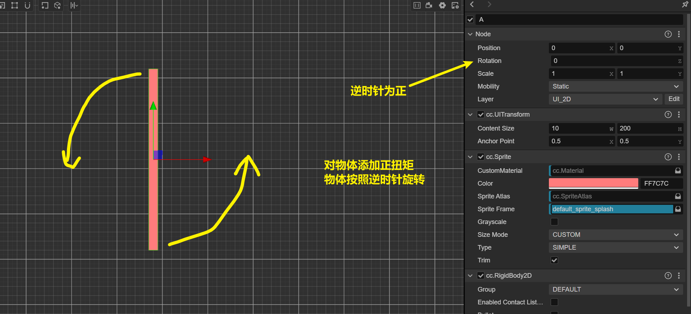
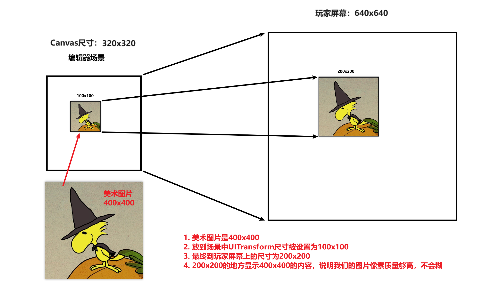

代码创建Mesh

```typescript
let mesh = cc.utils.MeshUtils.createMesh({
　　positions: [0, 10, 0, 0, 0, 0, 10, 0, 0, 10, 0, 0, 10, 10, 0, 0, 10, 0],
　　indices: [],
　　uvs: [0, 0, 0, 1, 1, 1, 1, 1, 1, 0, 0, 0],
});
```

# 属性检查器可见性

字段在检查器中的可见性规则如下：

如果设置了`@property({visible: true | false})`，那么就根据visible参数来控制。这个规则的优先级最高。

如果没有设置`@property({visible: true | false})`，则通过字段是否以下划线开头来判断，下划线开头的不在属性检查器中显示。

```typescript
// 即便以_开头，属性检查其中依然可见
@property({visible: true})
_mystring: string = ''

// 即便不是_开头，属性检查其中依然不可见
@property({visible: false})
mystring: string = ''
```

set方法永远不用@property修饰

get方法可以用@property修饰，来控制其在属性检查器中的可见性

！！！属性检查器中的可见与否，与此字段是否被序列化，毫无关系！！！

# 序列化

- 在场景中设置完属性检查器中的参数之后，按ctrl+s保存场景，这时，刚刚设置的那些参数就被保存到scene文件中了。关闭cocos编辑器，下次再打开的时候，编辑器中的值就是你上次设置的值。
- 将属性检查器中的参数，保存到scene中的功能是property装饰器提供的，property的serializable参数控制是否将此字段序列化。

下面三个property的用法是完全一样的，都是使用默认参数

```typescript
@property
myvar: string = ''

@property()
myvar: string = ''

@property({})
myvar: string = ''
```

# 资源管理

resources与assetManager在使用上的区别

resources直接加载资源就行了

```
resources.load(资源)
```

assetManager需要先加载ab包，再从ab包中加载资源

```
1. assetManager.loadBundle(ab包名字或路径) 在回调函数中得到ab包
2. ab.load(资源)
```

x

```typescript
// 从resources中加载资源
resources.load("test_assets/prefab", Prefab, (err, prefab) => {
    const newNode = instantiate(prefab);
    this.node.addChild(newNode);
});

resources.load("test_assets/image/spriteFrame", SpriteFrame, (err, spriteFrame) => {
    this.node.getComponent(Sprite).spriteFrame = spriteFrame;
});

resources.load("test_assets/image/texture", Texture2D, (err: any, texture: Texture2D) => {
    const spriteFrame = new SpriteFrame();
    spriteFrame.texture = texture;
    this.node.getComponent(Sprite).spriteFrame = spriteFrame;
});


// 加载ab包
assetManager.loadBundle('01_graphics', (err, bundle) => {
    bundle.load(...);
});

// 获取ab包
let bundle = assetManager.getBundle('01_graphics');

// 从ab包中加载资源
bundle.load(`image/texture`, Texture2D, function (err, texture) {
    console.log(texture)
});

```

# 打包android

cocos build之后的目录


# 旋转正负



# 鼠标位置

```javascript
    start() {
        input.on(Input.EventType.MOUSE_DOWN, this.onMouseDown, this);
        this.camera = this.node.getChildByPath("Camera").getComponent(Camera);
    }

    onMouseDown(e: EventMouse) {
        // e.getLocation()获取到的坐标是屏幕坐标系
        let screenPos = e.getLocation();
        console.log(screenPos);
        let worldPos = new Vec3();
        // 使用摄像机的screenToWorld方法可将屏幕坐标系中的坐标转为世界坐标系下
        this.camera.screenToWorld(new Vec3(screenPos.x, screenPos.y, 0), worldPos);
        console.log(worldPos);
    }
```

getLocation：获取鼠标的屏幕坐标位置，右下角为(0, 0)，左上角为(屏幕分辨率宽, 屏幕分辨率高)

getUILocation：获取鼠标的屏幕坐标位置，右下角为(0, 0)，左上角为(设计尺寸宽, 设计尺寸高)

# 物体质量2D

Collider的面积大小*Collider的密度=物体质量(kg)

注意长度32等于1米

要在物体创建之后的第二帧才能获取物体的质量

重点是Collider的面积大小，而不是UITransform的面积大小

例子，物体为BoxCollider2D，碰撞体的长宽为32和64，密度为0.8，那么碰撞体的面积为(32/32)x(64/32)=2，物体的质量为2x0.8=1.6

# 冲量和力

I=mxv

冲量=质量x速度变化量

冲量用于瞬间改变物体速度，所以只需要执行一次即可。

力用于缓慢改变物体速度，要在每个update中都施加力，持续一段时间。

# 摄像机与画布

- Canvas：画布，画布的内容会全部显示到屏幕上，也就是说画布就是玩家的屏幕。画布的内容是什么呢？画布的内容是摄像机的输出。画布尺寸与项目设计尺寸是同一个东西。
- 画布与玩家屏幕：画布尺寸200x400，玩家屏幕尺寸1000x2000，画布会放大来适配玩家设备的屏幕。画布尺寸200x400，玩家屏幕尺寸100x200，画布会缩小来适配玩家设备的屏幕。如果画布的w/h与屏幕的w/h不相等，则按照Fit Width或者Fit Height来适配屏幕。
- 长度32对应物理引擎的1米，这里的长度32指的是画布的长度而不是玩家屏幕的32个像素。假如我们的画布尺寸（设计尺寸）为320x640，那么对应物理引擎的物理世界为10米x20米。不管最终这个画布适配的屏幕尺寸为多少，我们在物理引擎中的尺寸都是10米x20米。
- 美术图片像素与UITransform Content Size：美术图片3200x3200像素，UITransform Content Size被设置为320x320，那么此精灵图对应物理世界的10米x10米（320/32=10），物理世界的尺寸只与UITransform Content Size的尺寸有联系，与美术图无关。美术图只与清晰度有关。
- Camera：摄像机，摄像机的输出内容是一张图片（不管摄像机看到的景色多么复杂，最终都会被摄像机作为一张图片进行输出），摄像机会把这张图片会输出到摄像机的targetTexture参数上，如果此参数为null，则摄像机会把这张图片输出到Canvas上。
- 多摄像机：如果有n个相机，且这n个相机的targetTexture都是null，那么这n个相机的内容都会被输出到Canvas上，Canvas上最终的内容就是这n张图片的堆叠。堆叠的方式与摄像机的clear flags、depth、材质的shader有关。所以玩家最终看到的就是这n张图片的堆叠。
- targetTexture：摄像机的targetTexture参数用来指定摄像机输出的地址，此参数类型为RenderTexture，可以自己创建一个RenderTexture，然后将RenderTexture赋值给摄像机的targetTexture，那么此摄像机的输出就不会输出到Canvas上了，而是输出到我们指定的RenderTexture上。我们可以将这个RenderTexture赋值给某个精灵图的SpriteFrame.texture参数上，这样一顿操作后，摄像机的输出就会显示到此精灵图上了。
- RenderTexture：就是一张空图片，我们将此RenderTexture的大小设置为100x200，那么就相当于我们有了一个100x200像素大小的空图片（这个图片中没有任何内容，可以理解为一张纯白的图片）。摄像机会将摄像机的内容输出到这张图片上，如果摄像机的输出尺寸为1000x2000，显然摄像机输出的图片超过了我们的RenderTexture的大小，所以最终的结果就是将摄像机的输出（1000x2000）等比例缩小为RenderTexture的大小（100x200），图片的内容是一样的只是清晰度变低了。如果RenderTexture的宽高比与摄像机的宽高比不一致，那么将有一部分摄像机的内容被裁剪丢弃。


