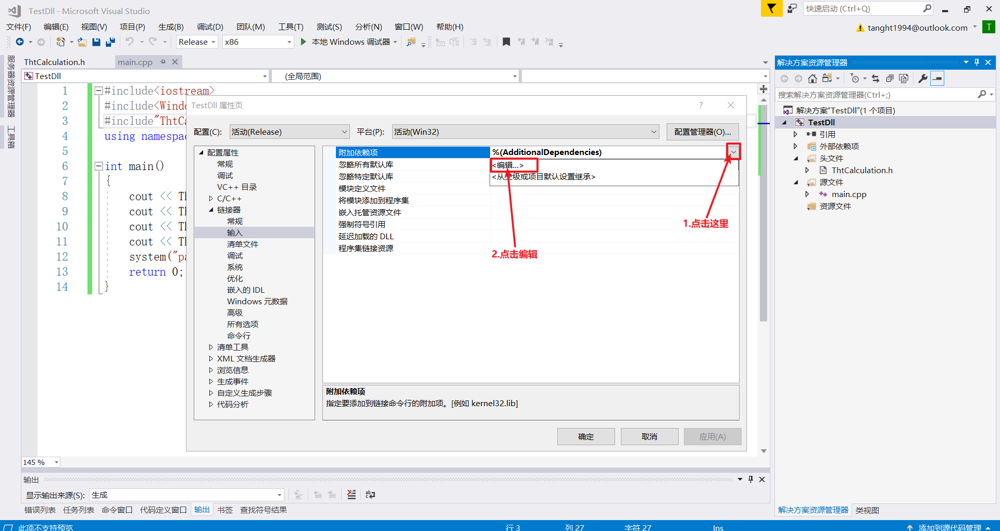

# 简介

- gcc：
- g++：
- MinGW：windows平台上的一个文件夹，这个文件夹中包含gcc.exe、g++.exe、等，用于在windows平台上使用gcc，但是你依然不能在windows中包含linux头文件（如：unistd.h）。
- cl.exe：windows平台上的c语言编译器，类似于linux平台的gcc
- Visual Studio：windows平台c、c++开发工具，按钮按一按就编译完成了，这个IDE内部拥有cl.exe等编译器
- Xcode：苹果平台c、c++开发工具，按钮按一按就编译完成了，这个IDE内部拥有编译器


open：linux平台上的c语言函数，c语言标准库中并没有这个函数。也就是说，这个函数只能在linux中用，在windows平台根本无法编译，因为windows平台可能并没有定义open这个函数，即便是定义了open函数，参数返回值等等都不一定一样。

fopen：标准c语言函数。不分平台，不管你是windows还是linux还是mac，这些平台必须实现这个函数。

# gcc/g++

CPATH：gcc/g++搜索头文件的路径，以:分隔

CPLUS_INCLUDE_PATH：g++搜索头文件的路径，以:分隔

C_INCLUDE_PATH：gcc搜索头文件的路径，以:分隔

LIBRARY_PATH：gcc/g++链接时搜索动态库/静态库的路径，以：分隔

LD_LIBRARY_PATH：程序运行时加载动态库的路径

使用gcc编译时，export上述环境变量当当前shell中，可以保存到一个shell脚本中，然后用source命令运行这个脚本。这样的话只对本次shell生效，不会影响全局的环境变量，随用随source。环境变量设置好之后，再使用gcc最多就只用-l指定一下库名了


## 总体选项

### -E 只激活预处理,这个不生成文件,你需要把它重定向到一个输出文件里 面. 例子用法: gcc -E hello.c > pianoapan.txt gcc -E hello.c | more 慢慢看吧,一个hello word 也要与处理成800行的代码

### -S

只激活预处理和编译，就是指把文件编译成为汇编代码。
例子用法
gcc -S hello.c
他将生成.s的汇编代码，你可以用文本编辑器察看
\### -c
只激活预处理,编译,和汇编,也就是他只把程序做成obj文件
例子用法:
gcc -c hello.c
他将生成.o的obj文件


## 目录选项

### -Wl:rpath,添加运行时库路径

-Wl:rpath, 后面也是路径，运行的时候用。这条编译指令会在编译时记录到target文件中，所以编译之后的target文件在执行时会按这里给出的路径去找库文件。

如：-Wl:rpath=/home/hello/lib

表示将/home/hello/lib目录作为程序运行时第一个寻找库文件的目录，程序寻找顺序是：/home/hello/lib-->/usr/lib-->/usr/local/lib。

可以加多个包含路径，程序在运行时的寻找顺序为添加的顺序。

### -L,添加链接库路径

-L 后跟路径，告诉链接器从哪找库(.so文件)，只有在链接时会用到。

如：-L /home/hello/lib

表示将/home/hello/lib目录作为第一个寻找库文件的目录，寻找顺序是：/home/hello/lib-->/usr/lib-->/usr/local/lib。

可以加多个包含路径，链接器的寻找顺序为添加的顺序。

### -l,添加引用链接库

-l 在链接时用到，它的作用是告诉链接器，要用到哪个库。 如：-l pthread

告诉链接器(linker)，程序需要链接pthread这个库,这里的pthread是库名不是文件名，具体来说文件句是libpthread.so。

### -I,添加包含路径

-I 在编译时用，告诉编译器去哪个路径下找文件

如：-I /home/hello/include

表示将/home/hello/include目录作为第一个寻找头文件的目录。

编译器的寻找顺序是：/home/hello/include-->/usr/include-->/usr/local/include。如果在/home/hello/include中有个文件hello.h，则在程序中用#include就能引用到这个文件。

可以加多个包含路径，编译器的寻找顺序为添加的顺序。

## 调试选项

### -g

只是编译器，在编译的时候，产生调试信息。

### -gstabs

此选项以stabs格式声称调试信息,但是不包括gdb调试信息.

### -gstabs+

此选项以stabs格式声称调试信息,并且包含仅供gdb使用的额外调试信息.

### -ggdb

此选项将尽可能的生成gdb的可以使用的调试信息.

### -glevel

请求生成调试信息，同时用level指出需要多少信息，默认的level值是2

## 链接选项

### -static 此选项将禁止使用动态库。

优点：程序运行不依赖于其他库

缺点：文件比较大

### -shared (-G) 此选项将尽量使用动态库，为默认选项

优点：生成文件比较小

缺点：运行时需要系统提供动态库

### -symbolic 建立共享目标文件的时候,把引用绑定到全局符号上.

对所有无法解析的引用作出警告(除非用连接编辑选项 `-Xlinker -z -Xlinker defs'取代)。

注：只有部分系统支持该选项.

## 错误与警告

### -Wall

一般使用该选项，允许发出GCC能够提供的所有有用的警告。也可以用-W{warning}来标记指定的警告。

### -pedantic

允许发出ANSI/ISO C标准所列出的所有警告

### -pedantic-errors

允许发出ANSI/ISO C标准所列出的错误

### -werror

把所有警告转换为错误，以在警告发生时中止编译过程

### -w

关闭所有警告,建议不要使用此项

## 预处理选项

### -Dmacro

相当于C语言中的#define macro

### -Dmacro=defn

相当于C语言中的#define macro=defn

### -Umacro

相当于C语言中的#undef macro

### -undef

取消对任何非标准宏的定义

## 其他选项

### -o

制定目标名称,缺省的时候,gcc 编译出来的文件是a.out,很难听,如果你和我有同感，改掉它,哈哈

例子用法
gcc -o hello.exe hello.c (哦,windows用习惯了)
gcc -o hello.asm -S hello.c
-O0
-O1
-O2
-O3
编译器的优化选项的4个级别，-O0表示没有优化,-O1为缺省值，-O3优化级别最高

### -fpic

编译器就生成位置无关目标码.适用于共享库(shared library).

### -fPIC

编译器就输出位置无关目标码.适用于动态连接(dynamic linking),即使分支需要大范围转移.

### -v

显示详细的编译、汇编、连接命令


# char与wchar_t

```c++
#include<stdio.h>
#include<locale.h>
#include<Windows.h>
int main()
{
	wchar_t str[] = L"你好啊";
	setlocale(LC_ALL, "Chs");
	printf("%ls %lc", str, str[1]);
	system("pause");
	return 0;
}

void fun1()
{
    wchar_t str[] = L"你好啊";
	setlocale(LC_ALL, "Chs");
	printf("%ls %lc", str, str[1]);
}

void fun1()
{
    char str[] = "你好啊";
	printf("%s %c", str, str[1]);
}
```


# coredump文件的生成与使用

windows下开启文件崩溃时自动创建dump文件的功能，以管理员身份运行下面的脚本即可。

```bash
@echo off
echo 正在启用Dump...
reg add "HKEY_LOCAL_MACHINE\SOFTWARE\Microsoft\Windows\Windows Error Reporting\LocalDumps"
reg add "HKEY_LOCAL_MACHINE\SOFTWARE\Microsoft\Windows\Windows Error Reporting\LocalDumps" /v DumpFolder /t REG_EXPAND_SZ /d "C:\CrashDump" /f
reg add "HKEY_LOCAL_MACHINE\SOFTWARE\Microsoft\Windows\Windows Error Reporting\LocalDumps" /v DumpType /t REG_DWORD /d 2 /f
reg add "HKEY_LOCAL_MACHINE\SOFTWARE\Microsoft\Windows\Windows Error Reporting\LocalDumps" /v DumpCount /t REG_DWORD /d 10 /f
echo Dump已经启用
pause
@echo on
```

- DumpFolder：告诉windows当程序崩溃时，自动创建的dump文件储存到哪里
- DumpType：告诉windows当程序崩溃时，创建的dump文件的类型，(0，不清楚)(1，只包含关键信息的dump文件)(2，包含全部信息的dump文件)
- DumpCount：告诉windows最大保留Dump个数，默认为10


windows下关闭自动创建dump文件的功能，以管理员身份运行下面的脚本即可。

```bash
@echo off
echo 正在关闭Dump...
reg delete "HKEY_LOCAL_MACHINE\SOFTWARE\Microsoft\Windows\Windows Error Reporting\LocalDumps" /f
echo Dump已经关闭
pause
@echo on
```

windows下dump文件的使用

vs编译项目的时候，除了生成一个.exe文件，还会生成一个对应的.pdb文件，pdb文件是调试用的，pdb文件包含了编译后程序指向源代码的位置信息，用于调试的时候定位到源代码。

1. 123.exe崩溃了
2. 操作系统发现123.exe崩溃时，会自动保存当前的123.exe的内部信息，调用栈之类的信息，这个信息保存到一个名为123xxx.dump的文件中，放到你设置的目录中，例如C:\crashdump文件夹下
3. 找到123.exe对应的,pdb文件，编译123.exe的时候自动生成了对应的.pdb文件
4. 把123.exe与123.pdb与123xxx.dump放到同一个文件夹下
5. 双击123xxx.dump，vs自动启动
6. 点击仅限本机调试
7. vs自动跳转到程序崩溃时的位置，甚至可以看一下调用找信息


# openssl

```c++
//VC++目录->包含目录，添加你的openssl库的头文件目录
//链接器->输入->附加依赖项，添加libcrypto.lib
//运行程序时会报错说缺少xxx.dll
//去openssl安装的目录找到这个xxx.dll文件，复制到项目的Debug文件夹下
//ok了

#define _CRT_SECURE_NO_WARNINGS
#include <stdio.h>
#include <string.h>
#include <openssl/evp.h>

int main()
{
	do
	{
		//我们将要对msg1和msg2这两块数据做摘要运算
		char msg1[] = "Hello Dog\n";
		char msg2[] = "Hello Cat";
		
		//md中储存了将要使用的摘要算法标识，有很多摘要算法，你得告诉opssl用什么算法进行摘要运算啊！
		//EVP_get_digestbyname("SHA1")返回sha1算法的标识，储存到md中
		//接下来将md传给摘要运算函数，然后那个函数就知道了，你想要用sha1进行运算
		const EVP_MD *md = nullptr;
		md = EVP_get_digestbyname("SHA1");	//md = EVP_sha1();效果一样
		if (md == NULL) {
			printf("Fuck! Don't Find Your DigestName");
			break;
		}

		//mdctx为程序上下文，其实就是一堆参数，包裹成了一个结构体，比直接传一堆参数方便。
		//比如EVP_DigestInit_ex()这个函数需要100个参数，
		//你不能真的设计成void EVP_DigestInit_ex（arg1, arg2, arg3, arg4...）写100个参数吧！
		//所以将这些参数放到EVP_MD_CTX结构体中，直接传一个EVP_MD_CTX就好了。
		//其实EVP_MD_CTX里面就是一堆int,double,char*等等的基本数据结构。
		EVP_MD_CTX *mdctx = nullptr;
		mdctx = EVP_MD_CTX_new();//创建一个程序上下文

		//初始化程序上下文
		//md中储存了你想要用的摘要算法，这个函数用md去初始化mdctx
		//所以mdctx就知道了你想要用什么算法了，并且mdctx还包含了其它信息供后面的函数用
		EVP_DigestInit_ex(mdctx, md, NULL);

		//向算法添加数据，将msg1添加进去
		EVP_DigestUpdate(mdctx, msg1, strlen(msg1));
		
		//向算法添加数据，将msg2添加进去
		EVP_DigestUpdate(mdctx, msg2, strlen(msg2));

		//如果有数据还可以继续添加，我们这里没有了，到这里就结束了
		//EVP_DigestUpdate(mdctx, msgN, strlen(msgN));

		//告诉openssl，我已经添加完数据了，可以给我计算摘要值了
		unsigned char md_value[EVP_MAX_MD_SIZE];	//储存最终的摘要值
		unsigned int md_len;						//储存摘要值的长度
		EVP_DigestFinal_ex(mdctx, md_value, &md_len);
		
		//释放上下文，将这一堆参数free掉
		EVP_MD_CTX_free(mdctx);

		//打印摘要值到屏幕上
		printf("Digest is: ");
		for (int i = 0; i < md_len; i++)
		{
			printf("%02x", md_value[i]);
		}			
		printf("\n");

	} while (false);

	system("pause");
	return 0;
}
```


# allocator与new的比较

new一个东西时，既申请了内存，又在申请的这块内存中进行了初始化（对元素调用默认构造函数）。

allocator一个东西时，只申请内存，不进行初始化。比new少了一步，所以比new快。

```c++
#include <iostream>
#include <vector>
#include <string>
#include <Windows.h>

#define gNumber 1000000

int main()
{
	unsigned long uStartTime = 0;
	unsigned long uEndTime = 0;

	//用new申请gNumber个字符串的空间，new会为每个字符串调用一次默认构造函数
	uStartTime = GetTickCount();
	std::string *pStr1 = new std::string[gNumber];
	uEndTime = GetTickCount();
	std::cout << "new cost: " << uEndTime - uStartTime << "ms" << std::endl;
	delete[] pStr1;


	//用allocator申请gNumber个字符串的空间，allocator不会调用字符串的默认构造函数
	uStartTime = GetTickCount();
	std::allocator<std::string> allocateStr;
	std::string *pStr2 = allocateStr.allocate(gNumber);
	uEndTime = GetTickCount();
	std::cout << "allocator cost: " << uEndTime - uStartTime << "ms" << std::endl;

	for (size_t i = 0; i < gNumber; ++i)
	{
		//如果前面构造了每个字符串，需要在这里析构每个字符串，不然会内存泄漏
		//前面没有构造，所以这里不用析构
	}
	allocateStr.deallocate(pStr2, gNumber);

	system("pause");
	return 0;
}
```


```c++
#include <iostream>
#include <Windows.h>

#define gNumber 1

class CA
{
public:
	CA(){ std::cout << "构造函数" << std::endl; }
	~CA() { std::cout << "析构函数" << std::endl; }
};

int main()
{
	std::cout << "start new..." << std::endl;
	CA * p1 = new CA[gNumber];
	delete[] p1;

	std::cout << "start allocator..." << std::endl;
	std::allocator<CA> allocatorCA;
	CA *p2 = allocatorCA.allocate(gNumber);
	allocatorCA.deallocate(p2, gNumber);

	system("pause");
	return 0;
}
```


# mysql

MySQL查询结果集：MYSQL_RES


```sql
SELECT * FROM table1;
```

我们的程序运行完尚书查询语句之后，mysql如何将这5条记录发送给我们？难道直接发过来一张excel表格么？肯定不是的，可以假设它发过来的是一堆字符串，其实就是一堆字符串，只不过是mysql自定义的格式的字符串。那么OK，我们如何解析这堆字符串？从第几个字节到第几个字节是第一条记录？第二条记录又记录在这堆字符串的什么地方？第3条呢？

OK，假设我们能找到第N条记录的位置，那么我们又如何找到第一条记录的哪几个字节表示第一个字段？第二个字段？第三个字段？

OK，太麻烦了！还好开发mysql的公司已经帮我们写好了，我们只需要用他的API就好了。


```c++
//执行sql语句，正常返回0
int mysql_query(MYSQL *mysql, const char *stmt_str);

//如果上一次执行的sql语句有结果集，则取结果集
//如果上次执行了MultipleStatement，可以多次调用此函数，每次取一条语句的结果集，没有结果集可取了则返回NULL，并且mysql_field_count()为0
MYSQL_RES *mysql_store_result(MYSQL *mysql);

// more results? -1 = no, >0 = error, 0 = yes 
int mysql_next_result(MYSQL *mysql);

//释放结果集
void mysql_free_result(MYSQL_RES *result)


```


# 代码中制定库名

```c++
#pragma comment (lib,"xxx.lib")
```


# 动态库的制作与使用

### 动态库是什么

动态库就是一堆函数的打包，调用这个动态的库的应用程序可以直接使用这个库中的函数，它是二进制格式的，不是源代码。例如有这么一个函数，函数名字叫fun1，它接收两个参数a和b，经过一系列骚操作之后返回结果c，你不需要清楚骚操作是什么，总之骚操作就是非常复杂的逻辑运算，代码实现的话要100w行。这个函数很好用，以至于你写的很多程序中都需要用到这个函数，甚至其他程序员（国内外的程序呀，火星的程序员，哈雷彗星上的程序员）也需要这个函数。

这时候有最直观的方法是，将fun1的代码复制N份发给各个程序员，其他程序员将fun1的代码放到自己的项目中，编译。但是这种方法很low啊，而且不方便，这代码有100w行啊，由很多文件组成，每次都复制代码的话太不方便了。更何况，开发这个fun1函数的程序员，并不想让其它的程序员知道这个函数的具体代码是怎么写的（因为这个代码写的炒鸡烂，他的作者不好意思被别人知道）。所以动态库（静态库也一样，这里不讨论静态库，动态库的区别，google上一堆解释，自己去查）就出现了，这个程序员将fun1编译成动态库，发给其它人，同时将动态库的说明书（也就是.h文件喽）也发给其他程序员。他是怎么做的呢？

1. 将fun1的源代码编译成动态库abc.dll、abc.lib（Windows，Linux中有些许的区别）。
2. 将fun1的头文件（函数声明，你总得告诉其它程序员这个函数接收几个参数，返回什么类型吧？不然其它程序员怎么调用你这个函数啊）与abc.dll与abc.lib发送给其它人。
3. 其他人有了这个函数的声明，就可以在代码中调用了。有了.lib，就可以编译了。有了.dll就可以运行了。

**注：.lib .dll是什么一会再说**

所以最终，你要知道，动态库就是一堆函数的实现过程，打包成一个.dll而已。一个动态库中可以包含很多函数的。

### Windows平台

#### 动态库的制作

使用VisualStudio2017制作动态库，最终生成MyFirstDll.dll与MyFirstDll.lib。我们将要制作的MyFirstDll库中包含了四个函数，分别是加减乘除，函数声明如下：

```c++
double ThtAdd(const double &a, const double &b); //计算a + b
double ThtSub(const double &a, const double &b); //计算a - b
double ThtMul(const double &a, const double &b); //计算a * b
double ThtDiv(const double &a, const double &b); //计算a / b
```

我们要在TestDll.exe中调用MyFirstDll.dll中的四个函数，测试是否成功。

1.打开VS，新建DLL项目，建完之后先编译一下，测试是否能编译成功，如果新建的项目都不能编译成功，把证明你的环境配置有问题，自己解决。99.9999%的情况下肯定能成功。


2.新建两个文件[ThtCalculation.h、ThtCalculation.cpp]


3.在ThtCalculation.h添加四个函数的声明。__declspec(dllexport)是必须的，作用是告诉编译器，这个函数可以给外部使用。不加declspec(dllexport)的话，外部软件就不能调用这个函数了。咱们的四个函数全部是给外部调用的，所以全部加上。


```c++
//ThtCalculation.h
#pragma once
__declspec(dllexport) double ThtAdd(const double &a, const double &b);
__declspec(dllexport) double ThtSub(const double &a, const double &b);
__declspec(dllexport) double ThtMul(const double &a, const double &b);
__declspec(dllexport) double ThtDiv(const double &a, const double &b);
```

4.在ThtCalculation.cpp中实现这四个函数。"pch.h"是windows快速编译的文件，没有这个文件的话也可以不include它。


```c++
//ThtCalculation.cpp
#include"pch.h"
#include<cmath>
#include"ThtCalculation.h"

double ThtAdd(const double & a, const double & b)
{
	return a + b;
}

double ThtSub(const double & a, const double & b)
{
	return a - b;
}

double ThtMul(const double & a, const double & b)
{
	return a * b;
}

double ThtDiv(const double & a, const double & b)
{
	if (abs(b) < 0.000001)
	{
		return 0.0;
	}
	return a / b;
}

```

5.编译


6.找到编译完的动态库


7.将动态库和.h文件放到同一个文件夹中，结束。


#### 动态库的使用

我们制作完了动态库，最终包含上述三个文件，一个.dll一个.lib一个.h。我们如何使用呢？很简单，直接将.h包含到项目中，调用动态库中的函数就行了。

1.创建TestDll项目


2.将动态库中的.h复制到我们的项目文件夹中，并添加到项目中


3.创建main函数，调用动态库中的函数


```c++
//main.cpp
#include<iostream>
#include<Windows.h>
#include"ThtCalculation.h"
using namespace std;

int main()
{
	cout << ThtAdd(10, 20) << endl;
	cout << ThtSub(10, 20) << endl;
	cout << ThtMul(10, 20) << endl;
	cout << ThtDiv(10, 20) << endl;
	system("pause");
	return 0;
}
```

4.告诉编译器，.lib的名字是什么，我们这里叫做MyFirstDll.lib。





5.告诉编译器，去哪里找到我们的动态库。编译器默认在项目的源文件目录搜索我们的.lib，如果你将.lib复制到项目的源代码目录中的话，那就不需要告诉编译器去哪里找动态库了。我们这里将.lib放在其它地方，所以我需要告诉编译器去哪里找.lib。


6.编译成TestDll.exe


7.双击运行我们的TestDll.exe，不出意外，肯定会报错，说找不到MyFirstDll.dll


8.终于.dll文件派上用场了，细心的你一定发现了，前面那么多步骤，都没有用到.dll。你的TestDll.exe会从它自己所在的目录和你的PATH环境变量所配置的路径中去找MyFirstDll.dll找不到就报错。我们这里就报错了，解决办法有多种：

1. 将MyFirstDll.dll所在的文件夹设置到PATH环境变量中
2. 将MyFirstDll.dll复制到TestDll.exe的文件夹中
3. 将MyFirstDll.dll复制到已经是PATH环境变量的文件夹中

我们这里用最简单的办法，直接把MyFirstDll.dll和TestDll.exe放到相同的文件夹中，再次运行TestDll.exe。成功！


注：.lib用于编译，.dll用于运行


### Linux平台

Linux平台特简单，这里就不说了。任何事情Windows总是要麻烦一些。


# GDB调试

gcc/g++编译的时候使用添加-g选项，多文件便宜的时候，需要每条g++ -c的时候都加-g选项

gdb a.out 进入gdb界面

run 开始运行代码，如果没有断点的话，那就一步到底了，所以run之前先设置好断点

break filename:line-number  设置断点

b filename:line-number  设置断点

l 显示10行代码(当前文件)

l 显示下10行代码(当前文件)

set listsize count 每次list显示的行数

list first,last 显示指定起始行到结束结束行的源文件

l test2.cpp:0 显示test2.cpp文件，从第0行开始，不能是l test2.cpp，这样的话会说找不到test2.cpp函数


# CMAKE

变量

| 变量名                                                   | 说明                                                         |
| -------------------------------------------------------- | ------------------------------------------------------------ |
| PROJECT_SOURCE_DIR                                       | 当前CMakeLists.txt所在的目录，前提是当前CMakeLists.txt调用了project()函数 |
| PROJECT_NAME                                             | project(xxx)指定的名字。比如project(HELLO)，则PROJECT_NAME == "HELLO" |
| PROJECT_BINARY_DIR                                       | cmake生成的文件的目标路径，比如生成的makefile的路径。默认为运行cmake命令时所在的目录。 |
| SET(EXECUTABLE_OUTPUT_PATH ${PROJECT_SOURCE_DIR}/../bin) |                                                              |


函数

| 函数名                                         | 说明                                                         |
| ---------------------------------------------- | ------------------------------------------------------------ |
| project(xxx)                                   | 设置PROJECT_NAME，只有这一个作用吗？                         |
| aux_source_directory(路径 变量)                | 获取路径下所有的.cpp/.c/.cc文件，并赋值到变量中              |
| set(变量 值)                                   | 设置变量，如：set(ABC_DIR ${PROJECT_SOURCE_DIR}/abc)         |
| message(消息1 消息2 ...)                       | 打印消息，如：message(abc   def   haha)，控制台输出"abcdefhaha"。也可以打印变改良的值，如：message("${变量}"  消息1  消息2 ...) |
| add_executable(${PROJECT_NAME} a1.cpp  a2.cpp) | 生成可执行文件                                               |
| add_definitions(编译选项)                      | 添加编译选项，如：add_definitions("-Wall -g")                |
| add_subdirectory(子文件夹名称)                 | 编译子文件夹的CMakeLists.txt                                 |
| include_directories(dir1 dir2 dir3)            | 添加头文件目录                                               |
|                                                |                                                              |
|                                                |                                                              |


```
# 本CMakeLists.txt的project名称
# 会自动创建两个变量，PROJECT_SOURCE_DIR和PROJECT_NAME
# ${PROJECT_SOURCE_DIR}：本CMakeLists.txt所在的文件夹路径
# ${PROJECT_NAME}：本CMakeLists.txt的project名称
project(xxx)

# 获取路径下所有的.cpp/.c/.cc文件，并赋值给变量中
aux_source_directory(路径 变量)

# 给文件名/路径名或其他字符串起别名，用${变量}获取变量内容
set(变量 文件名/路径/...)

# 添加编译选项
add_definitions(编译选项)

# 打印消息
message(消息)

# 编译子文件夹的CMakeLists.txt
add_subdirectory(子文件夹名称)
add_subdirectory(abc)
add_subdirectory(abc/d)  可以写路径
add_subdirectory("abc/d") 可以添加双引号

# 将.cpp/.c/.cc文件生成.a静态库
# 注意，库文件名称通常为libxxx.so，在这里只要写xxx即可
add_library(库文件名称 STATIC 文件)

# 将.cpp/.c/.cc文件生成可执行文件
add_executable(可执行文件名称 文件)

# 规定.h头文件路径
include_directories(路径)

# 规定.so/.a库文件路径
link_directories(路径)

# 对add_library或add_executable生成的文件进行链接操作
# 注意，库文件名称通常为libxxx.so，在这里只要写xxx即可
target_link_libraries(库文件名称/可执行文件名称 链接的库文件名称)
```


设置编译选项

找到需要的源文件

添加头文件目录

告诉cmake是生成可执行程序还是库文件

链接相关，设置链接库的目录

链接相关，设置链接库的名称   PROJECT_BINARY_DIR


默认情况下，在哪里运行cmake命令，就在哪里生成makefile文件，以及cmake的缓存文件，不管是`cmake .`还是`cmake ..`。makefile的生成位置与.和..无关，只与cmake的运行路径有关。可以通过cmake的变量来指定makefile的生成路径。

子CMakeLists.txt中定义的变量不会传递到父CMakeLists.txt

父CMakeLists.txt中定义的变量会传递到子CMakeLists.txt，子CMakeLists.txt可以覆盖父CMakeLists.txt中定义的变量，但是不影响父

运行到add_subdirectory()时，立即去执行子CMakeLists.txt中的代码，注意先后顺序


# 函数指针

## 普通函数

```c++
#include <iostream>
#include <string>

using namespace std;

void fun1(const string &name)
{
  cout << "My name is " << name << "." << endl;
}

// 给函数指针的类型起个别名
// My_Type 是什么类型呢？ void (*)(const string &)
// 很明显是一个指针，而且必须指向一个函数
typedef void (*My_Type)(const string &);

int main()
{
  // 直接在代码中定义函数指针类型来接收函数地址
  // void (*)(const string &) 这些都是在定义p1的类型
  // 与 int p1 没有区别，都是在定义p1的类型
  // 首先 (*) 代表p1是个指针，可以指向某个东西
  // 其次 xxx (*)xxx 这个结构代表p1只能指向某个函数
  // 再其次 void (const string &) 代表p1指向的函数必须是这样的签名
  void (*p1)(const string &) = fun1;
  p1("haha");

  // 使用typedef定义的类型来接收函数地址
  // p1 与 p2 完全相同
  My_Type p2 = fun1;
  p2("hehe");

  return 0;
}
```

`void (*p1)(const string &) = fun1`

- 直接拿fun1赋值就行了，不用&fun1，因为fun1就已经代表这个函数的地址了


## 类成员函数

```c++
#include <iostream>
#include <string>

using namespace std;

class Hi
{
  public:
    Hi(const string &time): m_time(time) {}
    void say_hi(const string &name);
  private:
    string m_time;
};

void Hi::say_hi(const string &name)
{
  cout << "Good " << this->m_time << " " << name << "." << endl;
}

int main()
{
  Hi a = Hi("morning");
  a.say_hi("tanght");

  // 将 p1 指向 Hi::say_hi
  // 注意 * 的位置，与普通的函数指针声明稍有不同
  // 注意 &Hi::say_hi ，不能直接写函数名，必须加上&
  void (Hi::*p1)(const string &) = &Hi::say_hi;
  // 调用成员函数指针
  (a.*p1)("tanght");

  return 0;
}
```

`void (Hi::*p1)(const string &) = &Hi::say_hi;`

- 声明时注意*的位置，紧邻p1
- 成员函数地址要加&，&Hi::say_hi

# 虚函数表

```c++
#include <iostream>

using namespace std;

class Base
{
public:
    Base() : data(0) {}
    ~Base() {}
    virtual void fun1()
    {
        cout << "base fun1" << endl;
    }
    virtual void fun2()
    {
        cout << "base fun2" << endl;
    }
    virtual void fun3()
    {
        cout << "base fun3" << endl;
    }
    virtual void fun4()
    {
        cout << "base fun4" << endl;
    }
    void fun5()
    {
        cout << "base fun5" << endl;
    }
    int data;
};

class Drive : public Base
{
public:
    Drive() : Base() {}
    virtual void fun2()
    {
        cout << "drive fun2" << endl;
    }
    virtual void fun4()
    {
        cout << "drive fun4" << endl;
    }
};

typedef void (*PFun)(void);
typedef PFun *VTableItem;
typedef VTableItem *PVTable;

void test(Base *p)
{
    auto VTableAddr = (PVTable)(p);
    cout << "VTableAddr:" << VTableAddr << endl;

    auto VTableFirstItem = (*VTableAddr);
    cout << "VTableFirstItem:" << VTableFirstItem << endl;

    auto VTableItem0 = VTableFirstItem + 0;
    cout << "VTableItem0:" << VTableItem0 << endl;
    auto PFun0 = *VTableItem0;
    cout << "Fun0Addr:" << (void *)PFun0 << endl;
    PFun0();

    auto VTableItem1 = VTableFirstItem + 1;
    cout << "VTableItem1:" << VTableItem1 << endl;
    auto PFun1 = *VTableItem1;
    cout << "Fun1Addr:" << (void *)PFun1 << endl;
    PFun1();

    auto VTableItem2 = VTableFirstItem + 2;
    cout << "VTableItem2:" << VTableItem2 << endl;
    auto PFun2 = *VTableItem2;
    cout << "Fun2Addr:" << (void *)PFun2 << endl;
    PFun2();

    auto VTableItem3 = VTableFirstItem + 3;
    cout << "VTableItem3:" << VTableItem3 << endl;
    auto PFun3 = *VTableItem3;
    cout << "Fun3Addr:" << (void *)PFun3 << endl;
    PFun3();
}

int main()
{
    Base obj1;
    Drive obj2;
    test(&obj1);
    cout << endl;
    test(&obj2);
    return 0;
}
```

