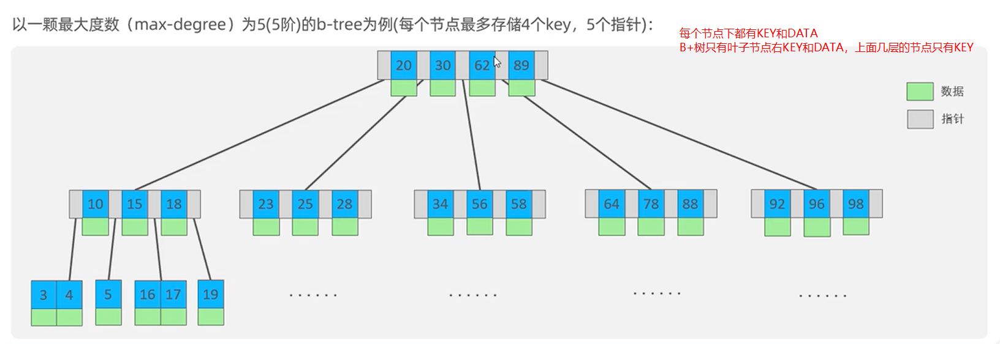
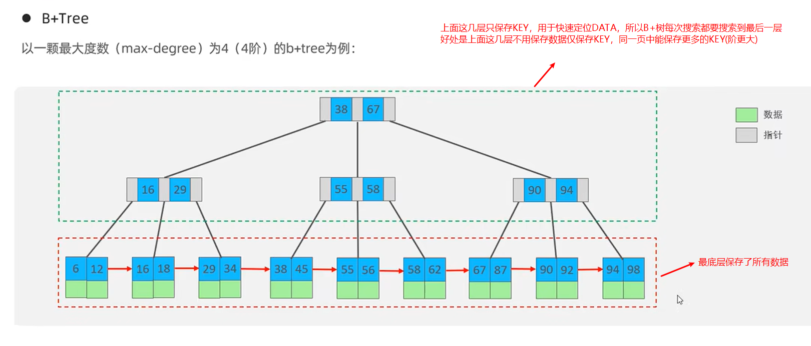
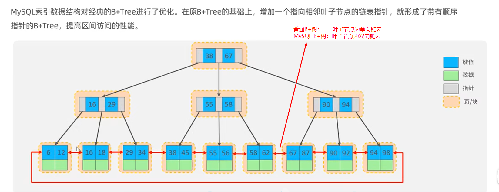
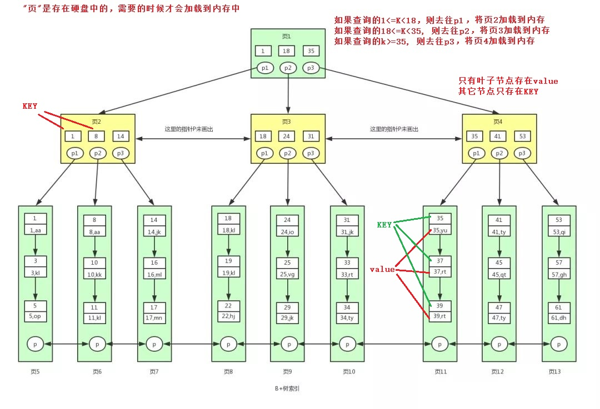
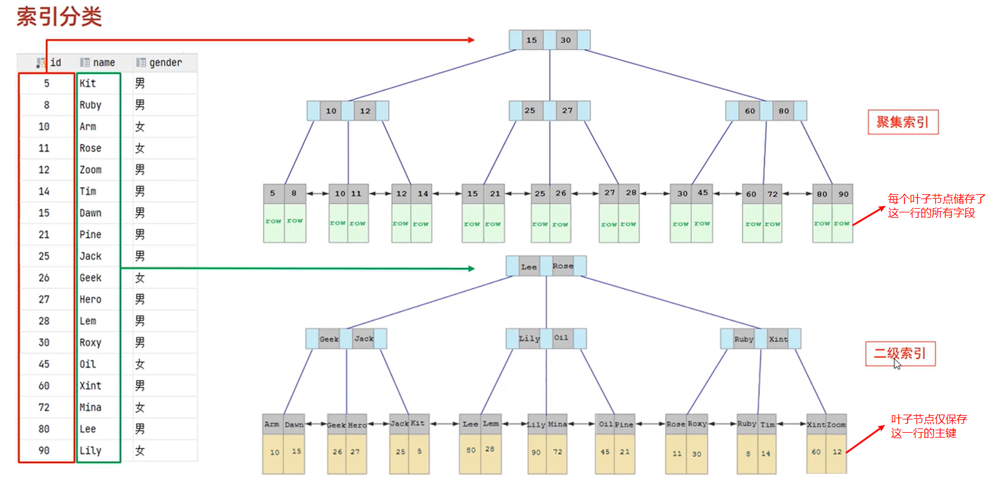
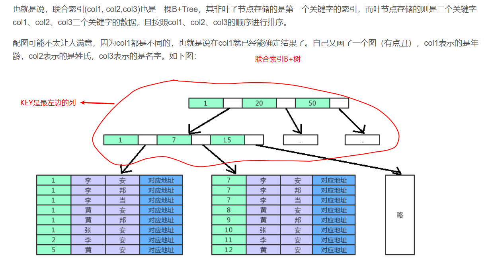

# MySQL

## 常用语句

```mysql
show full processlist;						# 查看当前进程列表
show variables like '%max_connections%';	# 查看最大连接数
show variables like 'xxxxx';				# 查询mysql的系统变量
set xxx = “123”;							# 设置mysql系统变量的值
show variables like 'event_scheduler';		# 查询event是否开启
SHOW EVENTS;								# 查询系统中所有event

# 字符集
show variables like '%char%';				#查看字符集
character_set_client
character_set_connection
character_set_database
character_set_filesystem
character_set_results
character_set_server
character_set_system
character_sets_dir

# 插入数据
INSERT INTO table_name (id, name,age) VALUES (1, "xiaoming", 18);

# 查询第0条数据以及往后1000条
SELECT * FROM xxxname LIMIT 0, 1000;

# 删除一段时间的数据
# ct为mysql的时间格式，直接跟字符串比较就行了
DELETE FROM xxxname WHERE ct > '2020-01-06 00:00:00' and ct < '2020-01-07 00:00:00';

# 查询test数据库所占用的空间
# 原理：MySQL软件中存在一个information_schema数据库，这个数据库保存了其它所有数据库的基本信息。
# 原理：information_schema数据库中存在一张表，名字为TABLES，这张表中有我们需要的数据（占用空间）
SELECT SUM(DATA_LENGTH) FROM TABLES WHERE TABLE_SCHEMA='test';	# 单位为字节

# 如果test1表存在，则将他删除
DROP TABLE IF EXISTS test1;	

# 创建表（test1不存在时才创建，若已经存在，则什么都不做）
CREATE TABLE IF NOT EXISTS test1 (
  id INT NOT NULL AUTO_INCREMENT,	# NOT NULL说明不能为空，AUTO_INCREMENT自增
  nick_name VARCHAR(255) NOT NULL,
  uid VARCHAR(30) CHARACTER SET utf8mb4 COLLATE utf8mb4_bin NOT NULL,
	age INT NOT NULL DEFAULT 0,
  gmt_create datetime NOT NULL DEFAULT CURRENT_TIMESTAMP,
  gmt_modified datetime NOT NULL DEFAULT CURRENT_TIMESTAMP ON UPDATE CURRENT_TIMESTAMP,
  PRIMARY KEY (id)
) ENGINE=InnoDB AUTO_INCREMENT=1 DEFAULT CHARSET=utf8mb4 COLLATE=utf8mb4_bin;

# 创建用户
CREATE USER 'haha1'@'%' IDENTIFIED BY '123456';	#  %表示可以从任何主机登陆
CREATE USER 'haha2'@'192.168。20.%' IDENTIFIED BY '123456';	# 20网段的可以登录

# 删除用户
DROP USER 'username'@'host';

# 修改密码
SET PASSWORD FOR 'root'@'localhost' = PASSWORD('123456');

# 授权
GRANT 权限 ON 数据库.表名 TO '账户名'@'主机';
GRANT SELECT, INSERT ON test.user TO 'tht'@'%';#tht可以访问test数据库下的user表格，拥有S、I权限
GRANT ALL ON test.* TO 'tht'@'%';#tht可以访问test数据库下的所有表，对所有表拥有满权限

# 撤销授权
REVOKE 权限 ON 数据库.表名 FROM '账户名'@'主机';

# 修改数据
UPDATE <表名> SET 字段 1=值 1 [,字段 2=值 2… ] [WHERE 子句 ];

# /etc/mysql/debian.cnf配置文件记录了debian-sys-maint超级用户的密码，可以通过这个用户来修改其它人的密码，包括root用户
# 必须用sudo打开这个文件，否则看不到文件内容
# /etc/mysql/mysql.conf.d/mysqld.cnf中bind-address = 127.0.0.1这一行要注释掉，否则这个mysql只能在本地用，外界不能访问

use mysql;
update mysql.user set authentication_string=password('root') where user='root' and Host ='localhost';
update user set plugin="mysql_native_password"; 
flush privileges;
quit;
sudo service mysql restart
mysql -u root -p 
```

## 储存过程

```mysql
SET @abc = 10;	# 声明+设置局部变量
SET bcd = 20;	# 设置系统变量，必须得是系统中有的变量才能设置

# 储存过程中给变量设置值 SELECT INTO
SET @mark_time = '2020-01-01 00:00:00';
SELECT DATE_SUB(CURRENT_TIMESTAMP(),INTERVAL 93 DAY) INTO @mark_time;

# 有些语句不能在储存过程中使用，可以使用预备语句
SET @mark_id = 0;
SET @sql_get_mark_id = CONCAT('SELECT id INTO @mark_id FROM ', param_table_name, ' WHERE gmt_create > "', @mark_time, '" LIMIT 1;');
PREPARE stmt FROM @sql_get_mark_id;
EXECUTE stmt;
```

用procedure来创建表

```mysql
USE `testdb`;
DROP procedure IF EXISTS `procedure_test`;

DELIMITER $$
USE `oversea`$$
CREATE DEFINER=`root`@`%` PROCEDURE `procedure_test`(IN t_name VARCHAR (100))
BEGIN
set @s1 = "`id` bigint unsigned NOT NULL AUTO_INCREMENT COMMENT '自增序列',";
set @s2 = "`gmt_create` datetime NOT NULL DEFAULT CURRENT_TIMESTAMP COMMENT '创建时间',";
set @s3 = "`gmt_modified` datetime NOT NULL DEFAULT CURRENT_TIMESTAMP COMMENT '修改时间',";
set @s4 = "`ts` int unsigned NOT NULL default 0 COMMENT '此数据创建的UTC时间戳',";
set @s5 = "`ty` varchar(50) NOT NULL DEFAULT '' COMMENT '文档类型',";
set @s6 = "`doc` varchar(2048) NOT NULL DEFAULT '' COMMENT '内容',";
set @s7 = "PRIMARY KEY (`id`),";
set @s8 = "KEY `idx_ts` (`ts`),";
set @s9 = "KEY `idx_ty` (`ty`)";
set @s10 = concat(@s1, @s2, @s3, @s4, @s5, @s6, @s7, @s8, @s9);
set @s11 = "ENGINE=InnoDB DEFAULT CHARSET=utf8mb4 COLLATE=utf8mb4_bin COMMENT='统计-原始数据';";
set @sqlct = concat('CREATE TABLE ', t_name, " (", @s10, ") ", @s11);
PREPARE sqlct FROM @sqlct;
EXECUTE sqlct;
END$$

DELIMITER ;
```

创建表相关：

```mysql
USE `test`;	#在test数据库中创建表	`这个符号是mysql的转义符号
CREATE TABLE test01 (
  `id1` bigint unsigned NOT NULL AUTO_INCREMENT COMMENT 'xxxxx',
  `id2` int NOT NULL DEFAULT 0
  `id3` int NOT NULL DEFAULT 0
  `id4` int NOT NULL DEFAULT 0
  `id5` int(11) NOT NULL COMMENT 'xxxx',
  `create_time` datetime NOT NULL DEFAULT CURRENT_TIMESTAMP COMMENT '',
  `modified_time` datetime NOT NULL DEFAULT CURRENT_TIMESTAMP ON UPDATE CURRENT_TIMESTAMP COMMENT '最后修改时间',
  PRIMARY KEY (`id2`,`id3`),
  UNIQUE KEY `uniq_id` (`id1`) USING BTREE,
  INDEX `idx_id4` (`id4`) USING BTREE # 索引
) ENGINE=InnoDB DEFAULT CHARSET=utf8;

# `这个符号是mysql的转义符号，如果创建的表名或字段名与mysql的关键字冲突了，则需要使用``包起来；
# USE `test` 表示在test数据库中创建表；
# COMMENT 'xxx' COMMENT关键字的意思是，后面的内容为注释；
# int(11) 创建一个int类型的字段，（11）没用，数据位数只跟类型有关，跟（）中的数字无关；
# AUTO_INCREMENT关键字是自增的意思，也就是说下一条数据是上一条数据+1，向表中插入数据的时候，不用填充被AUTO_INCREMENT修饰的字段；
# 被NOT NULL修饰的字段不允许为空，也就是说在插入数据的时候，NOT NULL字段必须有值；
# DEFAULT 默认值，带有默认值的字段，即便为NOT NULL，在插入的时候也可以不填充数据，因为如果没有值的话，他就会被默认值填充，所以依然不为空，满足NOT NULL的条件；
# id1被设置为自增的，所以它必须是唯一的(UNIQUE KEY);
```

错误 "this is incompatible with sql_mode=only_full_group_by"

```sql
-- 查看系统变量sql_mode，可以看到sql_mode中带有ONLY_FULL_GROUP_BY这个值，就是这个值造成了这个错误
show variables like "sql_mode"

-- 解决办法，使用sql语句（临时）重新设置这个系统变量，删除ONLY_FULL_GROUP_BY这个值，其它的保持不变
set @@GLOBAL.sql_mode=STRICT_TRANS_TABLES,NO_ZERO_IN_DATE,NO_ZERO_DATE,ERROR_FOR_DIVISION_BY_ZERO,NO_AUTO_CREATE_USER,NO_ENGINE_SUBSTITUTION
-- 解决办法，在mysql的配置文件（my.cnf）中设置这个系统变量，删除ONLY_FULL_GROUP_BY这个值，其它的保持不变，永远生效
sql_mode=STRICT_TRANS_TABLES,NO_ZERO_IN_DATE,NO_ZERO_DATE,ERROR_FOR_DIVISION_BY_ZERO,NO_AUTO_CREATE_USER,NO_ENGINE_SUBSTITUTION
```

字符串连接函数

```sql
-- 字符串连接，若str1，str2，strN中有一个为NULL，返回值则为NULL
concat("str1","str2","str3",...);
-- 尽管id或score不是string类型，也当作string类型进行连接
select concat (id, name, score) as info from test1;
-- 使用 连接符 进行字符串连接
concat_ws("连接符", str1, str2, ...);
-- 分组字符串连接
group_concat()
-- 使用名字分组，也就是说相同名字的记录只显示一条，这时候将相同名字的id连接到一起返回给我
select name, group_concat(id) from test group by name
-- 还可以指定连接的时候的排序和分隔符(排序order by id desc)(分隔符separator "+")
select name, group_concat(id order by id desc separator "+") from test group by name
```

## 定时任务

```shell
# 查看event
show events;

# 创建event
CREATE EVENT e_test2
ON SCHEDULE EVERY 1 DAY
DO TRUNCATE aaa;
```

## 删除所有表

```shell
SELECT concat('DROP TABLE IF EXISTS ', table_name, ';')
FROM information_schema.tables
WHERE table_schema = 'mydb';
```

## 允许远程访问

首先要设置防火墙，开放mysql的端口

其次要让mysql监听0.0.0.0这个IP，默认mysql监听的是127.0.0.1，可以在配置文件中将`bind-address = 127.0.0.1`这个配置项注释掉，然后重启mysql服务

### 查看各用户的允许登陆IP：

```mysql
use mysql;
select host,user from user;
```

结果：


说明：

通过tht用户登陆，可以通过任何IP地址访问此数据库

通过root登陆，只能使用本机登陆

### 修改mysql.user表，允许root通过所有IP地址登陆

```mysql
use mysql;
update user set host = '%' where user = 'root';
flush privileges;
```

## 用户权限管理

### 查看用户

```mysql
SELECT host, user FROM mysql.user;
```

### 创建用户

创建用户`zhangsan`，可以从`192.168.7.45`，`192.168.7.46`，`192.168.7.47`这三个IP登陆，密码为`123456`。

允许多IP的话，就是多执行几次CREATE USER命令，每次变化IP就行了。

```mysql
CREATE USER 'zhangsan'@'192.168.7.45' IDENTIFIED BY '123456';
CREATE USER 'zhangsan'@'192.168.7.46' IDENTIFIED BY '123456';
CREATE USER 'zhangsan'@'192.168.7.47' IDENTIFIED BY '123456';
```

创建用户，可以从任何IP登陆。

```mysql
CREATE USER 'zhangsan'@'%' IDENTIFIED BY '123456';
```

### 删除用户

```mysql
DROP USER '用户名'@'IP';
```

### 修改密码

```shell
SET PASSWORD FOR 'root'@'localhost' = PASSWORD('newpass')
```

### 查看权限

```mysql
# 查看当前用户的权限
SHOW GRANTS;
# 查看指定用户的权限
SHOW GRANTS FOR 'tanght'@'%';
```

### 添加权限

修改权限后必须重启mysql（貌似）

```mysql
# ALL代表所有权限
GRANT ALL PRIVILEGES ON *.* TO `tanght`@`%` WITH GRANT OPTION;

# 也可以指定权限
GRANT SELECT, INSERT, UPDATE, DELETE, CREATE, DROP, RELOAD, SHUTDOWN, PROCESS, FILE, REFERENCES, INDEX, ALTER, SHOW DATABASES, SUPER, CREATE TEMPORARY TABLES, LOCK TABLES, EXECUTE, REPLICATION SLAVE, REPLICATION CLIENT, CREATE VIEW, SHOW VIEW, CREATE ROUTINE, ALTER ROUTINE, CREATE USER, EVENT, TRIGGER, CREATE TABLESPACE, CREATE ROLE, DROP ROLE ON *.* TO `tanght`@`%` WITH GRANT OPTION;

# 刷新
FLUSH PRIVILEGES;
```

### 删除权限

```mysql
REVOKE ALL ON *.* FROM 'user'@'IP';
```

## navicat报错

Client does not support authentication protocol requested by server...

两种解决办法

1.升级navicat驱动，使其支持mysql最新版本

不会

2.将mysql的密码验证规则改为老式规则

`ALTER USER 'root'@'%' IDENTIFIED WITH mysql_native_password BY 'your_password';`

## 安装

ubuntu在线安装

`sudo apt install mysql-server`安装mysql服务，顺便装了mysql-cli

`sudo mysql_secure_installation`首次配置mysql，密码什么的

## 重启Mysql

```shell
sudo /usr/local/mysql/mysql8000020/bin/mysqladmin -h127.0.0.1 -P3309 -uroot -p shutdown
sudo nohup /usr/local/mysql/mysql8000020/bin/mysqld --defaults-file=/data/mysqldata/mysql3309/my.cnf >/dev/null 2>&1 &
```

## 查看mysql状态

mysql有两种变量(全局变量、会话变量)，一种状态(当前实例的状态)

show global variables查看全局变量

set global var_name=value设置全局变量(此session必须是root才有权限设置全局变量)

set session var_name=value设置会话变量(设置自己的变量随意设置，不影响其它session)

show global status查看mysql的状态

```mysql
show variables;
show variables like "%max_prepared_stmt_count%";
SET GLOBAL var_name
SET SESSION var_name

SHOW GLOBAL STATUS;
SHOW GLOBAL STATUS LIKE 'com_stmt%';
```

## 事务隔离级别

show session variables like 'transaction_isolation';

show global variables like 'transaction_isolation';

set session transaction_isolation=READ-COMMITTED

- 读未提交：READ-UNCOMMITTED
- 读已提交：READ-COMMITTED
- 可重复读：REPEATABLE-READ
- 可串行化：SERIALIZABLE

### 不可重复读

READ-UNCOMMITTED 与 READ-COMMITTED 都是不可重复读，考虑如下场景

t0时刻：事物 A 查询 id=1 的记录，结果为 {id: 1, num: 10}

t1时刻：事物 B 修改 id=1 的记录为 {id: 1, num: 50}，并提交

t2时刻：事物 A 再次查询 id=1 的记录，得到的结果是 {id: 1, num: 50}

结论：同一个事物内，不同时刻，执行相同的SQL语句，得到的结果不同，这就是不可重复读。

### 可重复读

事物 A 不管任何时候查询 id=1 的记录，结果都与它第一次查询的时候得到的结果相同。不管这期间是否有其它事物对id=1的记录进行修改与否，提交与否。

需要利用"快照"技术实现可重复读的特性。快照技术那就涉及到MVCC，undo-log（undo日志），Read view（一致性视图），事务链等技术。

RC：在每次SELECT的时候生成ReadView

RR：只在第一次SELECT的时候生成Read View

## 索引

### 索引结构

#### 二叉树

每个节点只保存一个k-v对

#### b树

每个节点存多个k-v对

每个节点存多个k-v对，同一个节点中的k-v对按照从大到小的顺序排列，在此节点中搜索一个特定的key时，可以使用二分查找



#### b+树

对b-树的升级

只有叶子节点保存key-value，上层节点只保存key

各叶子结点之间用指针连接为**单向链表**



#### mysql索引树

对b+树的升级

叶子结点连接为双向链表



页的概念



### 聚集索引&二级索引

聚集索引叶子节点key-value对中的value保存的是**这行记录的所有数据**

二级索引（普通索引）叶子节点key-value对中的value保存的是**这行记录的主键**（获取其它数据需要回表）

主键索引的保存格式为聚集索引，普通索引（不管是不是唯一索引）的保存格式为二级索引



### 联合索引



### 索引失效

对索引列进行数学运算

对索引列使用 `not in` 或 `!=`

### 索引文件

innodb的数据全部存储在主键索引文件中，不存在数据文件。

- t表，有a、b、c、d四个字段，a为主键，则这张表只会存在一个a字段的索引文件，名字为t-a.idx。
- 这时对字段b创建索引，则会新生成一个以b为KEY的索引文件t-b.idx，这个文件中的KEY为字段b的值，值为t表的主键(a字段)。
- 如果执行select * from t where b=1的话，会通过t-b.idx文件定位到a字段
- 然后拿着a字段去t-a.idx文件中拿到这条记录的全部信息
- 根本原因就是t-b.idx索引文件中不会储存所有数据，只储存b字段与t表的主键(a字段)
- 拿着a字段去t-a.idx文件中获取数据的过程叫做回表。
- select a, b, c from t where b=1也是先从t-b.idx拿到a字段，然后根据a字段去t-a.idx中拿到a、b、c字段
- select a, b from t where b=1这个就好玩了，因为可以从t-b.idx文件中同时拿到a、b两个字段，所以就不用回表了
- 所以对于一些频繁查询来说，可以创建一个联合索引，使得从一个文件中即可获取所需的字段，这样可以节省回表的时间

## 锁

必须通过索引操作数据，才会使用行锁或范围锁，不通过索引来操作数据的话，直接用表锁

### 按照锁的范围可以分为三类

表锁：锁住整张表，如修改表结构的语句

行锁：锁住一条记录，如`where id=10`且10这条记录存在的话

范围锁：分为间隙锁（左开右开）和Next Key锁（左开右闭）

### 按照锁的作用分为两类

普通锁：就是普通的锁

意向锁：辅助用途，比如对一条记录加锁了，顺便对这张表加一个意向锁

## 多版本并发控制（MVCC）

关键词：事务ID、回滚指针、版本链、一致性视图、数据快照

### 每行数据的结构

每行数据有多个版本（你看到的是一行数据，其实MySQL内部存了多行，连这行数据的历史版本也存了下来，历史版本在commit之后被删除），每行数据有三个必须有的字段如下：

主键ID：如果你没设置主键ID，MySQL会给你的表添加一个自增的Row ID作为主键ID

事物ID：用于版本控制，通过与Read View对比控制可见性

回滚指针：指向此记录的上一个版本，形成版本链

### Read View

Read View由四部分组成，如下：

活跃事务列表：此刻所有活跃事务（还未提交的事务）的一个列表，符号为m_ids

最小活跃事物ID：活跃事务列表m_ids中最小的ID，符号为min_trx_id

下一个事务ID：此刻应该分配给下一个事务的事务id值，符号为max_trx_id

自己的事务ID：创建Read View的这个事务自己的事务ID，符号为creator_trx_id

可见性规则如下：

trx_id == creator_trx_id：意味着是自己读自己的修改，所以肯定可见

trx_id < min_trx_id：意味着trx_id 这个版本对于此事务来说早就已经提交了，可见

trx_id == min_trx_id：min_trx_id为活跃事务，还没提交呢，所以不可见

trx_id >= max_trx_id：意味着在读未来的版本，所以不可见

min_trx_id < trx_id < max_trx_id 且 trx_id 不在 m_ids 中：可见

min_trx_id < trx_id < max_trx_id 且 trx_id 在 m_ids 中：不可见

举例：

```
事务开始，创建Read View，Read View为 ([10, 20, 30, 40] 和 50)
读一条数据，这条数据的版本链为 [80 -> 55 -> 30 -> 25]
版本80肯定不可见，因为我们创建的Read View最大的版本为50，意味着大于等于50的版本，都是未来的数据
版本55与版本80一样不可见
版本30也不可见，因为在Read View的活跃事务列表中，意味着还未提交
版本25小于50且不在活跃事务列表中,所以我们要的数据是版本25
```

读已提交：在每次SELECT的时候创建Read View

可重复读：只在第一次SELECT的时候创建Read View

## 性能测试

- 4核 - 8G - 普通机械硬盘 - 云服务器 - MySQL8.0
- 10张表, 每张表50W数据，每张表有20个字段，5个索引，不存在外键
- 读写都是基于主键或索引的情况下
- 每个请求都是单一的查询或修改, 不存在多表查询
- 读写比为9:1时的 QPS为 4800，CPU使用率为60%
- 纯读时 QPS为 9000，CPU使用率为60%
- CPU使用率到达 60% 之后上不去了，因为性能卡在硬盘速度上了

# Redis

## 远程登录

whereis redis.conf

/etc/redis/redis.conf

修改redis.conf

将bind 127.0.0.1 ::1注释掉，替换成bind 0.0.0.0 ::1

protected-mode no改成protected-mode yes

## 设置密码

即使设置了密码，使用本机的redis-cli也不需使用密码

使用redis-cli登陆redis

config set requirepass返回值是空字符串，说明没有密码

config set requirepass 123456设置密码为123456

## 分布式锁

```go

```

## 缓存击穿

问题：大量的key同时过期，导致大量请求同时去mysql

解决方案：设置超时时间的时候，将超时时间随机10%

## 缓存穿透

问题：大量查询不存在的key，导致每次查询都需要去mysql

解决：即使查询不存在的key，也要将NULL缓存起来

## 持久化

AOF：Redis 会在指定时刻或满足触发条件时，fork 出子进程，由子进程把当前数据内存快照写入一个 `.rdb` 文件，主进程继续响应客户端请求。触发快照的方式可在配置文件 `redis.conf` 中通过 `save <seconds> <changes>` 来指定

- 性能开销小：快照操作是子进程执行，且只在满足条件时触发，对 Redis 主进程几乎无影响
- 重启恢复快：RDB 文件体积小，加载速度快，适合大数据量的快速恢复
- 文件紧凑：二进制格式压缩后体积较小，便于长期归档和冷备份
- 数据丢失窗口：只在快照时刻持久化，中间写操作失败或 Redis 崩溃会丢失最近一次快照之后的数据
- 期间 I/O 峰值：在生成 RDB 时会有一次性写入磁盘的 I/O 峰值，可能对磁盘造成短暂压力

RDB：Redis 把每条写命令（如 `SET`、`DEL`）以“Redis 协议格式”的形式追加写入 AOF 文件。Redis 重启时，通过 replay AOF 中的命令来恢复数据

## 大KEY

危害：如果不小心读取了这个KEY，那么会非常耗时（CPU和宽带），同时阻塞住redis服务的其它操作。如果是集群架构，甚至可能造成故障切换。

解决：拆分大KEY，比如按照userid % 1024将大KEY拆分成1024个小KEY

## 热KEY

此key的访问量非常大，会将redis压垮

解决方案1是增加redis服务器的性能

解决方案2是讲热key的数据直接读到程序中，不用访问redis了

可通过一定的办法在运行中发现热key，然后立即将热key读到程序中

## 过期删除策略

- 惰性删除 + 定期删除，定期删除的时间间隔通过配置项 hz 来设置
- 惰性删除：数据被访问时（读写），查看此数据是否已经过期，如果过期了就删除
- 定期删除：redis 会定期遍历过期字典，每次随机挑选一部分数据进行过期检测，如果数据已过期，就会被删除掉。将 hz 设置为10，代表每秒执行10次扫描
- 过期数据时保存在 redisDb 这个全局 struct 中的 map 字段中（redisDb.map称为过期字典）

## 过期回调

1. 配置项 notify-keyspace-events 来开启过期回调
2. 订阅 redis 自带的频道，接收过期事件
3. redis仅保证发送通知，不保证客户端有没有接收到

## 内存满了删除策略

配置项maxmemory设置满内存删除策略

- noeviction：插入数据时直接返回错误，不淘汰任何已经存在的redis键
- volatile-ttl：删除快过期的redis键
- allkeys-random：随机删除redis键
- volatile-random：随机删除有过期时间的redis键
- allkeys-lru：所有的键使用lru算法进行淘汰
- volatile-lru：有过期时间的使用lru算法进行淘汰
- volatile-lfu：根据lfu算法从有过期时间的键删除
- allkeys-lfu：根据lfu算法从所有键删除

LRU：优先淘汰最旧的数据（关键是最旧）（map+双向链表）

LFU：优先淘汰最少使用的数据（关键是使用次数）（map+最小堆）

## 集群

go-redis实现了集群的功能，直接使用即可，go-redis通过计算hash(key)可以找到此key放在哪个redis的slot中

Hash Tag，指定哪部分key参与slot的计算

```
key1 = "{user:123}.profile"
key2 = "{user:123}.settings"
```

## 慢查询

使用redis命令可以查看慢日志

相关命令如下：

```shell
# 查看最近 50 条慢命令
SLOWLOG GET 50

# 清空慢查询日志
SLOWLOG RESET

```

配置如下：

在redis的配置文件使用如下字段控制慢日志

```shell
# 大于 100000 微秒的算作慢查询
slowlog-log-slower-than 100000

# 慢日志最多记录 128 条，超过后丢弃旧日志
slowlog-max-len 128
```


# MongoDB

mongodb无需创建数据库，也无需创建表，插入数据的时候如果数据库或表不存在，则自动创建。

如果一个表还未存在，你也可以提前对它创建索引，当这个表被创建出来的时候索引就生效了。

## 安装

https://www.mongodb.com/docs/manual/tutorial/install-mongodb-on-red-hat/

/etc/yum.repos.d/mongodb-org-7.0.repo

```
[mongodb-org-7.0]
name=MongoDB Repository
baseurl=https://repo.mongodb.org/yum/redhat/7/mongodb-org/7.0/x86_64/
gpgcheck=1
enabled=1
gpgkey=https://www.mongodb.org/static/pgp/server-7.0.asc
```


sudo yum install -y mongodb-org

sudo systemctl daemon-reload

sudo systemctl start mongod

mongosh

创建超级用户

```
use admin
db.createUser(
  {
    user: "root",
    pwd: "dtfh45h",
    roles:
    [ "root"]
  }
)
```

vim /etc/mongod.conf

```
127.7.7.1 -> 0.0.0.0
security:
  authorization: enabled
```

sudo systemctl stop mongod

sudo systemctl start mongod

mongosh  -u root -p dtfh45h


## 超级管理员

mongodb的用户时针对单个数据库的，比如数据库A中的用户与数据库B中的用户时完全隔离的。不存在可以操作所有数据库的用户。超级管理员可以操作所有数据库。

mongodb刚安装完成时，只允许从localhost访问，且不需要用户密码。这时可以创建超级管理员。

```shell
use admin
db.createUser( { user: 'root', pwd: '123456', roles: ['root'] })
```

roles为root的用户就是超级管理员。

创建完超级管理员之后就可以打开mongodb的远程访问了，并开启密码登录。

1. 创建超级管理员
2. 开启远程访问并开启密码登录

顺序一定不要错，如果你先开启密码登录，你就无法登录了！因为你还没创建超级管理员！

## partial index

部分索引的意思是，只有符合条件的数据才会被建立索引

比如将phone字段设置为唯一索引，那么整个表中只能存在1个没有phone字段的数据

```json
{"name": "tanght1", "age": 18, "phone": "13302166666"}
{"name": "tanght2", "age": 18}  X!唯一索引冲突
{"name": "tanght3", "age": 18}  X!唯一索引冲突
```

```json
{"name": "tanght1", "age": 18, "phone": "13302166666"}
{"name": "tanght2", "age": 18, "phone": ""}  X!唯一索引冲突
{"name": "tanght3", "age": 18, "phone": ""}  X!唯一索引冲突
```

只有存在phone字段且phone字段不是空字符串时才做唯一索引检查，需要使用部分索引

上述条件可以简化为phone字段大于""

```shell
db.xxx.createIndex({ phone: 1 }, { unique: true, partialFilterExpression: { phone: { $gt: "" } } })
```

## update修改

```shell
db.xxx.updateOne(
   { "d": "ddd" },
   { $set: { "a.b": "abab", "c": "ccc" }}
)
```

修改(aggregation)

```shell
db.xxx.updateOne(
   { "d": "ddd" },
   [
     { $set: { "a.b": "abab", "c": "ccc" }}
   ]
)


db.userinfo.updateOne({ userid: 10000001 },[{$set: {coin: {$add: ["$coin", 10]}}},{$set: {max_coin: {$max: ["$coin", "$max_coin"]}}}])
```


```shell
{$set: {abc: 100}}
{$set: {abc: {$min: [50, 100]}}}
{$set: {abc: {$min: [{$add: ["$abc", 10]}, 100]}}}
```


## mongosh

连接数据库

```shell
# 连接127.0.0.1:27017并使用test库
mongosh

# 连接127.0.0.1:27017并使用abc库
mongosh 127.0.0.1:27017/abc
```

使用密码

```shell
# -u指定用户 -p指定密码
mongosh 127.0.0.1:27017/abc -u root -p 123456
```

执行js语句

```shell
# 执行js语句后退出交互模式
mongosh 127.0.0.1:27017/tanght --eval "printjson(db.users.insertOne({ name: 'tanght', age: NumberLong(18) }))"
```

执行js脚本

```shell
# 执行js脚本后退出交互模式
mongosh 127.0.0.1:27017/abc abc.js
```

js脚本

```javascript
// NumberLong("10000001")指定字段类型
db.userinfo.createIndex({ userid: 1 }, { unique: true });
db.userinfo.createIndex({ fbid: 1 }, { unique: true, partialFilterExpression: { fbid: { $gt: "" } } });
db.userinfo.createIndex({ imei: 1 }, { unique: true, partialFilterExpression: { imei: { $gt: "" } } });
db.userinfo.createIndex({ createat: 1 });
db.userinfo.createIndex({ invite_code: 1 }, { unique: true });
db.userinfo.createIndex({ beinvited_code: 1 });

db.session.createIndex({ sessionid: 1 }, { unique: true });
db.session.createIndex({ userid: 1 }, { unique: true });
db.session.createIndex({ cts: 1 }, { expireAfterSeconds: 2592000 });

db.nextid.createIndex({ type: 1 }, { unique: true });
db.nextid.insertOne({ type: "userid", next: NumberLong("10000001") });
db.nextid.insertOne({ type: "invite_code", next: NumberLong("1") });
db.nextid.insertOne({ type: "roomid", next: NumberLong("1") });

db.domino_process.createIndex({ roomid: 1 }, { unique: true });
db.domino_process.createIndex({ userid: 1 });
db.domino_process.createIndex({ game_start: 1 });
```

## 导入导出

```shell
# 导出数据
mongodump --authenticationDatabase=admin -u root -p kaka123.. -d yourdbname -o mongodb_data
# 导入数据
mongorestore --authenticationDatabase=admin -u root -p kaka123.. -d yourdbname --drop ./mongodb_data
```

# Elasticsearch

## 名词解释

索引：相当于mysql中的表

文档：相当于mysql中的一条记录

es没有库这个概念，相当于所有索引（表）在同一个库中。只不过这个库是分布式的，可以设置分片与备份。

## 索引模板

es插入数据时不要求提前创建索引，如果es发现你的insert语句中的表不存在，它会自动帮你创建这个索引。

es会根据你插入的数据猜测各个字段类型，然后将索引创建出来，然后将本条数据插入。

你当然也可以提前将索引创建好，这样es就会严格按照你所创建的索引来执行插入了，如果待插入的数据格式不符合索引的格式，那么就插入失败。

我们经常遇到这种场景：每天需要一个新的索引，索引结构（各种字段类型）与之前的完全一样，只是索引名字不一样。比如今天创建的索引名字为log-20220714，明天为log-20220715，后天为log-20220716。

难道我们每天都要手动去创建索引么？或者提前将今年一整年的索引都提前创建好？当然不需要，别忘了es有自动创建索引的能力哦，只不过自动创建的时候是靠es猜测的，它有可能会猜错。

所以我们用索引模板来规范es猜测的过程，我们告诉es，如果你要创建名字符合`log-*`模式的索引的话，必须按照我给你的结构来创建。

```json
PUT _index_template/template_name
{
  "index_patterns": ["log-*"],
  "template": {
    "settings": {
      "number_of_shards": 1
    },
    "mappings": {
      "_source": {
        "enabled": true
      },
      "properties": {
        "type": {"type": "integer"},
        "log": {"type": "text"},
        "md5": {"type": "keyword"}
      }
    }
  },
  "priority": 500
}
```

## ILM索引生命周期

**rollover原理**

ES有3个保存数据的原始文件，分别是`my-log-01  my-log-02  my-log-03`，别名`my-log`指向这3个文件，读取的时候，使用`my-log`会读取这三个文件，写入的时候，使用`my-log`会只写入`my-log-03`，因为设置别名的时候需要指定`写别名`，`写别名`只能指向1个原始文文件。

rollover的原理是，创建一个新的索引，然后将`写别名`指向这个新的索引。

**索引生命周期**

hot：这个阶段不受索引生命周期控制，只受rollover控制

warm：非`写别名`指向的索引，多长时间转为warm

clod：非`写别名`指向的索引，多长时间转为clod

delete：非`写别名`指向的索引，多长时间转为delete

**原理**

es每隔10分钟，扫描一下被ILM管理的索引，如果索引的状态（数据大小、时间、文档数量）到达设置的值，则创建新的索引，将写别名指向新索引，取消旧索引的写别名。这样以后的数据就只会写到新的索引了。

**代码**

```json
// 将索引生命周期的检查间隔设置为10S，默认是10分钟
PUT _cluster/settings
{
    "persistent": {
      "indices.lifecycle.poll_interval": "10s"
    }
}

// 创建ILM策略
PUT _ilm/policy/tanght_ilm_policy
{
  "policy": {
    "phases": {
      "hot": {
        "min_age": "0ms",
        "actions": {
          "set_priority": {
            "priority": 100
          },
          "rollover": {
            "max_primary_shard_size": "50gb",
            "max_age": "30d",
            "max_docs": 5
          }
        }
      },
      "warm": {
        "min_age": "30d",
        "actions": {
          "set_priority": {
            "priority": 50
          }
        }
      }
    }
  }
}

// 创建索引模板 在索引模板中使用刚刚创建好的ILM策略
PUT _index_template/tanght_index_template
{
  "index_patterns": ["tanght-*"],
  "template": {
    "settings": {
      "number_of_shards": 1,
      "number_of_replicas": 1,
      "index.lifecycle.name": "tanght_ilm_policy",
      "index.lifecycle.rollover_alias": "tanght",
      "index.default_pipeline": "add_ts"
    },
    "mappings": {
      "_source": {
        "enabled": true
      },
      "properties": {
        "type": {"type": "integer"},
        "log": {"type": "text"},
        "md5": {"type": "keyword"},
        "@timestamp": {"type": "date"}
      }
    }
  }
}

// 创建初始索引并定义别名
// ILM主要负责创建新索引，将别名指向新索引，将新索引别名is_write_index设置为true，将旧索引的is_write_index设置为false
PUT tanght-000001
{
  "aliases": {
    "tanght": {
      "is_write_index": true
    }
  }
}
```

## Data Stream

```json
// 将索引生命周期的检查间隔设置为10S，默认是10分钟
PUT _cluster/settings
{
    "persistent": {
      "indices.lifecycle.poll_interval": "10s"
    }
}

// 创建ILM策略
PUT _ilm/policy/tanght_ilm_policy
{
  "policy": {
    "phases": {
      "hot": {
        "min_age": "0ms",
        "actions": {
          "set_priority": {
            "priority": 100
          },
          "rollover": {
            "max_primary_shard_size": "50gb",
            "max_age": "30d",
            "max_docs": 5
          }
        }
      },
      "warm": {
        "min_age": "30d",
        "actions": {
          "set_priority": {
            "priority": 50
          }
        }
      }
    }
  }
}

// 创建索引模板 在索引模板中使用刚刚创建好的ILM策略
PUT _index_template/tanght_index_template
{
  "index_patterns": ["tanght*"],
  "data_stream": { },
  "template": {
    "settings": {
      "index.lifecycle.name": "tanght_ilm_policy",
      "index.default_pipeline": "add_ts"
    },
    "mappings": {
      "_source": {
        "enabled": true
      },
      "properties": {
        "type": {"type": "integer"},
        "log": {"type": "text"},
        "md5": {"type": "keyword"},
        "@timestamp": {"type": "date"}
      }
    }
  }
}

// 创建data stream
PUT _data_stream/tanght

// 向data stream中插入数据
POST /tanght/_doc/
{
  "log": "abc def haha",
  "md5": "assafsfgdfg",
  "type": 1
}

// 从data stream中查询数据
// 跟从普通索引中查数据是一样的
GET /tanght/_search
```

## FileBeat

```yaml
filebeat.inputs:
  - type: filestream
    id: log-a
    enabled: true
    paths:
      - /root/aaa/a*.log
    fields:
      log_type: "nginx"
    tags: ["aaaaaaaaaaaaaaaaaaaaaaaaaaaaaaaaaaaaaaaaaaa"]
    fields_under_root: true

  - type: filestream
    id: log-b
    enabled: true
    paths:
      - /root/aaa/b*.log
    tags: ["bbbbbbbbbbbbbbbbbbbbbbbbbbbbbbbbbbbbbbbbbbb"]

processors:
  - drop_fields:
      fields: ["input", "host", "agent", "ecs", "log"]
      ignore_missing: true


output.console:
  pretty: true
  enable: true


# output.elasticsearch:
#   enable: true
#   hosts: ["https://192.168.9.63:9200"]
#   username: "elastic"
#   password: "a*_+krCmmMKf*LR-dcbt"
#   ssl.certificate_authorities:
#     - C:\Users\tanght\Desktop\http_ca.crt
#   allow_older_versions: true
#   indices:
#     - index: "abc"
#       when.contains:
#         tags: "log-a"
#     - index: "deg"
#       when.contains:
#         tags: "log-a"


# # setup.template.enable: false
# setup.template.name: "template_name_tht2"
# setup.template.pattern: "template_name_tht2*"

```

使用

```
POST /nginxlog/_doc/?pipeline=filebeat_nginx
{
  "message": "[27/Oct/2022:23:03:29 +0700] 1666970785.520 10.251.1.60 [POST /v1//background/msg_data/ HTTP/1.0] 18 19 20 21 22 23"
}
```

## 权限管理

es添加用户

```shell
# 创建一个新用户 -p指定密码, 密码不能全是数字
/bin/elasticsearch-users useradd xxxname -p a123456
# 给用户添加超级管理
/bin/elasticsearch-users roles -a superuser xxxname
# 给用户添加kibana，此用户可以通过kibana连接es
/bin/elasticsearch-users roles -a kibana_system xxxname
```

# Kibana

运行

```shell
docker run -d --name kibana --network docker_ragflow -p 5601:5601 -e "ELASTICSEARCH_HOSTS=http://es01:9200" -e "ELASTICSEARCH_USERNAME=tht1" -e "ELASTICSEARCH_PASSWORD=a123456" kibana:8.11.3
```

安装

```shell
# 1. 创建网络环境
docker network create elastic

# 2. 运行es
docker run --name elastic-es01 --net elastic -p 9200:9200 -it -m 1GB elasticsearch:8.17.4

# 3. 从屏幕信息中找到 Password 和 enrollment token
# 屏幕中将出现下列日志，从日志中找到 Password 和 enrollment token
# 将 enrollment token 填写到 kibana 页面上
# 然后使用 用户名:elastic 密码: xxx 进行登录
# ✅ Elasticsearch security features have been automatically configured!
# ✅ Authentication is enabled and cluster connections are encrypted.

# ℹ️  Password for the elastic user (reset with `bin/elasticsearch-reset-password -u elastic`):
#   +4ArfA3WhuFc9+sPQx5d

# ℹ️  HTTP CA certificate SHA-256 fingerprint:
#   531d30a58ca0b748a5a4f0366f91e2a302ced28ade2f1145af52842164d6f565

# ℹ️  Configure Kibana to use this cluster:
# • Run Kibana and click the configuration link in the terminal when Kibana starts.
# • Copy the following enrollment token and paste it into Kibana in your browser (valid for the next 30 minutes):
#   eyJ2ZXIiOiI4LjE0LjAiLCJhZHIiOlsiMTcyLjE5LjAuMjo5MjAwIl0sImZnciI6IjUzMWQzMGE1OGNhMGI3NDhhNWE0ZjAzNjZmOTFlMmEzMDJjZWQyOGFkZTJmMTE0NWFmNTI4NDIxNjRkNmY1NjUiLCJrZXkiOiJwVnEyQ1pZQjlHZkk1TjJxc2RLajpwMHE3MlRWVFNXYVEyTVdLdnJpRld3In0=

# ℹ️ Configure other nodes to join this cluster:
# • Copy the following enrollment token and start new Elasticsearch nodes with `bin/elasticsearch --enrollment-token <token>` (valid for the next 30 minutes):
#   eyJ2ZXIiOiI4LjE0LjAiLCJhZHIiOlsiMTcyLjE5LjAuMjo5MjAwIl0sImZnciI6IjUzMWQzMGE1OGNhMGI3NDhhNWE0ZjAzNjZmOTFlMmEzMDJjZWQyOGFkZTJmMTE0NWFmNTI4NDIxNjRkNmY1NjUiLCJrZXkiOiJwMXEyQ1pZQjlHZkk1TjJxc2RLajp3RGdocWRhQ1FyeUlyTHNqMERqSjR3In0=

#   If you're running in Docker, copy the enrollment token and run:
#   `docker run -e "ENROLLMENT_TOKEN=<token>" docker.elastic.co/elasticsearch/elasticsearch:8.17.4`

# 4. 启动 Kibana
docker run --name elastic-kib01 --net elastic -p 5601:5601 kibana:8.17.4

# 5. 屏幕出现如下信息，使用浏览器 Go to http://0.0.0.0:5601/?code=347626
# Kibana is currently running with legacy OpenSSL providers enabled! For details and instructions on how to disable see https://www.elastic.co/guide/en/kibana/8.17/production.html#openssl-legacy-provider
# {"log.level":"info","@timestamp":"2025-04-06T06:46:06.486Z","log.logger":"elastic-apm-node","ecs.version":"8.10.0","agentVersion":"4.10.0","env":{"pid":7,"proctitle":"/usr/share/kibana/bin/../node/glibc-217/bin/node","os":"linux 5.15.167.4-microsoft-standard-WSL2","arch":"x64","host":"c0c254481b25","timezone":"UTC+00","runtime":"Node.js v20.18.2"},"config":{"active":{"source":"start","value":true},"breakdownMetrics":{"source":"start","value":false},"captureBody":{"source":"start","value":"off","commonName":"capture_body"},"captureHeaders":{"source":"start","value":false},"centralConfig":{"source":"start","value":false},"contextPropagationOnly":{"source":"start","value":true},"environment":{"source":"start","value":"production"},"globalLabels":{"source":"start","value":[["git_rev","57a32881bd4c7055491b10f3c957e7dcef2f1bf0"]],"sourceValue":{"git_rev":"57a32881bd4c7055491b10f3c957e7dcef2f1bf0"}},"logLevel":{"source":"default","value":"info","commonName":"log_level"},"metricsInterval":{"source":"start","value":120,"sourceValue":"120s"},"serverUrl":{"source":"start","value":"https://kibana-cloud-apm.apm.us-east-1.aws.found.io/","commonName":"server_url"},"transactionSampleRate":{"source":"start","value":0.1,"commonName":"transaction_sample_rate"},"captureSpanStackTraces":{"source":"start","sourceValue":false},"secretToken":{"source":"start","value":"[REDACTED]","commonName":"secret_token"},"serviceName":{"source":"start","value":"kibana","commonName":"service_name"},"serviceVersion":{"source":"start","value":"8.17.4","commonName":"service_version"}},"activationMethod":"require","message":"Elastic APM Node.js Agent v4.10.0"}
# Native global console methods have been overridden in production environment.
# [2025-04-06T06:46:08.318+00:00][INFO ][root] Kibana is starting
# [2025-04-06T06:46:08.368+00:00][INFO ][node] Kibana process configured with roles: [background_tasks, ui]
# [2025-04-06T06:46:17.907+00:00][INFO ][plugins-service] The following plugins are disabled: "cloudChat,cloudExperiments,cloudFullStory,dataUsage,investigateApp,investigate,profilingDataAccess,profiling,searchHomepage,searchIndices,securitySolutionServerless,serverless,serverlessObservability,serverlessSearch".
# [2025-04-06T06:46:17.980+00:00][INFO ][http.server.Preboot] http server running at http://0.0.0.0:5601
# [2025-04-06T06:46:18.106+00:00][INFO ][plugins-system.preboot] Setting up [1] plugins: [interactiveSetup]
# [2025-04-06T06:46:18.123+00:00][INFO ][preboot] "interactiveSetup" plugin is holding setup: Validating Elasticsearch connection configuration…
# [2025-04-06T06:46:18.149+00:00][INFO ][root] Holding setup until preboot stage is completed.


# i Kibana has not been configured.

# Go to http://0.0.0.0:5601/?code=347626 to get started.

# 6. 在页面中输入 enrollment token

# 7. 在页面中输入 用户名+密码

```

如果启动es的时候在屏幕日志中找不到password和enrollment token，可以通过下列方法重新生成

```shell
# 重新创建 password
docker exec -it elastic-es01 /usr/share/elasticsearch/bin/elasticsearch-reset-password -u elastic

# 重新创建 enrollment token
docker exec -it elastic-es01 /usr/share/elasticsearch/bin/elasticsearch-create-enrollment-token -s kibana
```

# Etcd

# Consul


# ZooKeeper

# nacos

阿里巴巴

# NATS

Go消息队列

# RocketMQ

- 生产者和消费者通过同一个topic进行通信
- 消费者消费时，要自己维护offset（也就是从哪里开始消费）
- mq会将生产者生产的消息保存一段时间（72小时/可配置）
- mq会把消息写入本地磁盘的 commitLog文件中，默认是同步刷盘（也可配置为异步），这样即使 Broker 宕机，消息也不会丢失（取决于刷盘策略）

## 核心概念

- NameServer：服务发现组件，类似于注册中心，它接收 Broker 上报的 Topic 路由信息、存储和提供 Broker 的路由信息（即哪些 Broker 存在哪些 Topic 和队列），他不保存生产者的消息，也不向消费者提供消息，它只向生产者和消费者提供 Broker 信息，然后生产者/消费者主动去连接 Broker
- Broker：消息的核心存储和转发组件，负责消息的接收、存储、投递和消费进度管理，处理生产者发来的消息写入磁盘，并响应消费者拉取消息请求
- Producer：生产者，负责将消息发布到指定的 Topic。它首先向 NameServer 查询 Topic 的路由信息，然后将消息发送给对应的 Broker
- Consumer：消费者，订阅某个Topic的消息，是消息的接收方，负责从 Broker 拉取消息并进行业务处理。它订阅一个或多个 Topic，并通过消费组管理消费进度和负载均衡
- ConsumerGroup：消费者组，是一组共享同一组名的消费者集合。它用于管理消费进度，并决定消息如何在组内消费者之间分配（集群模式）或广播（广播模式）。消费者必须指定自己所属的消费者组，即使这个组里只有一个消费者
- Topic：消息的分类标识（大颗粒，区别于TAG），相当于消息的主题。Producer 将消息发送到某个 Topic，Consumer 订阅相同的 Topic 以消费消息。一个 Topic 下可以有多个消息队列（MessageQueue）实现并行处理
- MessageQueue：Topic 下的一个逻辑分区，用于存储消息的队列。每条消息落在某个具体的 MessageQueue 内，保证该队列内消息顺序。多个 MessageQueue 可以实现 Topic 的消息并发消费和负载均衡

## 消息从 Producer 到 Consumer 的流程

- Producer 发消息 → NameServer 查找路由 → Broker 存储消息 → Consumer 拉消息。

## Topic、Queue、Message 的关系

- 一个 Topic 有多个 Queue（队列），每条消息落入一个 Queue；消息存放在队列中

## Topic + Queue

同一个 Queue 中的消息才保证顺序，如果你想要顺序消费，请保证获取同一个Queue

- 一个Topic对应多个Queue，为了提升mq的性能，并发写入，并发读取，如果底层只对应一个文件的话，就会频繁的加解锁
- 一个 Queue 对应一个 ConsumeQueue 文件，而多个 Queue 的消息共用同一个 CommitLog 文件

**顺序消费demo如下**

生产者

生产者通过指定queue，将逻辑上相同种类（比如同一个userid）的消息发送到用一个的queue

```go
selector := func(queues []*primitive.MessageQueue, msg *primitive.Message, arg interface{}) (*primitive.MessageQueue, error) {
    // arg 可以是订单ID、用户ID等，用于保证相同的业务发到同一个队列
    key := arg.(int)
    index := key % len(queues)
    return queues[index], nil
}

msg := &primitive.Message{
    Topic: "OrderTopic",
    Body:  []byte("Order created"),
}

// 同一个用户的消息会被发往同一个Queue
_, err := producer.SendSync(
    context.Background(),
    msg,
    primitive.WithMessageQueueSelector(selector, 订单ID),
)
```

消费者

消费者通过 WithConsumeMessageOrderly(true) 开启顺序消费，mq保证同一个Queue中的消息是有序的，不同Queue的消息可能无序，但是不重要，因为同一个userid的数据肯定在同一个Queue中

```go
consumer, _ := rocketmq.NewPushConsumer(
    consumer.WithGroupName("order-consumer-group"),
    consumer.WithNameServer([]string{"127.0.0.1:9876"}),
    consumer.WithConsumerModel(consumer.Clustering),
)

err := consumer.Subscribe("OrderTopic", consumer.MessageSelector{}, func(ctx context.Context, msgs ...*primitive.MessageExt) (consumer.ConsumeResult, error) {
    for _, msg := range msgs {
        fmt.Printf("Received orderly message: %s\n", string(msg.Body))
    }
    return consumer.ConsumeSuccess, nil
},
    consumer.WithConsumeMessageOrderly(true), // 开启顺序消费
)

_ = consumer.Start()

```

## 广播模式/集群模式

消费者组，消费消息时的，两种册罗

- 广播模式：每个消费者都会**收到全部消息副本**
- 集群模式：一个消费组内的多个消费者**分摊消费消息**

```go
consumer, err := rocketmq.NewPushConsumer(
    consumer.WithGroupName("xxx"),
    consumer.WithNameServer([]string{"127.0.0.1:9876"}),
    consumer.WithConsumerModel(consumer.Clustering), // 集群模式，默认
)

consumer, err := rocketmq.NewPushConsumer(
    consumer.WithGroupName("xxx"),
    consumer.WithNameServer([]string{"127.0.0.1:9876"}),
    consumer.WithConsumerModel(consumer.BroadCasting), // 广播模式
)
```

## TAG

- Topic 是用来区分消息的（大颗粒度），比如 user Topic
- TAG 也是用来区分消息的（小颗粒度），比如 user-create，user-del，user-change
- 用二级结构来分类，是世界通用标准，GRPC的路由也是二级结构，二级结构完全够用

```go
// 生产者发送消息，给消息设置Tag
msg := primitive.NewMessage("OrderTopic", []byte("Hello"))
msg.WithTag("TagA") // 设置消息标签

// 消费者只关注 TagA || TagB 的消息，忽略其它消息
consumer.Subscribe("OrderTopic", consumer.MessageSelector{
    Type:       consumer.TAG,
    Expression: "TagA || TagB", // 只消费 Tag 为 TagA 或 TagB 的消息
}, callback)

```

## Offset

- RocketMQ 自动维护 offset，各消费者的 offset 保存在 broker 中，无需程序员自己维护
- 消费进度标识：<ConsumerGroup, Topic, Queue>，所以同一个消费者组，同一个Topic，同一个Queue，broker会知道你消费到了哪里，即使消费者重启了也没问题

## 延迟队列

使用内置的定时等级（如 1s、5s、10s）实现延迟消息

生产者发送消息时设置消息的延迟等级，消费者不用关心消息是不是延迟消息

```go
msg := &primitive.Message{
    Topic: "DelayTopic",
    Body:  []byte("hello delayed message"),
}

// 设置延迟等级，比如 level 3（10秒）
msg.WithDelayTimeLevel(3)

res, err := producer.SendSync(context.Background(), msg)
if err != nil {
    fmt.Printf("send error: %s\n", err)
} else {
    fmt.Printf("send success: result=%s\n", res.String())
}
```

修改默认的延迟等级

broker.conf文件

```
messageDelayLevel=1s 5s 10s 30s 1m 2m 3m 4m 5m 6m 7m 8m 9m 10m 20m 30m 1h 2h
```

## 消费者幂等性

单数据库幂等性

- 需要一张表保存messageid，表名为okmessage，这张表里的messageid代表此消息已经被成功处理完毕，不要重复处理此消息
- 消费messageid时先从okmessage中查看此messageid是否已经处理完毕了，如果已经处理完毕则不再处理

跨库幂等性

- 只能保证最终一致性

## 事务消息

## 消费失败重试

消息会被重新投递（默认最多重试 16 次），重试失败后转到 DLQ（死信队列）

```go
consumer.Subscribe("TopicName", consumer.MessageSelector{}, func(ctx context.Context, msgs ...*primitive.MessageExt) (consumer.ConsumeResult, error) {
    for _, msg := range msgs {
        err := doSomething(msg.Body)
        if err != nil {
            return consumer.ConsumeRetryLater, nil  // 消费失败，触发重试
        }
    }
    return consumer.ConsumeSuccess, nil  // 消费成功
})
```

触发重试时，如果此Queue是顺序模式，则阻塞此Queue下的所有消费者。如果不是顺序模式，则不阻塞。

## 消息确认

消息确认机制的目的是保证消息可靠投递、避免丢失，防止重复。

需要消费者通知Broker此条消息是否被成功处理，如果没成功，则Broker会延迟一会再次发送此消息。

```go
consumer.Subscribe("TopicName", consumer.MessageSelector{}, func(ctx context.Context, msgs ...*primitive.MessageExt) (consumer.ConsumeResult, error) {
    // 这个回调函数的返回值控制此消息是 成功 还是 失败
    return consumer.ConsumeSuccess, nil
})
```


