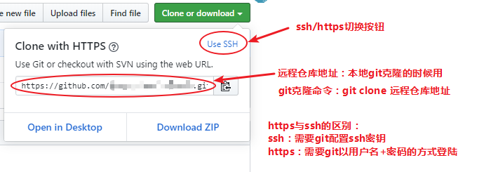
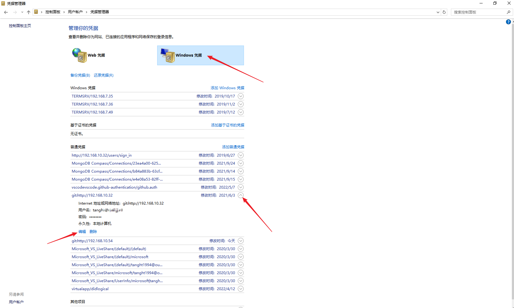

```shell
git remote add origin https://github.com/***/***.git
# 给 <https://github.com/***/***.git> 这个远程仓库取个别名叫做origin

git clone 远程仓库地址	#默认克隆master分支
git clone
git branch				#查看本地的所有分支
git branch -a			#查看所有分支（远程+本地）
git branch haha	   		#创建名字为haha的本地分支
git checkout haha		#切换到haha分支
git push --set-upstream origin test	//将当前分支与远程origin主机上的test分支建立联系
git push #将当前分支推送到远端相联系的分支
git pull <远程主机> <远程分支> <本地分支> #拉取远程分支到本地分支
git clone -b 分支名 远程仓库地址 # 克隆指定分支
```


# 登陆

```shell
以https克隆时，每次push都要输入密码，可以让git记住密码：
git config --global credential.helper store (开启记住密码功能，输入一次密码之后git会记下来)
```



# 克隆

```bash
# 克隆这个地址的master分支
git clone https://github.com/abc/abc.git

# 克隆指定分支，-b后面指定想要的分支名
git clone -b branch_name https://github.com/abc/abc.git

# clone的时候给项目重命名
# 本来克隆下来的时候项目的名字应该是abc
# 现在给重命名成new_name了
git clone https://github.com/abc/abc.git new_name

# 不需要历史记录, 只要最新数据
git clone https://github.com/abc/abc.git --depth 1

# 克隆加速
# 原地址
git clone https://github.com/xxx/xxx
# 新地址
git clone https://gitclone.com/github.com/xxx/xxx

# VPN对Git控制台不生效，所以我们需要告诉Git使用VPN
# 方法一：在执行git命令的时候指定
git clone https://github.com/xxx/xxx --config https.proxy=https://127.0.0.1:7890
# 方法二：直接写到git的配置文件中
git config --global http.proxy http://127.0.0.1:7890
git config --global https.proxy http://127.0.0.1:7890
git config --global http.proxy 'socks5://127.0.0.1:7891'
git config --global https.proxy 'socks5://127.0.0.1:7891'
# 方法二：取消代理
git config --global --unset http.proxy
git config --global --unset https.proxy


```


# 远程仓库

```shell
# 查看所有远程名字的信息，比如origin对应的地址
git remote -v
```


# 分支（branch）

## 查看

```shell
# 查看本地所有分支
git branch

# 查看所有分支(包含本地和远程)
git branch -a

# 有时候看不到远程分支，需要fetch同步一下
git fetch
```

## 创建

```shell
# 基于当前分支创建mybranch分支，但是并不切换去过
git branch mybranch

# 基于test分支创建mybranch分支，但是并不切换去过
git branch mybranch test

# 基于远程origin/test分支创建mybranch分支，但是并不切换去过
git branch mybranch origin/test
```

## 切换

```shell
# 切换到your_branch分支
git checkout your_branch

# 创建your_branch分支，并立即切换过去
git checkout -b your_branch

# 基于b2分支创建b1分支，并立即切换到b1
git checkout -b b1 b2

# 基于origin/b2远程分支创建b1分支，并立即切换到b1
git checkout -b b1 origin/b2
```

## 其他

```shell
# 修改分支名：修改当前分支的名字为main
git branch -m main

# 删除分支：删除本地名字为test的分支
# 前提是不能删除你当前所在的分支，因为若是删了，git不知道该把你放在那里
# 如果test分支新开发的东西还没有被合并到master上，则删除失败(防止误删除)
git branch -d test

# 强制删除：不管有没有被合并到master，直接强制删除
git branch -D test

# 删除远程分支：删除远程名字为your_branch的分支
git push origin --delete your_branch
```


# 远程分支

```shell
# 查看所有分支，包括本地和（本地远程）
# 本地远程是什么鬼？git中不存在真正的远程仓库，所有仓库都存在本地
# 本地远程是远程仓库的一个copy，时不时的需要fetch同步一下
git branch -a

# 取回所有远程分支的信息
# 远程新建了分支，branch -a是看不见的，需要fetch一下
git fetch

# 远程分支删除了，同步到本地
# 查看哪个远程分支被删除了，删除的分支后面带有标志stale(不新鲜)
git remote show origin

# 使用这个命令删除在远程已经被删除了的本地分支
git remote prune origin
```


# 将其它人的分支获取到本地

```shell
# 同步远程仓库，不然看不到其它人新建的分支
git fetch

# 显示所有分支，包括本地分支和远程分支
git branch -a

# 基于远程分支，创建一个本地分支
# 比如说 branch -a 的时候看到的新的分支名是 origin/zhangsan
# 我们想要在本地创建一个test分支(基于origin/zhangsan)
git checkout -b test origin/zhangsan
```


# 推送（push）

```shell
# 这个命令的行为与config push.default的值有关
# push.default可选的值是[nothing,current,upstream,simple,matching]
# 设置为nothing，则禁止这个含糊的命令，若要push则必须指明远程仓库和分支
# 默认是simple，会推送到远端的同名分支
git push

# 推送当前分支到远端指定分支：我要把当前分支路径上的所有commit上传到origin仓库的branch1分支上
# 当前分支不必叫branch1，可以是任何名字，反正不管当前分支的名字是什么，整条命令都会将当前分支推送到origin的branch1上
git push origin branch1
```


# 拉取（pull）

```shell
# 将origin branch1的代码fetch下来，并与当前所在分支merge
git pull origin branch1
```


# 合并（merge）

merge的时候git做了两个动作：

1. 将指定分支上所有的commit同步到当前分支上
2. 在当前分支上生成一个新commit

所以merge的最后，会要求输入commit信息。但是如果出现冲突的时候，merge就不会自动帮我们commit了，需要我们手动处理冲突之后，再自己commit。

如果有冲突出现，git会处于冲突待解决状态，需要程序员手动解决冲突然后commit或者放弃merge

```shell
# 合并分支：合并branch1分支上的所有commit到当前分支，并生成一个新的commit，新的commit使用默认的提交信息就可以了
git merge branch1

# 放弃merge：当前分支回到未merge时的状态，前提是git处于冲突待解决状态
git merge --abort
```


# 暂存（add）

注意概念的理解，暂存的是"改动"而不是文件

```shell
# 将your_filename的改动放入暂存区
git add your_filename

# 将所有改动放入暂存区
git add *

# 将所有改动放入暂存区
git add .

# 添加删除的文件到暂存区
git add -A -- your_file_name

# 添加删除的文件到暂存区(所有)
git add -A
```

# 回退（reset）

```shell

```


# 查看提交信息（log、show）

## commit历史信息

```shell
# 按顺序列出所有commit
git log

# 每条commit信息输出为1行
git log --oneline

# 使用图形显示"本分支"的commit历史
git log --oneline --graph

# 使用图形显示"所有分支"的commit历史
git log --oneline --graph --all

# 查看所有commit的详细改动
# 按顺序列出所有commit，将每个commit的详细信息也显示出来
# 比如再这个commit中增加了哪一行，删除了哪一行等
# 这是显示差异最详细的命令了
git log -p

# 查看commit的统计信息
# 比git log -p简单，比git log详细
git log --stat

git log --oneline --graph --decorate --all
```

## 指定commit信息

```shell
# 查看指定commit的详细改动（所有文件的详细改动）
git show commitID

# 查看指定commit的指定文件的详细改动
git show commitID filename

# 查看当前commit的详细改动
git show
```


# 对比（diff）

```shell
# --stat，只列出文件名字，不显示具体修改内容，对下面所有命令都生效
git diff --stat

# 对比工作目录和暂存区之间的不同
# 换句话说，这条指令可以让你看到"如果你此时执行add *，会向暂存区添加什么"
git diff

# 对比暂存区和最近的commit之间的不同
# 换句话说，这条指令可以让你看到"如果你此时执行commit，会提交什么"
git diff --staged

# 与--staged完全相同
git diff --cached

# 对比工作目录与HEAD
git diff HEAD

# 比较当前工作目录与commitid
git diff commitid

# 比较当前工作目录与branch_name最近的commit之间的差别
git diff branch_name
```


# 刚刚的commit错了想要修改

```shell
git commit --amend
```


# 放弃修改

## 放弃已经add后的文件的修改

- 先将这个文件由绿色变为红色（文件离开暂存区）
- 再对这个红色的文件checkout（对工作区中的变化进行还原）
- 因为绿色的文件无法checkout

```bash
# 由绿色变为红色，仅仅是变色，文件内容并不会发生变化
git reset HEAD -- E:\test\2.txt

# 再对红色的文件checkout，这个文件的所有修改都被还原
git checkout -- E:\test\2.txt

# 将暂存区的文件全部取消暂存（不用挨个指定文件名了）
git reset HEAD .
```

## 放弃没有add的文件的修改

前提是，这个文件已经被git跟踪了，不能是Untracked的状态

也就是说，如果对新建的文件使用这个命令，是不起作用的

因为新建的文件还没有被git跟踪呢

```bash
# 放弃指定文件的修改
git checkout -- E:\test\2.txt

# 放弃工作区的所有文件的修改
git checkout .
```

## 放弃没有被跟踪的文件的修改（新建的文件，还没被add）

跟手动删除没有任何区别，唯一的方便就是批量删除所有Untracked的文件

```shell
# 删除所有未跟踪的文件
git clean -f

# 删除指定文件
git clean -f -- E:\test\2.txt
```


# git status文件夹展开

```shell
git status -u
```


# 修改commit信息

```bash
git rebase -i HEAD~5
将准备修改的commit前改为r
```


# 合并多次commit

```bash
git rebase -i HEAD~5
前缀改为s
```


# 第一次推送至github(远程空仓库)

```bash
git init    			# 初始化本地仓库
git add *   			# 添加一些文件到暂存区
git commit -m "init"  	# 提交一次
git branch -M main		# 修改当前分支名为main
git remote add origin https://github.com/tanght1994/fishwebsdk.git # 添加远程仓库地址
git push -u origin main	# 推送到远程仓库
```


# 查看远程仓库信息

```shell
git remote show			# 列出所有远程仓库的别名
git remote show origin  # 查看origin详细信息
```

# 添加/删除远程仓库

```shell
git remote add origin https://github.com/tanght1994/fishwebsdk.git # 添加远程仓库地址,起别名为origin
git remote remove origin	# 删除别名为origin的远程仓库
```


# .gitignore文件

子目录中也可以放置.gitignore文件，这时就不用写一层层的目录了，子目录中的.gitignore文件只关心自己当前目录的忽略就可以了

```shell
# .gitignore文件

*  				# 忽略所有文件/文件夹
!.gitignore  	# 除了.gitignore文件
!fishwebsdk/	# 除了fishwebsdk文件夹
!fishwebsdk/**	# 除了fishwebsdk下的所有文件和所有文件夹，并且是递归

# 顺序很重要，后面的代码会覆盖前面的代码
# 第一行代码  *  忽略了所有文件
# 但是后面的代码又将某些文件/文件夹排除了，所以那些文件/文件夹就不会被忽略了

/test.test # 忽略当前目录(本.gitignore文件所在的目录)下的test.test(文件或者目录都可以),其它目录或子目录并不会忽略test.test
test.test  # 忽略所有目录下的test.test
```


# GIT配置文件

## 查看

共有三个级别的配置文件，分别为，系统级，全局级，仓库级，优先级递增，后面的覆盖前面的

```shell
git config --system --list  # 只查看系统级配置
git config --global --list  # 只查看全局级配置
git config --local --list  # 只查看仓库级配置

# 查看所有配置项，系统级，全局级，仓库级，显示顺序是 系统级 全局级 仓库级
# 同一个配置项可以出现多次(比如在这三个级别中都设置了一次)，但是以最后出现的为准
git config --list

# 查看配置项,查看user.name
git config [--level] –-get user.name
```

仓库级配置文件(local)位置在`.git/config`，它的优先级是最高的，用于控制则会个项目

全局级配置文件(global)在`C:\Users\your_windows_username\.gitconfig`，用于控制这个用户

系统级配置文件(system)在`windows没找到，linux中在/etc/gitconfig`，用于控制这台电脑

## 添加/修改

```shell
# 修改user.name为tanght1994，没有则添加
git config [--level] user.name tanght1994
```

## 删除

```shell
# 删除user.name
git config [--level] –-unset user.name
```

# 记住密码

```shell
git config --global credential.helper store
```
# Windows切换GIT用户



# GitHub

下载加速

git clone https://gitclone.com/github.com/tendermint/tendermint.git
