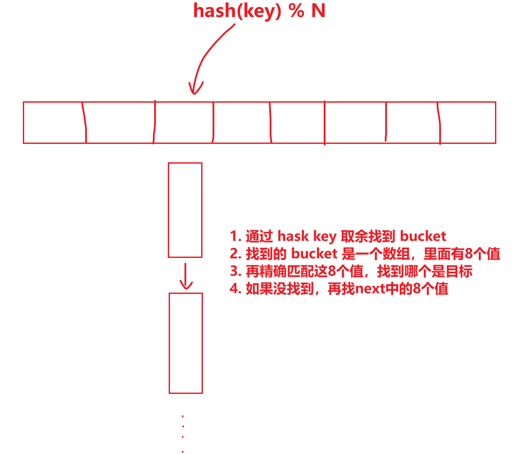

# 基础

## 第一步

```shell
# 开启 go mod, golang必须使用go mod, 不要问为什么
go env -w GO111MODULE=on

# 设置 go 代理, 下载包的时候不会被墙
go env -w GOPROXY=https://goproxy.cn,direct

# 初始化项目，会创建 go.mod 文件，注意：不会创建文件夹，你要自己创建文件夹，所以不要在桌面init
go mod init xxx

# 写自己的代码
# 你的代码中可能会 import 其它的包, 你要使用 go get github.com/xxx/xxx, 将包下载到本地
# go get 会自动维护 go.mod 文件, 记录你所下载的包的版本和相关依赖信息

# 根据代码中 import 到的包整理 go.mod 文件
# 随时随地 tidy 没错的
go mod tidy

# 直接vscode F5就能调试了

# 编译项目为可执行程序(.exe程序)
go build

go mod download
```

## = 和 :=

`=`是赋值操作，`:=`是声明并初始化操作

```go
// 两步操作
// 1. 声明变量a   var a string
// 2. 对a进行赋值  a = "test"
var a string = "test"

// 一步操作
// 1. 声明b并初始化为test
b := "test"
```

第二行的`:=`，对于err是赋值操作，out是声明+初始化操作。

```go
in, err := os.Open(infile)
out, err := os.Create(outfile)
```

`:=`左边至少有一个变量是新变量，否则会报错

```go
in, err := os.Open(infile1)
in, err := os.Open(infile2) // 错误，in和err都是已经存在的变量了
```

## 字符串

`rune`是int64类型，可以保存一个unicode码(注意不是utf-8编码)

ascii码是什么？

对`abcd...123...符号等...`进行排号，比如0号代表字符`a`，1号代表字符`b`。一共128个排号，代表128个字符。所以用一个字节(8位)就能储存一个ascii字符

unicode码是什么？

对`abcd...123...符号...汉字...日语...各种人类字...火星字...`进行排号

```go
func main() {
	//go中string的底层结构是字节数组[]byte，编码格式为utf-8，所以"a唐b"这个字符串在go底层是这样表示的
	//二进制：                                            十进制：                 十六进制：
	//{01100001, 11100101, 10010100, 10010000, 01100010} {97, 229, 148, 144, 98} {0x61, 0xE5, 0x94, 0x90, 0x62}
	// |--a---|  |------------唐------------|  |---b---|
	//可以看出有些字符占1个元素(a)，有些字符占3个元素(唐)
	s := "a唐b"
	fmt.Printf("%d %d %d %d %d\n", s[0], s[1], s[2], s[3], s[4])

	//rune是int64，可以储存一个很大的数字
	//[]rune(s)会将字符串(字节数组、字节流)按照utf-8格式解码为unicode标号
	//本来"唐"这个字符要占用3个byte元素，现在转为rune之后，只需要占用1个rune(int64)元素
	//[]rune实现了每个元素代表1个字符的愿望
	r := []rune(s)
	fmt.Printf("%d %d %d\n", r[0], r[1], r[2])

	//string()函数可以将rune元素按照utf-8格式编码为[]byte(字节流)
	s1 := string(r)
	fmt.Printf("%d %d %d %d %d\n", s1[0], s1[1], s1[2], s1[3], s1[4])
}
```

重点理解：unicode码与utf-8编码之间的关系

rune代表的是unicode码

## package与import

import()后面跟的永远是路径，与package name无关

代码中使package的时候，永远是通过package name来使用，与文件夹名字无关

例子，目录结构如下：

```go
test
├── hahapack
│   └── a.go
└── main.go
```

test/hahapack/a.go 虽然我的文件夹的名字是hahapack，但是我的package名字却是xixipack

```go
package xixipack
var A int = 11111
```

test/main.go 使用xixipack包

```go
package main

import (
	"fmt"
	xixipack "test/hahapack"  // 引用的时候要用文件夹的名字
)

func main() {
    // 使用的时候要用package的名字
    // 虽然文件夹叫做hahapack，但是包名却是xixipack
    // 所以这里必须要用xixipack来调用
	fmt.Println(xixipack.A)
}
```

package名字重复了？

import的时候可以重命名，重命名之后就不会重复了

## 时间

```go
// 2006-01-02 03:04:05 PM -07:00
// 2006-01-02 15:04:05 -07:00
time.Now().Format("2006-01-02 15:04:05 -07:00")
```

## 编译

```shell
myproject/
├── go.mod			# 工程的依赖信息(例如依赖了github上的哪些golang库)
├── go.sum
├── program_a      	# 程序A
│   ├── cmd
│   │   └── a.go
│   ├── core
│   │   └── b.go
│   └── main.go
├── bprogram_b    	# 程序B
│   └── main.go
├── program_c		# 程序C
│   └── main.go
└── lib				# 程序A B C的共用函数(库)
    ├── a.go
    ├── b.go
    └── c.go

# myproject这个工程包含了4个部分，分别是程序A、程序B、程序C、库函数

# 将go.mod中记录的依赖下载到本地
# go mod download

# 编译 A 程序
# go build -o A ./myproject/program_a

# 编译 B 程序
# go build -o B ./myproject/program_b

# 编译 C 程序
# go build -o C ./myproject/program_c
```

## 类型断言

运行中判断any的类型

```go
package main

import (
	"fmt"
)

func f1(data any) {
	// 根据 data 的类型进行不同的处理
	switch data.(type) {
	case int:
		fmt.Println("int")
	case string:
		fmt.Println("string")
	case bool:
		fmt.Println("bool")
	default:
		fmt.Println("unknown")
	}
}

func f2(data any) {
	// 将 data 转换为 int 类型
	// 如果 data 不是 int 类型，则会 panic
	x := data.(int)
	fmt.Println(x)
}

func f3(data any) {
	// 将 data 转换为 int 类型
	// 如果 data 不是 int 类型，则 ok 为 false, x 无意义, 不会 panic
	// 如果 data 是 int 类型，则 ok 为 true, x 为 data 的值
	x, ok := data.(int)
	if !ok {
		fmt.Println("not int")
		return
	}
	fmt.Println(x)
}

func main() {
	f1(1)
	f1("hello")

	f2(1)
	// f2("1") // panic

	f3(1)
	f3("hello")
}
```

# 错误处理

使用错误码来区别错误类型需要保证各个包返回的错误码不一样，这样才能在外部通过1、2、3等错误码来判断错误类型，显然是无法保证各个包的错误码不会重复的

go中每个变量都不一样，所以可以用go中的变量来表示错误类型，这样外部就可以保证所有错误都唯一了

类似C语言的错误处理逻辑，错误码：

- 包 A 返回错误码 1 代表打开文件失败
- 包 B 返回错误码 1 代表文件删除失败
- 现在我们的代码中的某个函数 F，使用了包 A 和包 B，当 F 遇到错误码时直接返回错误码
- 请问当 F 函数返回错误码 1 时，表示什么错误？

- 所以 F 函数不能直接返回每个包的错误码，F 函数只能自己重新规划错误码，比如 1 表示打开文件失败，2 表示文件删除失败，3 表示网络请求失败，等等等
- 所以 F 不能无脑的直接向上层返回错误码，F 必须关注所有包返回的错误码然后将这些错误转变为 F 自己定义的错误码

Go中的错误处理逻辑，错误变量：

- 包 A 返回错误变量 A1 代表打开文件失败
- 包 B 返回错误码 B1 代表文件删除失败
- 现在我们的代码中的某个函数 F，使用了包 A 和包 B，当 F 遇到错误时直接返回错误
- 外部可以直接判断错误，不存在冲突

## 基本操作

```go
package main

import (
	"errors"
	"fmt"
)

// 定义一个错误类型
var ErrNotFound = errors.New("not found")

func get(id int) error {
	if id != 123 {
		return ErrNotFound
	}
	return nil
}

func main() {
	err := get(456)
	if err != nil {
		// 判断错误类型
		if err == ErrNotFound {
			fmt.Println("未找到", err)
		} else {
			fmt.Println("其他错误：", err)
		}
	}
}
```

## errors.Is

使用 `fmt.Errorf("%w: context", err)` 包装一个现有的错误，并对其添加额外信息

使用`errors.Is` 来做判断错误的底层错误

```go
package main

import (
	"errors"
	"fmt"
)

var ErrNotFound = errors.New("not found")

func get(id int) error {
	if id != 123 {
		return ErrNotFound
	}
	return nil
}

func Get(id int) error {
	err := get(id)
	if err != nil {
		// 包装一个错误并增加额外信息, 外部需要用 errors.Is 来判断底层的错误类型
		return fmt.Errorf("没找到, 查询的id为%d: %w", id, err)
	}
	return nil
}

func main() {
	err := Get(456)
	if err != nil {
		// Is 能帮我们找到最底层的 ErrNotFound
		if errors.Is(err, ErrNotFound) {
			fmt.Println("未找到：", err)
		} else {
			fmt.Println("其他错误：", err)
		}
	}
}
```

## errors.As

使用`errors.As`将错误转变为自定义错误类型。因为go的error只包含一个字符串，没有更多信息，所以可以自定义一个struct当作错误类型（前提是实现Error接口），让错误有更个性化的信息和结构

```go
package main

import (
	"errors"
	"fmt"
)

// 自定义错误类型
type MyError struct {
	Code    int
	Message string
}

func (e *MyError) Error() string {
	return fmt.Sprintf("code=%d: %s", e.Code, e.Message)
}

func func1() error {
	return &MyError{Code: 404, Message: "找不到资源"}
}

func func2() error {
	e := func1()
	if e != nil {
		return fmt.Errorf("func2: %w", e)
	}
	return nil
}

func main() {
	err := func1()
	if err != nil {
		var e *MyError
		// errors.As 会判断 err 是不是 MyError 类型
		// err 任何一层是 MyError 类型都算
		// 如果是的话则会填充 e 变量
		if errors.As(err, &e) {
			fmt.Printf("捕获到 MyError，Code=%d, Msg=%q %s\n", e.Code, e.Message, err)
		} else {
			fmt.Println("其他错误：", err)
		}
	}

	err = func2()
	if err != nil {
		var e *MyError
		fmt.Println(e)
		if errors.As(err, &e) {
			fmt.Printf("捕获到 MyError，Code=%d, Msg=%q %s\n", e.Code, e.Message, err)
		} else {
			fmt.Println("其他错误：", err)
		}
	}
}

```

# 注意

## slice作为函数参数

```go
package main

import "fmt"

func main() {
	a := []string{"0"}
    // abc 想给 a 数组添加几个元素，无法实现
    // 与 map 形成强烈对比
	abc(a)
	fmt.Println(a)
}

func abc(l []string) {
	l = append(l, "1")
	l = append(l, "2")
	l = append(l, "3")
	l = append(l, "4")
	l = append(l, "5")
	l = append(l, "6", "7", "8", "9")
    // l 已经重新分配内存了，所以这些新增的元素，反应不到外部的 l
    // 如果 l 不重新分配内存，那么 l 的变化会反应到外部的 l
}
```

## map作为函数参数

```go
package main

import "fmt"

func main() {
	a := map[string]string{"0": "0"}
    // abc 函数可以改变 a 参数，即使使 a 变大也没事
    // abc 函数运行完之后，a 参数真的变大了
	abc(a)
	fmt.Println(a)
}

func abc(m map[string]string) {
	m["1"] = "1"
	m["2"] = "1"
	m["3"] = "1"
	m["4"] = "1"
	m["5"] = "1"
	m["6"] = "1"
	m["7"] = "1"
	m["8"] = "1"
	m["9"] = "1"
    // 可以随意给m添加值，添加任意多个都没事，即使底层重新分配内存也不碍事
    // 注意：如果这里 m = nil，外部的 map 不会被设置为 nil
}
```

## Mutex

sync.Mutex 最好通过指针进行传递：创建一个变量lock，将lock通过协程参数传递给两个协程，那么这两个协程收到的其实是两个完全不同的锁，无法对两个协程进行同步。不仅是Mutex最好用指针，sync包中的所有同步原语，最好都用指针进行传递！

sync.Mutex的复制，连同锁状态一起复制

```go
lock1 := sync.Mutex{}
lock1.Lock()
lock2 := lock1  // lock2已经Lock()了
lock2.Lock()  // 死锁了
```

## byte()强制转换

```go
// uint16 65280 二进制表示为 11111111 00000000
var a uint16 = 65280
b := byte(a)
// 请问b为11111111还是00000000
// 答案是b为00000000
print(b)
// 如果我想要a的11111111部分怎么办呢？
b = byte(a >> 8)
```

## slice切片

```go
// a的len=10, cap=10
a := make([]int, 10)
b := a[:0]
// b的len和cap是多少呢？
fmt.Println(len(b), cap(b))
// b的len=0, cap=10。而且b与a共用相同的底层数组
//向b中append5个数
b = append(b, 1, 2, 3, 4, 5)
fmt.Println(a, b)
// 可以发现，a，b都被添加了1,2,3,4,5，这是因为a,b的底层数组是同一个东西
```

## slice切片

```go
a := make([]int, 10, 20)
b := a[:15]
// 请问会报错么？a的len只有10，但是b却取15
// 答：不会报错，因为a的容量有20，如果取的超过20，才会报错
// 并且a,b依然共享同一个底层数组
```

# 标准库

## bytes

### 常用函数

字符串join、子字符串index、字符串Split、字符串Trim、字符串大小写转换、字符串换行切割、等等一系列字符串操作

```go
package main

import (
	"bytes"
	"fmt"
	"iter"
)

func main() {

	// *** 判断一段文本是否包含某个子串 ***
	{
		// 函数签名: Contains(b, subslice []byte) bool
		// 函数作用: 如果 b 中包含 subslice 则返回 true
		b := []byte("hello world")
		fmt.Println(bytes.Contains(b, []byte("hello"))) // true
		fmt.Println(bytes.Contains(b, []byte("hi")))    // false

		// 函数签名: ContainsAny(b, chars string) bool
		// 函数作用: 如果 b 中包含 chars 中的任意一个字符则返回 true
		b = []byte("hello world")
		fmt.Println(bytes.ContainsAny(b, "aeiou")) // true
		fmt.Println(bytes.ContainsAny(b, "xyz"))   // false

		// 函数签名: ContainsRune(b []byte, r rune) bool
		// 函数作用: 如果 b 中包含 r 则返回 true
		b = []byte("你好世界")
		fmt.Println(bytes.ContainsRune(b, '你')) // true
		fmt.Println(bytes.ContainsRune(b, '好')) // true
		fmt.Println(bytes.ContainsRune(b, '中')) // false
		fmt.Println(bytes.ContainsRune(b, 'a')) // false

		// 函数签名: ContainsFunc(b []byte, f func(rune) bool) bool
		// 函数作用: 如果 b 中包含"使 f 返回 true 的字符"则返回 true
		b = []byte("hello world")
		fmt.Println(bytes.ContainsFunc(b, func(r rune) bool {
			return r == 'h' || r == 'e'
		})) // true
		fmt.Println(bytes.ContainsFunc(b, func(r rune) bool {
			return r == 'x' || r == 'y'
		})) // false
	}

	// *** 以某个子串为分界线切分文本为前后两部分, 或者去掉前缀或后缀 ***
	{
		// 函数签名: Cut(b, sep []byte) (before, after []byte, found bool)
		// 函数作用: 以 第一次 sep 为分界线将 b 切分为前后两部分, 返回切分后的前后两部分和是否找到分界线
		// 如果没有找到分界线则 before 为 b, after 为 nil, found 为 false
		b := []byte("hello world")
		before, after, found := bytes.Cut(b, []byte(" "))
		fmt.Println(string(before)) // hello
		fmt.Println(string(after))  // world
		fmt.Println(found)          // true

		before, after, found = bytes.Cut(b, []byte("xxx"))
		fmt.Println(string(before)) // hello world
		fmt.Println(string(after))  // <nil>
		fmt.Println(found)          // false

		// 函数签名: CutPrefix(b, prefix []byte) (after []byte, found bool)
		// 函数作用: 如果 b 以 prefix 为前缀, 则返回去掉前缀后的部分和true
		// 如果b不以 prefix 为前缀, 则返回 b 和 false
		b = []byte("hello world")
		after, found = bytes.CutPrefix(b, []byte("hello"))
		fmt.Println(string(after)) //  world
		fmt.Println(found)         // true

		b = []byte("abc hello world")
		after, found = bytes.CutPrefix(b, []byte("hello"))
		fmt.Println(string(after)) // abc hello world
		fmt.Println(found)         // false

		// 函数签名: CutSuffix(b, suffix []byte) (before []byte, found bool)
		// 函数作用: 如果 b 以 suffix 为后缀, 则返回去掉后缀后的部分和true
		// 如果b不以 suffix 为后缀, 则返回 b 和 false
		b = []byte("hello world")
		before, found = bytes.CutSuffix(b, []byte("world"))
		fmt.Println(string(before)) // hello
	}

	// *** 判断两个切片是否相等 ***
	{
		// 函数签名: Equal(a, b []byte) bool
		// 函数作用: 如果 a 和 b 相等则返回 true
		a := []byte("hello")
		b := []byte("hello")
		fmt.Println(bytes.Equal(a, b)) // true
		b = []byte("world")
		fmt.Println(bytes.Equal(a, b)) // false

		// 函数签名: EqualFold(a, b []byte) bool
		// 函数作用: 如果 a 和 b 相等, 忽略大小写则返回 true
		a = []byte("hello")
		b = []byte("HELLO")
		fmt.Println(bytes.EqualFold(a, b)) // true
	}

	// *** 按照 [空白字符 or 自定义函数] 切割 []byte 为多个子串 ***
	{
		// 函数签名: Fields(b []byte) [][]byte
		// 函数作用: 将 b 按照空白字符切分为多个子串, 返回切分后的子串
		// 连续的空白字符会被当做一个分隔符
		// 例如: "hello world   a b c" -> ["hello", "world", "a", "b", "c"]
		b := []byte("hello world    a b c")
		fields := bytes.Fields(b)
		strs := toStringSlice1(fields)
		fmt.Println(strs)

		// 函数签名: FieldsSeq(s []byte) iter.Seq[[]byte]
		// 函数作用: 与 Fields() 相同, 但是返回的是一个迭代器
		b = []byte("hello world    a b c")
		seq := bytes.FieldsSeq(b)
		strs = toStringSlice2(seq)
		fmt.Println(strs)

		// 函数签名: FieldsFunc(s []byte, f func(rune) bool) [][]byte
		// 函数作用: 将 b 按照 f 返回 true 的字符切分为多个子串, 返回切分后的子串
		b = []byte("hello world    a b c")
		fields = bytes.FieldsFunc(b, func(r rune) bool {
			return r == ' ' || r == 'a'
		}) // ["hello", "world", "b", "c"], a 被当做分隔符了
		strs = toStringSlice1(fields)
		fmt.Println(strs)

		// 函数签名: FieldsFuncSeq(s []byte, f func(rune) bool) iter.Seq[[]byte]
		// 函数作用: 与 FieldsFunc() 相同, 但是返回的是一个迭代器
		b = []byte("hello world    a b c")
		seq = bytes.FieldsFuncSeq(b, func(r rune) bool {
			return r == ' ' || r == 'a'
		})
		strs = toStringSlice2(seq)
		fmt.Println(strs)
	}

	// *** 切割字符串为多个子串 ***
	{
		// 函数签名: Split(s []byte, sep []byte) [][]byte
		// 函数作用: 将 b 按照 sep 切分为多个子串, 返回切分后的子串
		// 连续的 sep 会被当做一个分隔符
		b := []byte("hello--world---a----b------c")
		split := bytes.Split(b, []byte("--"))
		strs := toStringSlice1(split)
		fmt.Println(strs) // ["hello", "world", "-a", "", "b", "", "", "c"]

		// 函数签名: SplitN(s []byte, sep []byte, n int) [][]byte
		// 函数作用: 将 b 按照 sep 切分为 n 个子串, 返回切分后的子串
		// 如果 n < 0 则表示切分所有, 如果 n == 0 则返回空切片, 如果 n == 1 则返回 b
		b = []byte("hello-world--a---b-c")

		split = bytes.SplitN(b, []byte("-"), 3)
		strs = toStringSlice1(split)
		fmt.Println(strs) // ["hello", "world", "-a---b-c"]

		split = bytes.SplitN(b, []byte("-"), 2)
		strs = toStringSlice1(split)
		fmt.Println(strs) // ["hello", "world--a---b-c"]

		split = bytes.SplitN(b, []byte("-"), 1)
		strs = toStringSlice1(split)
		fmt.Println(strs) // ["hello-world--a---b-c"]

		split = bytes.SplitN(b, []byte("-"), 0)
		strs = toStringSlice1(split)
		fmt.Println(strs) // []

		split = bytes.SplitN(b, []byte("-"), -1)
		strs = toStringSlice1(split)
		fmt.Println(strs) // ["hello", "world", "", "a", "", "", "b", "c"]

		// 函数签名: SplitAfter(s []byte, sep []byte) [][]byte
		// 函数作用: 与 Split() 相同, 但是每个子串的后面都包含 sep
		b = []byte("hello--world---a----b------c")
		split = bytes.SplitAfter(b, []byte("--"))
		strs = toStringSlice1(split)
		fmt.Println(strs) // ["hello--", "world--", "-a--", "--", "b--", "--", "--", "c"]

		// 函数签名: SplitAfterN(b, sep []byte, n int) [][]byte
		// 函数作用: 与 SplitN() 相同, 但是每个子串的后面都包含 sep

		// 函数签名: SplitSeq(s, sep []byte) iter.Seq[[]byte]
		// 函数作用: 与 Split() 相同, 但是返回的是一个迭代器

		// 函数签名: SplitAfterSeq(s, sep []byte) iter.Seq[[]byte]
		// 函数作用: 与 SplitAfter() 相同, 但是返回的是一个迭代器
	}

	// *** 字符串前缀后缀 ***
	{
		// 函数签名: HasPrefix(b, prefix []byte) bool
		// 函数作用: 判断前缀
		b := []byte("hello world")
		fmt.Println(bytes.HasPrefix(b, []byte("hello"))) // true
		fmt.Println(bytes.HasPrefix(b, []byte("world"))) // false

		// 函数签名: HasSuffix(b, suffix []byte) bool
		// 函数作用: 判断后缀
		b = []byte("hello world")
		fmt.Println(bytes.HasSuffix(b, []byte("world"))) // true
		fmt.Println(bytes.HasSuffix(b, []byte("hello"))) // false
	}

	// *** 查找子串的位置 ***
	{
		// 函数签名: Index(b, subslice []byte) int
		// 函数作用: 查找 subslice 在 b 中第一次出现的位置, 如果没有找到则返回 -1
		b := []byte("hello world")
		fmt.Println(bytes.Index(b, []byte("hello"))) // 0
		fmt.Println(bytes.Index(b, []byte("world"))) // 6
		fmt.Println(bytes.Index(b, []byte("hi")))    // -1
		fmt.Println(bytes.Index(b, []byte("lo")))    // 3

		// 函数签名: IndexAny(b, chars string) int
		// 函数作用: 查找 chars 中的任意一个字符在 b 中第一次出现的位置, 如果没有找到则返回 -1
		b = []byte("hello world")
		fmt.Println(bytes.IndexAny(b, "aeiou")) // 1
		fmt.Println(bytes.IndexAny(b, "xyz"))   // -1

		// 函数签名: IndexByte(b []byte, c byte) int
		// 函数作用: 查找 c 在 b 中第一次出现的位置, 如果没有找到则返回 -1
		b = []byte("hello world")
		fmt.Println(bytes.IndexByte(b, 'h')) // 0
		fmt.Println(bytes.IndexByte(b, 'o')) // 4
		fmt.Println(bytes.IndexByte(b, 'x')) // -1

		// 函数签名: IndexFunc(b []byte, f func(rune) bool) int
		// 函数作用: 查找 f 返回 true 的字符在 b 中第一次出现的位置, 如果没有找到则返回 -1
		b = []byte("hello world")
		fmt.Println(bytes.IndexFunc(b, func(r rune) bool {
			return r == 'h' || r == 'e'
		})) // 0
		fmt.Println(bytes.IndexFunc(b, func(r rune) bool {
			return r == 'x' || r == 'y'
		})) // -1

		// 函数签名: IndexRune(b []byte, r rune) int
		// 函数作用: 查找 r 在 b 中第一次出现的位置, 如果没有找到则返回 -1
		b = []byte("你好世界")
		fmt.Println(bytes.IndexRune(b, '你')) // 0
		fmt.Println(bytes.IndexRune(b, '好')) // 3
		fmt.Println(bytes.IndexRune(b, '中')) // -1
		fmt.Println(bytes.IndexRune(b, 'a')) // -1

		// 函数签名: LastIndex(b, subslice []byte) int 同Index, 只是从后往前找
		// 函数签名: LastIndexAny(b, chars string) int 同IndexAny, 只是从后往前找
		// 函数签名: LastIndexByte(b []byte, c byte) int 同IndexByte, 只是从后往前找
		// 函数签名: LastIndexFunc(b []byte, f func(rune) bool) int 同IndexFunc, 只是从后往前找
	}

	// *** 替换子串 ***
	{
		// 函数签名: Replace(s []byte, old []byte, new []byte, n int) []byte
		// 函数作用: 将 s 中的 old 替换为 new, n 为替换的次数, -1 表示全部替换
		b := []byte("aaabbbcccddd eee abcdefg")
		fmt.Println(string(bytes.Replace(b, []byte("a"), []byte("A"), 0)))  // aaabbbcccddd eee abcdefg
		fmt.Println(string(bytes.Replace(b, []byte("a"), []byte("A"), 1)))  // Aaabbbcccddd eee abcdefg
		fmt.Println(string(bytes.Replace(b, []byte("a"), []byte("A"), 2)))  // AAabbbcccddd eee abcdefg
		fmt.Println(string(bytes.Replace(b, []byte("a"), []byte("A"), -1))) // AAAbbbcccddd eee Abcdefg
		fmt.Println(string(bytes.Replace(b, []byte("ab"), []byte(""), -1))) // aabbcccddd eee cdefg

		// 函数签名: ReplaceAll(s []byte, old []byte, new []byte) []byte
		// 函数作用: 将 s 中的 old 替换为 new, 替换所有
		// 与 Replace(s, old, new, -1) 相同
		b = []byte("aaabbbcccddd eee abcdefg")
		fmt.Println(string(bytes.ReplaceAll(b, []byte("a"), []byte("A")))) // AAAbbbcccddd eee Abcdefg
	}

	// *** 大小写转换 ***
	{
		b := []byte("Hello world")
		fmt.Println(string(bytes.ToLower(b))) // hello world
		fmt.Println(string(bytes.ToUpper(b))) // HELLO WORLD
		fmt.Println(string(bytes.ToTitle(b))) // Hello World
	}
	// *** 去掉前缀后缀 ***
	{
		// 函数签名: Trim(s []byte, cutset string) []byte
		// 函数作用: 去掉 s 前后的 cutset 中的字符
		b := []byte("  hello world  ")
		fmt.Println(string(bytes.Trim(b, " ")))   // "hello world"
		fmt.Println(string(bytes.Trim(b, " hd"))) // "ello worl"
		fmt.Println(string(bytes.Trim(b, "h")))   // "  hello world  "

		// bytes.Trim()
		// bytes.TrimFunc()
		// bytes.TrimLeft()
		// bytes.TrimLeftFunc()
		// bytes.TrimPrefix()
		// bytes.TrimRight()
		// bytes.TrimRightFunc()
		// bytes.TrimSpace()
		// bytes.TrimSuffix()
	}

	// *** 其它 ***
	{
		// 函数签名: Join(s [][]byte, sep []byte) []byte
		// 函数作用: 将 s 中的每个子串用 sep 连接起来, 返回连接后的结果
		list := [][]byte{
			[]byte("hello"),
			[]byte("world"),
			[]byte("a"),
			[]byte("b"),
			[]byte("c"),
		}
		b := bytes.Join(list, []byte(","))
		fmt.Println(string(b)) // "hello,world,a,b,c"

		// 函数签名: Count(s []byte, sep []byte) int
		// 函数作用: 统计 s 中 sep 的个数
		b = []byte("hello world hello world")
		fmt.Println(bytes.Count(b, []byte("hello"))) // 2

		// 函数签名: Lines(s []byte) iter.Seq[[]byte]
		// 函数作用: 将 s 按照换行符切分为多个子串, 返回切分后的子串
		// 字串中包含换行符
		b = []byte("hello\nworld\na\nb\nc")
		lines := bytes.Lines(b)
		strs := toStringSlice2(lines)
		fmt.Println(strs) // ["hello\n", "world\n", "a\n", "b\n", "c"]

		// 函数签名: Map(mapping func(r rune) rune, s []byte) []byte
		// 函数作用: 将 s 中的每个字符都应用 mapping 函数, 返回转换后的结果
		b = []byte("hello world")
		m := bytes.Map(func(r rune) rune {
			if r >= 'a' && r <= 'z' {
				return r - 32
			}
			return r
		}, b)
		fmt.Println(string(m)) // "HELLO WORLD"

		// 函数签名: Repeat(b []byte, count int) []byte
		// 函数作用: 将 s 重复 count 次, 返回重复后的结果
		b = []byte("hello")
		r := bytes.Repeat(b, 3)
		fmt.Println(string(r)) // "hellohellohello"

		// 函数签名: Compare(a, b []byte) int
		// 函数作用: 比较 a 和 b 的大小, 返回 -1, 0, 1, 分别表示 a < b, a == b, a > b
		a := []byte("hello")
		b = []byte("hello")
		cmp := bytes.Compare(a, b)
		fmt.Println(cmp) // 0

		// 函数签名: Runes(s []byte) []rune
		// 函数作用: 将 s 中的每个字符转换为 rune, 返回转换后的结果
		b = []byte("hello world")
		runes := bytes.Runes(b)
		fmt.Println(runes) // [104 101 108 108 111 32 119 111 114 108 100]
	}
}

func toStringSlice1(data [][]byte) []string {
	r := make([]string, 0, len(data))
	for _, v := range data {
		r = append(r, string(v))
	}
	return r
}

func toStringSlice2(data iter.Seq[[]byte]) []string {
	r := make([]string, 0)
	for v := range data {
		r = append(r, string(v))
	}
	return r
}

```

提供字符串处理常用方法，比如字符串分割，字符串比较，搜索子字符串，字符串数组join，字符串替换等等。

提供一个buffer，可以从里面读数据(Reader)或向里面写数据(Writer)。

提供一个Reader，跟buffer有什么不同？我也不知道，感觉跟buffer类似了。

### bytes.Buffer

NewBuffer()创建一个Buffer，然后就可以对这个Buffer进行读写了。

记住，写入的话是从内部buf的len()处开始写的，所以如果想从头开始写，那一定要创建一个len为0(cap可0可不0)的[]byte给NewBuffer进行初始化。


```go
b := bytes.NewBuffer([]byte(""))

	r := bytes.NewReader()

	b.Available()
	b.AvailableBuffer()
	b.Bytes()
	b.Cap()
	b.Grow()
	b.Len()
	b.Next()

	// 从 buffer 中读取数据
	b.Read()
	b.ReadByte()
	b.UnreadByte()
	b.ReadRune()
	b.UnreadRune()
	b.ReadBytes()
	b.ReadString()
	b.String()

	// 向 buffer 中写入数据
	b.Write()
	b.WriteByte()
	b.WriteString()

	b.ReadFrom() // 从外面读取数据写到 buffer 中
	b.WriteTo()  // 将 buffer 中的数据写到外面

	b.Reset()
	b.Truncate()
```

### bytes.Reader

将一个[]byte包装为Reader

```go
package main

import (
    "bytes"
    "fmt"
    "io"
)

func main() {
    data := []byte("GolangBytes")
    r := bytes.NewReader(data)

    // 读取前 6 字节
    p := make([]byte, 6)
    r.Read(p)
    fmt.Println(string(p)) // 输出: Golang

    // 跳转到尾部前 5 字节处，再读
    r.Seek(-5, io.SeekEnd)
    q := make([]byte, 5)
    r.Read(q)
    fmt.Println(string(q)) // 输出: Bytes

    // 回退一个字节，再读
    r.UnreadByte()
    b, _ := r.ReadByte()
    fmt.Printf("单字节: %c\n", b) // 输出: 单字节: B
}

```

## strings

与bytes类似的字符串操作

## bufio

读写缓冲，比如文件

## json

结构体Tag的规则：

- 结构体字段后面用反引号包裹起来的字符串就是Tag
- 字符串是一堆key-value对，用空格将各个key-value对分割开
- key不能用双引号包裹，value必须用双引号包裹(因为value中可能包含空格)
- 可以用反射功能在代码中获取结构体各字段的Tag
- Tag的作用就是给结构体的字段增加一个辅助字符串

```go
package main

import (
	"fmt"
	"reflect"
)

type ABC struct {
	A int `dog:"我是一只狗" 猫:"i am cat"`
	B int
}

func main() {
	abc := ABC{}
	tag1 := reflect.TypeOf(abc).Field(0).Tag.Get("dog")
	fmt.Println(tag1)  // 我是一只狗
	tag2 := reflect.TypeOf(abc).Field(0).Tag.Get("猫")
	fmt.Println(tag2)  // i am cat
}
```

既然Tag能给结构体的字段附带一些信息，那么json库就利用了Tag来定义了一些规则，来辅助json编解码

```golang
// json库只获取Tag的名字为"json"的Key
// 对于下面的ABC.A字段,json库只会取到"A,string"这个字符串
// "required,min=6,max=20"这个value是不会被获取到的
type ABC struct {
	A int `json:"A,string" validate:"required,min=6,max=20"`
	B string
}

// A,string：A是定义json字段的名字，因为json字段的名字可能跟结构体中字段的名字不一致
// A,string：string是定义json字段的类型
// 在golang中ABC.A的类型为int，在json中A的类型为string
// {"A": "1"}  {"A": 1} 的区别
type ABC struct {
	A int `json:"A,string" validate:"required,min=6,max=20"`
}
```

编解码

```go
// 将字符串str按照abc结构体的格式，转换成abc结构体
json.Unmarshal(str, &abc)

// 将abc结构体变成json字符串
json.Marshal(abc)
```

## atomic

```go
// CAS(CompareAndSwap)操作的意思: 如果 A==B 则将A设置为C并返回true
// 如果*addr == old 则 *addr=new
// 因为要修改addr的值, 所以要将addr的指针传进去
atomic.CompareAndSwapPointer(addr *unsafe.Pointer, old unsafe.Pointer, new unsafe.Pointer) (swapped bool)
```

## net

- 多个协程同时对1个`net.Conn`执行`Write`操作是安全的
- 多个协程同时对1个`net.Conn`执行`Read`操作是无意义的，所以我没测试
- 数据顺序不会出错，比方说2个协程，一个写"1111"另一个写"2222"，那么对方不会收到类似"11221122"这种信息
- 猜测Write内部是有并发考虑的，可能是内部加锁了
- 多个协程同时对1个`net.Conn`写，不如1个协程的效率高，所以最好借助`chan`

```go
func main() {
	l, _ := net.Listen("tcp", "127.0.0.1:8000")
	c, _ := l.Accept()
	for i := 0; i < 100; i++ {
		go write(c)
	}
	time.Sleep(10000 * time.Second)
}

func write(c net.Conn) {
	for {
		c.Write([]byte("123"))
	}
}
```

ip地址

```go
// net.IP 是一个[]byte(字节数组)，长度为16个字节
// IPV4地址只占用 [12] [13] [14] [15] 这四个字节
// 例如对 192.168.7.45 来说， [12]=192 [12]=168 [12]=7 [15]=45
func net.ParseIP(s string) net.IP
ip := net.ParseIP("192.169.8.8")

// net.IPNet 是 net.IP 附带 掩码
// 192.168.7.45/8 的意思是  192.*.*.*
// 只有x.x.x.x/n 只有被n包括的字符才生效，其它的字符为*
func net.ParseCIDR(s string) (net.IP, *net.IPNet, error)
ip, ip_with_mask, err := net.ParseCIDR("192.168.7.45/8")
// 192.168.7.45/8 包括 192.8.8.8
ip_with_mask.Contains(net.ParseIP("192.8.8.8"))  // true
```

## rand

```go
// 生成随机字节流
p := make([]byte, 16)
io.ReadFull(rand.Reader, p)
```

## HTTP

最原始的http服务器，连路由都要自己做

- `http.ListenAndServe`负责监听一个端口，等待客户端连接
- 连接到达时，它负责将连接包装成`http.ResponseWriter`和`http.Request`
- 然后将`http.ResponseWriter`和`http.Request`交给http处理器
- http处理器负责根据URL找到匹配的处理函数，然后执行处理函数，回应用户的请求

```go
package main

import (
	"fmt"
	"net/http"
	"time"
)

func Log(format string, v ...any) {
	msg := fmt.Sprintf(format, v...)
	t := time.Now().Format("2006-01-02 15:04:05")
	fmt.Printf("%s %s\n", t, msg)
}

// 这是我们的http处理器
// 请求到达时, 框架会调用 ServeHTTP 函数
type ABCD struct{}

func (x *ABCD) ServeHTTP(w http.ResponseWriter, r *http.Request) {
	// 对于每个请求, http 框架都会调用 ABCD 的 ServeHTTP 方法
	// 可以从 r 参数中获取用户请求的 URL 路径/参数/Method/Header 等所有请求相关的信息
	// 使用 w 给用户返回数据, 包括设置 Header 状态码 数据等
	// 我们在这里手动判断请求的 Method 和 Path 然后进行路由

	Log("请求方法: %s, 请求路径: %s, 请求参数: %s", r.Method, r.URL.Path, r.URL.RawQuery)

	if r.Method == http.MethodGet && r.URL.Path == "/hello" {
		w.Header().Set("Content-Type", "application/json")
		w.WriteHeader(http.StatusOK)
		w.Write([]byte(`{"code":0,"msg":"hello world"}`))
	} else if r.Method == http.MethodGet && r.URL.Path == "/hi" {
		w.Header().Set("Content-Type", "application/json")
		w.WriteHeader(http.StatusOK)
		w.Write([]byte(`{"code":0,"msg":"hi world"}`))
	} else {
		w.WriteHeader(http.StatusNotFound)
	}
}

func main() {
	x := &ABCD{}
	http.ListenAndServe(":10086", x)
}

```

使用http自带的路由，至少不用我们手动判断URL再手动路由了，但是功能依然简陋，跟流行的HTTP框架比起来依然不够方便

```go
package main

import (
	"fmt"
	"net/http"
	"time"
)

func Hello(w http.ResponseWriter, r *http.Request) {
	w.Header().Set("Content-Type", "application/json")
	w.WriteHeader(http.StatusOK)
	w.Write([]byte(`{"code":0,"msg":"hello world"}`))
}

func Hi(w http.ResponseWriter, r *http.Request) {
	w.Header().Set("Content-Type", "application/json")
	w.WriteHeader(http.StatusOK)
	w.Write([]byte(`{"code":0,"msg":"hi world"}`))
}

func main() {
	mux := http.NewServeMux()
	mux.HandleFunc("/hello", Hello) // 注册URL对应的处理函数
	mux.HandleFunc("/hi", Hi)       // 注册URL对应的处理函数
	http.ListenAndServe(":10086", mux)
}

```

# 其它库

## validator

校验结构体各字段是否符合预期

```go
import "github.com/go-playground/validator/v10"

vali := validator.New()
a := struct {
    Name string `validate:"required`
    Age  int    `validate:"required,gte=0,lte=100"`
}{Name: "tanght", Age: 100}
err := vali.Struct(a)

// dive告诉校验器下潜到下一级别校验下一级别的每一个元素
// 所以dive只会用于 list 和 map类型的字段哦
// 对于Phone字段，如果不写dive
// 那么即使下一级元素有 validate 规则，也不会进行验证
// Phone []struct {
//     Id    int     `json:"id" yaml:"" validate:""`
//     Name  string  `json:"name" yaml:"" validate:""`
//     Price float64 `json:"price" yaml:"" validate:"gte=10,lte=50"`
// } `json:"phone" yaml:"" validate:"required"`
b := struct {
    Name  string `json:"name" yaml:"" validate:"required"`
    Age   int    `json:"age" yaml:"" validate:"gte=0,lte=130"`
    Phone []struct {
        Id    int     `json:"id" yaml:"" validate:""`
        Name  string  `json:"name" yaml:"" validate:""`
        Price float64 `json:"price" yaml:"" validate:"gte=10,lte=50"`
    } `json:"phone" yaml:"" validate:"required,dive"`
}{}
```

## Redis

核心，连接redis(Dial)，操作redis(Do)

```go
package main

import (
	"fmt"

	"github.com/gomodule/redigo/redis"
)

func main() {
	// 先创建几个DialOption
	// DialOption用于配置redis客户端
	// 比如设置客户端名字(命令为CLIENT SETNAME haha)
	// 使用密码登陆redis(命令为AUTH your_password)
	// 使用用户+密码登陆redis(命令为AUTH your_name your_password)
	// 等等...
	ocn := redis.DialClientName("tanghttest")
	opw := redis.DialPassword("Tht940415,./")
	// Dial接收N个DialOption选项,上面创建的，这里给它传递进去就行了
	c, e := redis.Dial("tcp", "www.tanght.xyz:6379", ocn, opw)
	if e != nil {
		fmt.Println("连接redis失败", e.Error())
	}
	// 然后就可以使用c了，c是redis的连接，通过c给redis发命令就行了
	// redis返回的是interface类型，可以使用redis包提供的类型转换函数进行转换
	// 比如redis.String()将redis的返回值转换为string类型
	fmt.Println(redis.String(c.Do("GET", "tanght")))
	fmt.Println(redis.String(c.Do("SET", "tanght", "100")))
	fmt.Println(redis.String(c.Do("GET", "tanght")))
}
```

连接池

```go
package main

import (
	"fmt"
	"time"

	"github.com/gomodule/redigo/redis"
)

func main() {
	p := redis.Pool{MaxIdle: 10, MaxActive: 100, Dial: redisDial, IdleTimeout: 10 * time.Second}
	c := p.Get()
	defer c.Close()
	fmt.Println(redis.String(c.Do("GET", "tanght")))
	fmt.Println(redis.String(c.Do("SET", "tanght", "100")))
	fmt.Println(redis.String(c.Do("GET", "tanght")))
	fmt.Println("haha")
}

func redisDial() (redis.Conn, error) {
	ocn := redis.DialClientName("haha")
	opw := redis.DialPassword("xxxx")
	return redis.Dial("tcp", "www.abc.com:6379", ocn, opw)
}
```

## redsync

redis分布式锁

https://github.com/go-redsync/redsync.git

## base64Captcha

验证码，base64图片，data:image/png;base64,iVBORXXX...

https://github.com/mojocn/base64Captcha

## yaml

```go
import "gopkg.in/yaml.v3"
yaml.Unmarshal && yaml.Marshal
```

## go-kit

service：业务逻辑

endpoint：中间层，中间件操作等

transport：传输层，生成 http 的 Mux 或 grpc 的 &XXXServer{} 或 自定义协议的传输

```go
s := grpc.NewServer()
xxxserver = &XXXServer{} // transport就负责生成这个xxxserver，来代替这个&XXXServer{}
pb.RegisterAddServer(s, xxxserver)
s.Serve(grpcListener)

mux := http.NewServeMux() // transport就负责生成这个mux，来代替这个http.NewServeMux{}
http.Serve(httpListener, mux)
```

http框架也是类似的逻辑，一个文件夹放核心逻辑，一个文件夹方api函数，api函数调用核心逻辑，api函数中的操作只是简单的参数和返回值的整理

## GORM

```GO
// 1. 开始链式调用
db := DB                     // *gorm.DB
db = db.Model(&User{})       // stmt.Model、stmt.Schema 初始化
db = db.Where("age > ?", 18) // 在 stmt.Clauses["WHERE"] 中记录条件
db = db.Order("name")        // 在 stmt.Clauses["ORDER BY"] 中记录排序

// 2. 调用 Query 操作
tx := db.Session(&Session{NewDB: true})
tx = tx.callback().Query().Execute(tx)  

// 3. 回调 QueryBefore → 构建 SQL 
//    回调 Query → 调用 clause.Builder 拼接 SQL
//    "SELECT * FROM users WHERE age > ? ORDER BY name"

// 4. 执行底层 Query
rows, err := tx.ConnPool.QueryContext(tx.Statement.Context, sql, tx.Statement.Vars...)

// 5. 结果扫描
for rows.Next() {
  tx.Statement.ReflectValue.Set(reflect.New(tx.Statement.ModelType)) // 新建目标实例
  tx.Scan(rows)                                                   // 将列值写入字段
  results = append(results, tx.Statement.ReflectValue.Interface())
}

// 6. 回调 QueryAfter，返回结果到用户
return tx

```

Table

```go
db.First(&User{}) // 自动根据 User 推断表名
db.Table("xxx").First(&User{})  // 强制使用 xxx 当作表名
```

Model

```go
// Model 自动从 struct 中提取表名
db.Model(&User{}).Where("id = ?", 1).Update("name", "Alice")

// Table 需要手动填写表名
db.Table("users").Where("id = ?", 1).Update("name", "Alice")
```

两种写法作用一样

```go
db.Find(&users1, "age = ?", 20) // SELECT * FROM `users` WHERE age = 20;
db.Where("age = ?", 20).Find(&users2) // SELECT * FROM `users` WHERE age = 20;
```

执行原始SQL（SELECT）

```go
db.Exec("UPDATE users SET name = ? WHERE id = ?", "zhangsan", 100)
```

执行原始SQL（INSERT / UPDATE / DELETE）

```go
var users []User
db.Raw("SELECT * FROM users WHERE age > ?", 18).Scan(&users)
```

Omit 忽略指定字段

```go
type User struct {
    ID       uint
    Name     string
    Age      int
    Password string
}

// 插入时排除 Password 字段
user := User{Name: "Alice", Age: 25, Password: "123456"}
db.Omit("Password").Create(&user) // INSERT INTO users (name, age) VALUES ('Alice', 25);
```

与或非

```go
var users []User
db.Where("age > ?", 18).Where("name = ?", "Alice").Find(&users)
// 等价 SQL: SELECT * FROM users WHERE age > 18 AND name = 'Alice';

db.Where("age > ?", 30).Or("name = ?", "Bob").Find(&users)
// 等价 SQL: SELECT * FROM users WHERE age > 30 OR name = 'Bob';

db.Not("name = ?", "Charlie").Find(&users)
// 等价 SQL: SELECT * FROM users WHERE NOT (name = 'Charlie');

db.Where(
    db.Where("age > ?", 25).Or("name = ?", "Alice"),
).Where("status = ?", "active").Find(&users)
// 等价 SQL:SELECT * FROM users WHERE (age > 25 OR name = 'Alice') AND status = 'active';

db.Where("name LIKE ? AND age <> ?", "A%", 30).Find(&users)
// 等价 SQL: SELECT * FROM users WHERE name LIKE 'A%' AND age <> 30;
```

下面的函数要放在最后，这些api会立即触发sql执行

```go
Create
First
Find
Take
Save
Update
Delete
Scan
Row
Rows
```

# protobuf

## 存在的意义

- C++中定义了一个结构体，在内存中的二进制表现形式为A
- Go中定义了一个相同的结构体，在内存中的二进制表现形式为B
- 尽管C++和Go中的结构体意思相同（比如都是一个代表用户信息的结构体，且字段名称和字段类型全都相同），但是底层内存格式未必相同，所以A和B大概率是不一样的
- 所以直接将C++的结构体内存A复制到Go中，然后Go直接用A当作B，肯定会直接崩溃的
- 所以需要一种中间形态，任何语言想要发送自己的内存到外部时先要转换为中间形态C，任何语言从外部接收数据时数据格式必须为中间形态C，然后再将中间形态C转换为自己的内存格式
- 中间形态C可以是纯文本，或者时json，也可以是protobuf
- protobuf的卖点是效率高

## 需要的程序

protoc.exe：核心程序，负责解析proto文件，生成mete信息，下载地址（https://github.com/protocolbuffers/protobuf/releases）

protoc-gen-xxx.exe：插件，负责通过mete信息，生成对应的代码

一些插件

protoc-gen-python.exe生成python代码，这个是protoc自带的，不需要下载

protoc-gen-cpp.exe生成c++代码，这个是protoc自带的，不需要下载

protoc-gen-go.exe生成golang代码，需要自行下载（go install github.com/golang/protobuf/protoc-gen-go@latest）

protoc-gen-gogofaster.exe生成golang代码，跟protoc-gen-go.exe功能一样，protoc-gen-gogofaster瞧不起protoc-gen-go，所以他重写了go的插件

## --xxx_out的解释

- ./protoc     --cpp_out=./abc/     *.proto

  使用protoc-gen-cpp插件来生成代码，protoc-gen-cpp当然是生成c++代码咯

- ./protoc     --go_out=./abc/     *.proto

  使用protoc-gen-go插件来生成代码，protoc-gen-go当然是生成golang代码咯

- ./protoc     --fuck_out=./abc/     *.proto

  使用protoc-gen-fuck插件来生成代码，protoc-gen-fuck插件你可以自己开发

- --xxx_out=./abc/

  生成的代码放在./abc/目录下

- protoc-gen-cpp插件是protobuf自带的，不需要程序员下载，如果用到其它的插件，则需要程序员提前下载好插件

## --plugin的解释

指定插件的路径，下面的命令的作用是设置protoc-gen-gogofaster插件的路径

--plugin=protoc-gen-gogofaster=./protoc-gen-gogofaster.exe

如果插件路径在path环境变量中，则不需手动指定

## go中proto用法

- protoc.exe的参数可以指定生成的go文件的路径，path1
- proto文件中的go_package字段可以指定生成的go文件的路径，path2
- 最终的go文件路径为 path1 / path2

所以最好protoc.exe的参数中指定为当前路径，然后在proto文件中设置生成路径

```protobuf
syntax = "proto3";
// 这里设置的package名称只用于多个proto文件间的相互引用，与go代码无任何关系
package demo;
// 这里设置go代码的路径和go的包名，格式如下
// option go_package = "{生成的go文件的路径};{go包名}";
option go_package = "./demopb;demopb";

message Ping { string message = 1; }
message Pong { string message = 1; }
```

## 命令

将proto文件编译为go代码

```shell
./protoc.exe --go_out=. demo01.proto demo02.proto demo03.proto
```

## 例子

目录结构

```bash
.
├── fuckproto  # 目录
├── main.go
└── protofile
    ├── first.proto  # option go_package = "./fuckproto/;fuckproto";
    ├── protoc.exe
    └── protoc-gen-go.exe
```

first.proto中的option go_package为`option go_package = "./fuckproto/;fuckproto";`

在当前目录创建fuckproto目录，将生成的代码放到./fuckproto/目录下，包名为fuckproto

在protofile目录下执行`protoc.exe --go_out=../ *.proto`

cmd+option go_package的效果就是，在.././fuckproto的目录下生成go代码

目录结构

```shell
.
├── fuckproto
│   └── first.pb.go  # 生成的文件
├── main.go
└── protofile
    ├── first.proto
    ├── protoc.exe
    └── protoc-gen-go.exe
```

使用

```go
package main

import (
	"fmt"
	"tanght/fuckproto"

	"google.golang.org/protobuf/proto"
)

func main() {
	// 将结构体编码为字节流
	s1 := fuckproto.Student{
		Name:   "tanght",
		Male:   true,
		Scores: []int32{1, 2, 3, 4},
	}
	bys, err := proto.Marshal(&s1)
	must(err)

	// 将字节流解码为结构体
	s2 := &fuckproto.Student{}
	err = proto.Unmarshal(bys, s2)
	must(err)
	fmt.Println(s2)

	// 给bys添加一个字符，导致bys字节流不是有效的protobuf格式的数据
	// 所以解析肯定会失败
	bys = append(bys, 1)
	s3 := &fuckproto.Student{}
	err = proto.Unmarshal(bys, s3)
	must(err)
	fmt.Println(s3)
}

func must(e error) {
	if e != nil {
		panic(e)
	}
}
```

## json与pb互转

```go
"github.com/golang/protobuf/jsonpb"  // json与pb互转
"github.com/golang/protobuf/proto"   // 基础pb操作

a := &pb.UserInfo{}
jsonpb.UnmarshalString(`{"name": "tanght", "age": "100"}`, a)  // 将json字符串解析到protobuf结构体a中

b := &jsonpb.Marshaler{}
c, _ := b.MarshalToString(a)  // 将protobuf结构体a，转为json字符串
fmt.Println(c)
```

# http2

**二进制帧**

```
+-----------------------------------------------+
|                 Frame Header                  |
|  Length (24) | Type (8) | Flags (8) | R(1)   |
| Stream Identifier (31)                        |
+-----------------------------------------------+
|                  Frame Payload                |
+-----------------------------------------------+

Length：负载长度（不含帧头），最大 16 384 字节，可通过 SETTINGS 协商更改。
Type：标识本帧的类型（见下表）。
Flags：此帧特定的标志位，例如 END_STREAM。
Stream Identifier：指明该帧所属的流（Stream）；为 0 时表示与流无关。
```

**流（Stream）**

不同流之间的数据互不影响，没有先后顺序，解决了http1的队头阻塞问题（指的是一个请求未完成时，后续请求需等待）

```
模拟数据传输
├─ Frame(Stream 1)
├─ Frame(Stream 3)
├─ Frame(Stream 1)
├─ Frame(Stream 5)
└─ Frame(Stream 3)

对方接到时，自己整理各个流的数据
所以即使Stream1的数据还没发送完毕，就可以发送Stream2 Stream3 Stream...的数据了
```

服务端响应的StreamID与客户端请求的StreamID相等

```
1. 客户端访问 http://www.xxx.com/a    StreamID为1
2. 服务器返回 hello world             StreamID为1
3. 客户端访问 http://www.xxx.com/b    StreamID为3
4. 服务器返回 ok                      StreamID为3
```

**帧类型（Frame Types）**

| 类型       | 用途                                      |
| ---------- | ----------------------------------------- |
| DATA       | 承载请求/响应体数据                       |
| HEADERS    | 传输 HTTP 报头块（Header Block Fragment） |
| PRIORITY   | 指定流的优先级                            |
| RST_STREAM | 强制终止流                                |
| PING       | 心跳检测，测量延迟                        |
| 其它...    | ...                                       |

**头部压缩（HPACK）**

HTTP/2 用 HPACK 算法替代 HTTP/1.x 的纯文本 HEADERS，主要特点：

- 静态表：预定义常见头部字段（如 `:method: GET`）
- 动态表：连接运行过程中，记录最近使用的头字段以备重用

- 整数采用可变字节表示（Variable-Length Integer）

- 字符串可选择是否 Huffman 压缩

- 每个 HEADERS 帧仅传输自上次更新后新增或变化的字段，减少了报文冗余

**流量控制：**避免单个流或对端过度发送，导致资源耗尽，针对每个流（Stream）和整个连接（Connection）都维护一个窗口（window size）

**优先级：**HTTP/2 支持给各流分配依赖关系和权重，用以告知对端“我更关心哪个流更快完成”，0 到 256，表示相对优先级，服务端或代理可根据此信息，在资源紧张时合理调度发包顺序


# grpc

## 远程函数调用

- 通信的本质是什么？将程序中的数据传递给另一个程序
- 使用http2协议发送和接收protobuf格式的二进制数据，然后路由到对应的处理函数，就是grpc的所有工作
- "protobuf格式的二进制数据"使用protobuf来编码和解码
- "使用http2协议发送和接收并路由"这些逻辑grpc已经写好了
- 所以一个proto文件，会生成两个.go文件，一个是protobuf需要的文件用于编码解码，另一个是grpc需要的文件用于数据的发送和接受和路由

proto文件

```protobuf
syntax = "proto3";

option go_package = "./fuckproto/;fuckproto";

service Greeter {
    rpc SayHello (HelloRequest) returns (HelloReply) {}
    rpc SayHelloAgain (HelloRequest) returns (HelloReply) {}
}

message HelloRequest {
    string name = 1;
}

message HelloReply {
    string message = 1;
}
```

生成go文件

```shell
protoc.exe --go_out=./ *.proto
protoc.exe --go-grpc_out=./ *.proto
或者两条命令合在一起
protoc.exe --go_out=. --go-grpc_out=. *.proto
```

## 例子

proto文件

```protobuf
syntax = "proto3";
package study;

option go_package = "./study;study";

service OnlineStudy {
  // 获取课程信息
  rpc GetCourseInfo(CourseQuery) returns (CourseInfo);

  // 教师向学生推送题目
  rpc PushQuiz(QuizRequest) returns (stream QuizData);

  // 学生上传作业
  rpc SubmitAnswers(stream AnswerData) returns (AnswerSummary);

  // 实时协作白板
  rpc WhiteboardSync(stream DrawCommand) returns (stream DrawCommand);
}

message CourseQuery {
  string course_id = 1;
}

message CourseInfo {
  string info = 1;
}

message QuizRequest {
    string student_id = 1;
}

message QuizData {
  string data = 1;
}

message AnswerData {
  string student_id = 1;
  string data = 2;
}

message AnswerSummary {
  string summary = 1;
}

message DrawCommand {
  string command = 1;
}
```

代码

```go
package main

import (
	"context"
	"fmt"
	"io"
	"math/rand"
	"net"
	"sync"
	"time"

	"google.golang.org/grpc"
	"google.golang.org/grpc/credentials/insecure"

	"tht/proto/study"
)

const (
	address = "localhost:10086"
)

func LogS(format string, v ...any) {
	msg := fmt.Sprintf(format, v...)
	t := time.Now().Format("2006-01-02 15:04:05")
	fmt.Printf("%s 服务器 %s\n", t, msg)
}

func LogC(format string, v ...any) {
	msg := fmt.Sprintf(format, v...)
	t := time.Now().Format("2006-01-02 15:04:05")
	fmt.Printf("%s 客户端 %s\n", t, msg)
}

func Exit(format string, v ...any) {
	msg := fmt.Sprintf(format, v...)
	t := time.Now().Format("2006-01-02 15:04:05")
	fmt.Printf("%s %s\n", t, msg)
	panic(msg)
}

// 定义一个 struce 实现 study.UnimplementedOnlineStudyServer 接口
type OnlineStudyServer struct {
	study.UnimplementedOnlineStudyServer
}

// 普通 接口
func (s *OnlineStudyServer) GetCourseInfo(ctx context.Context, req *study.CourseQuery) (*study.CourseInfo, error) {
	LogS("获取课程信息 %s", req.CourseId)
	return &study.CourseInfo{Info: fmt.Sprintf("Info for course %s", req.CourseId)}, nil
}

// 服务端流式 接口
func (s *OnlineStudyServer) PushQuiz(req *study.QuizRequest, stream study.OnlineStudy_PushQuizServer) error {
	LogS("推送课堂练习 %s", req.StudentId)
	for i := 1; i <= 5; i++ {
		quiz := &study.QuizData{Data: fmt.Sprintf("Question %d for %s", i, req.StudentId)}
		if err := stream.Send(quiz); err != nil {
			return err
		}
		time.Sleep(time.Second)
	}
	return nil
}

// 客户端流式 接口
func (s *OnlineStudyServer) SubmitAnswers(stream study.OnlineStudy_SubmitAnswersServer) error {
	for {
		ans, err := stream.Recv()
		if err == io.EOF {
			return stream.SendAndClose(&study.AnswerSummary{Summary: "接收到所有答案"})
		}
		if err != nil {
			return err
		}
		LogS("接收到Answer %s %s", ans.StudentId, ans.Data)
	}
}

// 双向流式 接口
func (s *OnlineStudyServer) WhiteboardSync(stream study.OnlineStudy_WhiteboardSyncServer) error {
	wg := sync.WaitGroup{}
	wg.Add(2)
	// 接收客户端消息
	go func() {
		defer wg.Done()
		for {
			cmd, err := stream.Recv()
			if err != nil {
				return
			}
			LogS("接收到绘画指令: %s", cmd.Command)
		}
	}()
	// 不定期向客户端发送消息
	go func() {
		defer wg.Done()
		for {
			time.Sleep(time.Duration(rand.Int()%5) * time.Second)
			data := &study.DrawCommand{Command: fmt.Sprintf("绘画指令: %d", rand.Int()%5)}
			if err := stream.Send(data); err != nil {
				return
			}
			// codes.Internal
		}
	}()
	wg.Wait()
	// 关闭流
	return nil
}

// 运行 gRPC 服务器
func runServer() {
	lis, err := net.Listen("tcp", address)
	if err != nil {
		Exit("failed to listen: %v", err)
	}
	s := grpc.NewServer()
	study.RegisterOnlineStudyServer(s, &OnlineStudyServer{})
	LogS("server listening on %s", address)
	if err := s.Serve(lis); err != nil {
		Exit("failed to serve: %v", err)
	}
}

// 运行 gRPC 客户端
func runClient() {
	// 等服务端启动
	time.Sleep(time.Second)

	// 创建 gRPC 连接
	grpcOpt := grpc.WithTransportCredentials(insecure.NewCredentials())
	conn, err := grpc.NewClient(address, grpcOpt)
	if err != nil {
		Exit("10000001 %v", err)
	}
	defer conn.Close()
	// 创建客户端
	c := study.NewOnlineStudyClient(conn)

	// 普通接口
	ci, err := c.GetCourseInfo(context.Background(), &study.CourseQuery{CourseId: "CS101"})
	if err != nil {
		Exit("10000002 %v", err)
	}
	LogC("CourseInfo: %s", ci.Info)

	// 服务端流式
	stream, err := c.PushQuiz(context.Background(), &study.QuizRequest{StudentId: "S123"})
	if err != nil {
		Exit("10000003 %v", err)
	}
	for {
		qd, err := stream.Recv()
		if err == io.EOF {
			break
		}
		if err != nil {
			Exit("10000004 %v", err)
		}
		LogC("QuizData: %s", qd.Data)
	}

	// 客户端流式
	ansStream, err := c.SubmitAnswers(context.Background())
	if err != nil {
		Exit("10000005 %v", err)
	}
	for i := 1; i <= 3; i++ {
		ans := &study.AnswerData{StudentId: "S123", Data: fmt.Sprintf("Answer %d", i)}
		if err := ansStream.Send(ans); err != nil {
			Exit("10000010 %v", err)
		}
	}
	sum, err := ansStream.CloseAndRecv()
	if err != nil {
		Exit("10000006 %v", err)
	}
	LogC("AnswerSummary: %s", sum.Summary)

	// 双向流式
	wbStream, err := c.WhiteboardSync(context.Background())
	if err != nil {
		Exit("10000007 %v", err)
	}
	waitc := make(chan struct{})
	// receive
	go func() {
		for {
			msg, err := wbStream.Recv()
			if err == io.EOF {
				close(waitc)
				return
			}
			if err != nil {
				Exit("10000008 %v", err)
			}
			LogC("WhiteboardSync recv: %s", msg.Command)
		}
	}()
	// send
	for i := 1; i <= 3; i++ {
		err := wbStream.Send(&study.DrawCommand{Command: fmt.Sprintf("Draw line %d", i)})
		if err != nil {
			Exit("10000009 %v", err)
		}
		time.Sleep(time.Second)
	}
	wbStream.CloseSend()
	<-waitc
}

func main() {
	go runServer()
	go runClient()
	select {}
}
```

## 源码

grpc服务端路由，如何根据 "客户端的请求" 定位到服务端中的 "程序员写完的函数"

```go
func (s *Server) handleStream(t transport.ServerTransport, stream *transport.ServerStream) {
	其它逻辑...
    
    // 根据客户端请求参数，找到 服务名称 和 方法名称
	sm := stream.Method()
    pos = "/"的位置
	service := sm[:pos]   // 服务名称
	method := sm[pos+1:]  // 服务中的函数名称
	
    其它逻辑...
	
	// 根据 服务名称 和 方法名称 找到对应的回调函数
    // s.services 中保存了 proto 文件中定义的服务
    // 你已经通过 pb.RegisterXXXServer(s, &XXXServer{}) 添加到 s.services 中了
	srv, knownService := s.services[service]
	if knownService {
		if md, ok := srv.methods[method]; ok {
			s.processUnaryRPC(ctx, stream, srv, md, ti) // 普通RPC调用
			return
		}
		if sd, ok := srv.streams[method]; ok {
			s.processStreamingRPC(ctx, stream, srv, sd, ti) // 流式RPC调用
			return
		}
	}
	
    其它逻辑...
}
```

grpc流程图

```go
grpc.NewServer().Serve(lis)
    for {
        rawConn, err := lis.Accept() // 等待连接
        go Server.handleRawConn(lis.Addr().String(), rawConn) // 并发处理所有连接
            Server.serveStreams(context.Background(), st, rawConn) // 处理流
            Server.handleStream(st, stream) // 路由到程序员的函数
    }
```

# 反射

```go
typ := reflect.TypeOf(a)
NumMethod()	// struct的method数量
Method(1)	// 获取第1个method，reflect.Method类型，再次获取.Type，可以获取到Type类型
NumField()	// 返回struct的字段数
Field(1)	// 返回第1个字段，reflect.StructField类型，再次获取.Type，可以获取到Type类型

// 对于func类型的Type
NumIn()  	// 返回参数的个数
NumOut()  	// 返回返回值的个数
In(1)   	// 返回第1个参数(从0开始)，Type类型
Out(0)  	// 返回第0个返回值(从0开始)，Type类型
```

# pprof

功能：程序详细信息分析，协程数量，内存申请情况，cpu占用等等

原理：通过匿名引入`net/http/pprof(内部依赖runtime/pprof)`这个标准库，这个标准库会在代码的关键位置进行监控和统计，进而实现对程序的详细运行情况的掌控。

使用方法

- 通过浏览器直接访问特定的页面，在浏览器中查看
- 通过wget直接下载页面到本地，通过记事本查看
- 通过`go tool pprof url地址`下载二进制文件到本地，再通过`go tool pprof 文件名`来交互

# 内存/GC/调度

## 内存分配

golang 内存管理使用了 TCMalloc（Thread-Caching Malloc），所以先了解以下什么是 TCMalloc

- c语言中的 malloc 和 free 函数的底层实现是什么？不知道是什么，只知道是由 glibc 库实现的
- TCMalloc 就是用来替代 glibc 库中内存管理这部分代码的（TCMalloc 是 malloc 和 free 的底层实现）
- glibc 中甚至没有线程本地储存，所有线程共用同一块内存，通过锁来进行同步
- TCMalloc 中使用了 thread_local，使用了小对象分类、 Page、Span、分层内存管理来减少内存碎片和提升效率

线程本地缓存：

- c++：使用 thread_local 关键字来定义
- python：使用 threading.local() 来创建

## GC

**三色标记法**

白：可以被清理的内存

灰：活跃的内存，子对象还没检查完（如果检查完了就该标记为黑色了）

黑：活跃的内存，不能清理，子对象全部检查完毕

处理流程：

1. 将根集合（栈、全局变量、寄存器中直接引用的对象）都染成灰色，其他对象保持白色
2. 从灰色中取一个对象A，找到A的所有子对象，如果子对象为白色，将子对象设置为灰色，最后将A设置为黑色
3. 重复上面的动作，直到灰色列表没有元素
4. 这时，所有元素要么是白色（可清理）要么是黑色（不可清理）

**GC流程**

1. 阶段一：GC Start (STW)

   1. Stop-the-World：暂停所有 goroutine
   2. 启动写屏障（write barrier），确保后续所有指针写入都能捕获未标记的新对象
   3. 启动三色标记法协程
   4. 扫描根集合（全局变量、栈上引用、寄存器等），将它们染成灰色并入队
   5. Start-the-World：恢复程序并进入并发标记阶段
2. 阶段二：并行标记
   1. 并行执行：标记协程与用户 goroutine 同时运行
   2. 三色标记法流程
   3. 写屏障协助：用户程序在并发标记阶段新建或修改对象时，写屏障会把被修改的白对象再次染灰并入"remark 队列"，保证不会漏标
3. 阶段三：Remark
   1. Stop-the-World：再次暂停所有 goroutine
   2. 清空写屏障队列：处理并发标记期间写屏障捕获的灰对象，将它们染黑并递归扫描其引用，直到队列为空
   3. Start-the-World：恢复程序，所有可达对象此时均为黑色
4. 阶段四：Concurrent Sweep（并发清扫）
   1. 并行清理：GC 后台以增量方式扫描所有 span 中的对象头部
   2. 清除白对象：凡仍为白色的对象（不可达），立即回收其所占的内存，并将剩余黑对象重置为白，为下一轮 GC 做准备

**gctrace**

开启方式

```
"env": {
	"GODEBUG": "gctrace=1"
}
```

内容格式

```go
gc 22 @4.428s 0%: 0+11+0 ms clock, 0+0.50/4.5/8.5+0 ms cpu, 4->4->2 MB, 4 MB goal, 0 MB stacks, 0 MB globals, 4 P
    1    2    3     4                     5                     6          7          8              9        10

10部分
1：第多少次GC
2：此时的时间（相对于程序开始时的相对时间）
3：本次GC所使用的CPU占比
4：GC第一阶段时间 + GC第二阶段时间 + GC第三阶段时间
5：同上
6：GC开始时的内存大小（包含垃圾和活跃内存） -> 有多少M被标记为了垃圾 -> GC结束时的活跃内存大小
7：
8：
9：
10：本次GC一共用了多少协程
```

## 调度器

Go中的协程是如何管理的？

- 多线程调度器 - 1.0版本
  - G-M，G 是 Go 协程（函数），M 是执行单元（线程），M 的数量是 CPU 的核心数
  - 有一个全局 G 列表，多个 M 从全局 G 列表中拿 G 来执行
  - 多个 M 访问全局 G 列表时要加锁，所以效率低
  - 协程让出 CPU 的时机：系统调用如打开文件、访问网络等IO操作
- 任务窃取调度器 - 1.1版本
  - G-P-M，引入中间层 P，M 与 P 一一对应，M 不再直接从全局 G 列表获取 G，而是从 P 获取 G，P 从全局队列获取 G，但是 P 会提前缓存 G，保证 M 从 P 中获取 G 时不用等待
  - 协程让出 CPU 的时机：系统调用如打开文件、访问网络等IO操作
- 协作式抢占式调度器 - 1.2版本
  - 比上一版增加了"检查点"，Go编译的时候会在所有函数内部添加"检查点"，不管是不是IO操作，都有机会让出 CPU
- 信号抢占式调度器 - 1.14版本
  - "检查点"解决不了如下问题：比如一个函数，内部就是一个死循环，里面没有任何函数调用，这时候代码根本运行不到"检查点"，Go 根本没机会让出这个协程的 CPU，这样会将其它协程饿死的
  - 所以添加了"信号"，信号是能打断任何逻辑的，所以靠"信号"可以管理协程

# Map原理

哈希表+链表+数组（链表中的元素是数组）



在每个数组（8个元素）中匹配key的时候，先用key的topHash（1字节）进行快速比较，如果topHash相等，再进行深度比较

**扩容**

当哈希表快满了的时候，会进行2倍扩容，然后进行渐进式迁移，将元素逐步的搬迁到新hash中

- Go 不会一次性把所有桶搬完，而是“惰性”地、每次访问 map 时搬一两个桶
- 访问时碰到还没搬的桶，就扫描该旧桶，把其中所有元素按上述规则插入新桶，然后标记该旧桶为"已搬"

# Go锁


# VSCODE泛型报错


# 正则表达式

```go
// reg.Find[All][String|StringSubmatch][Index]
// reg.FindString 最左匹配，返回匹配到的字符串，即使存在多个匹配结果，也只返回最左的第一个(想返回所有的话，用FindALL)
// reg.FindStringSubmatch 
// 加ALL 匹配所有（不只返回最左了）
// 加Index 不返回字符串，而是返回字符串的开始和结束的索引（左开右闭）

s = "xxx name:tanght age:18 name:wq age:10 xxx name:tom age:1 xxx name:dog age:100"
reg, _ := regexp.Compile(`name:(?P<name1>[\S]+) age:(?P<age1>[\S]+)`)

// 正则中未分组捕获
reg.FindString(s) 返回 "name:tanght age:18"
reg.FindStringIndex(s) 返回 [4 22]
reg.FindAllString(s, -1) 返回 ["name:tanght age:18", "name:wq age:10", "name:tom age:1", "name:dog age:100"]
reg.FindAllStringIndex(s, -1) 返回 [[4 22] [23 37] [42 56] [61 77]]

// 正则中分组捕获
reg.FindStringSubmatch(s) 返回 []string [0]是匹配到的字符串 [1]是第一组 [2]是第二组
reg.FindStringSubmatchIndex(s) 返回 []int [0][1]是匹配到的字符串 [2][3]是第一组 [4][5]是第二组
reg.FindAllStringSubmatch(s, -1) 返回 [][]string
```

# 性能常识

## 原子操作&锁&无锁

- 无锁：243309/ms
- 原子操作atomic：37503/ms
- 普通锁Mutex：7114/ms

1. 最普通的锁，每毫秒也能加解锁7千多次，每秒就是700多万次加解锁，你的程序真的接受不了这点性能损失么？10次加解锁只需要1.4us的时间。
2. 原子操作比普通锁厉害5.27倍。
3. 无锁比原子操作厉害6.5倍。

## channel

N个线程往里放，M个线程往外读，每毫秒传递的元素数量在1W左右，且速率与M和N的大小关系不大。

## 费用

CDN流量：0.25元/G

公网流量：0.8元/G

# 安装

https://go.dev/dl/go1.21.6.linux-arm64.tar.gz

tar -zxvf xxxxx

mv go /usr/local/

~/.bashrc

```
export GOROOT=/usr/local/go/1.21.5
export GOPATH=$GOROOT/gopath
export PATH=$PATH:$GOROOT/bin:$GOPATH/bin
```

# GO多版本

这里可以查看golang的所有版本号 https://go.dev/dl/

安装指定版本的golang，需要执行两条命令

```shell
# 安装1.24.2的管理工具
go install golang.org/dl/go1.24.2@latest

# 使用管理工具安装golang1.24.2版本
go1.24.2 download

# 使用 go1.24.2 这个命令来代替 go 命令
go1.24.2 version

# 使用 go1.24.2 mod
go1.24.2 mod init xxx

# 在vscode中选择 1.24.2 版本
```

# swagger

1. 安装 swagger 软件
2. 安装 gin swagger 相关的包
3. 在 API 函数的注释部分，按照 swagger 的规范编写注释
4. 在 Router 中设置 swagger 的 URL 路径
5. 在项目根目录执行`swag fmt`，swagger 会扫描整个项目中的代码，格式化代码中与swag相关的注释
6. 在项目根目录执行`swag init`，swagger 会从代码的注释中生成 swagger 配置文件，放在项目根目录的`/docs`目录下，swagger 会根据 swagger 配置文件来生成 API 文档的 HTML 页面
7. 运行项目，既可以在对应的 URL 中查看到 API 文档

安装

```shell
# 安装 swagger 软件
go install github.com/swaggo/swag/cmd/swag@latest

# 查看 swagger 是否安装成功
swag -v

# 安装 swagger 相关的包, 代码中会用到
go get -u -v github.com/swaggo/gin-swagger
go get -u -v github.com/swaggo/files
go get -u -v github.com/alecthomas/template
```

# TCP连接池

先看下面的测试数据再设计连接池

```go
package main

import (
	"fmt"
	"math/rand"
	"net"
	"sync/atomic"
	"time"
)

const PORT = ":19000"

var (
	msgcnt int64 // 统计消息数量
	msgbyt int64 // 新增消息字节数
)

func main() {
	go server()
	time.Sleep(1 * time.Second) // 等待服务端启动
	for range 5 {
		go client()
	}
	go showQPS()
	select {}
}

// 服务端 读取客户端数据并丢弃
func server() {
	ln, err := net.Listen("tcp", PORT)
	if err != nil {
		fmt.Println("Listen error:", err)
		return
	}
	for {
		conn, err := ln.Accept()
		if err != nil {
			fmt.Println("Accept error:", err)
			continue
		}
		go func(c net.Conn) {
			defer c.Close()
			buf := make([]byte, 1024)
			for {
				n, err := c.Read(buf)
				if n > 0 {
					atomic.AddInt64(&msgcnt, 1)
					atomic.AddInt64(&msgbyt, int64(n)) // 统计字节数
				}
				if err != nil {
					return
				}
			}
		}(conn)
	}
}

// 客户端 发送数据
func client() {
	randstr := makeRandStr()
	for {
		conn, err := net.Dial("tcp", "127.0.0.1"+PORT)
		if err != nil {
			time.Sleep(1 * time.Second)
			continue
		}
		for {
			// 随机选择一个字符串
			msg := randstr[rand.Intn(len(randstr))]
			_, err := conn.Write([]byte(msg))
			if err != nil {
				conn.Close()
				break
			}
		}
	}
}

// makeRandStr 返回100个随机字符串, 每个字符串长度为 0.5k-4.5k
func makeRandStr() []string {
	strs := make([]string, 100)
	letters := []rune("abcdefghijklmnopqrstuvwxyzABCDEFGHIJKLMNOPQRSTUVWXYZ0123456789")
	for i := range 100 {
		length := rand.Intn(4096) + 500
		runes := make([]rune, length)
		for j := range runes {
			runes[j] = letters[rand.Intn(len(letters))]
		}
		strs[i] = string(runes)
	}
	return strs
}

func showQPS() {
	lastCnt := atomic.LoadInt64(&msgcnt)
	lastByt := atomic.LoadInt64(&msgbyt)
	for {
		// 计算增量
		curCnt := atomic.LoadInt64(&msgcnt)
		curByt := atomic.LoadInt64(&msgbyt)
		incCnt := float64(curCnt-lastCnt) / float64(10000)
		incByt := float64(curByt-lastByt) / (1024 * 1024)
		fmt.Printf("%.2f w, %.2f MB/s\n", incCnt, incByt)
		lastCnt = curCnt
		lastByt = curByt
		time.Sleep(1 * time.Second)
	}
}

/*
测试结果(普通笔记本电脑):
1个tcp连接:  23.1 w,  200 MB/s  CPU使用率 37%
2个tcp连接:  41.9 w,  364 MB/s  CPU使用率 50%
3个tcp连接:  55.9 w,  470 MB/s  CPU使用率 69%
4个tcp连接:  51.5 w,  457 MB/s  CPU使用率 77%
5个tcp连接:  54.1 w,  480 MB/s  CPU使用率 92%

分析:
网络环境很好的情况下, tcp连接数不需要很多
极限情况，假如你的网络情况跟你的内存条一样快
那么一根TCP连接就可以将CPU跑满
因为你的CPU刚将数据复制到TCP缓冲区, 你的缓冲区就被发送走了
CPU要马上继续给你搬运数据，根本没有空闲时间

网络情况不好时，tcp连接多不多都没意义，因为即使tcp很多
大部分也发不出去，因为宽带限制了

所以只有在网络情况很好，且CPU跑不满的情况时，才应该增大tcp连接数
*/

```

# chan发送切片

chan只是将切片的元数据发走了，底层数组还是被共享的！

```go
func main() {
	ch := make(chan []byte)

	// 协程 1
	go func() {
		a := []byte("tanght")
		ch <- a
		time.Sleep(1 * time.Second)
		a[0] = 'T' // 将字节数组发送出去之后，修改它的内容
	}()

	// 协程 2
	go func() {
		b := <-ch
		time.Sleep(2 * time.Second)
		fmt.Println(string(b)) // 这里会打印出 "Tanght"
	}()

	select {}
}
```

# 有趣的

## 锁

go中锁Lock的时候，先自旋，自旋几次之后仍然无法获取锁，才会调用操作系统的锁进入阻塞状态

