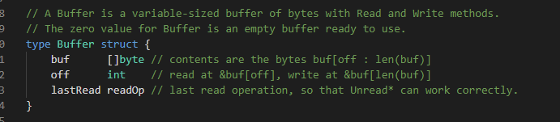
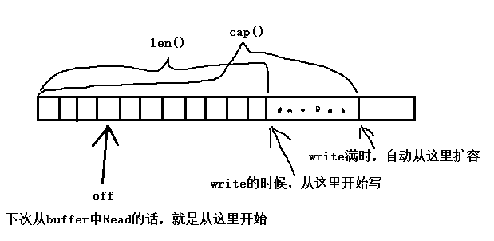
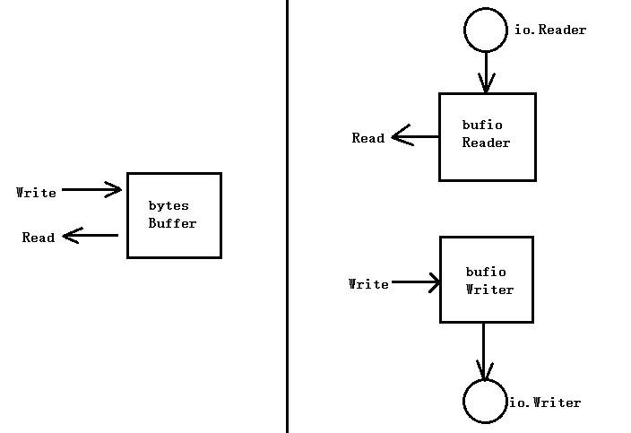
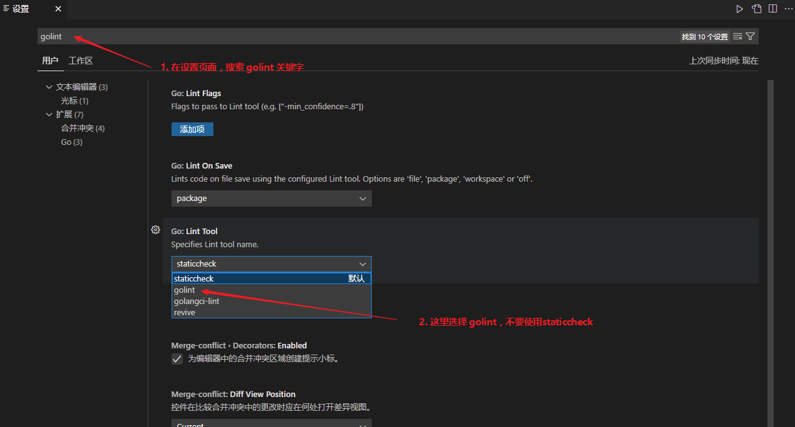
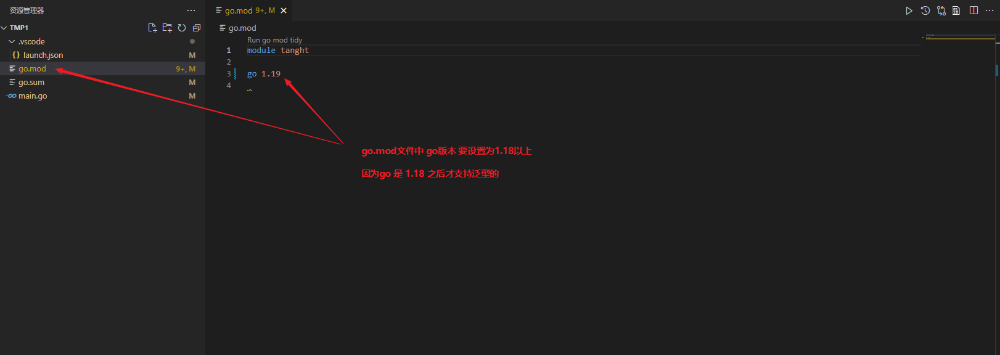

# 声明

`=`是赋值操作，不是声明变量的操作

`:=`是声明变量的操作

```go
var a string = "test"  //两部操作声明a，再对a赋值 1.var a string   2.a = "test"  
b := "test" // 就一步操作，声明b并初始化为test
```


第二行的`:=`，对于err是赋值操作，out是声明+初始化操作。

```Go
in, err := os.Open(infile)
out, err := os.Create(outfile)
```


`:=`左边至少有一个变量是新变量，否则会报错

```go
in, err := os.Open(infile1)
in, err := os.Open(infile2) // 错误，in和err都是已经存在的变量了
```

# 字符串

rune：是int64类型，可以保存一个unicode码(注意不是utf-8编码)。

ascii码是什么？

对`abcd...123...符号等...`进行排号，比如0号代表字符`a`，1号代表字符`b`。一共128个排号，代表128个字符。所以用一个字节(8位)就能储存一个ascii字符。

unicode码是什么？

对`abcd...123...符号...汉字...日语...各种人类字...火星字...`进行排号

```go
func main() {
	//go中string的底层结构是字节数组[]byte，编码格式为utf-8，所以"a唐b"这个字符串在go底层是这样表示的
	//二进制：                                            十进制：                 十六进制：
	//{01100001, 11100101, 10010100, 10010000, 01100010} {97, 229, 148, 144, 98} {0x61, 0xE5, 0x94, 0x90, 0x62}
	// |--a---|  |------------唐------------|  |---b---|
	//可以看出有些字符占1个元素(a)，有些字符占3个元素(唐)
	s := "a唐b"
	fmt.Printf("%d %d %d %d %d\n", s[0], s[1], s[2], s[3], s[4])

	//rune是int64，可以储存一个很大的数字
	//[]rune(s)会将字符串(字节数组、字节流)按照utf-8格式解码为unicode标号
	//本来"唐"这个字符要占用3个byte元素，现在转为rune之后，只需要占用1个rune(int64)元素
	//[]rune实现了每个元素代表1个字符的愿望
	r := []rune(s)
	fmt.Printf("%d %d %d\n", r[0], r[1], r[2])

	//string()函数可以将rune元素按照utf-8格式编码为[]byte(字节流)
	s1 := string(r)
	fmt.Printf("%d %d %d %d %d\n", s1[0], s1[1], s1[2], s1[3], s1[4])
}
```

重点理解：unicode码与utf-8编码之间的关系

rune代表的是unicode码


# go mod

123


# package与import

import()后面跟的永远是路径，与package name无关

代码中使package的时候，永远是通过package name来使用，与文件夹名字无关

例子，目录结构如下：

```go
test
├── hahapack
│   └── a.go
└── main.go
```


```go
// test/hahapack/a.go
// 虽然我的文件夹的名字是hahapack，但是我的package名字却是xixipack，我乐意！
package xixipack
var A int = 11111
```


```go
// test/main.go
package main

import (
	"fmt"
	xixipack "test/hahapack"  // 引用的时候要用文件夹的名字
)

func main() {
    // 使用的时候要用package的名字
    // 虽然文件夹叫做hahapack，但是包名却是xixipack
    // 所以这里必须要用package name来调用
    // 除非import的重命名
	fmt.Println(xixipack.A)
}

```


# package名字重复了？

import的时候可以重命名，重命名之后就可以使用了，不存在冲突


# Slice

```go
```


# 常用函数

```go
// dst与src是slice类型，并且其中的元素类型必须相同
// dst=[]byte and src=[]int 会报错，编译报错
// src可以使字符串(因为字符串底层也是[]byte)
copy(dst, src)
```


```go
type Request struct {
	Method string  		//POST GET DELETE
	URL *url.URL
	Proto      string 	// "HTTP/1.0"
	ProtoMajor int    	// 1
	ProtoMinor int    	// 0
	Header Header		// map[string][]string
	Body io.ReadCloser
	GetBody func() (io.ReadCloser, error)
	ContentLength int64
	TransferEncoding []string
	Close bool
	Host string
	Form url.Values
	PostForm url.Values
	MultipartForm *multipart.Form
	Trailer Header
	RemoteAddr string
	RequestURI string
	TLS *tls.ConnectionState
	Cancel <-chan struct{}
	Response *Response
	ctx context.Context
}
```


```go
type response struct {
	conn             *conn
	req              *Request // request for this response
	reqBody          io.ReadCloser
	cancelCtx        context.CancelFunc // when ServeHTTP exits
	wroteHeader      bool               // reply header has been (logically) written
	wroteContinue    bool               // 100 Continue协议，分部上传post数据，没什么用
    wants10KeepAlive bool               // Connection: "keep-alive"
	wantsClose       bool               // Connection: "close"
	canWriteContinue atomicBool			// 100 Continue协议，分部上传post数据，没什么用
	writeContinueMu  sync.Mutex			// 100 Continue协议，分部上传post数据，没什么用
	w  *bufio.Writer 	// 底层是cw
	cw chunkWriter		// cw是w的底层,cw的Write会调用conn.bufw
	handlerHeader Header
	calledHeader  bool // handler accessed handlerHeader via Header
	written       int64 // number of bytes written in body
	contentLength int64 // explicitly-declared Content-Length; or -1
	status        int   // status code passed to WriteHeader
	closeAfterReply bool
	requestBodyLimitHit bool
	trailers []string
	handlerDone atomicBool // set true when the handler exits
	dateBuf   [len(TimeFormat)]byte
	clenBuf   [10]byte
	statusBuf [3]byte
	closeNotifyCh  chan bool
	didCloseNotify int32 // atomic (only 0->1 winner should send)
}
```


```go
type conn struct {
	// server is the server on which the connection arrived.
	// Immutable; never nil.
	server *Server

	// cancelCtx cancels the connection-level context.
	cancelCtx context.CancelFunc

	// rwc is the underlying network connection.
	// This is never wrapped by other types and is the value given out
	// to CloseNotifier callers. It is usually of type *net.TCPConn or
	// *tls.Conn.
	rwc net.Conn

	// remoteAddr is rwc.RemoteAddr().String(). It is not populated synchronously
	// inside the Listener's Accept goroutine, as some implementations block.
	// It is populated immediately inside the (*conn).serve goroutine.
	// This is the value of a Handler's (*Request).RemoteAddr.
	remoteAddr string

	// tlsState is the TLS connection state when using TLS.
	// nil means not TLS.
	tlsState *tls.ConnectionState

	// werr is set to the first write error to rwc.
	// It is set via checkConnErrorWriter{w}, where bufw writes.
	werr error

	// r is bufr's read source. It's a wrapper around rwc that provides
	// io.LimitedReader-style limiting (while reading request headers)
	// and functionality to support CloseNotifier. See *connReader docs.
	r *connReader

	// bufr reads from r.
	bufr *bufio.Reader

	// bufw writes to checkConnErrorWriter{c}, which populates werr on error.
    bufw *bufio.Writer	// checkConnErrorWriter中调用,rwc.Write，也就是net.TCPConn的Write

	// lastMethod is the method of the most recent request
	// on this connection, if any.
	lastMethod string

	curReq atomic.Value // of *response (which has a Request in it)

	curState struct{ atomic uint64 } // packed (unixtime<<8|uint8(ConnState))

	// mu guards hijackedv
	mu sync.Mutex

	// hijackedv is whether this connection has been hijacked
	// by a Handler with the Hijacker interface.
	// It is guarded by mu.
	hijackedv bool
}
```


```go
type response struct {
	conn             *conn
    
	w  *bufio.Writer 	// 底层是cw
    
	cw chunkWriter		// cw是w的底层,cw的Write会调用conn.bufw
}

type conn struct {
	server *Server
    
	rwc net.Conn
    
    bufw *bufio.Writer	// checkConnErrorWriter中调用,rwc.Write，也就是net.TCPConn的Write
}
```


```go
go get -u github.com/kataras/iris/v12@latest
```


# proto

## 需要的程序：

protoc.exe：核心程序，负责解析proto文件，生成mete信息，下载地址（https://github.com/protocolbuffers/protobuf/releases）

protoc-gen-xxx.exe：插件，负责通过mete信息，生成对应的代码

一些插件

protoc-gen-python.exe生成python代码，这个是protoc自带的，不需要下载

protoc-gen-cpp.exe生成c++代码，这个是protoc自带的，不需要下载

protoc-gen-go.exe生成golang代码，需要自行下载（go install github.com/golang/protobuf/protoc-gen-go@latest）

protoc-gen-gogofaster.exe生成golang代码，跟protoc-gen-go.exe功能一样，protoc-gen-gogofaster瞧不起protoc-gen-go，所以他重写了go的插件

## --xxx_out的解释：

- ./protoc     --cpp_out=./abc/     *.proto

  使用protoc-gen-cpp插件来生成代码，protoc-gen-cpp当然是生成c++代码咯

- ./protoc     --go_out=./abc/     *.proto

  使用protoc-gen-go插件来生成代码，protoc-gen-go当然是生成golang代码咯

- ./protoc     --fuck_out=./abc/     *.proto

  使用protoc-gen-fuck插件来生成代码，protoc-gen-fuck插件你可以自己开发

- --xxx_out=./abc/

  生成的代码放在./abc/目录下

- protoc-gen-cpp插件是protobuf自带的，不需要程序员下载，如果用到其它的插件，则需要程序员提前下载好插件

## --plugin的解释：

指定插件的路径，下面的命令的作用是设置protoc-gen-gogofaster插件的路径

--plugin=protoc-gen-gogofaster=./protoc-gen-gogofaster.exe

如果插件路径在path环境变量中，则不需手动指定

## go_package

编写proto文件，与C++不同的是，golang的proto文件需要在文件中设置option go_package

```shell
option go_package = "{path};{package_name}";
# path：指定生成的xx.pb.go文件的位置(以cmd中--go_out=的路径为基路径)
# package_name：指定xx.pb.go文件中，package的名字
# 下面是具体的例子，生成的文件在当前目录下，文件中的package名字是hahaha
option go_package = "./;hahaha";
# 注意"./;hahaha"最终的路径要加上cmd中指定的--go_out的路径
```

## 例子

目录结构

```bash
.
├── fuckproto  # 目录
├── main.go
└── protofile
    ├── first.proto  # option go_package = "./fuckproto/;fuckproto";
    ├── protoc.exe
    └── protoc-gen-go.exe
```

first.proto中的option go_package为`option go_package = "./fuckproto/;fuckproto";`

在当前目录创建fuckproto目录，将生成的代码放到./fuckproto/目录下，包名为fuckproto

在protofile目录下执行`protoc.exe --go_out=../ *.proto`

cmd+option go_package的效果就是，在.././fuckproto的目录下生成go代码

目录结构

```shell
.
├── fuckproto
│   └── first.pb.go  # 生成的文件
├── main.go
└── protofile
    ├── first.proto
    ├── protoc.exe
    └── protoc-gen-go.exe
```

使用

```go
package main

import (
	"fmt"
	"tanght/fuckproto"

	"google.golang.org/protobuf/proto"
)

func main() {
	// 将结构体编码为字节流
	s1 := fuckproto.Student{
		Name:   "tanght",
		Male:   true,
		Scores: []int32{1, 2, 3, 4},
	}
	bys, err := proto.Marshal(&s1)
	must(err)

	// 将字节流解码为结构体
	s2 := &fuckproto.Student{}
	err = proto.Unmarshal(bys, s2)
	must(err)
	fmt.Println(s2)

	// 给bys添加一个字符，导致bys字节流不是有效的protobuf格式的数据
	// 所以解析肯定会失败
	bys = append(bys, 1)
	s3 := &fuckproto.Student{}
	err = proto.Unmarshal(bys, s3)
	must(err)
	fmt.Println(s3)
}

func must(e error) {
	if e != nil {
		panic(e)
	}
}
```

## json与pb互转

```
"github.com/golang/protobuf/jsonpb"  // json与pb互转
"github.com/golang/protobuf/proto"   // 基础pb操作

a := &pb.UserInfo{}
jsonpb.UnmarshalString(`{"name": "tanght", "age": "100"}`, a)  // 将json字符串解析到protobuf结构体a中

b := &jsonpb.Marshaler{}
c, _ := b.MarshalToString(a)  // 将protobuf结构体a，转为json字符串
fmt.Println(c)
```


# grpc

一个proto文件，会生成两个.go文件

proto文件

```protobuf
syntax = "proto3";

option go_package = "./fuckproto/;fuckproto";

service Greeter {
    rpc SayHello (HelloRequest) returns (HelloReply) {}
    rpc SayHelloAgain (HelloRequest) returns (HelloReply) {}
}

message HelloRequest {
    string name = 1;
}

message HelloReply {
    string message = 1;
}
```

生成go文件

```
protoc.exe --go_out=../ *.proto
protoc.exe --go-grpc_out=../ *.proto
或者两条命令合在一起
protoc.exe --go_out=../ --go-grpc_out=../ *.proto
```

# 反射

aaaaaaaaaa

```go
typ := reflect.TypeOf(a)
NumMethod()	// struct的method数量
Method(1)	// 获取第1个method，reflect.Method类型，再次获取.Type，可以获取到Type类型
NumField()	// 返回struct的字段数
Field(1)	// 返回第1个字段，reflect.StructField类型，再次获取.Type，可以获取到Type类型

// 对于func类型的Type
NumIn()  	// 返回参数的个数
NumOut()  	// 返回返回值的个数
In(1)   	// 返回第1个参数(从0开始)，Type类型
Out(0)  	// 返回第0个返回值(从0开始)，Type类型
```


```

=======
获取里面的类型

对于` Array, Chan, Map, Ptr, Slice`这些类型来说，可以通过`type.Elem()`获取“里面的”类型

比如对`[]string`类型使用`reflect.TypeOf()`的话，得到的类型是slice，`reflect.TypeOf().Elem()`得到的是string

| 变量类型       | TypeOf()类型 | TypeOf().Elem()类型 |
| -------------- | ------------ | ------------------- |
| []string       | slice        | string              |
| map[int]string | map          | string              |
| *int           | ptr          | int                 |
| chan float64   | chan         | float64             |

代码

```golang
func main() {
	a := int(0)
	fmt.Println(reflect.TypeOf(&a).Kind())
	fmt.Println(reflect.TypeOf(&a).Elem().Kind())
	fmt.Println("")

	b := []string{}
	fmt.Println(reflect.TypeOf(b).Kind())
	fmt.Println(reflect.TypeOf(b).Elem().Kind())
	fmt.Println("")

	c := map[int]string{}
	fmt.Println(reflect.TypeOf(c).Kind())
	fmt.Println(reflect.TypeOf(c).Elem().Kind())
	fmt.Println("")

	d := make(chan float64)
	fmt.Println(reflect.TypeOf(d).Kind())
	fmt.Println(reflect.TypeOf(d).Elem().Kind())
	fmt.Println("")
}
```


# 时间

```go
// 2006-01-02 03:04:05 PM -07:00
// 2006-01-02 15:04:05 -07:00
time.Now().Format("2006-01-02 15:04:05 -07:00")
```

# 好玩的

## byte()强制转换

```go
// uint16 65280 二进制表示为 11111111 00000000
var a uint16 = 65280
b := byte(a)
// 请问b为11111111还是00000000
// 答案是b为00000000
print(b)
// 如果我想要a的11111111部分怎么办呢？
b = byte(a >> 8)

```

## slice切片

```go
// a的len=10, cap=10
a := make([]int, 10)
b := a[:0]
// b的len和cap是多少呢？
fmt.Println(len(b), cap(b))
// b的len=0, cap=10。而且b与a共用相同的底层数组
//向b中append5个数
b = append(b, 1, 2, 3, 4, 5)
fmt.Println(a, b)
// 可以发现，a，b都被添加了1,2,3,4,5，这是因为a,b的底层数组是同一个东西
```

## slice切片

```go
a := make([]int, 10, 20)
b := a[:15]
// 请问会报错么？a的len只有10，但是b却取15
// 答：不会报错，因为a的容量有20，如果取的超过20，才会报错
// 并且a,b依然共享同一个底层数组
```

## nil

```go

```

## slice作为函数参数

```go
package main

import "fmt"

func main() {
	a := []string{"0"}
    // abc想给a数组添加几个元素，想得美，门儿都没有
    // 与map形成强烈对比
	abc(a)
	fmt.Println(a)
}

func abc(l []string) {
	l = append(l, "1")
	l = append(l, "2")
	l = append(l, "3")
	l = append(l, "4")
	l = append(l, "5")
	l = append(l, "6", "7", "8", "9")
    // l已经重新分配内存了，所以这些新增的元素，反应不到外部的l
    // 如果l不重新分配内存，那么l的变化会反应到外部的l
}
```

## map作为函数参数

```go
package main

import "fmt"

func main() {
	a := map[string]string{"0": "0"}
    // abc函数可以改变a参数，即使使a变大也没事
    // abc函数运行完之后，a参数真的变变了
	abc(a)
	fmt.Println(a)
}

func abc(m map[string]string) {
	m["1"] = "1"
	m["2"] = "1"
	m["3"] = "1"
	m["4"] = "1"
	m["5"] = "1"
	m["6"] = "1"
	m["7"] = "1"
	m["8"] = "1"
	m["9"] = "1"
    // 可以随意给m添加值，添加任意多个都没事，即使底层重新分配内存也不碍事
}
```

为什么map会这样？golang的作者说了，用户创建的`map`其实是`*map`。在很早以前的golang，确实需要将`map`定义为`*map`，后来发现程序员只定义`*map`，从来不定义`map`，索性直接用`map`代替`*map`了。是的，就是这么随意！操！

## Mutex

sync.Mutex 最好通过指针进行传递：创建一个变量lock，将lock通过协程参数传递给两个协程，那么这两个协程收到的其实是两个完全不同的锁，无法对两个协程进行同步。不仅是Mutex最好用指针，sync包中的所有同步原语，最好都用指针进行传递！

sync.Mutex的复制，连同锁状态一起复制

```go
lock1 := sync.Mutex{}
lock1.Lock()
lock2 := lock1  // lock2已经Lock()了
lock2.Lock()  // 死锁了
```

# Redis

核心，连接redis(Dial)，操作redis(Do)

```go
package main

import (
	"fmt"

	"github.com/gomodule/redigo/redis"
)

func main() {
	// 先创建几个DialOption玩儿玩儿
	// DialOption用于配置redis客户端
	// 比如设置客户端名字(命令为CLIENT SETNAME haha)
	// 使用密码登陆redis(命令为AUTH your_password)
	// 使用用户+密码登陆redis(命令为AUTH your_name your_password)
	// 等等...
	ocn := redis.DialClientName("tanghttest")
	opw := redis.DialPassword("Tht940415,./")
	// Dial接收N个DialOption选项,上面创建的，这里给它传递进去就行了
	c, e := redis.Dial("tcp", "www.tanght.xyz:6379", ocn, opw)
	if e != nil {
		fmt.Println("连接redis失败", e.Error())
	}
	// 然后就可以使用c了，c是redis的连接，通过c给redis发命令就行了
	// redis返回的是interface类型，可以使用redis包提供的类型转换函数进行转换
	// 比如redis.String()将redis的返回值转换为string类型
	fmt.Println(redis.String(c.Do("GET", "tanght")))
	fmt.Println(redis.String(c.Do("SET", "tanght", "100")))
	fmt.Println(redis.String(c.Do("GET", "tanght")))
}
```

连接池

```go
package main

import (
	"fmt"
	"time"

	"github.com/gomodule/redigo/redis"
)

func main() {
	p := redis.Pool{MaxIdle: 10, MaxActive: 100, Dial: redisDial, IdleTimeout: 10 * time.Second}
	c := p.Get()
	defer c.Close()
	fmt.Println(redis.String(c.Do("GET", "tanght")))
	fmt.Println(redis.String(c.Do("SET", "tanght", "100")))
	fmt.Println(redis.String(c.Do("GET", "tanght")))
	fmt.Println("haha")
}

func redisDial() (redis.Conn, error) {
	ocn := redis.DialClientName("haha")
	opw := redis.DialPassword("xxxx")
	return redis.Dial("tcp", "www.abc.com:6379", ocn, opw)
}
```

# 标准库

## bytes

提供字符串处理常用方法，比如字符串分割，字符串比较，搜索子字符串，字符串数组join，字符串替换等等。

提供一个buffer，可以从里面读数据(Reader)或向里面写数据(Writer)。

提供一个Reader，跟buffer有什么不同？我也不知道，感觉跟buffer类似了。

### 常用函数

```go
// 按照sep为分隔符切割s，将s分割为一堆小s，分隔符直接扔掉，小s中不带分隔符
func Split(s, sep []byte) [][]byte

// 与Split功能一样，只不过分割后的小s中带有sep，也就是说每个小s都带一个sep尾巴(最后一个小s可能没有分隔符)
func SplitAfter(s, sep []byte) [][]byte

// 与Split一样，只不过[][]byte的长度最大为n
func SplitN(s, sep []byte, n int) [][]byte

// 还有一堆常用的，自己看源码中的注释就行了
```

### bytes.Buffer

NewBuffer()创建一个Buffer，然后就可以对这个Buffer进行读写了。

记住，写入的话是从内部buf的len()处开始写的，所以如果想从头开始写，那一定要创建一个len为0(cap可0可不0)的[]byte给NewBuffer进行初始化。





## bufio

123



## json

结构体Tag的规则：

- 结构体字段后面用反引号包裹起来的字符串就是Tag
- 字符串是一堆key-value对，用空格将各个key-value对分割开
- key不能用双引号包裹，value必须用双引号包裹(因为value中可能包含空格)
- 可以用反射功能在代码中获取结构体各字段的Tag
- Tag的作用就是给结构体的字段增加一个辅助字符串

```go
package main

import (
	"fmt"
	"reflect"
)

type ABC struct {
	A int `dog:"我是一只狗" 猫:"i am cat"`
	B int
}

func main() {
	abc := ABC{}
	tag1 := reflect.TypeOf(abc).Field(0).Tag.Get("dog")
	fmt.Println(tag1)  // 我是一只狗
	tag2 := reflect.TypeOf(abc).Field(0).Tag.Get("猫")
	fmt.Println(tag2)  // i am cat
}
```

既然Tag能给结构体的字段附带一些信息，那么json库就利用了Tag来定义了一些规则，来辅助json编解码

```golang
// json库只获取Tag的名字为"json"的Key
// 对于下面的ABC.A字段,json库只会取到"A,string"这个字符串
// "required,min=6,max=20"这个value是不会被获取到的
type ABC struct {
	A int `json:"A,string" validate:"required,min=6,max=20"`
	B string
}

// A,string：A是定义json字段的名字，因为json字段的名字可能跟结构体中字段的名字不一致
// A,string：string是定义json字段的类型
// 在golang中ABC.A的类型为int，在json中A的类型为string
// {"A": "1"}  {"A": 1} 的区别
type ABC struct {
	A int `json:"A,string" validate:"required,min=6,max=20"`
}
```

编解码

```go
// 将字符串str按照abc结构体的格式，转换成abc结构体
json.Unmarshal(str, &abc)

// 将abc结构体变成json字符串
json.Marshal(abc)
```

## atomic

```go
// CAS(CompareAndSwap)操作的意思: 如果 A==B 则将A设置为C并返回true
// 如果*addr == old 则 *addr=new
// 因为要修改addr的值, 所以要将addr的指针传进去
atomic.CompareAndSwapPointer(addr *unsafe.Pointer, old unsafe.Pointer, new unsafe.Pointer) (swapped bool)
```


## net

- 多个协程同时对1个`net.Conn`执行`Write`操作是安全的
- 多个协程同时对1个`net.Conn`执行`Read`操作是无意义的，所以我没测试
- 数据顺序不会出错，比方说2个协程，一个写"1111"另一个写"2222"，那么对方不会收到类似"11221122"这种信息
- 猜测Write内部是有并发考虑的，可能是内部加锁了
- 多个协程同时对1个`net.Conn`写，不如1个协程的效率高，所以最好借助`chan`

```go
func main() {
	l, _ := net.Listen("tcp", "127.0.0.1:8000")
	c, _ := l.Accept()
	for i := 0; i < 100; i++ {
		go write(c)
	}
	time.Sleep(10000 * time.Second)
}

func write(c net.Conn) {
	for {
		c.Write([]byte("123"))
	}
}
```


```go
// net.IP 是一个[]byte(字节数组)，长度为16个字节
// IPV4地址只占用 [12] [13] [14] [15] 这四个字节
// 例如对 192.168.7.45 来说， [12]=192 [12]=168 [12]=7 [15]=45
func net.ParseIP(s string) net.IP
ip := net.ParseIP("192.169.8.8")

// net.IPNet 是 net.IP 附带 掩码
// 192.168.7.45/8 的意思是  192.*.*.*
// 只有x.x.x.x/n 只有被n包括的字符才生效，其它的字符为*
func net.ParseCIDR(s string) (net.IP, *net.IPNet, error)
ip, ip_with_mask, err := net.ParseCIDR("192.168.7.45/8")
// 192.168.7.45/8 包括 192.8.8.8
ip_with_mask.Contains(net.ParseIP("192.8.8.8"))  // true
```


## rand

```go
// 生成随机字节流
p := make([]byte, 16)
io.ReadFull(rand.Reader, p)
```


# 三方库

## validator

校验结构体各字段是否符合预期

```go
import "github.com/go-playground/validator/v10"

vali := validator.New()
a := struct {
    Name string `validate:"required`
    Age  int    `validate:"required,gte=0,lte=100"`
}{Name: "tanght", Age: 100}
err := vali.Struct(a)

// dive告诉校验器下潜到下一级别校验下一级别的每一个元素
// 所以dive只会用于 list 和 map类型的字段哦
// 对于Phone字段，如果不写dive
// 那么即使下一级元素有 validate 规则，也不会进行验证
// Phone []struct {
//     Id    int     `json:"id" yaml:"" validate:""`
//     Name  string  `json:"name" yaml:"" validate:""`
//     Price float64 `json:"price" yaml:"" validate:"gte=10,lte=50"`
// } `json:"phone" yaml:"" validate:"required"`
b := struct {
    Name  string `json:"name" yaml:"" validate:"required"`
    Age   int    `json:"age" yaml:"" validate:"gte=0,lte=130"`
    Phone []struct {
        Id    int     `json:"id" yaml:"" validate:""`
        Name  string  `json:"name" yaml:"" validate:""`
        Price float64 `json:"price" yaml:"" validate:"gte=10,lte=50"`
    } `json:"phone" yaml:"" validate:"required,dive"`
}{}
```

# yaml

```go
import "gopkg.in/yaml.v3"
yaml.Unmarshal && yaml.Marshal
```


# pprof

功能：程序详细信息分析，协程数量，内存申请情况，cpu占用等等

原理：通过匿名引入`net/http/pprof(内部依赖runtime/pprof)`这个标准库，这个标准库会在代码的关键位置进行监控和统计，进而实现对程序的详细运行情况的掌控。

使用方法

- 通过浏览器直接访问特定的页面，在浏览器中查看
- 通过wget直接下载页面到本地，通过记事本查看
- 通过`go tool pprof url地址`下载二进制文件到本地，再通过`go tool pprof 文件名`来交互

# 编译

```shell
myproject/
├── go.mod			# 工程的依赖信息(例如依赖了github上的多个golang库)
├── go.sum
├── program_a      	# 程序A
│   ├── cmd
│   │   └── a.go
│   ├── core
│   │   └── b.go
│   └── main.go
├── bprogram_b    	# 程序B
│   └── main.go
├── program_c		# 程序C
│   └── main.go
└── lib				# 程序A B C的共用函数(库)
    ├── a.go
    ├── b.go
    └── c.go

# myproject这个工程包含了4个部分，分别是程序A、程序B、程序C、库函数

# 将go.mod中记录的依赖下载到本地
# go mod download

# 编译 A 程序
# go build -o A ./myproject/program_a

# 编译 B 程序
# go build -o B ./myproject/program_b

# 编译 C 程序
# go build -o C ./myproject/program_c
```


# 禁用代码分析

```
//nolint:all

// +build !codeanalysis
```

aaa

```go
//nolint:govet,errcheck // 对文件级别生效
package main
 
import (
    "fmt"
    "math/rand"
    "time"
)
 
func main() {
    rand.Seed(time.Now().UnixNano())
    fmt.Println(rand.Int()) //nolint:gosec // 对行级别生效
}
 
//nolint // 对函数级别生效
func nolintFunc() {
 
}
```


.golangci.yaml文件控制go代码检查，将此文件放在项目的根目录

```yaml
# 检测基本配置
run:
  skip-dirs: # 设置要忽略的目录
    - util
    - .*~
    - api/swagger/docs
  skip-files: # 设置不需要检查的go源码文件，支持正则匹配
    - ".*.my.go$"
    - _test.go
# 修改某个linter的设置
linters-settings:
  errcheck:
    check-type-assertions: true # 这里建议设置为true，如果确实不需要检查，可以写成`num, _ := strconv.Atoi(numStr)`
    check-blank: false
  lll:
    line-length: 240 # 一行的长度
  godox:
    keywords: # 建议设置为BUG、FIXME、OPTIMIZE、HACK
      - BUG
      - FIXME
      - OPTIMIZE
      - HACK
# 开启某个linter，按需开启
linters:
  disable-all: true
  enable:
    - typecheck
    - asciicheck
    - bodyclose
    - cyclop
    - deadcode
    - depguard
    - dogsled
    - dupl
    - durationcheck
    - errcheck
    - errorlint
    - exhaustive
    - exhaustivestruct
    - exportloopref
    - forbidigo
    - funlen
    - gci
    - gochecknoinits
    - gocognit
    - goconst
    - gocyclo
    - godot
    - godox
    - gofmt
    - gofumpt
    - goheader
    - goimports
    - gomoddirectives
    - gomodguard
    - goprintffuncname
    - gosec
    - gosimple
    - govet
    - ifshort
    - importas
    - ineffassign
    - lll
    - makezero
    - misspell
    - nakedret
    - nestif
    - nilerr
    - nlreturn
    - noctx
    - nolintlint
    - paralleltest
    - prealloc
    - predeclared
    - promlinter
    - revive
    - rowserrcheck
    - sqlclosecheck
    - staticcheck
    - structcheck
    - stylecheck
    - thelper
    - tparallel
    - unconvert
    - unparam
    - unused
    - varcheck
    - wastedassign
    - whitespace
  fast: false

```

# GC

第一个阶段 gc开始 （stw）

1. stop the world 停止整个世界
2. 启动标记工作协程（ mark worker goroutine ），用于第二阶段
3. 启动写屏障
4. 将root 根对象放入标记队列（放入标记队列里的就是灰色）
5. start the world 开始整个世界，进入第二阶段

第二阶段 marking（这个阶段，用户程序跟标记协程是并行的）

1. 从标记队列里取出对象，标记为黑色
2. 然后检测是否指向了另一个对象，如果有，将另一个对象放入标记队列
3. 在扫描过程中，用户程序如果新创建了对象 或者修改了对象，就会触发写屏障，将对象放入单独的 marking队列，也就是标记为灰色
4. 扫描完标记队列里的对象，就会进入第三阶段

第三阶段 处理marking过程中修改的指针 （stw）

1. stop the world 暂停程序
2. 将marking阶段 修改的对象 触发写屏障产生的队列里的对象取出，标记为黑色
3. 然后检测是否指向了另一个对象，如果有，将另一个对象放入标记队列
4. 扫描完marking队列里的对象，start the world 取消暂停程序 进入第四阶段

第四阶段 sweep 清楚白色的对象

# gctrace

```
"env": {
	"GODEBUG": "gctrace=1"
}
```


```
gc 22 @4.428s 0%: 0+11+0 ms clock, 0+0.50/4.5/8.5+0 ms cpu, 4->4->2 MB, 4 MB goal, 0 MB stacks, 0 MB globals, 4 P
    1    2    3     4                     5                     6          7          8              9        10

10部分
1：第多少次GC
2：此时的时间（相对于程序开始时的相对时间）
3：本次GC所使用的CPU占比
4：GC第一阶段时间 + GC第二阶段时间 + GC第三阶段时间
5：同上
6：GC开始时的内存大小（包含垃圾和活跃内存） -> 有多少M被标记为了垃圾 -> GC结束时的活跃内存大小
7：
8：
9：
10：本次GC一共用了多少协程


```


# VSCODE泛型报错






# 正则表达式

```go
// reg.Find[All][String|StringSubmatch][Index]
// reg.FindString 最左匹配，返回匹配到的字符串，即使存在多个匹配结果，也只返回最左的第一个(想返回所有的话，用FindALL)
// reg.FindStringSubmatch 
// 加ALL 匹配所有（不只返回最左了）
// 加Index 不返回字符串，而是返回字符串的开始和结束的索引（左开右闭）


s = "xxx name:tanght age:18 name:wq age:10 xxx name:tom age:1 xxx name:dog age:100"
reg, _ := regexp.Compile(`name:(?P<name1>[\S]+) age:(?P<age1>[\S]+)`)

// 正则中未分组捕获
reg.FindString(s) 返回 "name:tanght age:18"
reg.FindStringIndex(s) 返回 [4 22]
reg.FindAllString(s, -1) 返回 ["name:tanght age:18", "name:wq age:10", "name:tom age:1", "name:dog age:100"]
reg.FindAllStringIndex(s, -1) 返回 [[4 22] [23 37] [42 56] [61 77]]

// 正则中分组捕获
reg.FindStringSubmatch(s) 返回 []string [0]是匹配到的字符串 [1]是第一组 [2]是第二组
reg.FindStringSubmatchIndex(s) 返回 []int [0][1]是匹配到的字符串 [2][3]是第一组 [4][5]是第二组
reg.FindAllStringSubmatch(s, -1) 返回 [][]string
```

# 性能常识

## 原子操作&锁&无锁

- 无锁：243309/ms
- 原子操作atomic：37503/ms
- 普通锁Mutex：7114/ms

1. 最普通的锁，每毫秒也能加解锁7千多次，每秒就是700多万次加解锁，你的程序真的接受不了这点性能损失么？10次加解锁只需要1.4us的时间。
2. 原子操作比普通锁厉害5.27倍。
3. 无锁比原子操作厉害6.5倍。

## channel

N个线程往里放，M个线程往外读，每毫秒传递的元素数量在1W左右，且速率与M和N的大小关系不大。

## 费用

CDN流量：0.25元/G

公网流量：0.8元/G

# 通过go安装软件

go install github.com/gogo/protobuf/protoc-gen-gofast

# TCP

## Close

每个conn只能调用一次Close，再次调用Close会返回错误（注意只是返回错误而已，不是抛出异常）

```go
c = net.Conn{}
e := c.c.Close() // e = nil
e = c.c.Close() // e = "不能close一个已经被close了的连接"
```

对方Close了这个连接，我方也需要对这个连接Close一下。如果我方不Close，则可能会造成我方的内存泄漏。

我方可以通过Read函数的返回值来判断对方是否已经Close（io.EOF）

```go
n, e := c.Read(data)
if e == io.EOF {
    c.Close()
}
```

## Write

可以并发调用Write

```go
// 可以多个线程并发调用Write函数, Write内部自动加锁
// Write("0123456789") Write("abcdefgh")
// 要么先发"0123456789", 要么先发"abcdefgh", 不会出现 "012345abcd"
c.Write([]byte("123123"))
```

## Read

并发Read没有实际意义，所以不讨论

# 安装

https://go.dev/dl/go1.21.6.linux-arm64.tar.gz

tar -zxvf xxxxx

mv go /usr/local/

~/.bashrc

```
export GOROOT=/usr/local/go/1.21.5
export GOPATH=$GOROOT/gopath
export PATH=$PATH:$GOROOT/bin:$GOPATH/bin
```

# 有用的库

验证码，base64图片，data:image/png;base64,iVBORXXX...

github.com/mojocn/base64Captcha
