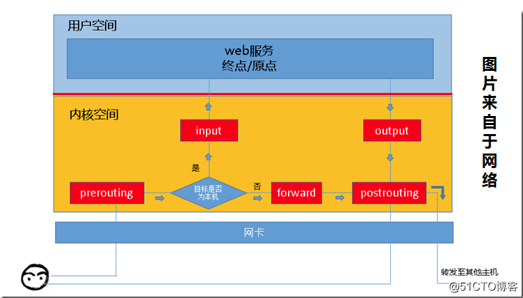

# SHELL快捷键

| 命令            | 作用                                    |
| --------------- | --------------------------------------- |
| Ctrl + U        | 清空命令行 （所有内容）                 |
| Ctrl + K        | 清空命令行 （当前光标位置以后所有内容） |
| Ctrl + W        | 清空命令行 （ 当前光标位置之前的单词）  |
| Ctrl + Y        | 粘贴Ctrl + [U,K,W]删除的内容            |
|                 |                                         |
| Ctrl + A        | 跳到命令行头部                          |
| Ctrl + E        | 跳到命令行尾部                          |
|                 |                                         |
| Ctrl + Z        | 暂停当前任务，并给出任务号[task_num]    |
| `bg [task_num]` | 去后台运行[task_num]这个任务            |
| `fg [task_num]` | 去前台运行[task_num]这个任务            |
|                 |                                         |
| Ctrl + D        | 关闭当前终端                            |
| Ctrl + L        | 清屏                                    |
|                 |                                         |

# 基本命令

## 创建新用户

```shell
# 切换为root用户
su root

# 创建tanght用户
useradd tanght

# 修改tanght用户的密码
passwd tanght
```

## 打包/压缩/解压(tar)

```shell
tar zxvf filename.tar
tar czvf filename.tar dirname

# 将所有.jpg文件，打包（不压缩）成haha.tar文件
tar -cf haha.tar *.jpg
# 将所有.gif文件，添加到haha.tar文件中
tar -rf haha.tar *.gif
# 列出haha.tar中包含的所有文件
tar -tf haha.tar
# 解包haha.tar
tar -xf haha.tar

# 忽略某些文件夹
# dir1
#     test1
#          other
#          test2
#     other
# --exclude后面跟的是相对于dir1的相对路径
tar --exclude=test1/test2 dir1.tar.gz dir1
```

注意：f参数必须在所有参数之后

## 软连接(ln)

```shell
# 在path2目录中创建一个path1文件(或者目录)的软链接
ln -s path1 path2
```

## 查看目录大小(du)

```shell
# 查看当前目录的大小（查看.的总大小）
du -sh

# 查看当前目录下所有文件和目录的大小（递归）
du -h

# 同上，递归1层
du -h --max-depth=1
```

## 查看磁盘空间(df)

```she
df -h
```

## 查看DELETE文件

```shell
sudo find /proc/*/fd -ls | grep '(deleted)'
```

## sort(排序)

```shell
# -r 逆序，从大到小
# -n 以数值大小进行排序，也就意味着，指定的排序列必须为数字，避免10 < 2的情况(字符顺序)
# -k 后面跟列数，指定排序的列
# -t 指定分隔符  如 -t :   以冒号作为分割符，不指定的话是空格
# 将filename.txt中每行作为一个单元，以空格为分隔符，以第三列为关键列进行排序，倒序
sort -rn -k 3 filename.txt
```

## alias(命令别名)

```shell
# 把这条语句写到 ~/.bashrc 中
alias ll='ls -lh'
alias lll='ls -lha'
```

## lsof(查看端口/文件状态)

```shell
lsof -i :80 查看80端口的状态
lsof abc.txt 显示开启文件abc.txt的进程
lsof -c abc 显示abc进程现在打开的文件
lsof -c -p 1234 列出进程号为1234的进程所打开的文件
lsof -g gid 显示归属gid的进程情况
lsof +d /usr/local/ 显示目录下被进程开启的文件
lsof +D /usr/local/ 同上，但是会搜索目录下的目录，时间较长
lsof -d 4 显示使用fd为4的进程
```

## netstat(查看网络连接)

```shell
# 显示当前电脑所占用的所有tcp端口
# a 显示所有sockets， 默认只显示connected状态的sockets
# n 不要将IP地址转换为域名
# p 显示进程名
# t 只显示tcp的sockets
netstat -anpt
```

## 查看系统版本

```shell
# 查看内核版本
uname -a

# 查看内核版本
cat /proc/version

# 查看系统版本(Centos版本或Ubuntu版本，但是这个命令可能没有)
lsb_release -a

# 查看Centos版本(Centos必有)
cat /etc/redhat-release

# 查看Ubuntu版本(Ubuntu必有)
cat /etc/redhat-release

```

## source(执行脚本)

```shell
source test.sh		# 将test.sh中的代码读出来，放到本窗口的命令行中执行(本shell直接运行test.sh中的命令)
. test.sh			# . 同 source
./test.sh			# 启动子进程，运行test.sh脚本
sh test.sh			# sh 同 ./
```

例子：

export的环境变量对本shell以及本shell的子程序起作用。如果定义了一个环境变量但是不export，则此环境变量只对本shell起作用，对它的子程序不起作用。所以如果我们编写了一个脚本如下：

```shell
# export_env.sh
# 此脚本的作用就是定义几个环境变量给gcc使用
export LD_LIBRARY_PATH=/home/tanght/download/boost_1_75_0/stage/lib:${LD_LIBRARY_PATH}
export LIBRARY_PATH=/home/tanght/download/boost_1_75_0/stage/lib:${LIBRARY_PATH}
export CPATH=/home/tanght/download/boost_1_75_0:${CPATH}
```

如果我们`./export_env.sh`这样运行这个脚本，则会发现`echo ${CPATH}`并没有按照我们的想法被设置，跟我们没有运行这个脚本之前是一样的。

那是因为export_env.sh这个脚本是以一个子进程的形式运行的，子进程中设置的环境变量并不能传递给它的父进程(也就是我们的操作窗口)。

所以如果想要在本窗口中设置环境变量，只能将上面的代码复制到命令行中执行一下了。。。哈哈，那样岂不是太弱了，一点逼格都没有！牛逼的方法看下面！

source命令的作用是什么呢？`source export_env.sh`这个命令的意思是：别用子进程运行export_env.sh这个脚本，直接将export_env.sh这个文件中的命令读出来，直接在本窗口中运行！

## dd(创建文件指定大小)

```shell
# if 指定输入文件
# of 指定文件写入的位置
# bs * count 是文件的大小
dd if=/dev/zero of=50M.file bs=1M count=50
```

## grep(查找字符串)

```shell
grep   [控制参数]   '想要搜索的字符串'   文件名(可以带*匹配)

# 读取file.txt，输出包含'ab cd'这个字符串的行
grep 'ab cd' file.txt

# 读取当前目录下所有.log结尾的文件，输出包含'ab cd'这个字符串的行
# 只在当前目录下找.log文件，不会递归的去子目录下去找
grep 'ab cd' *.log

# 读取当前目录下所有文件，输出包含'ab cd'这个字符串的行
grep 'ab cd' *

# 读取当前目录以及子目录下所有文件，输出包含'ab cd'这个字符串的行
# -r 遍历所有子目录
grep -r 'ab cd' *

# -n 顺便输出行号
grep -n 'ab cd' file.txt

# -i 忽略大小写
grep -i 'ab cd' file.txt

# -l 只显示文件名，不显示匹配到的具体的行
grep -r -l 'ab cd' *

# -E 使用正则表达式匹配
grep -E 'ab.*cd' file.txt

# -v 排除带有abc关键字的行
grep -v abc file.txt
```

## find(查找文件或目录)

```shell
# 在 / 目录下查找名字符合 *abc* 的所有文件(普通文件、目录、链接、等文件)，递归所有子目录
find / -name "*abc*"

# 在 / 目录下查找名字符合 *abc* 的普通文件(仅包括普通文件，不包含目录、链接等)
# -type 限制文件类型 (f普通文件 d目录 c字符设备 b块设备 l链接 p管道)
find / -name "*abc*" -type f

# 在 / 目录下查找名字符合 *abc* 且大小大于1M 的普通文件
# -size 限制大小(+1M大于1兆 -1M小于1兆)
find / -name "*abc*" -type f -size +1M

# -type f (限制文件类型 f普通文件 d目录 c字符设备 b块设备 l链接 p管道)
# -size +1M (限制文件大小 +1M  -1M)
# -maxdepth 2 (限制目录层数 目录最多递归2层)
# -mtime +10 (限制文件最近修改时间 单位为天)
# -mmin +10 (限制文件最近修改时间 单位为分钟)
```

## awk(文本处理)

不影响源文件。

awk就是把文件**逐行**的读入，以空格为默认分隔符将**每行分割**，切开的部分再进行各种分析处理。

`$0`表示所有域，`$1`表示第一个域，`$n`表示第n个域。

```shell
awk [-F '分隔符(默认是空格)'] '{指令}' 待处理的文件
```

例子

```shell
ps -elf | grep node | awk '{print $1" "$3}' # $1和$3之间有一个字符" "
ps -elf | grep node | awk '{print $1   $3}' # $1和$3之间没有空格
cat /etc/passwd | awk -F ':' '{print $1" "$7}'
```

## sed(文本处理)

默认不影响源文件。-i参数直接修改源文件

```shell
sed [选项] [脚本命令] 文件名
```

例如将文件中的hello单词全部替换为world单词

```shell

```

## wc(文本处理)

统计文件中有多少行l(单词w、字符c)

```shell
wc [-clw] [filename]
```

# 软件安装与仓库

## 软件包安装

Ubuntu：高级apt，基本dpkg

Centos：高级yum，基本rpm

### Ubuntu

```shell
# 更新本地软件仓库至最新(将远程软件仓库又新增了哪些软件，软件仓库中的软件版本等等这些信息同步过来)
apt update
# 更新已经安装的软件到最新
apt upgrade
# 安装软件
apt-get install PackageName
# 指定版本
apt-get install PackageName=VersionName
# 重新安装
apt-get --reinstall install PackageName
# 安装源码包所需要的编译环境
apt-get build-dep PackageName
# 下载软件包的源码
apt-get source PackageName


# 删除软件包, 保留配置文件
apt-get remove PackageName
# 删除软件包, 同时删除配置文件
apt-get remove PackageName --purge
# 删除软件包, 同时删除为满足依赖而自动安装且不再使用的软件包
apt-get autoremove PackageName 
# 删除软件包, 删除配置文件,删除不再使用的依赖包
apt-get --purge autoremove PackageName
# 清除 已下载的软件包 和 旧软件包
apt-get clean && apt-get autoclean


# 列出本地软件仓库中的所有包(包含已安装和未安装的，所有的)，已安装的软件会带有[installed]标签
apt list
# 指定名字
apt list mysql*
# 列出已经安装的软件
apt list --installed
# 列出可升级的软件
apt list --upgradable
```

### centos

```shell
# --showduplicates 用于显示所有版本，否则的话只显示最新版本
yum search kubectl --showduplicates
# 结果如下
# kubectl-1.5.4-0.x86_64 : xxx说明.
# kubectl-1.6.0-0.x86_64 : xxx说明.
# ...
# kubectl-1.20.13-0.x86_64 : xxx说明.
# kubectl-1.20.14-0.x86_64 : xxx说明.
# ...
# kubectl-1.24.0-0.x86_64 : xxx说明.
# kubectl-1.24.1-0.x86_64 : xxx说明.

# 挑一个你喜欢的版本进行安装
yum install -y --setopt=obsoletes=0 kubectl-1.20.13-0.x86_64

# 查看已经安装的软件
yum list installed

# 卸载软件
yum remove package_name
```

## 软件仓库

### 修改仓库源地址

#### Centos

```bash
配置文件地址：/etc/yum.repos.d/CentOS-Base.repo
mv /etc/yum.repos.d/CentOS-Base.repo /etc/yum.repos.d/CentOS-Base.repo.backup # 备份
wget -O /etc/yum.repos.d/CentOS-Base.repo http://mirrors.aliyun.com/repo/Centos-5.repo # 下载新文件
wget -O /etc/yum.repos.d/CentOS-Base.repo http://mirrors.aliyun.com/repo/Centos-6.repo
wget -O /etc/yum.repos.d/CentOS-Base.repo http://mirrors.aliyun.com/repo/Centos-7.repo
```

#### Ubuntu

```shell
配置文件地址：/etc/apt/sources.list

档案类型   镜像url                 版本代号        软件包分类 
deb       http://xx.xx.xx/xx/    bionic        main restricted universe multiverse
 
————————————————
每一个源(http://xx.xx.xx/xx/)目录下都应该至少包含dists和pool两个目录，否则就是无效的源
```

## apt原理

`/etc/apt/sources.list`列举出了所有可用仓库，用户可以根据自己的爱好随意修改，修改之后记得执行`apt update`

sources.list类似下面这样：

```shell
deb http://mirrors.tencentyun.com/ubuntu/ bionic main restricted universe multiverse
deb http://mirrors.tencentyun.com/ubuntu/ bionic-security main restricted universe multiverse
deb http://mirrors.tencentyun.com/ubuntu/ bionic-updates main restricted universe multiverse
# deb http://mirrors.tencentyun.com/ubuntu/ bionic-proposed main restricted universe multiverse
# deb http://mirrors.tencentyun.com/ubuntu/ bionic-backports main restricted universe multiverse
deb-src http://mirrors.tencentyun.com/ubuntu/ bionic main restricted universe multiverse
deb-src http://mirrors.tencentyun.com/ubuntu/ bionic-security main restricted universe multiverse
deb-src http://mirrors.tencentyun.com/ubuntu/ bionic-updates main restricted universe multiverse
# deb-src http://mirrors.tencentyun.com/ubuntu/ bionic-proposed main restricted universe multiverse
# deb-src http://mirrors.tencentyun.com/ubuntu/ bionic-backports main restricted universe multiverse
deb [arch=amd64] https://download.docker.com/linux/ubuntu bionic stable
# deb-src [arch=amd64] https://download.docker.com/linux/ubuntu bionic stable
```

每行代表一个仓库，每行的格式如下

```shell
[deb或者deb-src二选一] [url] [Codename] [main restricted universe multiverse 多选]
```

deb：表示本行用于二进制软件下载

deb-src：表示本行用于源代码下载

注：为什么deb与deb-src的url是一样的？因为这个url既提供了二进制软件，也提供了源代码。apt去下载的时候会遵循一定的规则，在特定的目录下去下载软件或源代码，虽然是同一个url，但是子路径是不一样的

url：仓库地址

Codename：ubuntu版本代号。这个url中可能存在多个文件夹，以Codename-xxx格式命名，apt去这个url的哪个文件夹下搜索文件呢？就是根据这一行的Codename来决定的

查看本机ubuntu的版本代号：`lsb_release -a`

查看所有发行版代号：https://wiki.ubuntu.com/Releases

/etc/apt/sources.list是所有仓库的地址(url)，每个仓库中都保存了很多软件

apt update的时候，apt会去遍历sources.list中的所有url，将每个url中所包含的软件信息保存到本地(注意不是保存软件到本地，只是将仓库中的软件信息保存到本地，例如软件名，软件版本，软件签名等等)，保存到/var/lib/apt/lists/中

apt install的时候去本地的软件信息中分析依赖并找到软件的下载位置，然后去安装

## 仓库结构

以http://cn.archive.ubuntu.com/ubuntu/这个仓库为例


dists下的结构


进入bionic目录


进入main/binary-i386目录下，下载Packages.gz解压后得到Packages文件，这个文件是此仓库提供的所有软件的信息


apt源修改

# 定时任务(crond)

简述：crond为定时任务后台服务，为Linux提供定时任务功能，基本上任何一个Linux发行版都带有crond这个服务。crontab为crond的对外接口，使用户可以配置crond。

## 使用crontab

在命令行中输入crond -e后，会打开一个虚拟文件，直接编辑这个文件就能实现定时任务的设置。文件中的每一行为一个定时任务，每行的的格式如下：

```shell
分  时  日  月  周  shell命令
```

可以运行shell命令就十分灵活了，因为可以用shell命令来运行我们自己编写的脚本或程序，如下：

```shell
# 每分钟运行ls命令，当然了crond是在后台运行我们的任务，所以ls的结果我们当然看不到了
* * * * * ls

# 每分钟运行  ls > /home/tanght/test.txt   这个命令，我们将ls的结果重定向到了test.txt中，这样我们就能看到结果了
* * * * * ls > /home/tanght/test.txt

# 每分钟运行   python3  /home/ubuntu/timedtasks/helloworld.py  my_arg   这个命令
# helloworld.py是我自己写的python脚本，接收1个参数
* * * * * python3 /home/ubuntu/timedtasks/helloworld.py 101.txt
```

使用方法

```shell
crond -e

# 以当前用户的身份设置定时任务，只能看到/编辑当前用户的定时任务
crond -e

# 以root用户来设置定时任务，能看到/编辑所有用户的定时任务
sudo crond -e
```

注意事项：

- 首次运行crond -e可能需要选择编辑器，选择vim就行了
- select-editor命令用来切换编辑器

## 使用crond配置文件

直接修改/添加配置文件也能实现定时任务的设置，crond的配置文件在/etc/cron.d目录下（多个文件，每个定时任务单独一个文件，这样比较清晰），如果想新增定时任务，直接写个新的文件放到/etc/cron.d目录下就行了，新增或修改/etc/cron.d目录下的配置文件不需要重启crond服务，配置文件的格式如下：

```shell
# 文件路径为 /etc/cron.d/nginx
SHELL=/bin/bash
PATH=/sbin:/bin:/usr/sbin:/usr/bin
# HOME环境变量是设置这个任务的 当前工作目录(cwd)
HOME=/
# 每天的23:59分 用root用户 执行 logrotate -f /usr/local/nginx/conf/nginx.logrotate
# 温馨提示: logrotate 是linux下做日志分割的工具
59 23 * * * root logrotate -f /usr/local/nginx/conf/nginx.logrotate
```

## crontab时区

crontab的时区在`/etc/crontab`这个文件中设置，添加`CRON_TZ=Asia/Shanghai`这样一句配置的话，就是告诉crontab使用北京时间，修改了配置文件之后记得重启`sudo service crond restart`

使用service或者systemctl控制crontab的时候注意，这个程序有时候叫做crond有时候叫做cron，有可能跟系统版本有关

# 日志切割(logrotate)

/etc/logrotate.d

/etc/logrotate.conf

```shell
# 每周执行一次滚动
weekly

# 日志发生滚动后，指定备份日志文件保存多少个副本
rotate 4

# 是否创建一个空的新的日志文件
create

# 指定滚动文件的后缀是当前日期
dateext

# 对滚动后的日志进行压缩
compress

##### 上面是全局配置，下面是局部配置 #####

# 加载子配置文件(跟nginx的conf.d类似)
include /etc/logrotate.d
 
# 指定对特定的日志文件的滚动规则
/var/log/wtmp {
    monthly                 # 一月滚动一次
    create 0664 root utmp   # 指定滚动后创建的新文件的权限为0644，数组为root，属组为utmp
    minsize 1M              # 指定文件的值小于1M不滚动   
    rotate 1                # 指定保留几个备份副本
 
}

/var/log/btmp {
    missingok   # 如果日志文件不存在发送错误消息
    monthly
    create 0600 root utmp
    rotate 1
}
```

nginx日志切割的

```shell
/data/logs/*[^0-9].log
{
    su root adm
    daily
    rotate 7
    missingok
    notifempty
    compress
    create 644 root adm
    minsize 5M
    sharedscripts
    postrotate
        /bin/kill -USR1 $(cat /run/nginx.pid 2>/dev/null) 2>/dev/null || :
    endscript
}
```

# Linx时区

## 查看时区

`date -R`可以查看当前的时区是什么，命令的结果是`Fri, 08 Jan 2021 15:54:32 +0800`，明显看到是`+0800`时区

## 修改时区

- 由`/etc/localtime`指向的文件决定，为什么说指向？因为localtime文件是个软连接，比如我的这台电脑是`/etc/localtime -> /usr/share/zoneinfo/Asia/Shanghai`，则这台电脑的时区就是北京时间。想要修改时区的话，直接改变`/etc/localtime`这个软连接的指向就好了，将它指向你想要的时区文件。时区文件在哪里？全部都在`/usr/share/zoneinfo/`这个文件夹下哦，自己去找吧
- `tzselect`命令可以告诉你时区文件的名字，是一个交互式的程序，按照程序的提示一步步选择就好了，结束之后`tzselect`会告诉你你想要的时区的时区文件名字是什么

# service命令

## 介绍

service程序是Linux的服务管理程序，可以方便的管理一些服务的启动/停止/重启等等

`service nginx start`这条命令的执行过程

- `sevice`程序去`/etc/init.d/`下寻找名字为`nginx`的shell脚本，注意脚本必须具有可执行权限
- `start`这个字符串作为第一个参数传递给这个脚本，并执行这个脚本
- 后面的事情就交给名字为nginx的这个脚本去做了

## 自定义service命令

- 编写脚本mytest
- 赋予mytest可执行权限`chmod 777 mytest`
- 将mytest放入`/etc/init.d/`目录下
- `service mytest`运行mytest，没有参数
- `service mytest arg1`运行mytest，传入一个参数，脚本中可以通过`$1`获取
- `service mytest arg1 arg2 arg3`运行mytest，传入三个参数，脚本中通过`$1 $2 $3`获取


```shell
sudo service --status-all
 [ - ]  acpid
 [ + ]  apparmor
 ......
 [ + ]  atd
 [ - ]  console-setup.sh
 [ + ]  cron
```

# systemctl

查看service源码可知，对于标准命令如start，stop，restart等，即使使用`service name start`去操作，但是后台也偷偷将service换成了systemctl。

```shell
# 这两个命令是一样的
service cron start
systemctl start cron
```

```shell
systemctl list-unit-files --type=service   # 列出所有服务（包括启用的和禁用的）
systemctl list-units --all --state=inactive # 列出所有没有运行的 Unit
systemctl list-units # 列出正在运行的 Unit
systemctl list-units --all # 列出所有Unit，包括没有找到配置文件的或者启动失败的
systemctl list-units --failed # 列出所有加载失败的 Unit


systemctl status mysql # 查看mysql服务的状态，详细信息中会写着管理mysql服务的service脚本在哪里
```

## 查看systemd信息的命令

```shell
systemctl list-unit-files --type=service   # 列出所有服务（包括启用的和禁用的）
systemctl list-units --all --state=inactive # 列出所有没有运行的 Unit
systemctl list-units # 列出正在运行的 Unit
systemctl list-units --all # 列出所有Unit，包括没有找到配置文件的或者启动失败的
systemctl list-units --failed # 列出所有加载失败的 Unit
```

## 控制软件的命令

```shell
systemctl status mysql # 查看mysql服务的状态，详细信息中会写着管理mysql服务的service脚本在哪里
systemctl stop mysql # 停止
systemctl restart mysql # 重启mysql
systemctl enable mysql # 设置开机启动(在/etc/systemd/system/xxx.target.wants下创建一个软连接)
systemctl disable mysql # 取消开机启动(删除xxx.target.wants下对应的软链接)
systemctl is-enabled mysql # 查看是否是开机启动
```


```shell
systemctl list-units --type=service -all
systemctl list-units --type=target -all

# 查看当前系统模式(multi-user.target  graphical.target)
systemctl get-default

# 将电脑切换到multi-user.target模式(命令行)
systemctl isolate multi-user.target
# 将电脑切换到graphical.target模式(图形界面)
systemctl isolate graphical.target

# 查看此target包含哪些服务
systemctl list-dependencies multi-user.target

# 重新加载配置文件
systemctl daemon-reload
```

## service文件

```shell
[Unit]
Description=tanght openresty
After=network.target

[Service]
Type=forking
PIDFile=/usr/local/openresty/nginx/logs/nginx.pid
ExecStart=/usr/local/openresty/nginx/sbin/nginx
ExecReload=/usr/local/openresty/nginx/sbin/nginx -s reload
ExecStop=/usr/local/openresty/nginx/sbin/nginx -s stop
PrivateTmp=true

[Install]
WantedBy=multi-user.target
```


```shell
[Service]
Type=forking
PIDFile=/usr/local/openresty/nginx/logs/nginx.pid   # systemd会将程序的pid写到这里
ExecStart=/usr/local/openresty/nginx/sbin/nginx		# 用这个命令来启动程序
ExecReload=/usr/local/openresty/nginx/sbin/nginx -s reload	# 用这个命令来重载(可以不写)
ExecStop=/usr/local/openresty/nginx/sbin/nginx -s stop	# 用这个命令来关闭(可以不写)
Restart=always	# 不管什么原因程序被关闭了，systemd都会重新启动这个程序(通过systemd stop这个程序除外)
RestartSec=10s  # 程序死了之后，10s后再重启
```


[Unit]
After=network.target
\#[Service]部分是服务的关键，是服务的一些具体运行参数的设置，这里Type=forking
\#是后台运行的形式，PIDFile为存放PID的文件路径，ExecStart为服务的具体运行命令，
\#ExecReload为重启命令，ExecStop为停止命令，PrivateTmp=True表示给服务分配独
\#立的临时空间，注意：[Service]部分的启动、重启、停止命令全部要求使用绝对路径，使
\#用相对路径则会报错！
[Service]
Type=forking
PIDFile=/home/developer/web/gunicorn.pid
ExecStart=/usr/local/bin/forever start 
ExecReload=/bin/kill -s HUP $MAINPID
ExecStop=/bin/kill -s QUIT $MAINPID
PrivateTmp=true
\#[Install]部分是服务安装的相关设置，可设置为多用户的
[Install]
WantedBy=multi-user.target


man systemd.unit  service文件的帮助文档


所有的启动设置之前，都可以加上一个连词号（-），表示"抑制错误"，即发生错误的时候，不影响其他命令的执行。比如，EnvironmentFile=-/etc/sysconfig/sshd（注意等号后面的那个连词号），就表示即使/etc/sysconfig/sshd文件不存在，也不会抛出错误。


修改配置文件以后，需要重新加载配置文件，然后重新启动相关服务。

重新加载配置文件

systemctl daemon-reload

## 控制程序的启停

步骤如下：

1. 创建你的程序的.service文件
2. 将.service文件放到`/etc/systemd/system/`或者`/lib/systemd/system/`(推荐)下
3. 使用`systemctl start/stop/.. your_service_name.sevice `来启停程序

## service文件路径

systemd会去哪里查找.service文件呢？如下：

- /etc/systemd/system/xxx.service(优先级高)
- /lib/systemd/system/xxx.service(优先级低)
- 推荐将service文件放在/lib/systemd/system/下，/etc/systemd/system/下一般只放.target.wants

## 开机启动

### 命令

`systemctl enable xxx.service`

xxx.service随便放在哪个目录，可以不是`/etc/systemd/system/`或`/lib/systemd/system/`这两个systemd的默认目录，只不过这时候需要加上文件的路径。`systemctl enable /your_path/xxx.service`。

此命令只做一件事，就是在`/etc/systemd/system/xxx.target.wants`下创建一个指向你的service文件的软链接，然后重新加载systemd服务。xxx.target.wants中的xxx到底是什么呢？这个由你编写的service文件中的WantedBy决定

```shell
[Install]
WantedBy=multi-user.target  # enable的时候将软连接创建在multi-user.target.wants目录下
```

### 原理

enable（开机启动）的原理就是在`/etc/systemd/system/xxx.target.wants`目录下创建一个`.service`文件的软连接（.service文件最好在`/lib/systemd/system/`目录下），然后使systemd重新加载一次（`systemctl daemon-reload`）

也就是说，只要是`xxx.target.wants`下的service，都会在开机时启动（系统默认开机时运行multi-user.target），你也可以手动去`xxx.target.wants`下创建软连接而不用systemctl enable，效果是一样的。

### 总结

- 将`.service`文件放在`/etc/systemd/system/`或`/lib/systemd/system/`下，此时就能用systemctl来控制你的程序了。
- 将`.service`文件放在`/etc/systemd/system/xxx.target.wants`下，就能开机启动了。

# 后台运行

`command`：前台运行command。stdout与stderr都直接输出到当前窗口

`command >/dev/null`：stderr直接输出到当前窗口，stdout输出到黑洞

`command >/dev/null 2>&1`：2>&1的意思是stderr输出到stdout，也就是说stderr也去黑洞了

`command >/dev/null 2>&1 &`：&的意思是后台运行程序，也就是说从当前窗口不能给此程序发送信号了，不能给此程序标准输入了

`nohup command >/dev/null 2>&1 &`：nohup的意思是告诉此程序不要处理SIGHUP信号，什么时候会有SIGHUP信号呢？关闭当前窗口时，当前窗口会给此窗口下的所有程序发送SIGHUP信号

## &

在任何命令后面加上&，就会将此命令/程序放到后台运行。

后台运行意味着什么呢？意味着不能从当前终端给这个程序标准输入了，所以我们能看到，后台运行的程序不会阻塞住当前终端，当前终端可以立即接受新的用户操作；也意味着不能从当前终端给程序传递信号了，Ctrl+C不管用了；

## nohup

在任何一条命令之前加上nohup，就会使此程序忽略SIGHUP信号。

SIGHUP信号是什么鬼？当关闭某个终端时，这个终端会给自己下面的所有程序发送SIGHUP信号，通知自己的程序"我死了，你们看着办吧"，程序在收到这个信号时就会知道终端死了，就可以决定自己下一步该怎么办，大部分程序的行为都是跟着终端一起去死。当父进程结束时，也会给自己的子进程发送SIGHUP信号。

## 2>&1

任何命令后方加上2>&1，就会将此程序的stderr重定向到stdout。

stderr重定向到stdout？我没听错吧？这什么意思？意思就是，stdout去哪里，stderr就去哪里。

`command > 123.txt`这个命令只是将stdout重定向到123.txt了，stderr依然向终端输出东西，所以加上2>&1会将stderr也扔到123.txt，当然了，也可以直接使用2>123.txt，这样的话就需要打开两次123.txt,而且stdout与stderr的输出可能会相互覆盖。

# SSH登陆

电脑A通过第三方工具远程控制电脑B，电脑A每次控制电脑B时都需要输入密码，为了避免重复输入密码，可以使用SSH服务，将电脑A的公钥放入电脑B的SSH的authorized_keys中。

在该用户家目录的.ssh文件夹下找到authorized_keys这个文件(没有就新建)，确认这个文件的权限是**600**(不是的话就改成600)，将另一台电脑生成的公钥复制到authorized_keys这个文件中，保存，重启ssh服务。

允许root使用ssh登陆，需要修改/etc/ssh/sshd_config文件，添加一句命令`PermitRootLogin yes`

出现警告`the ECDSA host key for 'xxxx' differs from the key for the IP address 'xxxxx'`，删除电脑A的known_hosts文件，这个文件在该用户家目录的.ssh文件夹中

# 生成公钥私钥

linux下只要安装了ssh那么就可以使用ssh-keygen命令来生成公钥私钥。windows下需要先安装git，然后使用git的ssh-keygen命令。

- -q：安静模式，不显示额外的生成信息
- -b：指定秘钥长度，RSA密钥最小768位，默认2048位。DSA密钥必须是1024位
- -t：指定密钥类型。可用的值：dsa|ecdsa|ed25519|rsa，默认rsa
- -N：指定生成秘钥公钥对的密码，不指定会在生成过程中要求输入，生成时一直回车就行了
- -C：指定秘钥公钥对的说明信息，一般写邮箱就行了
- -f：指定生成密钥的目录和文件名，不指定会在生成过程中要求输入，生成时一直回车就行了

或者任何参数都不加，直接`ssh-keygen`，利用交互式创建


# 动态库路径

`export LD_LIBRARY_PATH=${LD_LIBRARY_PATH}:your_path`

Linux中的动态加载器通过ld.so.cache文件决定搜索动态库的路径

ld.so.cache通过ld.so.conf生成，使用ldconfig命令

ld.so.conf中一般是`include /etc/ld.so.conf.d/*.conf`，意思是包含ld.so.conf.d中的.conf文件

所以用户可以在ld.so.conf.d中新增自己的.conf文件，将路径写到自己的文件中就行了

# g++ include路径

查看

g++ -v -E -x c++ -

CPATH环境变量影响gcc与g++的include

CPLUS_INCLUDE_PATH影响g++

C_INCLUDE_PATH影响gcc


# 网络

host文件的作用：解析域名（主机名）。在去DNS解析域名之前，先查询本机的hosts文件，如果本机设置了此域名对应的IP地址，就不用费劲巴拉的去DNS查询了。

Linux下host文件路径是/etc/hosts

Windows下host文件路径是C:\Windows\System32\drivers\etc\host

```shell
# host 文件格式
# IP地址 别名1 别名2 ... 别名n
182.61.200.6 sb fuck
```

上述文件的作用如下

```shell
ping sb  # 相当于ping 182.61.200.6
curl http://sb:8888/haha  # 相当于 curl http://182.61.200.6:8888/haha
```


centos重启网络`/etc/init.d/network restart`

ubuntu重启网络`/etc/init.d/networking restart`


# 防火墙

## centos7

```shell
systemctl status/start/stop firewalld
```

## centos6

```
service iptables status/start/stop
```


```shell
# 开放防火墙
iptables -I INPUT -p tcp --dport 1 -j ACCEPT

# --line-number 可以查看每条规则的序号
iptables -L -n --line-number
# 删除INPUT链的2号规则
iptables -D INPUT 2

# iptables-save是一条命令，他的作用是将当前设置保存至y文件中
iptables-save > iptables.config

# 这条命令估计是调用了iptables-save
service iptables save
iptables -A INPUT -s 192.168.58.139 -p tcp -j ACCEPT
# iptables配置文件的位置
/etc/sysconfig/iptables

# -A INPUT：向INPUT地点添加一条规则
# -s 2.3.4.5：源地址
# -p tcp：只对tcp协议生效
# -j ACCEPT：动作是接受
# 允许2.3.4.5地址访问本机的所有tcp端口
iptables -A INPUT -s 2.3.4.5 -p tcp -j ACCEPT

# 拒绝所有机器访问本机的tcp/80端口
iptables -A INPUT -s 0.0.0.0/0 -p tcp --dport 80 -j DROP
iptables -nvL –line-number
# 允许192.168.58.139访问本机3306端口
iptables -A INPUT -s 192.168.58.139 -p tcp --dport 1024:65535 -j ACCEPT
iptables -D INPUT -s 192.168.58.139 -p tcp --dport 3306 -j ACCEPT
iptables -A INPUT -s 192.168.58.139 -p tcp -m multiport --dports 1 -j ACCEPT
```

## iptables



# 资源占用情况(top)

top命令用于打开资源占用信息窗口(类似windows的任务管理器)


**退出：**在这个界面中输入q就退出了

**刷新频率：**在这个界面中输入s可以调整刷新频率


**内存单位切换(K, M,G,P)：**按E键对1部分的单位进行切换。按e键对2部分的单位进行切换。

**多核CPU：**按1键显示多核CPU详细信息。

**高亮RUN状态的进程：**按b键。

**高亮排序列：**按x键。

**更换排序列：**按`shift+, | shift+.`

**查看指定进程：**`top -p 1,2,3,4`

-p后面跟想要查看的进程id，如果有一个就写一个，如果有多个就写多个并用逗号隔开

# makefile

## 简介

makefile格式如下

```shell
目标:依赖
[Tab]cmd
```

当我们在命令行执行`make`命令的时候，自动执行第一个目标。

我们也可以`make your_target`来执行指定的target。

当在当前目录中可以找到目标时：

检测依赖是否比目标新，如果依赖比目标新，则重新生成目标。

如果如果依赖不比目标新，则什么也不做。

当在当前目录中没有找到目标时：

直接生成目标(执行目标下的cmd就会生成目标了)

如何生成目标：

首先检查依赖是否存在，如果不存在，就先生成依赖，所有依赖全部OK之后，再生成目标。

## 设置依赖规则

低级做法，手动设置所有规则

```makefile
a.out: a.o b.o c.o
	gcc a.o b.o c.o -o a.out
	
a.o: a.c
	gcc -c a.c -o a.o
	
b.o: b.c
	gcc -c b.c -o b.o
	
c.o: c.c
	gcc -c c.c -o c.o
```

高级做法，设置通用规则

```makefile
a.out: a.o b.o c.o
	gcc a.o b.o c.o -o a.out

# 通用规则，优先级低
%.o: %.c
	gcc -c $< -o $@

# 具体规则，优先级高
b.o: b.c aaa.c bbb.c ccc.c ddd.c
	gcc -c b.c aaa.c bbb.c ccc.c ddd.c -o b.o
```

解释：假设我们的目录中只有.c文件，可执行文件与.o文件都还没生成。

1. `a.out`需要`a.o b.o c.o`
2. 所以make会去遍历makefile文件，寻找生成a.o的规则，b.o的规则，c.o的规则。
3. ok，找到了b.o的规则，则执行此规则下面的命令。命令执行完毕，b.o出现。
4. 全文都找不到`a.o c.o`的规则，make该启用B计划了，查找通用规则。
5. ok发现了`%.o`的规则，正好适合这里的`a.o`目标，将`a.o`中的`a`提取出来，依据通用规则来生成具体规则`a.o: a.c`。
6. `%.o`这个通用规则同样适用`c.o`目标，同上。
7. ok，`a.o b.o c.o`生成完毕，现在来生成`a.out`。


命令行中给makefile传递变量

```shell
make ABC=true DEF="haha"
```

makefile中执行linux命令，并获得命令的结果。必须是`$(shell your_cmd)`这种格式。

```makefile
UNAME := $(shell uname -s)
```

`= := ?= +=`

```makefile
# = 所有makefile展开后再决定变量的值，所以此处的y = xyz bar
x = foo
y = $(x) bar
x = xyz

# := 立即取值，不要所有makefile全部加载完毕再决定，所以此处的y = foo bar
x := foo
y := $(x) bar
x := xyz

# += 顾名思义，在变量后面追加，两个变量之间自动添加一个空格。x = a b
x = a
x += b

# ?= 条件赋值，只有在此变量是第一次定义的时候才生效。如果此变量已经被定义过了，则此条语句无效. a=1
a = 1
a ?= 2
```

通配符展开

```shell
# 错误，通配符展开不能通过变量传递。
OBJ=*.c
test:$(OBJ)
    gcc -o $@ $^
    
# wildcard帮忙展开，然后放到需要的地方
OBJ=$(wildcard *.c)
test:$(OBJ)
    gcc -o $@ $^
```

字符串处理

后缀替换

```makefile
# 替换.cpp为.o，如果这个元素没有.cpp，则直接输出原值
SRC = 1.cpp 2.c 3.cpp
OBJ = $(patsubst %.cpp, %.o, $(SRC))
# 结果OBJ = 1.o 2.c 3.o

# 同上，简化写法
SRC = 1.cpp 2.c 3.cpp
OBJ = $(SRC:.cpp=.o)
# 结果OBJ = 1.o 2.c 3.o
```

# shell脚本

| 变量 | 说明                                          |
| ---- | --------------------------------------------- |
| $#   | 传递给脚本的参数个数                          |
| $0   | 脚本名                                        |
| $1   | 传递给脚本的第一个参数，以此类推              |
| $2   | 传递给脚本的第二个参数，以此类推              |
| $*   | 合并所有参数为1个字符串，各参数之间用空格分隔 |
| $@   | 所有参数数组 `for i in "$@"; do`              |
| $$   | 当前进程ID                                    |
| $!   | 上一个进程的ID                                |
| $?   | 返回上一条命令exit的值，0当然代表无错误了     |
| $$   | 当前进程ID                                    |

## 大括号骚操作

```shell
# 去掉var变量左边或者右边符合pattern的部分
${var%pattern}		# %是去掉右边(在键盘上%在$之右边)，只去掉第一个符合pattern的部分
${var%%pattern}		# 同上，不同之处是去掉所有符合pattern的部分
${var#pattern}		# #是去掉左边(在键盘上#在$之左边)
${var##pattern}		# 同上，不同之处是去掉所有符合pattern的部分

# 大括号扩展
ls {ex1,ex2}.sh			# 相当于 ls ex1.sh ex2.sh
ls {ex{1..3},ex4}.sh   	# 相当于 ls ex1.sh  ex2.sh  ex3.sh  ex4.sh
ls {ex[1-3],ex4}.sh    	# 相当于 ls ex1.sh  ex2.sh  ex3.sh  ex4.sh

# var为空和不为空时，赋值行为不同
${var:-string}
${var:+string}
${var:=string}
${var:?string}

# 字符串截取，类似python
${var:num}
${var:num1:num2}

# 字符串替换
${var/pattern1/pattern2}	# 将var字符串中符合pattern1的部分替换为pattern2，只替换1次
${var//pattern1/pattern2}	# 将var字符串中符合pattern1的部分替换为pattern2，全部替换
```

## 捕捉信号 trap

```shell
myfunc() {
    echo "拜拜"
    exit 0
}

# docker stop 的时候会向docker内的1号进程发送 SIGTERM 信号
trap myfunc SIGTERM

# 打印当前进程ID
echo "当前进程ID为：$$"
while :; do
    sleep 1
done
```

## 变量

```shell
# 定义一个变量，等号两边不能有空格
myvar1=abc
echo ${myvar1}

# 值中有空格时，要用双引号或单引号包裹
myvar2="abc  def"
echo ${myvar2}

# 双引号中可以使用其它变量
myvar3="hello ${myvar1}"
echo ${myvar3}

# 把$给转义就不会取值了
myvar4="hello \${myvar1}"
echo ${myvar4}

$0 是脚本名
$1 是第一个参数
$2 是第二个参数
$# 是参数个数（不包括$0）
$* 是所有参数，for i in "$*" 不管有多少参数只会循环循环一次
$@ 是所有参数，for i in "$@" 有几个参数就循环多少次

my_array=(aaa bbb ccc)
echo "数组元素个数为: ${#my_array[*]}"
echo "数组元素个数为: ${#my_array[@]}"
```

执行结果

```shell
# ./test.sh
abc
abc def
hello abc
hello ${myvar1}
```

## 参数

```shell
#!/bin/bash
# $0 为执行文件名
echo "执行的文件名：$0"

# $1 为脚本的第一个参数
echo "第一个参数为：$1"

# $2 为脚本的第二个参数
echo "第二个参数为：$2"

# $# 为参数个数
echo "参数个数为：$#"

# $@ 为 所有参数拼接成的一个字符串，各单词之间用空格分隔
# 即使参数中存在多个空格，也会将连续的空格缩短为1个
echo '$@为：' $@

# 与 $@ 一样
echo '$*为：' $*
```

执行结果


```shell
# ./test.sh aaa     "bbb     ccc"
执行的文件名：./test.sh
第一个参数为：aaa
第二个参数为：bbb     ccc
参数个数为：2
$@为： aaa bbb ccc
$*为： aaa bbb ccc
```

## cat写作文到文件中

`cat a.txt`什么意思？

意思是读取`a.txt`的内容，然后输出到屏幕，直到遇到EOF（文件结束符）为止。

`cat a.txt > b.txt`什么意思？

意思是读取`a.txt`的内容，然后写到`b.txt`中。

`cat`什么意思？

意思是从标准输入（键盘）读取内容，然后输出到屏幕，直到遇到EOF为止。用户如何输入EOF符呢？`ctrl+d`为EOF。

`cat > b.txt`是什么意思？

意思是从标准输入（键盘）读取内容，然后输出到b.txt，直到遇到EOF为止。用户如何输入EOF符呢？`ctrl+d`为EOF。

`cat <<ABC > b.txt`是什么意思？

重定义EOF，使用字符ABC代替`ctrl+d`

```shell
cat <<EOF > abc.txt
hahahaha
   hello world
what the fuck!
ok ok "not ok" ok ok


12312"3123
456789
EOF
```


```shell
# :- 可以设置默认值
# 如果将第1行注释掉，则THT为hello world，否则THT为tanght
1. THT=tanght
2. THT=${THT:-hello world}

# ``中的字符串会作为shell命令立即执行，如果命令有返回值，则立即得到返回值，可以赋值给其它变量
# dirname 命令获取目录，`dirname /usr/local`的结果为/usr
THT = `dirname /usr/local`

# case in esac
# *)会匹配所有值哦
case "abc$THT" in
    abclala)
    	echo haha
    ;;

    abcdef*)
    	echo hehe
    ;;

    *)
        echo xixi
    ;;
esac
```


if判断命令执行成功还是失败

```shell
# echo "test\c"肯定成功，所以echo "test\c" | grep c >/dev/null;这条命令的总体成功还是失败是由grep c >/dev/null控制的
# grep命令如果成功匹配了，则返回值为0，否则返回值为1

if echo "test\c" | grep c >/dev/null; then

    if echo -n test | grep n >/dev/null; then
        ngx_n=
        ngx_c=

    else
        ngx_n=-n
        ngx_c=
    fi

else
    ngx_n=
    ngx_c='\c'
fi
```

# 进程监控

```shell
StartProcess(){
    ps_out=`ps -ef | grep "$1" | grep -v 'grep' | grep -v "$0"`
    if [ ${#ps_out} -eq 0 ]
    then
        `$1`
        echo "`date` $1" >> /data/webserver/monitor/log.log
    fi
}

StartProcess "uwsgi --ini /etc/uwsgi.ini"
StartProcess "uwsgi --ini /data/webserver/log_server/uwsgi/uwsgi.ini"
```

# 七层网络

集线器：只会无脑广播，无效数据包充斥着整个局域网，什么叫无效数据包？把应该给A电脑的包发送给B电脑，就叫无效数据包。此设备工作在L1层（物理层）

网桥：优化一些无效广播、局域网中少了一些无效的数据包。根据数据包的MAC地址工作，此设备工作在L2层（数据链路层）

交换机：升级版的网桥。

路由器：不清楚。

网关：不清楚。

```
# 物理层1
# 链路层2
  [目标MAC][源MAC][上层协议类型][上层数据][校验串]
# 网络层3
  ARP协议，IP协议，ICMP协议，IGMP协议
  IP协议：[版本号/长度/等]...[目标IP地址][源IP地址]...[控制/校验等]
# 传输层4
  TCP协议：[版本号/序列号/长度/等]...[目标端口号][源端口号]...[控制/等]
# 会话层5
# 表示层6
# 应用层7
```

# VIM

## 粘贴格式错误

从windows复制文字到远程VIM时，如果内容中有特殊字符，比如`#`，会出现格式错乱，解决方法如下：

1. 在vim的命令行执行`set paste`，使vim进入粘贴模式
2. 进行你的粘贴操作（右键）
3. 在vim的命令行执行`set nopaste`，还原第一步的设置


# 进程最大打开文件数量

查看当前用户的配置

```
root@VM-0-10-ubuntu:~# ulimit -a
core file size          (blocks, -c) 0
data seg size           (kbytes, -d) unlimited
scheduling priority             (-e) 0
file size               (blocks, -f) unlimited
pending signals                 (-i) 7187
max locked memory       (kbytes, -l) 65536
max memory size         (kbytes, -m) unlimited
open files                      (-n) 1300         // 当前的进程最大打开文件量为1300, 通过ulimit -n命令可临时修改
pipe size            (512 bytes, -p) 8
POSIX message queues     (bytes, -q) 819200
real-time priority              (-r) 0
stack size              (kbytes, -s) 8192
cpu time               (seconds, -t) unlimited
max user processes              (-u) 7187
virtual memory          (kbytes, -v) unlimited
file locks                      (-x) unlimited
```

永久生效

```
修改 /etc/security/limits.conf 这个文件, 添加如下内容
root soft nofile 1300
root hard nofile 1300

root的意思是指, 设置root用户的ulimit
```


