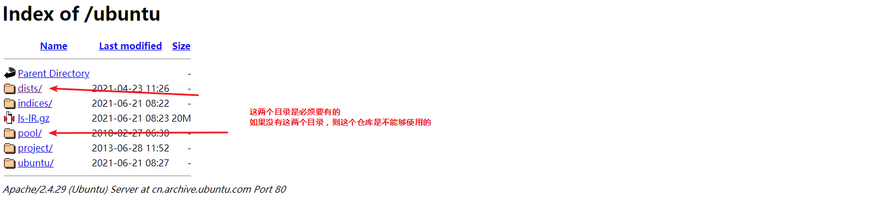
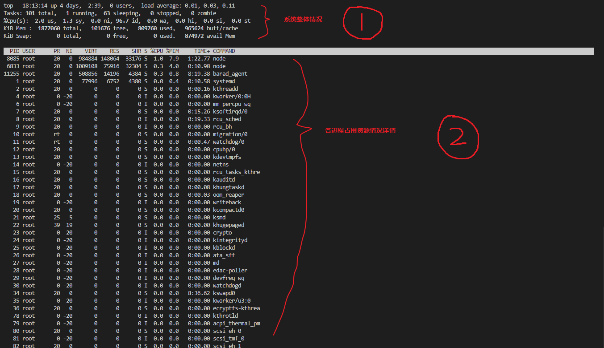
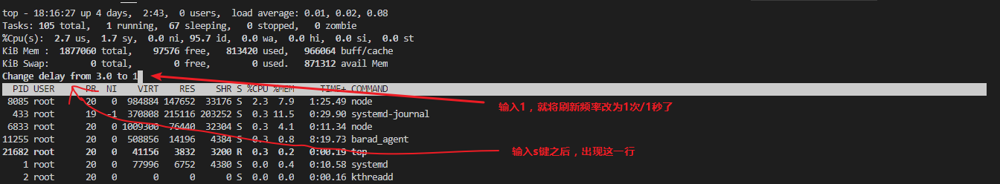

# SHELL快捷键

| 命令            | 作用                                    |
| --------------- | --------------------------------------- |
| Ctrl + U        | 清空命令行 （所有内容）                 |
| Ctrl + K        | 清空命令行 （当前光标位置以后所有内容） |
| Ctrl + W        | 清空命令行 （ 当前光标位置之前的单词）  |
| Ctrl + Y        | 粘贴Ctrl + [U,K,W]删除的内容            |
|                 |                                         |
| Ctrl + A        | 跳到命令行头部                          |
| Ctrl + E        | 跳到命令行尾部                          |
|                 |                                         |
| Ctrl + Z        | 暂停当前任务，并给出任务号[task_num]    |
| `bg [task_num]` | 去后台运行[task_num]这个任务            |
| `fg [task_num]` | 去前台运行[task_num]这个任务            |
|                 |                                         |
| Ctrl + D        | 关闭当前终端                            |
| Ctrl + L        | 清屏                                    |
|                 |                                         |

# 基本命令

## 创建新用户

```shell
# 切换为root用户
su root

# 创建tanght用户
useradd tanght

# 修改tanght用户的密码
passwd tanght
```


## 打包/压缩/解压

```shell
tar zxvf filename.tar
tar czvf filename.tar dirname

# 将所有.jpg文件，打包（不压缩）成haha.tar文件
tar -cf haha.tar *.jpg
# 将所有.gif文件，添加到haha.tar文件中
tar -rf haha.tar *.gif
# 列出haha.tar中包含的所有文件
tar -tf haha.tar
# 解包haha.tar
tar -xf haha.tar

# 忽略某些文件夹
# dir1
#     test1
#          other
#          test2
#     other
# --exclude后面跟的是相对于dir1的相对路径
tar --exclude=test1/test2 dir1.tar.gz dir1
```

注意：f参数必须在所有参数之后


## 软连接

```shell
# 在path2目录中创建一个path1文件(或者目录)的软链接
ln -s path1 path2
```


## 查看目录大小

```shell
du -sh
```


## 排序

```shell
# -r 逆序，从大到小
# -n 以数值大小进行排序，也就意味着，指定的排序列必须为数字，避免10 < 2的情况(字符顺序)
# -k 后面跟列数，指定排序的列
# -t 指定分隔符  如 -t :   以冒号作为分割符，不指定的话是空格
# 将filename.txt中每行作为一个单元，以空格为分隔符，以第三列为关键列进行排序，倒序
sort -rn -k 3 filename.txt
```


# 查看端口被谁占用

```shell
lsof -i
lsof -i :80
lsof abc.txt 显示开启文件abc.txt的进程 lsof -c abc 显示abc进程现在打开的文件 lsof -c -p 1234 列出进程号为1234的进程所打开的文件 lsof -g gid 显示归属gid的进程情况 lsof +d /usr/local/ 显示目录下被进程开启的文件 lsof +D /usr/local/ 同上，但是会搜索目录下的目录，时间较长 lsof -d 4 显示使用fd为4的进程 lsof -i 用以显示符合条件的进程情况 lsof -i[46] [protocol][@hostname|hostaddr][:service|port]   46 --> IPv4 or IPv6   protocol --> TCP or UDP   hostname --> Internet host name   hostaddr --> IPv4地址   service --> /etc/service中的 service name (可以不止一个)   port --> 端口号 (可以不止一个)

```


# 软件包安装


# 软件仓库

## 修改仓库源地址

### Centos

```bash
配置文件地址：/etc/yum.repos.d/CentOS-Base.repo
mv /etc/yum.repos.d/CentOS-Base.repo /etc/yum.repos.d/CentOS-Base.repo.backup # 备份
wget -O /etc/yum.repos.d/CentOS-Base.repo http://mirrors.aliyun.com/repo/Centos-5.repo # 下载新文件
wget -O /etc/yum.repos.d/CentOS-Base.repo http://mirrors.aliyun.com/repo/Centos-6.repo
wget -O /etc/yum.repos.d/CentOS-Base.repo http://mirrors.aliyun.com/repo/Centos-7.repo
```


### Ubuntu

```shell
配置文件地址：/etc/apt/sources.list

档案类型   镜像url                 版本代号        软件包分类 
deb       http://xx.xx.xx/xx/    bionic        main restricted universe multiverse
 
————————————————
每一个源(http://xx.xx.xx/xx/)目录下都应该至少包含dists和pool两个目录，否则就是无效的源
```


## apt原理

`/etc/apt/sources.list`列举出了所有可用仓库，用户可以根据自己的爱好随意修改，修改之后记得执行`apt update`

sources.list类似下面这样：

```shell
deb http://mirrors.tencentyun.com/ubuntu/ bionic main restricted universe multiverse
deb http://mirrors.tencentyun.com/ubuntu/ bionic-security main restricted universe multiverse
deb http://mirrors.tencentyun.com/ubuntu/ bionic-updates main restricted universe multiverse
# deb http://mirrors.tencentyun.com/ubuntu/ bionic-proposed main restricted universe multiverse
# deb http://mirrors.tencentyun.com/ubuntu/ bionic-backports main restricted universe multiverse
deb-src http://mirrors.tencentyun.com/ubuntu/ bionic main restricted universe multiverse
deb-src http://mirrors.tencentyun.com/ubuntu/ bionic-security main restricted universe multiverse
deb-src http://mirrors.tencentyun.com/ubuntu/ bionic-updates main restricted universe multiverse
# deb-src http://mirrors.tencentyun.com/ubuntu/ bionic-proposed main restricted universe multiverse
# deb-src http://mirrors.tencentyun.com/ubuntu/ bionic-backports main restricted universe multiverse
deb [arch=amd64] https://download.docker.com/linux/ubuntu bionic stable
# deb-src [arch=amd64] https://download.docker.com/linux/ubuntu bionic stable
```

每行代表一个仓库，每行的格式如下

```shell
[deb或者deb-src二选一] [url] [Codename] [main restricted universe multiverse 多选]
```

deb：表示本行用于二进制软件下载

deb-src：表示本行用于源代码下载

注：为什么deb与deb-src的url是一样的？因为这个url既提供了二进制软件，也提供了源代码。apt去下载的时候会遵循一定的规则，在特定的目录下去下载软件或源代码，虽然是同一个url，但是子路径是不一样的

url：仓库地址

Codename：ubuntu版本代号。这个url中可能存在多个文件夹，以Codename-xxx格式命名，apt去这个url的哪个文件夹下搜索文件呢？就是根据这一行的Codename来决定的

查看本机ubuntu的版本代号：`lsb_release -a`

查看所有发行版代号：https://wiki.ubuntu.com/Releases

/etc/apt/sources.list是所有仓库的地址(url)，每个仓库中都保存了很多软件

apt update的时候，apt会去遍历sources.list中的所有url，将每个url中所包含的软件信息保存到本地(注意不是保存软件到本地，只是将仓库中的软件信息保存到本地，例如软件名，软件版本，软件签名等等)，保存到/var/lib/apt/lists/中

apt install的时候去本地的软件信息中分析依赖并找到软件的下载位置，然后去安装

## 仓库结构

以http://cn.archive.ubuntu.com/ubuntu/这个仓库为例



dists下的结构


进入bionic目录


进入main/binary-i386目录下，下载Packages.gz解压后得到Packages文件，这个文件是此仓库提供的所有软件的信息


```shell
# 在~/目录下生成一个/mnt/hgfs/abc的软连接，名字为abc
ln  -s   /mnt/hgfs/abc   ~/

# 在/目录下查找名字为tanght的普通文件
find / -name tanght -type f

```


# 定时任务

简述：crond为定时任务后台服务，为Linux提供定时任务功能，基本上任何一个Linux发行版都带有crond这个服务。crontab为crond的对外接口，使用户可以配置crond。

设置定时任务：在命令行中输入crond -e后，会打开一个虚拟文件，直接编辑这个文件就能实现定时任务的设置。文件中的每一行为一个定时任务，每行的的格式如下：

```shell
分  时  日  月  周  shell命令
```

可以运行shell命令就十分灵活了，因为可以用shell命令来运行我们自己编写的脚本或程序，如下：

```shell
# 每分钟运行ls命令，当然了crond是在后台运行我们的任务，所以ls的结果我们当然看不到了
* * * * * ls

# 每分钟运行  ls > /home/tanght/test.txt   这个命令，我们将ls的结果重定向到了test.txt中，这样我们就能看到结果了
* * * * * ls > /home/tanght/test.txt

# 每分钟运行   python3  /home/ubuntu/timedtasks/helloworld.py  my_arg   这个命令
# helloworld.py是我自己写的python脚本，接收1个参数
* * * * * python3 /home/ubuntu/timedtasks/helloworld.py 101.txt
```

使用方法

```shell
crond -e

# 以当前用户的身份设置定时任务，只能看到/编辑当前用户的定时任务
crond -e

# 以root用户来设置定时任务，能看到/编辑所有用户的定时任务
sudo crond -e
```

注意事项：

- 首次运行crond -e可能需要选择编辑器，选择vim就行了
- select-editor命令用来切换编辑器

## crontab时区

crontab的时区在`/etc/crontab`这个文件中设置，添加`CRON_TZ=Asia/Shanghai`这样一句配置的话，就是告诉crontab使用北京时间，修改了配置文件之后记得重启`sudo service crond restart`

使用service或者systemctl控制crontab的时候注意，这个程序有时候叫做crond有时候叫做cron，有可能跟系统版本有关


# Linux时区

## 查看时区

`date -R`可以查看当前的时区是什么，命令的结果是`Fri, 08 Jan 2021 15:54:32 +0800`，明显看到是`+0800`时区

## 修改时区

- 由`/etc/localtime`指向的文件决定，为什么说指向？因为localtime文件是个软连接，比如我的这台电脑是`/etc/localtime -> /usr/share/zoneinfo/Asia/Shanghai`，则这台电脑的时区就是北京时间。想要修改时区的话，直接改变`/etc/localtime`这个软连接的指向就好了，将它指向你想要的时区文件。时区文件在哪里？全部都在`/usr/share/zoneinfo/`这个文件夹下哦，自己去找吧
- `tzselect`命令可以告诉你时区文件的名字，是一个交互式的程序，按照程序的提示一步步选择就好了，结束之后`tzselect`会告诉你你想要的时区的时区文件名字是什么


# service命令

## 介绍

service程序是Linux的服务管理程序，可以方便的管理一些服务的启动/停止/重启等等

`service nginx start`这条命令的执行过程

- `sevice`程序去`/etc/init.d/`下寻找名字为`nginx`的shell脚本，注意脚本必须具有可执行权限
- `start`这个字符串作为第一个参数传递给这个脚本，并执行这个脚本
- 后面的事情就交给名字为nginx的这个脚本去做了

## 自定义service命令

- 编写脚本mytest
- 赋予mytest可执行权限`chmod 777 mytest`
- 将mytest放入`/etc/init.d/`目录下
- `service mytest`运行mytest，没有参数
- `service mytest arg1`运行mytest，传入一个参数，脚本中可以通过`$1`获取
- `service mytest arg1 arg2 arg3`运行mytest，传入三个参数，脚本中通过`$1 $2 $3`获取


```shell
sudo service --status-all
 [ - ]  acpid
 [ + ]  apparmor
 ......
 [ + ]  atd
 [ - ]  console-setup.sh
 [ + ]  cron
```


# systemctl

查看service源码可知，对于标准命令如start，stop，restart等，即使使用`service name start`去操作，但是后台也偷偷将service换成了systemctl。

```shell
# 这两个命令是一样的
service cron start
systemctl start cron
```

```shell
systemctl list-unit-files --type=service   # 列出所有服务（包括启用的和禁用的）
systemctl list-units --all --state=inactive # 列出所有没有运行的 Unit
systemctl list-units # 列出正在运行的 Unit
systemctl list-units --all # 列出所有Unit，包括没有找到配置文件的或者启动失败的
systemctl list-units --failed # 列出所有加载失败的 Unit


systemctl status mysql # 查看mysql服务的状态，详细信息中会写着管理mysql服务的service脚本在哪里
```

## 查看systemd信息的命令

```shell
systemctl list-unit-files --type=service   # 列出所有服务（包括启用的和禁用的）
systemctl list-units --all --state=inactive # 列出所有没有运行的 Unit
systemctl list-units # 列出正在运行的 Unit
systemctl list-units --all # 列出所有Unit，包括没有找到配置文件的或者启动失败的
systemctl list-units --failed # 列出所有加载失败的 Unit
```

## 控制软件的命令

```shell
systemctl status mysql # 查看mysql服务的状态，详细信息中会写着管理mysql服务的service脚本在哪里
systemctl stop mysql # 停止
systemctl restart mysql # 重启mysql
systemctl enable mysql # 设置开机启动(在/etc/systemd/system/xxx.target.wants下创建一个软连接)
systemctl disable mysql # 取消开机启动(删除xxx.target.wants下对应的软链接)
systemctl is-enabled mysql # 查看是否是开机启动
```


```shell
systemctl list-units --type=service -all
systemctl list-units --type=target -all

# 查看当前系统模式(multi-user.target  graphical.target)
systemctl get-default

# 将电脑切换到multi-user.target模式(命令行)
systemctl isolate multi-user.target
# 将电脑切换到graphical.target模式(图形界面)
systemctl isolate graphical.target

# 查看此target包含哪些服务
systemctl list-dependencies multi-user.target

# 重新加载配置文件
systemctl daemon-reload
```

## service文件

[Unit]
After=network.target
\#[Service]部分是服务的关键，是服务的一些具体运行参数的设置，这里Type=forking
\#是后台运行的形式，PIDFile为存放PID的文件路径，ExecStart为服务的具体运行命令，
\#ExecReload为重启命令，ExecStop为停止命令，PrivateTmp=True表示给服务分配独
\#立的临时空间，注意：[Service]部分的启动、重启、停止命令全部要求使用绝对路径，使
\#用相对路径则会报错！
[Service]
Type=forking
PIDFile=/home/developer/web/gunicorn.pid
ExecStart=/usr/local/bin/forever start 
ExecReload=/bin/kill -s HUP $MAINPID
ExecStop=/bin/kill -s QUIT $MAINPID
PrivateTmp=true
\#[Install]部分是服务安装的相关设置，可设置为多用户的
[Install]
WantedBy=multi-user.target


man systemd.unit  service文件的帮助文档


所有的启动设置之前，都可以加上一个连词号（-），表示"抑制错误"，即发生错误的时候，不影响其他命令的执行。比如，EnvironmentFile=-/etc/sysconfig/sshd（注意等号后面的那个连词号），就表示即使/etc/sysconfig/sshd文件不存在，也不会抛出错误。


修改配置文件以后，需要重新加载配置文件，然后重新启动相关服务。

重新加载配置文件

systemctl daemon-reload

## 控制程序的启停

步骤如下：

1. 创建你的程序的.service文件
2. 将.service文件放到`/etc/systemd/system/`或者`/lib/systemd/system/`(推荐)下
3. 使用`systemctl start/stop/.. your_service_name.sevice `来启停程序

## service文件路径

systemd会去哪里查找.service文件呢？如下：

- /etc/systemd/system/xxx.service(优先级高)
- /lib/systemd/system/xxx.service(优先级低)
- 推荐将service文件放在/lib/systemd/system/下，/etc/systemd/system/下一般只放.target.wants

## 开机启动

### 命令

`systemctl enable xxx.service`

xxx.service随便放在哪个目录，可以不是`/etc/systemd/system/`或`/lib/systemd/system/`这两个systemd的默认目录，只不过这时候需要加上文件的路径。`systemctl enable /your_path/xxx.service`。

此命令只做一件事，就是在`/etc/systemd/system/xxx.target.wants`下创建一个指向你的service文件的软链接，然后重新加载systemd服务。xxx.target.wants中的xxx到底是什么呢？这个由你编写的service文件中的WantedBy决定

```shell
[Install]
WantedBy=multi-user.target  # enable的时候将软连接创建在multi-user.target.wants目录下
```

### 原理

enable（开机启动）的原理就是在`/etc/systemd/system/xxx.target.wants`目录下创建一个`.service`文件的软连接（.service文件最好在`/lib/systemd/system/`目录下），然后使systemd重新加载一次（`systemctl daemon-reload`）

也就是说，只要是`xxx.target.wants`下的service，都会在开机时启动（系统默认开机时运行multi-user.target），你也可以手动去`xxx.target.wants`下创建软连接而不用systemctl enable，效果是一样的。

### 总结

- 将`.service`文件放在`/etc/systemd/system/`或`/lib/systemd/system/`下，此时就能用systemctl来控制你的程序了。
- 将`.service`文件放在`/etc/systemd/system/xxx.target.wants`下，就能开机启动了。


# 后台运行

`command`：前台运行command。stdout与stderr都直接输出到当前窗口

`command >/dev/null`：stderr直接输出到当前窗口，stdout输出到黑洞

`command >/dev/null 2>&1`：2>&1的意思是stderr输出到stdout，也就是说stderr也去黑洞了

`command >/dev/null 2>&1 &`：&的意思是后台运行程序，也就是说从当前窗口不能给此程序发送信号了，不能给此程序标准输入了

`nohup command >/dev/null 2>&1 &`：nohup的意思是告诉此程序不要处理SIGHUP信号，什么时候会有SIGHUP信号呢？关闭当前窗口时，当前窗口会给此窗口下的所有程序发送SIGHUP信号

## &

在任何命令后面加上&，就会将此命令/程序放到后台运行。

后台运行意味着什么呢？意味着不能从当前终端给这个程序标准输入了，所以我们能看到，后台运行的程序不会阻塞住当前终端，当前终端可以立即接受新的用户操作；意味着不能从当前终端给程序传递信号了，Ctrl+C不管用了；

## nohup

在一条命令/程序之前加上nohup，就会使此程序忽略SIGHUP信号

SIGHUP信号是什么鬼？当关闭某个终端时，这个终端会给自己下面的所有程序发送SIGHUP信号，通知自己的程序"我死了，你们看着办吧"，程序在收到这个信号时就会知道终端死了，就可以决定自己下一步该怎么办，大部分程序的行为都是跟着终端一起去死。

## 2>&1

任何命令后方加上2>&1，就会将此程序的stderr重定向到stdout

stderr重定向到stdout？我没听错吧？这什么意思？意思就是，stdout去哪里，我stderr就去哪里，我跟定你了！

`command > 123.txt`这个命令只是将stdout重定向到123.txt了，stderr依然向终端喷射东西，所以加上2>&1会将stderr也扔到123.txt，当然了，也可以直接使用2>123.txt，这样的话就需要打开两次123.txt,而且stdout与stderr的输出可能会相互覆盖


# SSH登陆

电脑A通过第三方工具远程控制电脑B，电脑A每次控制电脑B时都需要输入密码，为了避免重复输入密码，可以使用SSH服务，将电脑A的公钥放入电脑B的SSH的authorized_keys中。

在该用户家目录的.ssh文件夹下找到authorized_keys这个文件(没有就新建)，确认这个文件的权限是600(不是的话就改成600)，将另一台电脑生成的公钥复制到authorized_keys这个文件中，保存，重启ssh服务。

允许root使用ssh登陆，需要修改/etc/ssh/sshd_config文件，添加一句命令`PermitRootLogin yes`

出现警告`the ECDSA host key for 'xxxx' differs from the key for the IP address 'xxxxx'`，删除电脑A的known_hosts文件，这个文件在该用户家目录的.ssh文件夹中


# 生成公钥私钥

linux下只要安装了ssh那么就可以使用ssh-keygen命令来生成公钥私钥。windows下需要先安装git，然后使用git的ssh-keygen命令。

- -q：安静模式，不显示额外的生成信息
- -b：指定秘钥长度，RSA密钥最小768位，默认2048位。DSA密钥必须是1024位
- -t：指定密钥类型。可用的值：dsa|ecdsa|ed25519|rsa，默认rsa
- -N：指定生成秘钥公钥对的密码，不指定会在生成过程中要求输入，生成时一直回车就行了
- -C：指定秘钥公钥对的说明信息，一般写邮箱就行了
- -f：指定生成密钥的目录和文件名，不指定会在生成过程中要求输入，生成时一直回车就行了

或者任何参数都不加，直接`ssh-keygen`，利用交互式创建


# 动态库路径

`export LD_LIBRARY_PATH=${LD_LIBRARY_PATH}:your_path`

Linux中的动态加载器通过ld.so.cache文件决定搜索动态库的路径

ld.so.cache通过ld.so.conf生成，使用ldconfig命令

ld.so.conf中一般是`include /etc/ld.so.conf.d/*.conf`，意思是包含ld.so.conf.d中的.conf文件

所以用户可以在ld.so.conf.d中新增自己的.conf文件，将路径写到自己的文件中就行了


# g++ include路径

查看

g++ -v -E -x c++ -

CPATH环境变量影响gcc与g++的include

CPLUS_INCLUDE_PATH影响g++

C_INCLUDE_PATH影响gcc


# source命令

```shell
source test.sh		# 将test.sh中的代码读出来，放到本窗口的命令行中执行(本shell直接运行test.sh中的命令)
. test.sh			# . 同 source
./test.sh			# 启动子进程，运行test.sh脚本
sh test.sh			# sh 同 ./
```

例子：

export的环境变量对本shell以及本shell的子程序起作用。如果定义了一个环境变量但是不export，则此环境变量只对本shell起作用，对它的子程序不起作用。所以如果我们编写了一个脚本如下：

```shell
# export_env.sh
# 此脚本的作用就是定义几个环境变量给gcc使用
export LD_LIBRARY_PATH=/home/tanght/download/boost_1_75_0/stage/lib:${LD_LIBRARY_PATH}
export LIBRARY_PATH=/home/tanght/download/boost_1_75_0/stage/lib:${LIBRARY_PATH}
export CPATH=/home/tanght/download/boost_1_75_0:${CPATH}
```

如果我们`./export_env.sh`这样运行这个脚本，则会发现`echo ${CPATH}`并没有按照我们的想法被设置，跟我们没有运行这个脚本之前是一样的。

那是因为export_env.sh这个脚本是以一个子进程的形式运行的，子进程中设置的环境变量并不能传递给它的父进程(也就是我们的操作窗口)。

所以如果想要在本窗口中设置环境变量，只能将上面的代码复制到命令行中执行一下了。。。哈哈，那样岂不是太弱了，一点逼格都没有！牛逼的方法看下面！

source命令的作用是什么呢？`source export_env.sh`这个命令的意思是：别用子进程运行export_env.sh这个脚本，直接将export_env.sh这个文件中的命令读出来，直接在本窗口中运行！

# 防火墙

## centos7

```shell
systemctl status/start/stop firewalld
```

## centos6

```
service iptables status/start/stop
```


```shell
# 开放防火墙
iptables -I INPUT -p tcp --dport 27017 -j ACCEPT

# --line-number 可以查看每条规则的序号
iptables -L -n --line-number
# 删除INPUT链的2号规则
iptables -D INPUT 2

# iptables-save是一条命令，他的作用是将当前设置保存至y文件中
iptables-save > iptables.config

# 这条命令估计是调用了iptables-save
service iptables save

# iptables配置文件的位置
/etc/sysconfig/iptables
```


# Linux资源占用查看

top命令用于打开资源占用信息窗口(类似windows的任务管理器)



**退出：**在这个界面中输入q就退出了

**刷新频率：**在这个界面中输入s可以条中刷新频率



**查看指定进程：**`top -p 1,2,3,4`

-p后面跟想要查看的进程id，如果有一个就写一个，如果有多个就写多个并用逗号隔开


# makefile

## 简介

makefile格式如下

```shell
目标:依赖
[Tab]cmd
```

当我们在命令行执行`make`命令的时候，自动执行第一个目标。

我们也可以`make your_target`来执行指定的target。

当在当前目录中可以找到目标时：

检测依赖是否比目标新，如果依赖比目标新，则重新生成目标。

如果如果依赖不比目标新，则什么也不做。

当在当前目录中没有找到目标时：

直接生成目标(执行目标下的cmd就会生成目标了)

如何生成目标：

首先检查依赖是否存在，如果不存在，就先生成依赖，所有依赖全部OK之后，再生成目标。

## 设置依赖规则

低级做法，手动设置所有规则

```makefile
a.out: a.o b.o c.o
	gcc a.o b.o c.o -o a.out
	
a.o: a.c
	gcc -c a.c -o a.o
	
b.o: b.c
	gcc -c b.c -o b.o
	
c.o: c.c
	gcc -c c.c -o c.o
```

高级做法，设置通用规则

```makefile
a.out: a.o b.o c.o
	gcc a.o b.o c.o -o a.out

# 通用规则，优先级低
%.o: %.c
	gcc -c $< -o $@

# 具体规则，优先级高
b.o: b.c aaa.c bbb.c ccc.c ddd.c
	gcc -c b.c aaa.c bbb.c ccc.c ddd.c -o b.o
```

解释：假设我们的目录中只有.c文件，可执行文件与.o文件都还没生成。

1. `a.out`需要`a.o b.o c.o`
2. 所以make会去遍历makefile文件，寻找生成a.o的规则，b.o的规则，c.o的规则。
3. ok，找到了b.o的规则，则执行此规则下面的命令。命令执行完毕，b.o出现。
4. 全文都找不到`a.o c.o`的规则，make该启用B计划了，查找通用规则。
5. ok发现了`%.o`的规则，正好适合这里的`a.o`目标，将`a.o`中的`a`提取出来，依据通用规则来生成具体规则`a.o: a.c`。
6. `%.o`这个通用规则同样适用`c.o`目标，同上。
7. ok，`a.o b.o c.o`生成完毕，现在来生成`a.out`。


命令行中给makefile传递变量

```shell
make ABC=true DEF="haha"
```

makefile中执行linux命令，并获得命令的结果。必须是`$(shell your_cmd)`这种格式。

```makefile
UNAME := $(shell uname -s)
```

`= := ?= +=`

```makefile
# = 所有makefile展开后再决定变量的值，所以此处的y = xyz bar
x = foo
y = $(x) bar
x = xyz

# := 立即取值，不要所有makefile全部加载完毕再决定，所以此处的y = foo bar
x := foo
y := $(x) bar
x := xyz

# += 顾名思义，在变量后面追加，两个变量之间自动添加一个空格。x = a b
x = a
x += b

# ?= 条件赋值，只有在此变量是第一次定义的时候才生效。如果此变量已经被定义过了，则此条语句无效. a=1
a = 1
a ?= 2
```

通配符展开

```shell
# 错误，通配符展开不能通过变量传递。
OBJ=*.c
test:$(OBJ)
    gcc -o $@ $^
    
# wildcard帮忙展开，然后放到需要的地方
OBJ=$(wildcard *.c)
test:$(OBJ)
    gcc -o $@ $^
```

字符串处理

后缀替换

```makefile
# 替换.cpp为.o，如果这个元素没有.cpp，则直接输出原值
SRC = 1.cpp 2.c 3.cpp
OBJ = $(patsubst %.cpp, %.o, $(SRC))
# 结果OBJ = 1.o 2.c 3.o

# 同上，简化写法
SRC = 1.cpp 2.c 3.cpp
OBJ = $(SRC:.cpp=.o)
# 结果OBJ = 1.o 2.c 3.o
```


# cmake