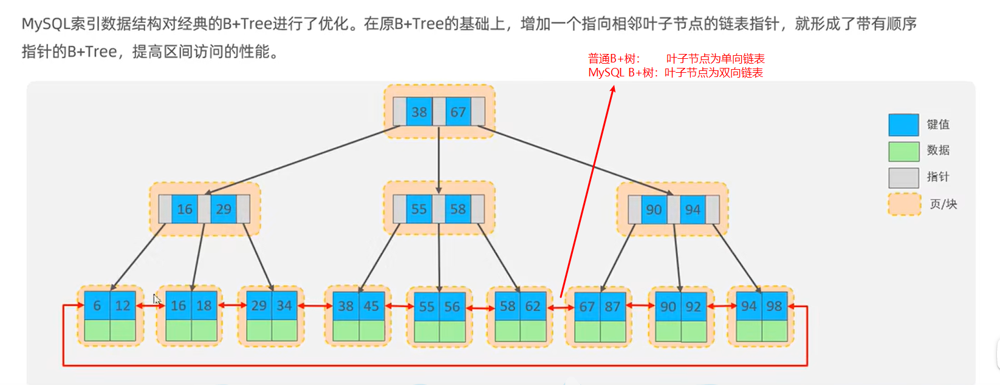

MySQL语句

```mysql
show full processlist;						# 查看当前进程列表
show variables like '%max_connections%';	# 查看最大连接数
show variables like 'xxxxx';				# 查询mysql的系统变量
set xxx = “123”;							# 设置mysql系统变量的值
show variables like 'event_scheduler';		# 查询event是否开启
SHOW EVENTS;								# 查询系统中所有event

# 字符集
show variables like '%char%';				#查看字符集
character_set_client
character_set_connection
character_set_database
character_set_filesystem
character_set_results
character_set_server
character_set_system
character_sets_dir


# 插入数据
INSERT INTO table_name (id, name,age) VALUES (1, "xiaoming", 18);

# 查询第0条数据以及往后1000条
SELECT * FROM xxxname LIMIT 0, 1000;

# 删除一段时间的数据
# ct为mysql的时间格式，直接跟字符串比较就行了
DELETE FROM xxxname WHERE ct > '2020-01-06 00:00:00' and ct < '2020-01-07 00:00:00';

# 查询test数据库所占用的空间
# 原理：MySQL软件中存在一个information_schema数据库，这个数据库保存了其它所有数据库的基本信息。
# 原理：information_schema数据库中存在一张表，名字为TABLES，这张表中有我们需要的数据（占用空间）
SELECT SUM(DATA_LENGTH) FROM TABLES WHERE TABLE_SCHEMA='test';	# 单位为字节


# 如果test1表存在，则将他删除
DROP TABLE IF EXISTS test1;	

# 创建表（test1不存在时才创建，若已经存在，则什么都不做）
CREATE TABLE IF NOT EXISTS test1 (
  id INT NOT NULL AUTO_INCREMENT,	# NOT NULL说明不能为空，AUTO_INCREMENT自增
  nick_name VARCHAR(255) NOT NULL,
  uid VARCHAR(30) CHARACTER SET utf8mb4 COLLATE utf8mb4_bin NOT NULL,
	age INT NOT NULL DEFAULT 0,
  gmt_create datetime NOT NULL DEFAULT CURRENT_TIMESTAMP,
  gmt_modified datetime NOT NULL DEFAULT CURRENT_TIMESTAMP ON UPDATE CURRENT_TIMESTAMP,
  PRIMARY KEY (id)
) ENGINE=InnoDB AUTO_INCREMENT=1 DEFAULT CHARSET=utf8mb4 COLLATE=utf8mb4_bin;


# 创建用户
CREATE USER 'haha1'@'%' IDENTIFIED BY '123456';	#  %表示可以从任何主机登陆
CREATE USER 'haha2'@'192.168。20.%' IDENTIFIED BY '123456';	# 20网段的可以登录

# 删除用户
DROP USER 'username'@'host';

# 修改密码
SET PASSWORD FOR 'root'@'localhost' = PASSWORD('123456');

# 授权
GRANT 权限 ON 数据库.表名 TO '账户名'@'主机';
GRANT SELECT, INSERT ON test.user TO 'tht'@'%';#tht可以访问test数据库下的user表格，拥有S、I权限
GRANT ALL ON test.* TO 'tht'@'%';#tht可以访问test数据库下的所有表，对所有表拥有满权限

# 撤销授权
REVOKE 权限 ON 数据库.表名 FROM '账户名'@'主机';

# 修改数据
UPDATE <表名> SET 字段 1=值 1 [,字段 2=值 2… ] [WHERE 子句 ];

# /etc/mysql/debian.cnf配置文件记录了debian-sys-maint超级用户的密码，可以通过这个用户来修改其它人的密码，包括root用户
# 必须用sudo打开这个文件，否则看不到文件内容
# /etc/mysql/mysql.conf.d/mysqld.cnf中bind-address = 127.0.0.1这一行要注释掉，否则这个mysql只能在本地用，外界不能访问


use mysql;
update mysql.user set authentication_string=password('root') where user='root' and Host ='localhost';
update user set plugin="mysql_native_password"; 
flush privileges;
quit;
sudo service mysql restart
mysql -u root -p 

```


# 储存过程

```mysql
SET @abc = 10;	# 声明+设置局部变量
SET bcd = 20;	# 设置系统变量，必须得是系统中有的变量才能设置

# 储存过程中给变量设置值 SELECT INTO
SET @mark_time = '2020-01-01 00:00:00';
SELECT DATE_SUB(CURRENT_TIMESTAMP(),INTERVAL 93 DAY) INTO @mark_time;

# 有些语句不能在储存过程中使用，可以使用预备语句
SET @mark_id = 0;
SET @sql_get_mark_id = CONCAT('SELECT id INTO @mark_id FROM ', param_table_name, ' WHERE gmt_create > "', @mark_time, '" LIMIT 1;');
PREPARE stmt FROM @sql_get_mark_id;
EXECUTE stmt;
```


用procedure来创建表

```mysql
USE `testdb`;
DROP procedure IF EXISTS `procedure_test`;

DELIMITER $$
USE `oversea`$$
CREATE DEFINER=`root`@`%` PROCEDURE `procedure_test`(IN t_name VARCHAR (100))
BEGIN
set @s1 = "`id` bigint unsigned NOT NULL AUTO_INCREMENT COMMENT '自增序列',";
set @s2 = "`gmt_create` datetime NOT NULL DEFAULT CURRENT_TIMESTAMP COMMENT '创建时间',";
set @s3 = "`gmt_modified` datetime NOT NULL DEFAULT CURRENT_TIMESTAMP COMMENT '修改时间',";
set @s4 = "`ts` int unsigned NOT NULL default 0 COMMENT '此数据创建的UTC时间戳',";
set @s5 = "`ty` varchar(50) NOT NULL DEFAULT '' COMMENT '文档类型',";
set @s6 = "`doc` varchar(2048) NOT NULL DEFAULT '' COMMENT '内容',";
set @s7 = "PRIMARY KEY (`id`),";
set @s8 = "KEY `idx_ts` (`ts`),";
set @s9 = "KEY `idx_ty` (`ty`)";
set @s10 = concat(@s1, @s2, @s3, @s4, @s5, @s6, @s7, @s8, @s9);
set @s11 = "ENGINE=InnoDB DEFAULT CHARSET=utf8mb4 COLLATE=utf8mb4_bin COMMENT='统计-原始数据';";
set @sqlct = concat('CREATE TABLE ', t_name, " (", @s10, ") ", @s11);
PREPARE sqlct FROM @sqlct;
EXECUTE sqlct;
END$$

DELIMITER ;

```


创建表相关：

```mysql
USE `test`;	#在test数据库中创建表	`这个符号是mysql的转义符号
CREATE TABLE test01 (
  `id1` bigint unsigned NOT NULL AUTO_INCREMENT COMMENT 'xxxxx',
  `id2` int NOT NULL DEFAULT 0
  `id3` int NOT NULL DEFAULT 0
  `id4` int NOT NULL DEFAULT 0
  `id5` int(11) NOT NULL COMMENT 'xxxx',
  `create_time` datetime NOT NULL DEFAULT CURRENT_TIMESTAMP COMMENT '',
  `modified_time` datetime NOT NULL DEFAULT CURRENT_TIMESTAMP ON UPDATE CURRENT_TIMESTAMP COMMENT '最后修改时间',
  PRIMARY KEY (`id2`,`id3`),
  UNIQUE KEY `uniq_id` (`id1`) USING BTREE,
  INDEX `idx_id4` (`id4`) USING BTREE # 索引
) ENGINE=InnoDB DEFAULT CHARSET=utf8;

# `这个符号是mysql的转义符号，如果创建的表名或字段名与mysql的关键字冲突了，则需要使用``包起来；
# USE `test` 表示在test数据库中创建表；
# COMMENT 'xxx' COMMENT关键字的意思是，后面的内容为注释；
# int(11) 创建一个int类型的字段，（11）没用，数据位数只跟类型有关，跟（）中的数字无关；
# AUTO_INCREMENT关键字是自增的意思，也就是说下一条数据是上一条数据+1，向表中插入数据的时候，不用填充被AUTO_INCREMENT修饰的字段；
# 被NOT NULL修饰的字段不允许为空，也就是说在插入数据的时候，NOT NULL字段必须有值；
# DEFAULT 默认值，带有默认值的字段，即便为NOT NULL，在插入的时候也可以不填充数据，因为如果没有值的话，他就会被默认值填充，所以依然不为空，满足NOT NULL的条件；
# id1被设置为自增的，所以它必须是唯一的(UNIQUE KEY);
```


错误 "this is incompatible with sql_mode=only_full_group_by"

```sql
-- 查看系统变量sql_mode，可以看到sql_mode中带有ONLY_FULL_GROUP_BY这个值，就是这个值造成了这个错误
show variables like "sql_mode"

-- 解决办法，使用sql语句（临时）重新设置这个系统变量，删除ONLY_FULL_GROUP_BY这个值，其它的保持不变
set @@GLOBAL.sql_mode=STRICT_TRANS_TABLES,NO_ZERO_IN_DATE,NO_ZERO_DATE,ERROR_FOR_DIVISION_BY_ZERO,NO_AUTO_CREATE_USER,NO_ENGINE_SUBSTITUTION
-- 解决办法，在mysql的配置文件（my.cnf）中设置这个系统变量，删除ONLY_FULL_GROUP_BY这个值，其它的保持不变，永远生效
sql_mode=STRICT_TRANS_TABLES,NO_ZERO_IN_DATE,NO_ZERO_DATE,ERROR_FOR_DIVISION_BY_ZERO,NO_AUTO_CREATE_USER,NO_ENGINE_SUBSTITUTION
```


字符串连接函数

```sql
-- 字符串连接，若str1，str2，strN中有一个为NULL，返回值则为NULL
concat("str1","str2","str3",...);
-- 尽管id或score不是string类型，也当作string类型进行连接
select concat (id, name, score) as info from test1;
-- 使用 连接符 进行字符串连接
concat_ws("连接符", str1, str2, ...);
-- 分组字符串连接
group_concat()
-- 使用名字分组，也就是说相同名字的记录只显示一条，这时候将相同名字的id连接到一起返回给我
select name, group_concat(id) from test group by name
-- 还可以指定连接的时候的排序和分隔符(排序order by id desc)(分隔符separator "+")
select name, group_concat(id order by id desc separator "+") from test group by name
```


# 定时任务

```shell
# 查看event
show events;

# 创建event
CREATE EVENT e_test2
ON SCHEDULE EVERY 1 DAY
DO TRUNCATE aaa;
```


# 删除所有表

```shell
SELECT concat('DROP TABLE IF EXISTS ', table_name, ';')
FROM information_schema.tables
WHERE table_schema = 'mydb';
```


# 允许远程访问

首先要设置防火墙，开放mysql的端口

其次要让mysql监听0.0.0.0这个IP，默认mysql监听的是127.0.0.1，可以在配置文件中将`bind-address = 127.0.0.1`这个配置项注释掉，然后重启mysql服务

## 查看各用户的允许登陆IP：

```mysql
use mysql;
select host,user from user;
```

结果：


说明：

通过tht用户登陆，可以通过任何IP地址访问此数据库

通过root登陆，只能使用本机登陆

## 修改mysql.user表，允许root通过所有IP地址登陆

```mysql
use mysql;
update user set host = '%' where user = 'root';
flush privileges;
```

# 用户权限管理

## 查看用户

```mysql
SELECT host, user FROM mysql.user;
```

## 创建用户

创建用户`zhangsan`，可以从`192.168.7.45`，`192.168.7.46`，`192.168.7.47`这三个IP登陆，密码为`123456`。

允许多IP的话，就是多执行几次CREATE USER命令，每次变化IP就行了。

```mysql
CREATE USER 'zhangsan'@'192.168.7.45' IDENTIFIED BY '123456';
CREATE USER 'zhangsan'@'192.168.7.46' IDENTIFIED BY '123456';
CREATE USER 'zhangsan'@'192.168.7.47' IDENTIFIED BY '123456';
```

创建用户，可以从任何IP登陆。

```mysql
CREATE USER 'zhangsan'@'%' IDENTIFIED BY '123456';
```

## 删除用户

```mysql
DROP USER '用户名'@'IP';
```

## 修改密码

```shell
SET PASSWORD FOR 'root'@'localhost' = PASSWORD('newpass')
```


## 查看权限

```mysql
# 查看当前用户的权限
SHOW GRANTS;
# 查看指定用户的权限
SHOW GRANTS FOR 'tanght'@'%';
```
## 添加权限
```mysql
# ALL代表所有权限
GRANT ALL PRIVILEGES ON *.* TO `tanght`@`%` WITH GRANT OPTION;

# 也可以指定权限
GRANT SELECT, INSERT, UPDATE, DELETE, CREATE, DROP, RELOAD, SHUTDOWN, PROCESS, FILE, REFERENCES, INDEX, ALTER, SHOW DATABASES, SUPER, CREATE TEMPORARY TABLES, LOCK TABLES, EXECUTE, REPLICATION SLAVE, REPLICATION CLIENT, CREATE VIEW, SHOW VIEW, CREATE ROUTINE, ALTER ROUTINE, CREATE USER, EVENT, TRIGGER, CREATE TABLESPACE, CREATE ROLE, DROP ROLE ON *.* TO `tanght`@`%` WITH GRANT OPTION;

# 刷新
FLUSH PRIVILEGES;
```

## 删除权限

```mysql
REVOKE ALL ON *.* FROM 'user'@'IP';
```


# navicat报错

Client does not support authentication protocol requested by server...

两种解决办法

1.升级navicat驱动，使其支持mysql最新版本

不会

2.将mysql的密码验证规则改为老式规则

`ALTER USER 'root'@'%' IDENTIFIED WITH mysql_native_password BY 'your_password';`


# 安装

## ubuntu在线安装

`sudo apt install mysql-server`安装mysql服务，顺便装了mysql-cli

`sudo mysql_secure_installation`首次配置mysql，密码什么的


# 重启Mysql

```shell
sudo /usr/local/mysql/mysql8000020/bin/mysqladmin -h127.0.0.1 -P3309 -uroot -p shutdown
sudo nohup /usr/local/mysql/mysql8000020/bin/mysqld --defaults-file=/data/mysqldata/mysql3309/my.cnf >/dev/null 2>&1 &
```

# 查看mysql状态

mysql有两种变量(全局变量、会话变量)，一种状态(当前实例的状态)

show global variables查看全局变量

set global var_name=value设置全局变量(此session必须是root才有权限设置全局变量)

set session var_name=value设置会话变量(设置自己的变量随意设置，不影响其它session)

show global status查看mysql的状态

```mysql
show variables;
show variables like "%max_prepared_stmt_count%";
SET GLOBAL var_name
SET SESSION var_name


SHOW GLOBAL STATUS;
SHOW GLOBAL STATUS LIKE 'com_stmt%';
```

# 事务隔离级别

show session variables like 'transaction_isolation';

show global variables like 'transaction_isolation';

set session transaction_isolation=READ-COMMITTED

- 读未提交：READ-UNCOMMITTED
- 读已提交：READ-COMMITTED
- 可重复读：REPEATABLE-READ
- 可串行化：SERIALIZABLE

## 不可重复读

READ-UNCOMMITTED 与 READ-COMMITTED 都是不可重复读，考虑如下场景

t0时刻：事物 A 查询 id=1 的记录，结果为 {id: 1, num: 10}

t1时刻：事物 B 修改 id=1 的记录为 {id: 1, num: 50}，并提交

t2时刻：事物 A 再次查询 id=1 的记录，得到的结果是 {id: 1, num: 50}

结论：同一个事物内，不同时刻，执行相同的SQL语句，得到的结果不同，这就是不可重复读。

## 可重复读

事物 A 不管任何时候查询 id=1 的记录，结果都与它第一次查询的时候得到的结果相同。不管这期间是否有其它事物对id=1的记录进行修改与否，提交与否。

需要利用"快照"技术实现可重复读的特性。快照技术那就涉及到MVCC，undo-log（undo日志），Read view（一致性视图），事务链等知识了。

RC：在每次SELECT的时候生成ReadView

RR：只在第一次SELECT的时候生成Read View

# 索引

## 索引结构

### 二叉树

每个节点只保存一个k-v对

### b树

每个节点存多个k-v对

每个节点存多个k-v对，同一个节点中的k-v对按照从大到小的顺序排列，在此节点中搜索一个特定的key时，可以使用二分查找


### b+树

对b-树的升级

只有叶子节点保存key-value，上层节点只保存key

各叶子结点之间用指针连接为**单向链表**


### mysql索引树

对b+树的升级

叶子结点连接为双向链表



页的概念


## 聚集索引&二级索引

聚集索引叶子节点key-value对中的value保存的是**这行记录的所有数据**

二级索引（普通索引）叶子节点key-value对中的value保存的是**这行记录的主键**（获取其它数据需要回表）

主键索引的保存格式为聚集索引，普通索引（不管是不是唯一索引）的保存格式为二级索引


## 联合索引


## 索引失效

对索引列进行数学运算

对索引列使用 `not in` 或 `!=`

## 索引文件

innodb的数据全部存储在主键索引文件中，不存在数据文件。

- t表，有a、b、c、d四个字段，a为主键，则这张表只会存在一个a字段的索引文件，名字为t-a.idx。
- 这时对字段b创建索引，则会新生成一个以b为KEY的索引文件t-b.idx，这个文件中的KEY为字段b的值，值为t表的主键(a字段)。
- 如果执行select * from t where b=1的话，会通过t-b.idx文件定位到a字段
- 然后拿着a字段去t-a.idx文件中拿到这条记录的全部信息
- 根本原因就是t-b.idx索引文件中不会储存所有数据，只储存b字段与t表的主键(a字段)
- 拿着a字段去t-a.idx文件中获取数据的过程叫做回表。
- select a, b, c from t where b=1也是先从t-b.idx拿到a字段，然后根据a字段去t-a.idx中拿到a、b、c字段
- select a, b from t where b=1这个就好玩了，因为可以从t-b.idx文件中同时拿到a、b两个字段，所以就不用回表了
- 所以对于一些频繁查询来说，可以创建一个联合索引，使得从一个文件中即可获取所需的字段，这样可以节省回表的时间

# 锁

必须通过索引操作数据，才会使用行锁或范围锁，不通过索引来操作数据的话，直接用表锁

## 按照锁的范围可以分为三类

表锁：锁住整张表，如修改表结构的语句

行锁：锁住一条记录，如`where id=10`且10这条记录存在的话

范围锁：分为间隙锁（左开右开）和Next Key锁（左开右闭）

## 按照锁的作用分为两类

普通锁：就是普通的锁

意向锁：辅助用途，比如对一条记录加锁了，顺便对这张表加一个意向锁

# 多版本并发控制（MVCC）

关键词：事务ID、回滚指针、版本链、一致性视图、数据快照

## 每行数据的结构

每行数据有多个版本（你看到的是一行数据，其实MySQL内部存了多行，连这行数据的历史版本也存了下来，历史版本在commit之后被删除），每行数据有三个必须有的字段如下：

主键ID：如果你没设置主键ID，MySQL会给你的表添加一个自增的Row ID作为主键ID

事物ID：用于版本控制，通过与Read View对比控制可见性

回滚指针：指向此记录的上一个版本，形成版本链

## Read View

Read View由四部分组成，如下：

活跃事务列表：此刻所有活跃事务（还未提交的事务）的一个列表，符号为m_ids

最小活跃事物ID：活跃事务列表m_ids中最小的ID，符号为min_trx_id

下一个事务ID：此刻应该分配给下一个事务的事务id值，符号为max_trx_id

自己的事务ID：创建Read View的这个事务自己的事务ID，符号为creator_trx_id

可见性规则如下：

trx_id == creator_trx_id：意味着是自己读自己的修改，所以肯定可见

trx_id < min_trx_id：意味着trx_id 这个版本对于此事务来说早就已经提交了，可见

trx_id == min_trx_id：min_trx_id为活跃事务，还没提交呢，所以不可见

trx_id >= max_trx_id：意味着在读未来的版本，所以不可见

min_trx_id < trx_id < max_trx_id 且 trx_id 不在 m_ids 中：可见

min_trx_id < trx_id < max_trx_id 且 trx_id 在 m_ids 中：不可见

举例：

```
事务开始，创建Read View，Read View为 ([10, 20, 30, 40] 和 50)
读一条数据，这条数据的版本链为 [80 -> 55 -> 30 -> 25]
版本80肯定不可见，因为我们创建的Read View最大的版本为50，意味着大于等于50的版本，都是未来的数据
版本55与版本80一样不可见
版本30也不可见，因为在Read View的活跃事务列表中，意味着还未提交
版本25小于50且不在活跃事务列表中,所以我们要的数据是版本25
```

读已提交：在每次SELECT的时候创建Read View

可重复读：只在第一次SELECT的时候创建Read View
