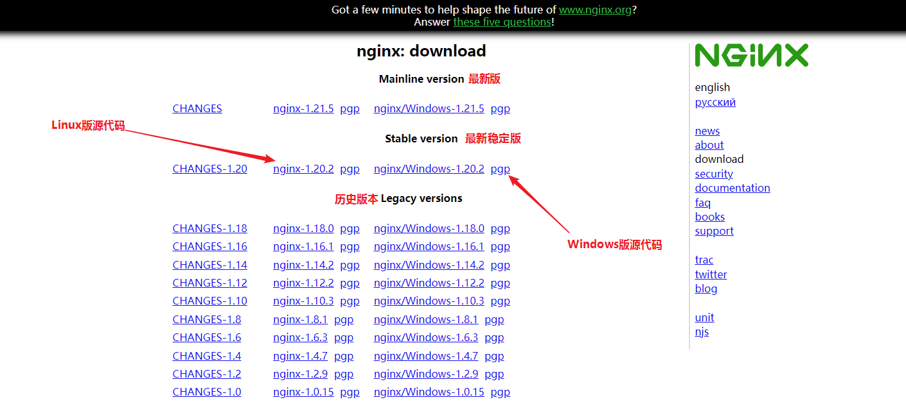

```nginx

#user  nobody;
worker_processes  1;   #设置值和CPU核心数一致，开启多少个子进程

#error_log  logs/error.log;
#error_log  logs/error.log  notice;
#error_log  logs/error.log  info;

#pid        logs/nginx.pid;

events {
	#use epoll;     #事件驱动模型
    worker_connections  2048;
    accept_mutex on;
    multi_accept on; 
}


http {
    include       mime.types;
    default_type  application/octet-stream;

    #log_format  main  '$remote_addr - $remote_user [$time_local] "$request" '
    #                  '$status $body_bytes_sent "$http_referer" '
    #                  '"$http_user_agent" "$http_x_forwarded_for"';

    #access_log  logs/access.log  main;

    sendfile        on;
    #tcp_nopush     on;
    #keepalive_timeout  0;
    keepalive_timeout  65;
    gzip  on;
	
	#在一次长连接上所允许请求的资源的最大数量
    keepalive_requests 3;
	#resolver 127.0.0.1;
	
	#负载均衡模组入口，网页访问入口 http://localhost:8072
	server {
		listen  8072;
		server_name  localhost;
		location / {
			proxy_pass http://server_group/;  #请求转向server_group定义的服务器列表
		}
	}
	#负载均衡模组
	upstream server_group {	   
	    # weight;     #轮询，默认就是轮询
		#ip_hash;   #同一个IP的访客固定访问一个后端服务器
		#	server 192.168.123.1:80 	 weight=4 max_fails=2 fail_timeout=30s;
		#	server 192.168.10.121:3333 backup;  #热备
		#weigth参数表示权值，权值越高被分配到的几率越大
		server 127.0.0.1:8076 	weight=4 max_fails=2 fail_timeout=30s;
		server 127.0.0.1:8083    	weight=4 max_fails=2 fail_timeout=30s;
		server 127.0.0.1:8086    	weight=4 max_fails=2 fail_timeout=30s;
	}	

    server {
	    #安标建web项目
        listen       8092;
        server_name  localhost;

        #charset koi8-r;
        #access_log  logs/host.access.log  main;
		
		#前端html
		location / {
			root D:\IIS_Publish\an.biao.jian.web.front;   #静态页面根目录
            index index.html;   #首页
        }

		#后台webapi
		location /abj_api/ {
		    #代理转发请求
			proxy_pass  http://localhost:8084/abj_api/;     # 注：proxy_pass的结尾有/,效果：会在请求时将/abj_api/*后面的路径直接拼接到后面
        }

        #error_page  404              /404.html;

        # redirect server error pages to the static page /50x.html
        #
       #error_page   500 502 503 504  /50x.html;
       #location = /50x.html {
       #    root   html;
       #}

        # proxy the PHP scripts to Apache listening on 127.0.0.1:80
        #
        #location ~ \.php$ {
        #    proxy_pass   http://127.0.0.1;
        #}

        # pass the PHP scripts to FastCGI server listening on 127.0.0.1:9000
        #
        #location ~ \.php$ {
        #    root           html;
        #    fastcgi_pass   127.0.0.1:9000;
        #    fastcgi_index  index.php;
        #    fastcgi_param  SCRIPT_FILENAME  /scripts$fastcgi_script_name;
        #    include        fastcgi_params;
        #}

    }

    # nginx状态页  http://localhost:8000/nginx_status
    server {
        listen  *:8000; 
        server_name  www.nginxcheck.com;
	    location /nginx_status {
		    stub_status;
		  #  allow 127.0.0.1;
		  #  deny all;
	    }
    }
	
	    #html测试页面，测试跨域
		server {
			listen  9000; 
			server_name  localhost;
			#前端html
			location / {
				root D:\IIS_Publish\ceshi.kuayu;   #静态页面根目录
				index index.html;   #首页
			}
		}


    # HTTPS server
    #
    #server {
    #    listen       443 ssl;
    #    server_name  localhost;

    #    ssl_certificate      cert.pem;
    #    ssl_certificate_key  cert.key;

    #    ssl_session_cache    shared:SSL:1m;
    #    ssl_session_timeout  5m;

    #    ssl_ciphers  HIGH:!aNULL:!MD5;
    #    ssl_prefer_server_ciphers  on;

    #    location / {
    #        root   html;
    #        index  index.html index.htm;
    #    }
    #}
	

}


```

# 同一个端口配多个网站

```nginx
```


# root与alias的区别

```nginx
{
	location /haha/ {
                alias /home/tanght/www/;
            }
}
```

前端访问/haha/123.html，服务器就会将/home/tanght/www/123.html文件发送给前端

```nginx
{
	location /haha/ {
                root /home/tanght/www/;
            }
}
```

前端访问/haha/123.html，服务器就会将/home/tanght/www/haha/123.html文件发送给前端

也就是说，root的话，url会被当成路径的一部分


# rewrite

用于web服务内部的重定向，不能重定向到其它机器的上的web服务

proxy_pass用于重定向到其它机器上的web服务

GET和POST都可以rewrite，GET参数和POST body不会丢失，请放心使用

```nginx
语法: rewrite 你想要重定向的URI正则表达式 你想要重定向到的URI [flag]
位置: server, location, if
你想要重定向到的URI中可以使用$1 $2等参数，从而可以使用前面正则捕获到的值
flag: 空        : 内部偷偷重定向，将重定向的地址的返回值返回给浏览器，浏览器根本察觉不到有重定向的存在
flag: last      : 不要执行此location下面的代码了，去执行重定向的location
flag: break     : 不要执行此location下面的rewrite代码了，去执行本location下面的其它代码
flag: redirect  : 临时重定向，将重定向的地址发送给浏览器，浏览器自己看着办
flag: permanent : 永久重定向，将重定向的地址发送给浏览器，浏览器自己看着办
```


```nginx
server {
    listen       8000;
	
    # server 块的重定向
    rewrite ^/a1$ /b1;
    rewrite ^/a2/(.*)$ /b2/($1);
    
    location /haha/ {
        # location 块的重定向
        rewrite ......;
    }

    location /b1 {
        default_type text/plain;
        return 200 "i am b1";
    }

    location /b2 {
        default_type text/plain;
        return 200 "i am b2";
    }
}
```


server块的break & last是完全一样的

用户访问 /a1/ 返回 i am a5

用户访问 /b1/ 返回 i am b3

用户访问 /c1/ 返回 i am c3

```nginx
server {
    listen       80;

    # /a1/ -> /a2/ -> /a3/ -> /a4/ -> /a5/
    # 继续找 /a5/ 的 rewrite，找了一圈发现没有给/a5/设置 rewrite
    # OK，rewrite 阶段结束，进入 location 阶段
    # 找到了 /a5/ 的 location，执行
    rewrite ^/a1/$ /a2/;
    rewrite ^/a2/$ /a3/;
    rewrite ^/a3/$ /a4/;
    rewrite ^/a4/$ /a5/;

    location = /a3/ {
        default_type text/plain;
        return 200 "i am a3";
    }

    location = /a5/ {
        default_type text/plain;
        return 200 "i am a5";
    }


    # /b1/ -> /b2/ -> /b3/ -> break
    # 虽然 给 /b3/ 设置了 rewrite，但是在上一行break了，所以在break处 rewrite 阶段就结束了，不会继续执行下面的 rewrite
    # ok，从 /b1/ -> /b2/ -> /b3/ 的 /b3/ 处开始进入 location 阶段
    # 找到了 /b3/ 的 location，执行
    rewrite ^/b1/$ /b2/;
    rewrite ^/b2/$ /b3/ break;
    rewrite ^/b3/$ /b4/;
    rewrite ^/b4/$ /b5/;

    location = /b3/ {
        default_type text/plain;
        return 200 "i am b3";
    }

    location = /b5/ {
        default_type text/plain;
        return 200 "i am b5";
    }

	# server 块中的 last 与 break 完全相同
    rewrite ^/c1/$ /c2/;
    rewrite ^/c2/$ /c3/ last;
    rewrite ^/c3/$ /c4/;
    rewrite ^/c4/$ /c5/;

    location = /c3/ {
        default_type text/plain;
        return 200 "i am c3";
    }

    location = /c5/ {
        default_type text/plain;
        return 200 "i am c5";
    }
}
```


location块中的break & last可不一样哦，有些复杂，最好不要出现这样的情况。如果出现这样的情况，证明你的URL规划的有问题，重构吧，重构的难度要比理解break & last的区别还要小呢。break & last是作者为了装逼而添加的功能，主要目的是装逼，没有实用价值。


# set偷偷添加参数

```nginx
# 覆盖用户传递的URL参数
location /aaa/ {
    set $args "env=nc&abc=def";
    proxy_pass http://172.17.0.1:9996/;
}

# 不会覆盖用户传递的URL参数，只是在用户参数的基础上添加
location /aaa/ {
    set $args "env=nc&abc=def&$args";
    proxy_pass http://172.17.0.1:9996/;
}
```


# proxy_pass

proxy_pass只有两种转发策略，nginx选择哪种策略只跟proxy_pass后面的URL带不带“/”有关，跟location中有没有“/”无关，两种类型的例子如下所示：

1. proxy_pass后的URL不带“/”，就是一个单纯的IP:PORT
   - proxy_pass http://localhost:8080
2. proxy_pass后的URL中带有"/"
   - proxy_pass http://localhost:8080/
   - proxy_pass http://localhost:8080/abc  （你可能要问了，这个abc后面不是没有“/”吗？哈哈8080后面“/”也算啊！）
   - proxy_pass http://localhost:8080/abc/

两种类型的处理方式如下：

第一种类型，nginx原封不动的将用户的请求转送到proxy_pass地址

第二种类型，nginx将删除匹配到的前缀，将剩余的URL部分转送给proxy_pass服务

示例：

```nginx
server {
    listen       80;

    # 类型1：proxy_pass后面的URL不带URI
    # nginx原封不动的转送请求，只是将URL中的IP:PORT部分替换为proxy_pass后的服务
    # http://localhost:80/a1                http://172.17.0.1:9996/a1
    # http://localhost:80/a1aaa             http://172.17.0.1:9996/a1aaa
    # http://localhost:80/a1/haha/xixi      http://172.17.0.1:9996/a1/haha/xixi
    # http://localhost:80/a1/haha/xixi/     http://172.17.0.1:9996/a1/haha/xixi/
    location /a1 {
       proxy_pass http://172.17.0.1:9996;
    }

    # 类型2：proxy_pass后面的URL带URI
    # nginx删除URL中的前缀，将剩余部分转给proxy_pass服务
    # 用户发送的请求                          用户URI   - 匹配到的前缀 = 剩余URI         proxy_pass后的路径       + 剩余URI       = nginx将要转发的地址
    # http://localhost:80/a2               /a2              - /a2 = 空             http://172.17.0.1:9996/ + 空           = http://172.17.0.1:9996/
    # http://localhost:80/a2aaa            /a2aaa           - /a2 = aaa            http://172.17.0.1:9996/ + aaa         = http://172.17.0.1:9996/aaa
    # http://localhost:80/a2/haha/xixi     /a2/haha/xixi    - /a2 = /haha/xixi     http://172.17.0.1:9996/ + /haha/xixi  = http://172.17.0.1:9996//haha/xixi
    # http://localhost:80/a2/haha/xixi/    /a2/haha/xixi/   - /a2 = /haha/xixi/    http://172.17.0.1:9996/ + /haha/xixi/ = http://172.17.0.1:9996//haha/xixi/
    location /a2 {
       proxy_pass http://172.17.0.1:9996/;
    }
    # 类型2： 同上
    # 剩余URI = 用户URI - /a3
    # 最终地址 = http://172.17.0.1:9996/abc + 剩余URI
    # http://localhost:80/a3                http://172.17.0.1:9996/abc
    # http://localhost:80/a3aaa             http://172.17.0.1:9996/abcaaa
    # http://localhost:80/a3/haha/xixi      http://172.17.0.1:9996/abc/haha/xixi
    # http://localhost:80/a3/haha/xixi/     http://172.17.0.1:9996/abc/haha/xixi/
    location /a3 {
       proxy_pass http://172.17.0.1:9996/abc;
    }
    # 类型2： 同上
    # 用户URI - /a4 = 剩余URI
    # 最终地址 = http://172.17.0.1:9996/abc/ + 剩余URI
    # http://localhost:80/a4                http://172.17.0.1:9996/abc/
    # http://localhost:80/a4aaa             http://172.17.0.1:9996/abc/aaa
    # http://localhost:80/a4/haha/xixi      http://172.17.0.1:9996/abc//haha/xixi
    # http://localhost:80/a4/haha/xixi/     http://172.17.0.1:9996/abc//haha/xixi/
    location /a4 {
       proxy_pass http://172.17.0.1:9996/abc/;
    }

    # 类型1
    location /b1/ {
       proxy_pass http://172.17.0.1:9996;
    }
    # 类型2
    # 剩余URI = 用户URI - /b2/
    # 最终地址 = http://172.17.0.1:9996/ + 剩余URI
    location /b2/ {
       proxy_pass http://172.17.0.1:9996/;
    }
    # 类型2
    # 剩余URI = 用户URI - /b3/
    # 最终地址 = http://172.17.0.1:9996/abc + 剩余URI
    location /b3/ {
       proxy_pass http://172.17.0.1:9996/abc;
    }
    # 类型2
    # 剩余URI = 用户URI - /b4/
    # 最终地址 = http://172.17.0.1:9996/abc/ + 剩余URI
    location /b4/ {
       proxy_pass http://172.17.0.1:9996/abc/;
    }
}
```


# 源码编译

官网下载源码，官网地址http://nginx.org/en/download.html




# 源码分析


1. 执行`./configure --prefix=/some_path/nginx_study`来生成Makefile，prefix用于指定nginx的基准目录，配置文件，日志，临时文件，pid文件等等都会放到此目录下
2. 之后会在objs目录下生成Makefile文件，此文件的前几行有个叫做CFLAGS的变量，将其修改为CFLAGS =  -pipe  -O0  -g ，-g用于调试，-O0用于禁止编译器优化，不然断点可能断不到
3. make && make install
4. 到我们指定的prefix下查看make && make install生成的东西吧
5. 修改配置文件，将worker_processes这条命令删除，在文件的开头添加两行命令`daemon off;`与`master_process off;`，作用是让nginx以单进程且非守护进程的模式运行，方便调试
6. 用调试器启动sbin/nginx，可以愉快的调试了


```
cycle->conf_ctx == conf.ctx 等于 ngx_pcalloc(pool, ngx_max_module * sizeof(void *))，是一个100多个坑的数组，每个坑里是一个指针，指向未知
上述指针数组中，要给每个指针new一块内存，储存配置

ngx_module_t  ngx_core_module

struct ngx_module_s {
    ngx_uint_t            ctx_index;  // 相同type的位置，用于配置定位
    ngx_uint_t            index;  // 全局ngx_modules[]数组中的位置
    char                 *name;
    ngx_uint_t            spare0;
    ngx_uint_t            spare1;
    ngx_uint_t            version;
    const char           *signature;
    void                 *ctx;  !!!!!!!! 这里可以储存任何类型的指针，比如ngx_core_module就储存了一个结构体(ngx_core_module_ctx)，结构体中有两个函数
    ngx_command_t        *commands;
    ngx_uint_t            type;
    ngx_int_t           (*init_master)(ngx_log_t *log);
    ngx_int_t           (*init_module)(ngx_cycle_t *cycle);
    ngx_int_t           (*init_process)(ngx_cycle_t *cycle);
    ngx_int_t           (*init_thread)(ngx_cycle_t *cycle);
    void                (*exit_thread)(ngx_cycle_t *cycle);
    void                (*exit_process)(ngx_cycle_t *cycle);
    void                (*exit_master)(ngx_cycle_t *cycle);
    uintptr_t             spare_hook0;
    uintptr_t             spare_hook1;
    uintptr_t             spare_hook2;
    uintptr_t             spare_hook3;
    uintptr_t             spare_hook4;
    uintptr_t             spare_hook5;
    uintptr_t             spare_hook6;
    uintptr_t             spare_hook7;
};


ngx_core_conf_t
ngx_event_conf_t
ngx_epoll_conf_t
ngx_kqueue_conf_t
ngx_http_core_main_conf_t
ngx_http_upstream_main_conf_t
ngx_http_uwsgi_main_conf_t
搜索配置文件结构体正则ngx_[a-zA-Z_]*_conf_t;


ctx_index与index，如下ngix共有51个模块，其中type为NGX_HTTP_MODULE的模块有43个
对ngx_http_core_module模块来讲，它的index是8，ctx_index是0
对ngx_http_upstream_module模块来讲，它的index是10，ctx_index是2
ctx_index的设置在ngx_count_modules函数中
在解析http大括号时，会计算所有NGX_HTTP_MODULE的模块的ctx_index，从0开始排序哦
在解析event大括号时，会计算所有NGX_EVENT_MODULE的模块的ctx_index，也是从0开始排序哦

ngx_module_t *ngx_modules[] = {
    &ngx_core_module,
    &ngx_errlog_module,
    &ngx_conf_module,
    &ngx_regex_module,
    &ngx_events_module,
    &ngx_event_core_module,
    &ngx_epoll_module,
    &ngx_http_module,
    &ngx_http_core_module,          // type为NGX_HTTP_MODULE
    &ngx_http_log_module,           // NGX_HTTP_MODULE
    &ngx_http_upstream_module,      // NGX_HTTP_MODULE
    &ngx_http_static_module,        // NGX_HTTP_MODULE
    &ngx_http_autoindex_module,     // NGX_HTTP_MODULE
    &ngx_http_index_module,         // NGX_HTTP_MODULE
    &ngx_http_mirror_module,        // NGX_HTTP_MODULE
    &ngx_http_try_files_module,     // NGX_HTTP_MODULE
    &ngx_http_auth_basic_module,    // NGX_HTTP_MODULE
    &ngx_http_access_module,        // NGX_HTTP_MODULE
    &ngx_http_limit_conn_module,    // NGX_HTTP_MODULE
    &ngx_http_limit_req_module,     // NGX_HTTP_MODULE
    &ngx_http_geo_module,           // NGX_HTTP_MODULE
    &ngx_http_map_module,           // NGX_HTTP_MODULE
    &ngx_http_split_clients_module, // NGX_HTTP_MODULE
    &ngx_http_referer_module,       // NGX_HTTP_MODULE
    &ngx_http_rewrite_module,       // NGX_HTTP_MODULE
    &ngx_http_proxy_module,         // NGX_HTTP_MODULE
    &ngx_http_fastcgi_module,       // NGX_HTTP_MODULE
    &ngx_http_uwsgi_module,         // NGX_HTTP_MODULE
    &ngx_http_scgi_module,          // NGX_HTTP_MODULE
    &ngx_http_memcached_module,     // NGX_HTTP_MODULE
    &ngx_http_empty_gif_module,     // NGX_HTTP_MODULE
    &ngx_http_browser_module,       // NGX_HTTP_MODULE
    &ngx_http_upstream_hash_module, // NGX_HTTP_MODULE
    &ngx_http_upstream_ip_hash_module,      // NGX_HTTP_MODULE
    &ngx_http_upstream_least_conn_module,   // NGX_HTTP_MODULE
    &ngx_http_upstream_random_module,       // NGX_HTTP_MODULE
    &ngx_http_upstream_keepalive_module,    // NGX_HTTP_MODULE
    &ngx_http_upstream_zone_module,         // NGX_HTTP_MODULE
    &ngx_http_write_filter_module,          // NGX_HTTP_MODULE
    &ngx_http_header_filter_module,         // NGX_HTTP_MODULE
    &ngx_http_chunked_filter_module,        // NGX_HTTP_MODULE
    &ngx_http_range_header_filter_module,   // NGX_HTTP_MODULE
    &ngx_http_gzip_filter_module,           // NGX_HTTP_MODULE
    &ngx_http_postpone_filter_module,       // NGX_HTTP_MODULE
    &ngx_http_ssi_filter_module,            // NGX_HTTP_MODULE
    &ngx_http_charset_filter_module,        // NGX_HTTP_MODULE
    &ngx_http_userid_filter_module,         // NGX_HTTP_MODULE
    &ngx_http_headers_filter_module,        // NGX_HTTP_MODULE
    &ngx_http_copy_filter_module,           // NGX_HTTP_MODULE
    &ngx_http_range_body_filter_module,     // NGX_HTTP_MODULE
    &ngx_http_not_modified_filter_module,   // NGX_HTTP_MODULE
    NULL
};


在解析http block时，会new一个ngx_http_conf_ctx_t，其中的每个(main_conf，srv_conf，loc_conf)数组，都有NGX_HTTP_MODULE总数的长度
也就是说，有多少个NGX_HTTP_MODULE个模块，main_conf数组就有多大
也就是说，有多少个NGX_HTTP_MODULE个模块，srv_conf数组就有多大
也就是说，有多少个NGX_HTTP_MODULE个模块，loc_conf数组就有多大

typedef struct {
    void        **main_conf;
    void        **srv_conf;
    void        **loc_conf;
} ngx_http_conf_ctx_t;


ngx_http_core_module是NGX_HTTP_MODULE类型的模块，它会将90%的配置文件字段new出来，其余的NGX_HTTP_MODULE类型的模块就不用new了，直接设置就行了。
static ngx_http_module_t  ngx_http_core_module_ctx = {
    ngx_http_core_preconfiguration,        /* preconfiguration */
    ngx_http_core_postconfiguration,       /* postconfiguration */

    ngx_http_core_create_main_conf,        /* create main configuration */
    ngx_http_core_init_main_conf,          /* init main configuration */

    ngx_http_core_create_srv_conf,         /* create server configuration */
    ngx_http_core_merge_srv_conf,          /* merge server configuration */

    ngx_http_core_create_loc_conf,         /* create location configuration */
    ngx_http_core_merge_loc_conf           /* merge location configuration */
};


待研究配置文件结构体
} ngx_http_core_main_conf_t;包含下面
} ngx_http_core_srv_conf_t;包含下面
ngx_http_core_loc_conf_t;


搜索nginx指令的正则表达式ngx_[^ ]*_commands\[\]
ngx_http_core_commands


ngx_http_core_run_phases  在这里打断点，可以分析http流程
ngx_epoll_process_events会调用rev->handler(rev)，这个handler是ngx_http_wait_request_handler
ngx_http_add_listening时将ngx_http_init_connection设置为ls->handler，就是上面的handler


ngx_init_cycle中调用ngx_conf_parse来解析配置文件
解析到http模块时，会根据http server block来创建listening并挂到cycle->listening数组中，并且设置ls->handler = ngx_http_init_connection


ngx_open_listening_sockets
ngx_init_cycle中调用ngx_open_listening_sockets
ngx_open_listening_sockets中会给所有cycle->listening创建socket bind listen


解析配置文件，创建共享内存，创建socketpair用于进程间通信，给cycle->listening(需要被监听的地址的数组)创建socket并listen，等等基础设施之后，进入ngx_single_process_cycle
在ngx_single_process_cycle中，有以下2个最重要的逻辑
1.调用所有模块的init_process，其中就包含event模块的ngx_event_process_init，(epoll模块只是event模块的多种选择之一，event也可以是poll，select，iocp等等)
2.while死循环，调用ngx_process_events_and_timers


ngx_event_process_init
找到使用的event模块，例如epoll，执行epoll的init函数
给连接池分配内存(cycle->connections，cycle->read_events，cycle->write_events)，并将他们三个联系到一起，让它们彼此能找到对方
设置free_connections(指针)，free_connections用于找到空闲的connection
给cycle->listening列表中的所有socket分配connection
给上述分配的connection对应的read event简称rev的rev->handler设置为ngx_event_accept，ngx_event_accept回调会调用accept函数接收连接生成socket，然后给这个socket fd找一个空闲的connection，然后将connection交给listen的handler，此handler为ngx_http_init_connection
将上述read event（简称rev）通过ngx_add_event添加到epoll中，如果是多进程，则在epoll add的时候设置NGX_EXCLUSIVE_EVENT参数，用于解决惊群问题


ngx_event_accept -> ls->handler(c)就是ngx_http_init_connection -> ngx_http_wait_request_handler -> 读取connection中的socket的内容，根据内容创建request(ngx_http_create_request)


http处理流程的11个阶段
每个模块在ngx_http_module_t  ngx_http_autoindex_module_ctx中的postconfiguration处设置自己的函数，将方法注册到其中某个阶段
ngx_http_block函数的尾部，会遍历所有http模块，调用模块的postconfiguration，postconfiguration会将自己模块的犯法注册到对应的阶段上


ngx_http_static_init 将 ngx_http_static_handler 注册到 NGX_HTTP_CONTENT_PHASE
ngx_http_static_handler


NGX_HTTP_POST_READ_PHASE        0
NGX_HTTP_SERVER_REWRITE_PHASE   1
NGX_HTTP_FIND_CONFIG_PHASE      0
NGX_HTTP_REWRITE_PHASE          1
NGX_HTTP_POST_REWRITE_PHASE     0
NGX_HTTP_PREACCESS_PHASE        2
NGX_HTTP_ACCESS_PHASE           1
NGX_HTTP_POST_ACCESS_PHASE      2
NGX_HTTP_PRECONTENT_PHASE       0
NGX_HTTP_CONTENT_PHASE          2
NGX_HTTP_LOG_PHASE
```


