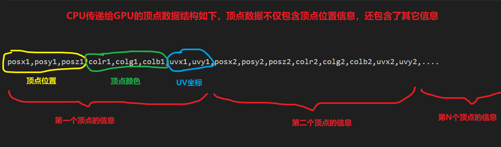
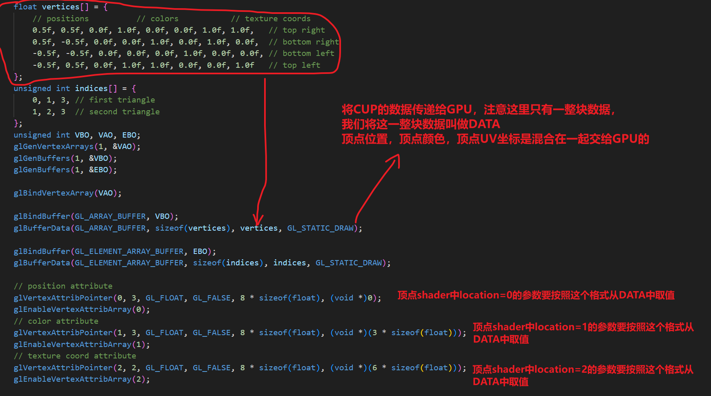
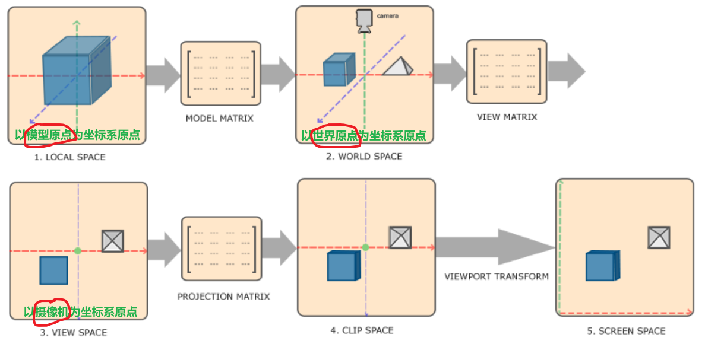

# 顶点数据



# location

- CPU传给GPU的顶点数据是一整块，包含顶点位置、顶点颜色、顶点UV坐标等，并且各部分的数据是交错在一起的。为什么不将顶点的各部分属性分不同次数传递给GPU呢？因为屎山代码不好改，现在的底层就是这样的逻辑，你爱学不学。
- 我的的shader中定义了三个参数，分别是arg0，arg1，arg2，我们想将顶点位置放到arg0上，将顶点颜色放到arg1上，将顶点UV坐标放到arg2上。
- GPU如何从这一整块数据上获取顶点位置、顶点颜色、顶点UV坐标，并将这些数据绑定到我们的shader中定义好的arg0，arg1，arg2上？
- 需要CPU告诉GPU，arg0的数据的类型是什么，是float32还是double还是int，第一个数据距离一整块数据开头的偏移量是多少，步长是多少等等。

顶点着色器的代码如下：

```
#version 330 core
layout (location = 0) in vec3 aPos;
layout (location = 1) in vec3 aColor;
layout (location = 2) in vec2 aTexCoord;

out vec3 ourColor;
out vec2 TexCoord;

void main()
{
    gl_Position = vec4(aPos, 1.0);
    ourColor = aColor;
    TexCoord = aTexCoord;
}
```



# 数学

## 点积

- 两个向量点积的结果是一个值
- 两个向量的点积结果容易算，两个向量的模长容易算，根据点积结果和模长可以非常简单的计算出两个向量的夹角

$$
\mathbf{A}=(A_{x},A_{y},A_{z})
$$
$$
\mathbf{B}=(B_{x},B_{y},B_{z})
$$
$$
\begin{aligned}
\mathbf{A}\cdot\mathbf{B}&=A_{x}*B_{x}+A_{y}*B_{y}+A_{z}*B_{z}\\&=|\mathbf{A}|*|\mathbf{B}|*\cos(\theta)
\end{aligned}
$$

## 叉乘

- 两个向量叉乘的结果是一个向量
- A和B叉乘的结果是向量C，且向量C同时垂直于A和B

$$
\mathbf{A}=(A_{x},A_{y},A_{z})
$$

$$
\mathbf{B}=(B_{x},B_{y},B_{z})
$$

$$
\mathbf{A}\times\mathbf{B}=\mathbf{C}=(A_{y}B_{z}-A_{z}B_{y},A_{z}B_{x}-A_{x}B_{z},A_{x}B_{y}-A_{y}B_{x})
$$

## 乘法

### 向量乘数值

$$
\mathbf{A}*b=(A_{x}b,A_{y}b,A_{z}b)
$$

### 向量乘向量

$$
\mathbf{A}*\mathbf{B}=(A_{x}B_{x},A_{y}B_{y},A_{z}B_{z})
$$

# 坐标系

- 模型空间：以模型原点为坐标系原点。模型的原点是模型设计师指定的。
- 世界空间：以世界原点为坐标系原点。世界原点是场景搭建师指定的。
- 观察空间：以摄像机位置为坐标系原点。
- 裁剪空间：将观察空间得到的顶点位置投影到一个2D平面上，这个2D平面就是裁剪空间。且所有顶点坐标都会被标准化到-1到1之间。投影的方法有正交投影和透视投影。
- 屏幕空间：将-1到1范围（裁剪空间的结果）转换为与屏幕分辨率相对应的范围，进而得知哪些点线面占用了屏幕上的哪些像素。



- 模型矩阵：将模型空间转换到世界空间，每个物体都有自己独有的model matrix，如果模型移动、旋转、缩放，那么此矩阵会发生变化。
- 观察矩阵：将世界空间转换到观察空间，每个摄像机都有自己独有的model matrix，如果摄像机移动、旋转，那么此矩阵会发生变化。
- 投影矩阵：将观察空间的点转换到裁剪空间，一个游戏只有一个projection matrix，这是在游戏初始化时就确定好了的，只有改变摄像机投影参数时，此矩阵才会变化。


游戏每一帧，如果这一帧中物体有移动、缩放、旋转则model matrix会发生变化，那么这一帧中CPU会发送移动的物体的model matrix到GPU中，每个物体都有自己的model matrix。如果这一帧中摄像机有移动则view matrix会发生变化


游戏中有一个模型A，这个模型A有多个实例，分别为A1、A2、A3，那么GPU中只需要一份模型A的顶点数据，需要A1的model matrix和A2的model matrix和A3的model matrix

