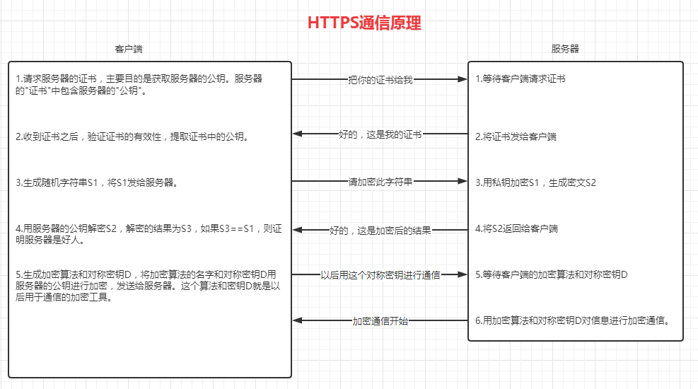
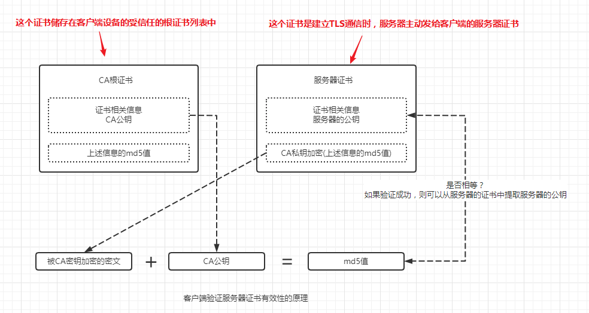

# 配置文件

```shell
openssl version -a
```

上述命令可以查看openssl的安装位置

配置文件去安装位置中去找，文件名是openssl.cn

# 证书签发的过程

1. 拥有根证书(A)
2. 使用根证书(A)，签其它服务器的证书(B)
3. 使用根证书(A)，签其它服务器的证书(C)
4. 使用根证书(A)，签其它服务器的证书(D)
5. 将证书B配置到Nginx的证书上(同时将证书的密钥也配置上)
6. 客户端信任根证书A(预制在操作系统中，或者用户手动将A导入到设备的可信任的证书中)
7. 如果客户端信任了A，则客户端信任B、C、D等证书

# 制作证书

```shell
# 制作CA的私钥ca.key
openssl genrsa -aes256 -out ca.key 4096
# 使用CA私钥创建CA自签的证书(根证书)ca.crt, 注意-subj中的/C=的参数必须是2个字符
openssl req -x509 -new -nodes -key ca.key -sha256 -days 3650 -out ca.crt -subj '/CN=THT CA/C=CN/ST=ST/L=L/O=O/OU=OU'
# 制作www.tanght.xyz网站的证书请求文件ser.csr
openssl req -new -nodes -out ser.csr -newkey rsa:4096 -keyout ser.key -subj '/CN=tanght.xyz/C=CN/ST=ST/L=L/O=O/OU=OU'
# 制作扩展文件，ca生成网站证书时需要这个文件作为参数
cat > ser.v3.ext << EOF
authorityKeyIdentifier=keyid,issuer
basicConstraints=CA:FALSE
keyUsage = digitalSignature, nonRepudiation, keyEncipherment, dataEncipherment
subjectAltName = @alt_names
[alt_names]
DNS.1 = *.tanght.xyz
IP.1 = 49.232.201.5
EOF
# ca创建www.tanght.xyz网站的证书ser.crt
openssl x509 -req -in ser.csr -CA ca.crt -CAkey ca.key -CAcreateserial -out ser.crt -days 730 -sha256 -extfile ser.v3.ext
```

123



123


