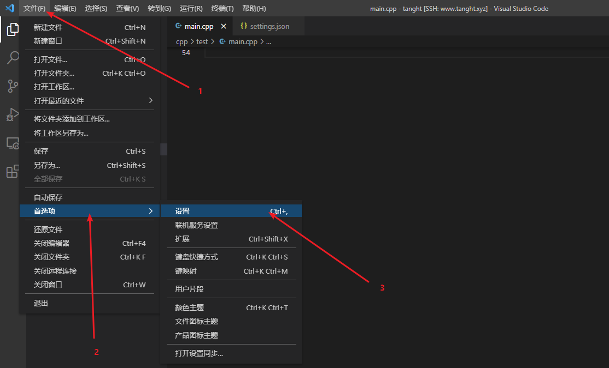
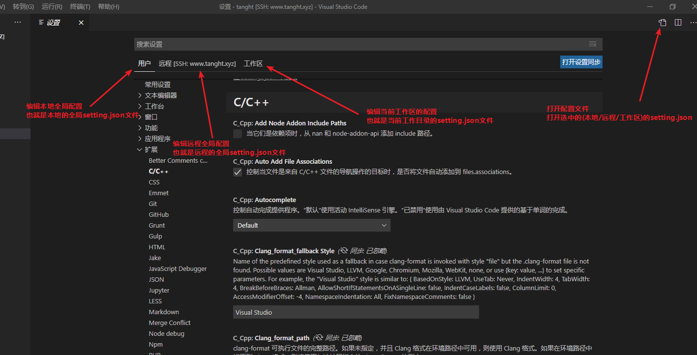
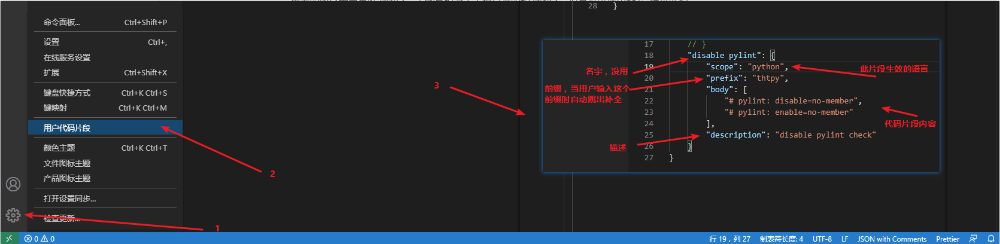

${workspaceFolder} :表示当前workspace文件夹路绝对路径。

${workspaceRootFolderName}:表示workspace的文件夹名，不是路径，仅仅是文件夹名而已。

${file}:文件自身的绝对路径。

${relativeFile}:文件相对路径，相对workspace来计算。

${fileBasenameNoExtension}:当前文件的文件名，不带路径，不带后缀（.json .cpp .txt等等都不要）。

${fileBasename}:当前文件的文件名，不带路径。

${fileDirname}:当前文件所在的文件夹绝对路径，不带文件名。

${fileExtname}:当前文件的后缀。

${lineNumber}:当前文件光标所在的行号。

${env:PATH}:系统中的环境变量。


```cmake
${VAR} # 取VAR变量的值
aux_source_directory(path, VAR) #将path目录下的所有源文件名字放到VAR变量中
file(GLOB _srcFiles "src/f[1-3].cpp") 
message("haha")
message(${VAR)


list(LENGTH var2 var3) # var2是一个数组，不用${var2}
```


# 配置文件系统介绍

打开配置文件，快捷键ctrl+,



配置文件界面，本地与远程可以随意切换



当前工作目录的setting.json可以覆盖全局的setting.json

也就是说将通用的配置写到全局的配置中，如果全局配置不适合当前项目，可以在当前项目中新建.vscode文件夹，在其中创建setting.json文件，用来局部覆盖全局配置


# C++配置文件

以下配置只影响C++程序的代码补全，并不影响gcc的编译

在全局的setting.json中放置通用的includePath，这样一来，那些普通的程序就可以补全了

```json
// 全局的setting.json文件
{
    "python.pythonPath": "venv/test/bin/python3.9",

    "C_Cpp.default.includePath": [
        "/usr/include/c++/7",
        "/usr/include/x86_64-linux-gnu/c++/7",
        "/usr/include/c++/7/backward",
        "/usr/lib/gcc/x86_64-linux-gnu/7/include",
        "/usr/local/include",
        "/usr/lib/gcc/x86_64-linux-gnu/7/include-fixed",
        "/usr/include/x86_64-linux-gnu",
        "/usr/include"
    ],
    "C_Cpp.default.intelliSenseMode": "linux-gcc-x64",
    "C_Cpp.default.cppStandard": "c++17",
    "C_Cpp.default.cStandard": "gnu11"
}
```

在当前项目的c_cpp_properties.json中设置特殊的配置

```json
// 当前项目的.vscode/c_cpp_properties.json文件
{
    "configurations": [
        {
            "name": "Linux",
            "includePath": [
                "${default}",
                "/home/tanght/download/boost_1_75_0"
            ],
            "defines": [],
            "compilerPath": "/usr/bin/gcc"
        }
    ],
    "version": 4
}
```

${default}是将全局setting.json的C_Cpp.default.includePath拿过来


# 无法在这个大型工作区监视

```json
//当前工作区的setting.json
{
    "files.watcherExclude": {
        "**/.git/objects/**": true,
        "**/.git/subtree-cache/**": true,
        "**/node_modules/*/**": true,
        "**/.hg/store/**": true,
        "/home/tanght/cpp/**": true,
        "/home/tanght/download/**": true,
        "/home/tanght/python/**": true,
        "/home/tanght/venv/**": true
    }
}
```

files.watcherExclude设置vscode的监视忽略。

也就是说vscode会不监视这些文件夹的变化情况，除非手动刷新。

里面的路径需要是绝对路径，不能是相对于工程目录的相对路径，但是可以使用**/这种来匹配。


```json
//当前工作区的setting.json
{
    "files.exclude": {
        "**/.git": true,
        "**/.svn": true,
        "**/.hg": true,
        "**/CVS": true,
        "**/.DS_Store": true,
        "cpp": true
    }
}
```

files.exclude更狠，vscode不仅不监控，连显示都不显示了，直接当作不存在。

里面的路径必须是相对于vscode工程的相对路径。


# Linux远程登陆

1. 在windows上生成ssh密钥，使用git bash生成，`ssh-keygen -t rsa -C "youremail@example.com"`
2. 将windows上生成的公钥复制到linux下某用户(想要登陆哪个用户就用那个用户)的~/.ssh/authorized_keys中，authorized_keys中的多个密钥用换行分隔
3. 如果是root用户，需要在/etc/ssh/sshd_config中添加一行代码`PermitRootLogin yes`
4. 删除windows下的家目录下的.ssh/known_hosts，一会儿连接linux的时候会自动生成这个文件

# 自定义代码片段




# 快捷键


| 快捷键           | 功能                          |
| ---------------- | ----------------------------- |
| ctrl + shift + p | 打开命令面板                  |
| ctrl + ,         | 打开设置（settings.json文件） |
| ctrl + `         | 打开vscode底部的cmd窗口       |
| ctrl + /         | 注释这一行代码                |
| ctrl + g         | 跳转到行                      |
| ctrl + p         | 跳转到文件                    |
| ctrl + f         | 查找                          |
| ctrl + b         | 切换侧边栏可见性              |
| ctrl + k + 0     | 折叠所有代码                  |
| ctrl + k + j     | 展开所有代码                  |
| ctrl + k + f     | 格式化所有代码                |
| shift + alt + f  | 格式化代码                    |
| F2               | 重命名                        |
| ctrl + shift + U | 单词大写                      |
| ctrl + shift +L  | 单词小写                      |

# 代码格式化

## WEB前端

格式化vue html js ts css json yaml 等等

- eslint：代码风格检查，不负责代码格式化（它的格式化功能很弱，相当于没有），只负责报错
- prettier：代码格式化工具，格式化之后的代码未必符合eslint的胃口（所以要保证eslint和prettier的配置不冲突）
- vetur：负责高亮vue文件（很弱，简直是脑残插件）

上述三个插件，只需在vscode中安装即可，不需要在项目中使用npm安装（使用npm安装这些插件是上个世纪那些用记事本写代码的上古程序员的做法）

```json
// vscode配置文件(全局或当前工程都行)
{
  "editor.defaultFormatter": "esbenp.prettier-vscode", // 设置编辑器的默认格式化工具为 prettier
  "[javascript]": { // 根据语言设置其专用的默认格式化工具
      "editor.defaultFormatter": "esbenp.prettier-vscode", // 设置js的默认格式化工具为 prettier
      "editor.formatOnSave": true, // 保存时自动格式化
  },
  // 设置esbenp.prettier-vscode的配置, 不建议在这里设置, 建议在项目的.prettierrc.json专用文件中设置
  "prettier.semi": false, // 语句末尾添加分号
  "prettier.singleQuote": true // 使用单引号
}

```

### prettier配置

在工程根目录下创建`.prettierrc.js`文件

```javascript
module.exports = {
    printWidth: 120,
    tabWidth: 4,
    useTabs: false,
    singleQuote: true,		// 是否使用单引号
    semi: false, 			// 是否添加分号
    trailingComma: "es5",
    bracketSpacing: true,
    jsxBracketSameLine: false,
    arrowParens: "avoid",
    endOfLine: "auto",
}
```

### eslint配置

在工程根目录下创建`.eslintrc.js`文件

文档：https://eslint.org/docs/latest/use/configure/#specifying-environments

```javascript
module.exports = {
    env: {
    	node: true,		// 此项目为nodejs项目，不是网页项目
    	es6: true	// 语法格式为es6
    },
    "rules": {
        "indent": ["error", 4],
        "linebreak-style": ["error", "unix"],
        "quotes": ["error", "double"],
        "semi": ["error", "always"],
        "no-empty": "warn",
        "no-cond-assign": ["error", "always"],
         "for-direction": "off",
    }
}
```

