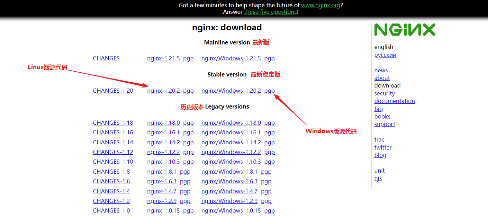

# TCP

## 三次握手

1. 客户端发送一个TCP包，这个包中的SYN标志位置为1
2. 服务端为了回应客户端，向客户端发送一个TCP包，这个包中的ACK标志位与SYN标志位都置为1
3. 客户端为了回应服务端，向服务端发送一个TCP包，这个包中的ACK标志位置为1

## 四次挥手

1. 发起端发送FIN
2. 被动端回应ACK
3. 被动端发送FIN
4. 发起端回应ACK

## Seq序列号与Ack序列号

TCP为了保证稳定传输，对传输的数据做了编号，每一个字节都做了编号哦。比如说我这里有1K的数据需要TCP传输，ok！

seq [100]

发起端发送第一个TCP包（SYN），请求建立连接，并且发送一个


# SSL

## 配置文件

```shell
openssl version -a
```

上述命令可以查看openssl的安装位置

配置文件去安装位置中去找，文件名是openssl.cn

## 证书签发的过程

1. 拥有根证书(A)
2. 使用根证书(A)，签其它服务器的证书(B)
3. 使用根证书(A)，签其它服务器的证书(C)
4. 使用根证书(A)，签其它服务器的证书(D)
5. 将证书B配置到Nginx的证书上(同时将证书的密钥也配置上)
6. 客户端信任根证书A(预制在操作系统中，或者用户手动将A导入到设备的可信任的证书中)
7. 如果客户端信任了A，则客户端信任B、C、D等证书

## 制作证书

```shell
# 制作CA的私钥ca.key
openssl genrsa -aes256 -out ca.key 4096
# 使用CA私钥创建CA自签的证书(根证书)ca.crt, 注意-subj中的/C=的参数必须是2个字符
openssl req -x509 -new -nodes -key ca.key -sha256 -days 3650 -out ca.crt -subj '/CN=THT CA/C=CN/ST=ST/L=L/O=O/OU=OU'
# 制作www.tanght.xyz网站的证书请求文件ser.csr
openssl req -new -nodes -out ser.csr -newkey rsa:4096 -keyout ser.key -subj '/CN=tanght.xyz/C=CN/ST=ST/L=L/O=O/OU=OU'
# 制作扩展文件，ca生成网站证书时需要这个文件作为参数
cat > ser.v3.ext << EOF
authorityKeyIdentifier=keyid,issuer
basicConstraints=CA:FALSE
keyUsage = digitalSignature, nonRepudiation, keyEncipherment, dataEncipherment
subjectAltName = @alt_names
[alt_names]
DNS.1 = *.tanght.xyz
IP.1 = 49.232.201.5
EOF
# ca创建www.tanght.xyz网站的证书ser.crt
openssl x509 -req -in ser.csr -CA ca.crt -CAkey ca.key -CAcreateserial -out ser.crt -days 730 -sha256 -extfile ser.v3.ext
```


**假设客户端拥有服务器的公钥：**

1. 客户端选择对称加密算法和对称加密密钥，将算法和密钥用服务器的公钥加密之后发送给服务器。
2. 服务器用自己的私钥解密出对称加密算法与对称加密密钥。
3. 此后服务器与客户端通过对称加密进行通信。

**上面是假设客户端拥有服务器的公钥，如何让客户端真的拥有服务器的公钥？**

- 通信之前先访问服务器获取服务器的公钥：不行，客户端怎么知道访问的是不是黑客？
- 客户端程序员去服务器公司，询问服务器的程序员公钥是什么，将服务器公钥手写在纸上拿回来，内置到客户端程序中：可以，但是太费程序员了！
- 通过证书来验证公钥的合法性：可以

# 免费证书

let's encrypt

```shell
# 切换到root用户
su

# 卸载certbot
yum remove certbot

# 安装epel-release源，因为certbot在这个源里
yum install epel-release

# 安装certbot
yum install certbot

# 使用certbot进行证书的制作，进入certbot的交互模式
certbot certonly


/etc/letsencrypt/live/www.zelaai.com/fullchain.pem
   Your key file has been saved at:
   /etc/letsencrypt/live/www.zelaai.com/privkey.pem
   Your certificate will expire on 2024-06-06. To obtain a new or
   tweaked version of this certificate in the future, simply run
   certbot again. To non-interactively renew *all* of your
   certificates, run "certbot renew"
 - If you like Certbot, please consider supporting our work by:

   Donating to ISRG / Let's Encrypt:   https://letsencrypt.org/donate
   Donating to EFF:                    https://eff.org/donate-le

```

# Nginx

## root&alias

```nginx
# 访问/haha/123.html，nginx会将/home/tanght/www/123.html文件发送给前端
{
	location /haha/ {
		alias /home/tanght/www/;
	}
}

# 访问/haha/123.html，nginx会将/home/tanght/www/haha/123.html文件发送给前端
{
	location /haha/ {
		root /home/tanght/www/;
	}
}
```

## set添加query arg

```nginx
# 覆盖用户传递的URL参数
location /aaa/ {
    set $args "env=nc&abc=def";
    proxy_pass http://172.17.0.1:9996/;
}

# 不会覆盖用户传递的URL参数，只是在用户参数的基础上添加
location /aaa/ {
    set $args "env=nc&abc=def&$args";
    proxy_pass http://172.17.0.1:9996/;
}
```

## proxy_pass

proxy_pass只有两种转发策略，nginx选择哪种策略只跟proxy_pass后面的URL带不带“/”有关，跟location中有没有“/”无关，两种类型的例子如下所示：

1. proxy_pass后的URL不带“/”，就是一个单纯的IP:PORT
   - proxy_pass http://localhost:8080
2. proxy_pass后的URL中带有"/"
   - proxy_pass http://localhost:8080/
   - proxy_pass http://localhost:8080/abc  （你可能要问了，这个abc后面不是没有“/”吗？哈哈8080后面“/”也算啊！）
   - proxy_pass http://localhost:8080/abc/

两种类型的处理方式如下：

第一种类型，nginx原封不动的将用户的请求转送到proxy_pass地址

第二种类型，nginx将删除匹配到的前缀，将剩余的URL部分转送给proxy_pass服务

示例：

```nginx
server {
    listen       80;

    # 类型1：proxy_pass后面的URL不带URI
    # nginx原封不动的转送请求，只是将URL中的IP:PORT部分替换为proxy_pass后的服务
    # http://localhost:80/a1                http://172.17.0.1:9996/a1
    # http://localhost:80/a1aaa             http://172.17.0.1:9996/a1aaa
    # http://localhost:80/a1/haha/xixi      http://172.17.0.1:9996/a1/haha/xixi
    # http://localhost:80/a1/haha/xixi/     http://172.17.0.1:9996/a1/haha/xixi/
    location /a1 {
       proxy_pass http://172.17.0.1:9996;
    }

    # 类型2：proxy_pass后面的URL带URI
    # nginx删除URL中的前缀，将剩余部分转给proxy_pass服务
    # 用户发送的请求                          用户URI   - 匹配到的前缀 = 剩余URI         proxy_pass后的路径       + 剩余URI       = nginx将要转发的地址
    # http://localhost:80/a2               /a2              - /a2 = 空             http://172.17.0.1:9996/ + 空           = http://172.17.0.1:9996/
    # http://localhost:80/a2aaa            /a2aaa           - /a2 = aaa            http://172.17.0.1:9996/ + aaa         = http://172.17.0.1:9996/aaa
    # http://localhost:80/a2/haha/xixi     /a2/haha/xixi    - /a2 = /haha/xixi     http://172.17.0.1:9996/ + /haha/xixi  = http://172.17.0.1:9996//haha/xixi
    # http://localhost:80/a2/haha/xixi/    /a2/haha/xixi/   - /a2 = /haha/xixi/    http://172.17.0.1:9996/ + /haha/xixi/ = http://172.17.0.1:9996//haha/xixi/
    location /a2 {
       proxy_pass http://172.17.0.1:9996/;
    }
    # 类型2： 同上
    # 剩余URI = 用户URI - /a3
    # 最终地址 = http://172.17.0.1:9996/abc + 剩余URI
    # http://localhost:80/a3                http://172.17.0.1:9996/abc
    # http://localhost:80/a3aaa             http://172.17.0.1:9996/abcaaa
    # http://localhost:80/a3/haha/xixi      http://172.17.0.1:9996/abc/haha/xixi
    # http://localhost:80/a3/haha/xixi/     http://172.17.0.1:9996/abc/haha/xixi/
    location /a3 {
       proxy_pass http://172.17.0.1:9996/abc;
    }
    # 类型2： 同上
    # 用户URI - /a4 = 剩余URI
    # 最终地址 = http://172.17.0.1:9996/abc/ + 剩余URI
    # http://localhost:80/a4                http://172.17.0.1:9996/abc/
    # http://localhost:80/a4aaa             http://172.17.0.1:9996/abc/aaa
    # http://localhost:80/a4/haha/xixi      http://172.17.0.1:9996/abc//haha/xixi
    # http://localhost:80/a4/haha/xixi/     http://172.17.0.1:9996/abc//haha/xixi/
    location /a4 {
       proxy_pass http://172.17.0.1:9996/abc/;
    }

    # 类型1
    location /b1/ {
       proxy_pass http://172.17.0.1:9996;
    }
    # 类型2
    # 剩余URI = 用户URI - /b2/
    # 最终地址 = http://172.17.0.1:9996/ + 剩余URI
    location /b2/ {
       proxy_pass http://172.17.0.1:9996/;
    }
    # 类型2
    # 剩余URI = 用户URI - /b3/
    # 最终地址 = http://172.17.0.1:9996/abc + 剩余URI
    location /b3/ {
       proxy_pass http://172.17.0.1:9996/abc;
    }
    # 类型2
    # 剩余URI = 用户URI - /b4/
    # 最终地址 = http://172.17.0.1:9996/abc/ + 剩余URI
    location /b4/ {
       proxy_pass http://172.17.0.1:9996/abc/;
    }
}
```

## rewrite

用于web服务内部的重定向，不能重定向到其它机器的上的web服务，proxy_pass用于重定向到其它机器上的web服务

GET和POST都可以rewrite，GET参数和POST body不会丢失，请放心使用

```nginx
语法: rewrite 你想要重定向的URI正则表达式 你想要重定向到的URI [flag]
位置: server, location, if
你想要重定向到的URI中可以使用$1 $2等参数，从而可以使用前面正则捕获到的值
flag: 空        : 内部偷偷重定向，将重定向的地址的返回值返回给浏览器，浏览器根本察觉不到有重定向的存在
flag: last      : 不要执行此location下面的代码了，去执行重定向的location
flag: break     : 不要执行此location下面的rewrite代码了，去执行本location下面的其它代码
flag: redirect  : 临时重定向，将重定向的地址发送给浏览器，浏览器自己看着办
flag: permanent : 永久重定向，将重定向的地址发送给浏览器，浏览器自己看着办
```

例子：

```nginx
server {
    listen       8000;
	
    # server 块的重定向
    rewrite ^/a1$ /b1;
    rewrite ^/a2/(.*)$ /b2/($1);
    
    location /haha/ {
        # location 块的重定向
        rewrite ......;
    }

    location /b1 {
        default_type text/plain;
        return 200 "i am b1";
    }

    location /b2 {
        default_type text/plain;
        return 200 "i am b2";
    }
}
```

例子：

- 用户访问 /a1/ 返回 i am a5
- 用户访问 /b1/ 返回 i am b3
- 用户访问 /c1/ 返回 i am c3

```nginx
server {
    listen       80;

    # /a1/ -> /a2/ -> /a3/ -> /a4/ -> /a5/
    # 继续找 /a5/ 的 rewrite，找了一圈发现没有给/a5/设置 rewrite
    # OK，rewrite 阶段结束，进入 location 阶段
    # 找到了 /a5/ 的 location，执行
    rewrite ^/a1/$ /a2/;
    rewrite ^/a2/$ /a3/;
    rewrite ^/a3/$ /a4/;
    rewrite ^/a4/$ /a5/;

    location = /a3/ {
        default_type text/plain;
        return 200 "i am a3";
    }

    location = /a5/ {
        default_type text/plain;
        return 200 "i am a5";
    }


    # /b1/ -> /b2/ -> /b3/ -> break
    # 虽然 给 /b3/ 设置了 rewrite，但是在上一行break了，所以在break处 rewrite 阶段就结束了，不会继续执行下面的 rewrite
    # ok，从 /b1/ -> /b2/ -> /b3/ 的 /b3/ 处开始进入 location 阶段
    # 找到了 /b3/ 的 location，执行
    rewrite ^/b1/$ /b2/;
    rewrite ^/b2/$ /b3/ break;
    rewrite ^/b3/$ /b4/;
    rewrite ^/b4/$ /b5/;

    location = /b3/ {
        default_type text/plain;
        return 200 "i am b3";
    }

    location = /b5/ {
        default_type text/plain;
        return 200 "i am b5";
    }

	# server 块中的 last 与 break 完全相同
    rewrite ^/c1/$ /c2/;
    rewrite ^/c2/$ /c3/ last;
    rewrite ^/c3/$ /c4/;
    rewrite ^/c4/$ /c5/;

    location = /c3/ {
        default_type text/plain;
        return 200 "i am c3";
    }

    location = /c5/ {
        default_type text/plain;
        return 200 "i am c5";
    }
}
```

location块中的break与last的作用可不一样哦！有些复杂！最好不要出现这样的情况！

## 日志

```nginx

```

## 源码编译

官网下载源码，官网地址http://nginx.org/en/download.html




```
sudo yum install pcre-devel
sudo yum install openssl openssl-devel
./configure --with-http_ssl_module
make
make install
```


## 源码分析

1. 执行`./configure --prefix=/some_path/nginx_study`来生成Makefile，prefix用于指定nginx的基准目录，配置文件，日志，临时文件，pid文件等等都会放到此目录下
2. 之后会在objs目录下生成Makefile文件，此文件的前几行有个叫做CFLAGS的变量，将其修改为CFLAGS =  -pipe  -O0  -g ，-g用于调试，-O0用于禁止编译器优化，不然断点可能断不到
3. make && make install
4. 到我们指定的prefix下查看make && make install生成的东西吧
5. 修改配置文件，将worker_processes这条命令删除，在文件的开头添加两行命令`daemon off;`与`master_process off;`，作用是让nginx以单进程且非守护进程的模式运行，方便调试
6. 用调试器启动sbin/nginx，可以愉快的调试了

```
cycle->conf_ctx == conf.ctx 等于 ngx_pcalloc(pool, ngx_max_module * sizeof(void *))，是一个100多个坑的数组，每个坑里是一个指针，指向未知
上述指针数组中，要给每个指针new一块内存，储存配置

ngx_module_t  ngx_core_module

struct ngx_module_s {
    ngx_uint_t            ctx_index;  // 相同type的位置，用于配置定位
    ngx_uint_t            index;  // 全局ngx_modules[]数组中的位置
    char                 *name;
    ngx_uint_t            spare0;
    ngx_uint_t            spare1;
    ngx_uint_t            version;
    const char           *signature;
    void                 *ctx;  !!!!!!!! 这里可以储存任何类型的指针，比如ngx_core_module就储存了一个结构体(ngx_core_module_ctx)，结构体中有两个函数
    ngx_command_t        *commands;
    ngx_uint_t            type;
    ngx_int_t           (*init_master)(ngx_log_t *log);
    ngx_int_t           (*init_module)(ngx_cycle_t *cycle);
    ngx_int_t           (*init_process)(ngx_cycle_t *cycle);
    ngx_int_t           (*init_thread)(ngx_cycle_t *cycle);
    void                (*exit_thread)(ngx_cycle_t *cycle);
    void                (*exit_process)(ngx_cycle_t *cycle);
    void                (*exit_master)(ngx_cycle_t *cycle);
    uintptr_t             spare_hook0;
    uintptr_t             spare_hook1;
    uintptr_t             spare_hook2;
    uintptr_t             spare_hook3;
    uintptr_t             spare_hook4;
    uintptr_t             spare_hook5;
    uintptr_t             spare_hook6;
    uintptr_t             spare_hook7;
};


ngx_core_conf_t
ngx_event_conf_t
ngx_epoll_conf_t
ngx_kqueue_conf_t
ngx_http_core_main_conf_t
ngx_http_upstream_main_conf_t
ngx_http_uwsgi_main_conf_t
搜索配置文件结构体正则ngx_[a-zA-Z_]*_conf_t;


ctx_index与index，如下ngix共有51个模块，其中type为NGX_HTTP_MODULE的模块有43个
对ngx_http_core_module模块来讲，它的index是8，ctx_index是0
对ngx_http_upstream_module模块来讲，它的index是10，ctx_index是2
ctx_index的设置在ngx_count_modules函数中
在解析http大括号时，会计算所有NGX_HTTP_MODULE的模块的ctx_index，从0开始排序哦
在解析event大括号时，会计算所有NGX_EVENT_MODULE的模块的ctx_index，也是从0开始排序哦

ngx_module_t *ngx_modules[] = {
    &ngx_core_module,
    &ngx_errlog_module,
    &ngx_conf_module,
    &ngx_regex_module,
    &ngx_events_module,
    &ngx_event_core_module,
    &ngx_epoll_module,
    &ngx_http_module,
    &ngx_http_core_module,          // type为NGX_HTTP_MODULE
    &ngx_http_log_module,           // NGX_HTTP_MODULE
    &ngx_http_upstream_module,      // NGX_HTTP_MODULE
    &ngx_http_static_module,        // NGX_HTTP_MODULE
    &ngx_http_autoindex_module,     // NGX_HTTP_MODULE
    &ngx_http_index_module,         // NGX_HTTP_MODULE
    &ngx_http_mirror_module,        // NGX_HTTP_MODULE
    &ngx_http_try_files_module,     // NGX_HTTP_MODULE
    &ngx_http_auth_basic_module,    // NGX_HTTP_MODULE
    &ngx_http_access_module,        // NGX_HTTP_MODULE
    &ngx_http_limit_conn_module,    // NGX_HTTP_MODULE
    &ngx_http_limit_req_module,     // NGX_HTTP_MODULE
    &ngx_http_geo_module,           // NGX_HTTP_MODULE
    &ngx_http_map_module,           // NGX_HTTP_MODULE
    &ngx_http_split_clients_module, // NGX_HTTP_MODULE
    &ngx_http_referer_module,       // NGX_HTTP_MODULE
    &ngx_http_rewrite_module,       // NGX_HTTP_MODULE
    &ngx_http_proxy_module,         // NGX_HTTP_MODULE
    &ngx_http_fastcgi_module,       // NGX_HTTP_MODULE
    &ngx_http_uwsgi_module,         // NGX_HTTP_MODULE
    &ngx_http_scgi_module,          // NGX_HTTP_MODULE
    &ngx_http_memcached_module,     // NGX_HTTP_MODULE
    &ngx_http_empty_gif_module,     // NGX_HTTP_MODULE
    &ngx_http_browser_module,       // NGX_HTTP_MODULE
    &ngx_http_upstream_hash_module, // NGX_HTTP_MODULE
    &ngx_http_upstream_ip_hash_module,      // NGX_HTTP_MODULE
    &ngx_http_upstream_least_conn_module,   // NGX_HTTP_MODULE
    &ngx_http_upstream_random_module,       // NGX_HTTP_MODULE
    &ngx_http_upstream_keepalive_module,    // NGX_HTTP_MODULE
    &ngx_http_upstream_zone_module,         // NGX_HTTP_MODULE
    &ngx_http_write_filter_module,          // NGX_HTTP_MODULE
    &ngx_http_header_filter_module,         // NGX_HTTP_MODULE
    &ngx_http_chunked_filter_module,        // NGX_HTTP_MODULE
    &ngx_http_range_header_filter_module,   // NGX_HTTP_MODULE
    &ngx_http_gzip_filter_module,           // NGX_HTTP_MODULE
    &ngx_http_postpone_filter_module,       // NGX_HTTP_MODULE
    &ngx_http_ssi_filter_module,            // NGX_HTTP_MODULE
    &ngx_http_charset_filter_module,        // NGX_HTTP_MODULE
    &ngx_http_userid_filter_module,         // NGX_HTTP_MODULE
    &ngx_http_headers_filter_module,        // NGX_HTTP_MODULE
    &ngx_http_copy_filter_module,           // NGX_HTTP_MODULE
    &ngx_http_range_body_filter_module,     // NGX_HTTP_MODULE
    &ngx_http_not_modified_filter_module,   // NGX_HTTP_MODULE
    NULL
};


在解析http block时，会new一个ngx_http_conf_ctx_t，其中的每个(main_conf，srv_conf，loc_conf)数组，都有NGX_HTTP_MODULE总数的长度
也就是说，有多少个NGX_HTTP_MODULE个模块，main_conf数组就有多大
也就是说，有多少个NGX_HTTP_MODULE个模块，srv_conf数组就有多大
也就是说，有多少个NGX_HTTP_MODULE个模块，loc_conf数组就有多大

typedef struct {
    void        **main_conf;
    void        **srv_conf;
    void        **loc_conf;
} ngx_http_conf_ctx_t;


ngx_http_core_module是NGX_HTTP_MODULE类型的模块，它会将90%的配置文件字段new出来，其余的NGX_HTTP_MODULE类型的模块就不用new了，直接设置就行了。
static ngx_http_module_t  ngx_http_core_module_ctx = {
    ngx_http_core_preconfiguration,        /* preconfiguration */
    ngx_http_core_postconfiguration,       /* postconfiguration */

    ngx_http_core_create_main_conf,        /* create main configuration */
    ngx_http_core_init_main_conf,          /* init main configuration */

    ngx_http_core_create_srv_conf,         /* create server configuration */
    ngx_http_core_merge_srv_conf,          /* merge server configuration */

    ngx_http_core_create_loc_conf,         /* create location configuration */
    ngx_http_core_merge_loc_conf           /* merge location configuration */
};


待研究配置文件结构体
} ngx_http_core_main_conf_t;包含下面
} ngx_http_core_srv_conf_t;包含下面
ngx_http_core_loc_conf_t;


搜索nginx指令的正则表达式ngx_[^ ]*_commands\[\]
ngx_http_core_commands


ngx_http_core_run_phases  在这里打断点，可以分析http流程
ngx_epoll_process_events会调用rev->handler(rev)，这个handler是ngx_http_wait_request_handler
ngx_http_add_listening时将ngx_http_init_connection设置为ls->handler，就是上面的handler


ngx_init_cycle中调用ngx_conf_parse来解析配置文件
解析到http模块时，会根据http server block来创建listening并挂到cycle->listening数组中，并且设置ls->handler = ngx_http_init_connection


ngx_open_listening_sockets
ngx_init_cycle中调用ngx_open_listening_sockets
ngx_open_listening_sockets中会给所有cycle->listening创建socket bind listen


解析配置文件，创建共享内存，创建socketpair用于进程间通信，给cycle->listening(需要被监听的地址的数组)创建socket并listen，等等基础设施之后，进入ngx_single_process_cycle
在ngx_single_process_cycle中，有以下2个最重要的逻辑
1.调用所有模块的init_process，其中就包含event模块的ngx_event_process_init，(epoll模块只是event模块的多种选择之一，event也可以是poll，select，iocp等等)
2.while死循环，调用ngx_process_events_and_timers


ngx_event_process_init
找到使用的event模块，例如epoll，执行epoll的init函数
给连接池分配内存(cycle->connections，cycle->read_events，cycle->write_events)，并将他们三个联系到一起，让它们彼此能找到对方
设置free_connections(指针)，free_connections用于找到空闲的connection
给cycle->listening列表中的所有socket分配connection
给上述分配的connection对应的read event简称rev的rev->handler设置为ngx_event_accept，ngx_event_accept回调会调用accept函数接收连接生成socket，然后给这个socket fd找一个空闲的connection，然后将connection交给listen的handler，此handler为ngx_http_init_connection
将上述read event（简称rev）通过ngx_add_event添加到epoll中，如果是多进程，则在epoll add的时候设置NGX_EXCLUSIVE_EVENT参数，用于解决惊群问题


ngx_event_accept -> ls->handler(c)就是ngx_http_init_connection -> ngx_http_wait_request_handler -> 读取connection中的socket的内容，根据内容创建request(ngx_http_create_request)


http处理流程的11个阶段
每个模块在ngx_http_module_t  ngx_http_autoindex_module_ctx中的postconfiguration处设置自己的函数，将方法注册到其中某个阶段
ngx_http_block函数的尾部，会遍历所有http模块，调用模块的postconfiguration，postconfiguration会将自己模块的犯法注册到对应的阶段上


ngx_http_static_init 将 ngx_http_static_handler 注册到 NGX_HTTP_CONTENT_PHASE
ngx_http_static_handler


NGX_HTTP_POST_READ_PHASE        0
NGX_HTTP_SERVER_REWRITE_PHASE   1
NGX_HTTP_FIND_CONFIG_PHASE      0
NGX_HTTP_REWRITE_PHASE          1
NGX_HTTP_POST_REWRITE_PHASE     0
NGX_HTTP_PREACCESS_PHASE        2
NGX_HTTP_ACCESS_PHASE           1
NGX_HTTP_POST_ACCESS_PHASE      2
NGX_HTTP_PRECONTENT_PHASE       0
NGX_HTTP_CONTENT_PHASE          2
NGX_HTTP_LOG_PHASE
```

# uwsgi

uwsgi是一个用c语言写成的程序，这个程序的功能非常简单，就是监听一个端口，然后读取这个端口收到的字符串，再将这些字符串交给一个python函数来处理，最后将这个python函数的返回值返回给端口对面的机器。

这个python函数长什么样子呢？是一个接收两个参数，返回一个可迭代对象的函数，他的名字可以是django，flask等等。

django本质上是一个复杂的函数，接收两个参数，返回一个可迭代对象。

启动uwsgi，uwsgi创建一个python解释器，python解释器去加载django。然后uwsgi创建一个socket，开始监听这个端口，比如就是80端口。80端口收到消息，uwsgi将消息整理之后传递个django，django使用程序员写的函数来处理消息，处理完毕后将结果返回给uwsgi，uwsgi对结果做简单的整理然后传递给80端口的对面机器。

## 最简单的uwsgi服务

前面说了，uwsgi程序只需要我们写一个application函数(名字必须为application)，接收两个参数，返回一个字符串(bytes类型，不能是str类型)，就这么简单，那么我们就写一个下面的函数，保存到haha.py中。

```python
# /home/tanght/haha.py
def application(env, start_response):
    start_response('200 OK', [('Content-Type','text/html')])
    return 'Hello World'.encode('utf-8')
```

ok，给uwsgi程序准备的函数写好了，那么现在我们可以启动uwsgi了。

```shell
uwsgi --http 0.0.0.0:8000 --wsgi-file tanght.py
```

输入上述命令，回车！搞定！可以看到命令行窗口中输出了一堆乱七八糟的信息，然后阻塞住不动了。这就证明uwsgi启动成功了，uwsgi作为一个程序，占用了当前的cmd窗口。

`--http 0.0.0.0:8000`是告诉uwsgi监听本机的8000端口。

`--wsgi-file`是告诉uwsgi我们的application函数所在的文件。

现在uwsgi就在循环监听8000端口了，只要8000端口来消息，uwsgi就会调用我们的application函数来处理，并且uwsgi会将application函数的返回值传递给对方。

## 常用命令

```shell
# 直接将uwsgi需要的参数通过命令行传递个它，这样启动之后，uwsgi会占用当前shell窗口，就是所谓的前台运行，关了这个shell或者ctrl+c之后，uwsgi就停止了
uwsgi --http 0.0.0.0:8000 --wsgi-file myfile.py

# 通过配置文件给uwsgi传递参数
uwsgi --ini your_path/your_uwsgi_config_name.ini

# 优雅的停止
uwsgi --stop you_pid.pid

# 重新加载uwsgi.ini配置文件，重新加载django项目，django
uwsgi --reload you_pid.pid
```

## 配置uwsgi.ini

```shell
# 这些参数既可以通过命令行传递，也可以通过这个配置文件来传递，一般都用配置文件，因为参数太多了
[uwsgi]

# 需要监听的端口号
# socket = 0.0.0.0:8000
http = 0.0.0.0:8000

# chdir设置当前工作目录，影响os.getcwd()，open(相对路径)
# 如果不设置chdir的话，在哪里运行的uwsgi命令，就将那个路径设置为当前工作目录
# 在app加载前切换到当前目录， 指定运行目录
# 这个变量会影响python导包的路径，因为uwsgi在启动python解释器的时候会将'.'放到sys.path中
chdir = /home/ubuntu/python/uwsgi_test/uwsgi1

# 虚拟环境不用设置，直接运行虚拟环境中uwsgi，则uwsgi将自动使用虚拟环境
# venv = /home/ubuntu/python/uwsgi_test/uwsgi1/.venv
# home = /home/ubuntu/python/uwsgi_test/uwsgi1/.venv
# uwsgi --help | grep vir

# 指定后台输出日志信息的文件
daemonize = /home/ubuntu/python/uwsgi_test/uwsgi1/log.log

# 指定运行时候的pid文件，也可以用来停止进程， uwsgi --stop /var/run/uwsgi_pid.log
pidfile = /home/ubuntu/python/uwsgi_test/uwsgi1/pid.log

# django项目同名目录内层自动生成的wsgi.py的路径，如果你的项目叫taobao，就填taobao.wsgi
# module = Blog.wsgi

# xxxxx
wsgi-file = /home/ubuntu/python/uwsgi_test/uwsgi1/test.py

# 开启主进程
master = true

# 最大进程数量
processes = 4

# uwsgi停止时，自动删除unix socket文件和pid文件
vacuum = true

# buffer-size = 32768

# python代码变动时自动重启
py-autoreload = 1
```

# Django

## 自定义异常处理

django异常时(404，权限，用户view函数异常等)，默认返回一个html页面，但是与前端商量好了，不管任何情况，服务端永远返回JSON，这时候怎么办呢？

通过中间件process_exception来处理嘛？对不起，只能处理views异常，(404，权限等异常依然解决不了)，这时候我们就要用绝招了，直接修改django源码，别修改源文件，而是import之后重写几个函数而已。

在`django/core/handlers/exception.py`中存在几个函数，这几个函数控制着django的异常处理：

- convert_exception_to_response：django加载中间件的时候，用这个函数包装了所有中间件函数
- response_for_exception：处理一些细节，没什么卵用
- get_exception_response：通过错误码，找到对应的异常处理函数，并调用，异常处理函数是那些呢？在django/views/defaults.py中有一些，也可以自己写一些
- handle_uncaught_exception：没找到错误处理函数的时候，进入这个函数 

狠一点的话，直接重写response_for_exception，将exception塞进json中返回就可以了

温柔一点的话，仿照get_exception_response，分类处理就好了

# Vue2

不知道

# Vue3

## 创建项目

```shell
npm create vite@latest
npm install element-plus
```

## setup

### setup简介

setup是vue2中的一个函数，与data，methods，watched等字段平级，setup函数用来替代data，methods，watched这些选项式风格，setup函数的最后会return方法和变量，然后模板中就可以使用setup中定义的那些东西了。

```vue
<script lang="ts">
	export default {
        name: "组件名字",
        setup() {
            // 数据
            let name = "tanght"
            let age = 18
            // 方法
            function hello() {}
            function hi() {}
            return {name, age, hello, hi}
        }
    }
</script>

<template>
</template>

<style scoped>
</style>

```

### setup语法糖

用更加简单的代码结构替代上面的代码，下面就是setup的语法糖了

```vue
<script lang="ts">
	export default {
        name: "组件名字"
    }
</script>

<script setup lang="ts">
	let name = "tanght"
    let age = 18
    function hello() {}
    function hi() {}
</script>

<template>
</template>

<style scoped>
</style>
```

### setup-name插件

vite-plugin-vue-setup-extend，可以在setup的script段落声明组件的名称

安装方式`npm i vite-plugin-vue-setup-extend -D`


## 响应式

### ref(基本数据类型or非基本数据类型)

模板中不用.value，代码中需要.value

### reactive(非基本数据类型)

模板中不用.value，代码中也不用.value

### Object.assign替换响应式对象

只有reactive需要这样操作，ref定义的响应式数据直接修改.value就行了

```vue
car = reactive(obj1)
car = reactive(obj2)
// 页面中的car不会变化, 因为响应式obj1没变化，即使car变为了响应式obj2
// 我们的目的是修改响应式obj1，而不是修改car
// 所以我们可以用Object.assign(car, obj2)来将响应式obj1的各个字段修改为obj2中对应的值
```

### toRefs（从obj中提取的字段继续保持响应式）

```vue
let {a, b, c} = obj1 // a, b, c 失去了响应式
let {a, b, c} = toRefs(obj1) // a, b, c 继续保持响应式 a.value = "xxx"  --->  obj1.a = "xxx"
```


### 泛型响应式

```ts
interface IPerson {
	id: string,
	name: string,
	age: number
}

type Persons = IPerson[]

let a = reactive<Persons>([])
```

## ref打标签

给普通的html标签打上ref，则可以在代码中方便的获取到此dom元素


给自定义组件打标签


## 计算属性

```vue
import { computed } from 'vue'

// 只读的计算属性
let fullname = computed(()=>{ return firstname + lastname })

// 可读可写的计算属性
let fullname = computed({
	get() {
		return firstname + lastname
	},
	set(val) {
		// 每次有人设置fullname, 都会执行这个函数
		// 至于导致设不设置fullname的关联字段由程序员自己控制
		console.log(val)
    }
})
```

## watch


监视ref的数据


只监听object的指定字段


watch ref的时候，默认不开启深度监视，可以通过{deep: true}来开启深度监视

watch reactive的时候，默认开启深度监视，且无法关闭深度监视

watch一个对象的字段的时候，必须用getter，不管这个字段是基础类型还是obj，如果是obj，请deep: true

## watchEffect

watchEffect自动分析需要监控哪些变量，不需要提前指明


## hooks

 /src/hooks/useSum.ts 此文件只完成求和功能相关的数据和方法

```ts
import {ref} from 'vue'

export default function() {
    let sum = ref(0)

    function add() {
        sum.value += 1
    }
    
    return {sum, add}
}
```

 /src/hooks/useDog.ts 此文件只完成狗功能相关的数据和方法

```ts
import {reactive} from 'vue'
import axios from 'axios'

export default function() {
    let dogs = reactive(['https://www.tnaght.xyz/dog/1.png'])

    async function addDog() {
        try {
            let res = await axios.get('https://www.tnaght.xyz/dogs/')
            dogs.push(res.data.message)
        } catch (err) {
            alert(err)
        }
    }
    
    return {dogs, addDog}
}
```

/src/Tanght.vue 此文件来使用上述几个文件

```vue
<template>
	<div>
        <h2>当前求和为：{{ sum }}</h2>
        <button @click="add">加一</button>
        <hr>
        
        <br>
        <button @click="addDog">加狗</button>
    </div>
</template>

<script setup lang="ts">
    import useSum from '@/hooks/useSum'
    import useDog from '@/hooks/useDog'
    
    const {sum, add} = useSum()
    const {dogs, addDog} = useDog()
</script>
```

## v-bind

```vue
<template>
  <HaHa :a="ok" :b="fuck" :c="you"/>
</template>
```

相当于

```vue
<template>
  <HaHa v-bind="{a: 'ok', b: 'fuck'}" :c="you"/>
</template>
```

## v-model

vue2和vue3中除了变量名和事件名不一样，其它原理全部一样

vue2的原理


vue3的原理


## 父子传值

### defineProps


```vue
// 接收两个参数
defineProps<{human:Persons, haha:number}>()

// haha参数可以不传 
defineProps<{human:Persons, haha?:number}>()
```


### defineEmits


### 自定义事件

浏览器事件对象


自定义事件，emit('haha', 666)触发haha事件，并携带666参数


事件名称要用a-b-c，不要用驼峰


### mitt事件系统

npm install mitt

任何时间&地点都可以emitter.on('x', ()=>{})绑定事件

任何时间&地点都可以emitter.emit('x')触发事件


### provide inject


## 组件的类型

普通组件：通过属性传值

路由组件：通过query或param传值

### 普通组件

程序员在template代码中直接使用的组件，下面的ZhangSan和LiSi这两个组件就是普通组件

A.vue

```vue
<template>
	<ZhangSan a="123" b="456"/>
	<LiSi />
</template>
```

程序员可以通过给标签添加属性的方法来进行父->子传值

ZhangSan.vue

```vue
<template>
	{{ a }} -- {{ b }}
</template>

<script setup lang="ts">
    import {defineProps} from 'vue'
    // 我需要两个参数a和b
    // 可以通过标签属性的方式传给我
    // 也可以通过路由query或params传给我
    defineProps<{a:string, b:number}>()
</script>
```

### 路由组件

程序员不在template代码中直接使用，而是将组件配置在路由中，程序员无法通过标签属性的方式进行父->子传值（因为没有机会啊，你连在template中写这个标签的机会都没有）

```typescript
const router = createRouter({
    history: createWebHashHistory(),  // createWebHashHistory createWebHistory
    routes: [
        { path: '/home/:id/:arg1', component: Home }
    ]
})
```

## 路由

根据path或name找到对应的vue组件，将此组件放到RouterView处显示。

npm install vue-router

import xxx from 'vue-router'

路由的原理就是一个path对应一个vue组件，如下

路径1  ---> vue组件1

路径n  ---> vue组件n

使用RouterLink标签设置点击此对象后要跳转的路径（或者说要加载的vue组件）

使用RouterView标签设置加载完vue组件后，要把这个组件的内容放置的位置

文件夹格式推荐如下

```text
/src/components/xxx.vue // 这里放路由组件
/src/views/xxx.vue		// 这里放普通组件
/src/router/index.ts	// 这里放路由配置
```

/src/components/Home.vue  使用路由

```vue
<template>
	<!-- 导航区 -->
	<div>
        <RouterLink to="/home">首页</RouterLink>
        <RouterLink to="{path:'/news'}">新闻</RouterLink>
        <RouterLink to="{name:'/guanyu'}">关于</RouterLink>
    </div>
	
	<!-- 显示区 -->
	<div>
        <RouterView></RouterView>
    </div>
</template>

<script lang="ts" setup>
    import {RouterLink, RouterView} from 'vue-router'
</script>

// to="/home" 等于 to="{path:'/home'}"
// to后面跟对象时，对象可以有path字段或name字段，可以根据path跳转也可以根据name跳转
```

/src/router/index.ts

```typescript
import {createRouter, createWebHashHistory} from 'vue-router'
import Home from '@/components/Home.vue'
import News from '@/components/News.vue'
import About from '@/components/About.vue'

// 1. 创建路由器, 并设置路由规则
const router = createRouter({
    history: createWebHashHistory(),  // createWebHashHistory createWebHistory
    routes: [
        { path: '/home', name: 'zhuye', component: Home },
        { path: '/news', name: 'xinwen', component: News },
        { path: '/about', name: 'guanyu', component: About }
    ]
})

// 2. 将路由器暴露出去
export default router
```

/src/main.ts

```typescript
import { createApp } from 'vue'
import { App } from './App.vue'
import { router } from './router/index.ts'

const app = createApp(App)
app.use(router)
app.mount('#app')
```

### 哈希模式和普通模式

createWebHashHistory：URL路径后带有井号#，如/a/b/c#d/e

createWebHistory：URL路径后不带井号#，如/a/b/c/d/e，需要nginx配合try_files

```
location / {
    root /data/nginx/html;
    try_files $uri $uri/ /index.html;
}
```

### 命名路由

给路由起个名字，跳转路由的时候可以to:{name: 'xxx'}来跳转

因为多级路由的时候path太长，可能是{path:a/b/c/d/e/f/g/h}

此事使用name进行跳转会方便些

```typescript
const router = createRouter({
    history: createWebHashHistory(),
    routes: [
        { path: '/home', name: 'zhuye', component: Home },
        { path: '/news', name: 'xinwen', component: News },
        { path: '/about', name: 'guanyu', component: About }
    ]
})
```

### 通过query给路由组件传值

谁传值？RouterLink传值，`<RouterLink :to="xxx">`

谁收值？xxx.vue组件收值，`route = useRoute()`

```vue
// 将query后面的对象给路由组件传过去
<RouterLink :to="{path: 'xxx', query: {对象}}">xxx</RouterLink>

import { useRoute } from 'vue-router'
let route = useRoute()
// 可以在此文件的template块使用route了
// route中的query字段就是RouterLink传过来的对象
```

### 通过params给路由组件传值

params传值只能使用name跳转，不能用path跳转

```vue
<RouterLink :to="{name: 'xxx', params: {对象}}">xxx</RouterLink>
```

### 通过Props给路由组件传值


1.将路由收到的所有params参数作为props传递给路由组件


2.自己传任何值作为props传递给路由组件


### 嵌套路由

嵌套路由就是多级路由(子级路由)

```typescript
const router = createRouter({
    history: createWebHashHistory(),
    routes: [
        {
            path: '/home',
            name: 'zhuye',
            component: Home,
            children: [
                {
                    path: 'info', // 子级路由前面不带/！！！！
                    name: 'homeinfo',
                    component: xxx
                }
            ]
        },
        ...
    ]
})
```

### 编程式路由

在html中写RouterLink可以实现路由跳转

在代码中也可以实现路由跳转router.push()


## attrs和refs和parent

**$attrs**

attrs：父组件给我的属性，如果我没有通过defineProps取出来，那么这些没有被取出来的属性会被放到$attrs这个变量中。

下面的代码的意思是，将父组件给的属性原封不动的传递给GrandSon组件。

```vue
<template>
  <GrandSon v-bind="$attrs"/>
</template>
```

**$refs**

组件通过defineExpose将数据暴露给父组件

父组件通过给子组件打标签(ref=xx)

父组件通过$refs得到子组件的数据

$refs的格式为{'ref设置的名字': {组件暴露的数据}}


**$parent**


## pinia

### 安装与使用

npm i pinia

main.js中引入


### 定义全局数据


### 外部使用


### 从pinia的store对象中解构需要的字段，并且继续保持响应式


### 订阅数据变动


### 组合式

只在pinia的定义中有区别，在外部使用的时候与选项式无任何区别


## 动态组件

keep-alive用于组件切换时保留上一个组件的缓存(数据不丢失)，如果不需要保留数据，可以不用keep-alive

```vue
<keep-alive>
  <component v-bind:is="currentTabComponent"></component>
</keep-alive>
```

例子

```vue
<script setup lang="ts">
import { computed, ref } from 'vue';
import Home from './components/Home.vue';
import News from './components/News.vue';
import About from './components/About.vue';

const x = ref(0);

const myComponent = computed(()=>{
  if (x.value === 0){
    return Home;
  }
  if (x.value === 1){
    return News;
  }
  return About;
})

function changeComponent(){
  x.value++;
  if (x.value === 3){
    x.value = 0;
  }
}
</script>

<template>
  <button @click="changeComponent">Change</button>
  <component :is="myComponent"/>
</template>

<style scoped>
</style>

```

## 插槽

默认插槽

子组件中预留一个位置，外部可传入内容到这个位置上


具名插槽

v-slot:s2 等同于 #s2


作用域插槽


具名+作用域插槽


## @位置

vite.config.ts和tsconfig.json


# Element-Plus

安装

```shell
npm install element-plus
```

vue3中引入（全部引入）

```typescript
import { createApp } from 'vue'
import ElementPlus from 'element-plus' // 1
import 'element-plus/dist/index.css'   // 2
import App from './App.vue'

const app = createApp(App)
app.use(ElementPlus)                   // 3
app.mount('#app')
```


# CSS

基础选择器

- *：选择所有元素
- h1：标签选择器，选择所有h1标签
- .xxx：class选择器，选择所有xxx类
- #xxx：id选择器，选择id为xxx的这个元素

组合选择器

A,B,C：选择A或B或C的所有元素（ABC可以是class也可以是标签）

A B C：选择一部分C元素，那些C元素属于A B的后代。A B如何解释呢？选择一部分B元素，那些B元素属于A的后代（ABC可以是class也可以是标签）

A > B：选择一部分B元素，那些B元素是A的子元素（ABC可以是class也可以是标签）

## 单位

- px：像素
- em：相对于当前对象内字体尺寸（font-size）。如果当前对象的font-size=10px，那么1em=10px，1.5em=15px。如当前对象的font-size未被人为设置，则使用浏览器的默认字体尺寸（16px）
- rem：em的大小与当前对象的font-size相关，造成页面中各个地方的em尺寸不一样。为了解决这个问题，rem只与html根元素的font-size相关
- vh、vw、vm：vw 就是根据窗口的宽度分成100等份，100vw就表示满宽，50vw就表示一半宽。（vw 始终是针对窗口的宽，不是父元素的宽），同理，`vh`则为窗口的高度。vm=min(vh,vw)

# Tailwind CSS

```shell
# 安装几个包，开发依赖
npm install -D tailwindcss@latest postcss@latest autoprefixer@latest
```

- tailwindcss是一个css库，提前写好了**一堆css的class**。
- PostCSS 是一个用JavaScript 编写的工具，用于**对CSS 进行转换和处理**。 它可以通过插件机制对CSS 进行各种自定义的转换操作，从而扩展CSS 的功能和语法。
- autoprefixer自动补全**浏览器css前缀**如-moz-border-radius: 10px;  -webkit-border-radius: 10px;

在根目录（package.json同级目录）创建tailwind.config.cjs和postcss.config.cjs这两个文件。

- .js：传统的JavaScript文件
- .mjs：ES Modules文件
- .cjs：CommonJS模块

tailwind.config.cjs文件

```javascript
/** @type {import('tailwindcss').Config} */
module.exports = {
  content: [
    "./index.html",
    "./src/**/*.{vue,js,ts,jsx,tsx}",
  ],
  important: true,
  theme: {
    extend: {
      backgroundColor: {
        "main": "#F5F5F5",
      }
    },
  },
  plugins: [],
  corePlugins: {
    preflight: false
  }
}
```

postcss.config.cjs文件

```javascript
module.exports = {
  plugins: {
    tailwindcss: {},
    autoprefixer: {},
  },
}
```


# npm

## 初始化项目

在一个空文件夹中执行`init`命令，执行完之后会生成`package.json`文件

```shell
npm init
```

## 安装三方包

必须先`init`初始化自己的项目（生成package.json之后）才能`install`其它包

```shell
# 本地安装(安装包的所有文件都会保存在./node_modules/xxx文件夹下)
npm i package_name

# 全局安装(安装包的所有文件都会保存在/xxx/xxx/xxx/node_modules/xxx文件夹下)
npm i package_name -g

# 安装到dependencies
npm i package_name -S

# 同样是安装到dependencies
npm i package_name

# 安装到devDependencies
npm i package_name -D
```

## 运行别人的项目

下载了别人的项目后，首先要安装这个项目的所有依赖。这个项目所有的依赖都记录在了`package.json`文件中，我们只要通过一条命令就能自动安装所有包到`./node_modules`目录下

```shell
# 安装package.json文件中的所有依赖
npm i
```

# JavaScript

## asm.js

- Emscripten是一个编译器，它可以将C和C++代码编译为JS代码。
- 并且这个JS代码是高度优化的，不用垃圾回收，不用可变类型。
- Emscripten生成的这个文件就叫asm.js，然后浏览器直接运行asm.js。且浏览器知道asm.js文件是高度优化的（不是愚蠢的人类手写的js，不需要烦人的垃圾回收等机制），所以浏览器会用更快的方法来运行asm.js
- 所以说asm.js是编译器生成的，你不要傻吧啦叽的去手写asm.js，虽然你可以去写，但是没有意义。
- 用于提升浏览器的性能（借助C语言的性能）。

## WebAssembly

- Emscripten是一个编译器，它可以将C和C++代码编译为WebAssembly格式的字节码，此文件的名字叫做xxx.wasm。
- WebAssembly格式的字节码可以运行在浏览器的虚拟CPU上，性能直逼可执行文件。
- 浏览器可以直接读取wasm文件，然后直接用js调用wasm中的函数。
- WebAssembly字节码是一种抹平了不同CPU架构的机器码，WebAssembly字节码不能直接在任何一种`CPU`架构上运行，它只能运行在浏览器的虚拟CPU上，但由于非常接近机器码，可以非常快的被翻译为对应架构的机器码，因此WebAssembly运行速度和机器码接近，这听上去非常像Java字节码和Python字节码。
- 用于提升浏览器的性能（借助C语言的性能）。

## JIT

- JIT是just in time的缩写，意思为即时编译。
- 第一次运行到此行代码时，将此行代码编译为机器码，然后CPU直接执行机器码。且这行机器码会被缓存起来。
- 这样性能就会提升很多。

## 包（模块）

CJS(CommonJS)：js没有官方import机制的那段时间，民间自研的import机制。require、module.exports

ESM(ESModule)：js官方的import机制（ES6时出现的）。import、export

模块的package.json中的type字段用来指定包的类型（是CJS还是ESM），不指定的话默认是CJS

- type: "commonjs" // CJS
- type: "module" // ESM

### ESM

#### 普通导入导出

export一个或多个有名的东西（变量、对象、函数、列表、类等）

import时要用花括号指定想要导入的东西的名字

a.js 导出

```javascript
export const a = "aaa"
export const b = "bbb"
export const c = "bbb"
```

aa.js 统一导出（作用与a.js完全一样）

```javascript
const a = "aaa"
const b = "bbb"
const c = "bbb"

// export {a: a, b: b, c: c}
export {a, b, c} // 对象简写
```

b.js 分别导入

```javascript
import {a, b} from './a.js'

console.log(a)
console.log(b)
```

c.js 全部导入

```javascript
import * as a from './a.js'

console.log(a.a)
console.log(a.b)
console.log(a.c)
```

#### default导入导出

export一个匿名的东西（变量、对象、函数、列表、类等）

import的时候不要用花括号指定名字（因为export的匿名，人家没有名字），而是直接给导入的东西起一个名字

a.js default导出的必须是匿名的东西

```javascript
export default class {}
```

b.js import时不能写花括号

```javascript
import haha from 'a.js'

// haha就是a.js中导出的那个匿名对象，在这里就是匿名class喽
```

## 模板字符串

```javascript
b = 'lalala'
a = `hahaha ${b}`
```

## promise

```javascript
new Promise(function(resolve, reject) {
  setTimeout(() => resolve(1), 1000);
})

fetch('url1').then(res => {
    console.log(res)
    return fetch('url2')
})
.then(res => {
    console.log(res)
    return fetch('url3')
})
.then(res => {
    console.log(res)
})
```

## async & await

用async修饰的函数，返回值是Promise，即便代码中写的返回值不是Promise，编译器也将返回值包装为Promise

```javascript
async function haha() {
    return 1 // 即使1不是Promise，编译器也会将1修改为Promise
}

// return 1 被编译器修改为下面的代码
// async function haha() {
//     return new Promise((resolve, reject) => {
//         resolve(1)
//     })
// }

haha().then(x => console.log(x))
```

await用于阻塞代码，直到await处的代码执行完毕才继续向下执行

await之能用于被async修饰的函数中（因为不能给await阻塞主协程的机会）

```javascript
async function f() {

  let promise = new Promise((resolve, reject) => {
    setTimeout(() => resolve("done!"), 1000)
  });

  let result = await promise; // 等待，直到 promise resolve (*)

  alert(result); // "done!"
}

f();
```

## export & import

这两个关键字是ES6新语法，与`const xxx = require('xxx')`功能一样，都是导入导出的作用。

nodejs中使用ES6，文件后缀必须是.mjs

```javascript
// 想要导出哪个变量，就把export关键字添加上
export const a = 100
const b = 200
export const c = a + b

// 或者可以先定义变量，然后在最后一行统一export
const a = 100
const b = 200
const c = a + b
export { a, c }

// 如何引用别的文件中的内容呢？
// 加入./a文件中导出了haha和xixi和other变量
import {haha, xixi} from './a' // 从./a中引入haha和xixi两个变量，且只引入这两个
import * as abc from './a'     // 从./a中引入所有内容, 并用abc.haha调用
```

export default

当一个文件只向外导出1个东西时，可以使用export default

正常情况下，import外部内容时，要`import {xxx} from 'xxx'`，大括号中的名字必须是包内已导出的名字

export default之后，只需要`import haha from 'xxx'`，连大括号都不用了

```javascript
// 当一个文件只向外导出1个东西时，可以使用export default
const tanght = 10
export default

// 别人这样导入
import a from './a'
log(a)  // 这里的a就是tanght
```

## require & module.exports

```javascript
module.exports = 'abc'
```

## 解构赋值

数组和对象都可以解构赋值


## 对象obj简化


# TypeScript

## declare

声明全局变量、函数、类等等

typescript中可以直接调用javascript代码。但是js代码是弱类型的，一切类型都是object，任何类型都拥有无限个任意属性。ts代码是强类型的，所有类型必须有明确的属性。所以ts中使用js代码会出现无法自动补全的情况。甚至无法顺利编译。比如说我们使用了微信的js库中的wx.xxxx()函数，ts发现wx这个变量是未定义的，所以直接报错了。所以我们只能提前用declare告诉ts我们有wx这个全局变量。

## 联合类型|交叉类型&

```typescript
interface A {
    a: string;
}

interface B {
    b: string;
}

// C要同时满足A和B的条件
type C = A & B;
// D只需要满足A或B其中一个条件
type D = A | B;

var c: C = { a: '1', b: '1' };
var d: D = { a: 'a' };
```

## Record

定义字典，限定key-value的类型

```typescript
type status = "a" | "b" | "c";

const statuinfo: Record<status, string> = {
    a: "未知错误",
    b: "请登录",
    c: "金币不够"
};

// 追加额外的值
const aaaainfo: Record<status | 'd', string> = {
    a: "未知错误",
    b: "请登录",
    c: "金币不够",
    d: "fuck you!"
};
```

## Pick

从已有类型中挑选1个或多个属性

```typescript
interface IA {
    a: number;
    b: number;
    c: number;
    d: string;
}

// IB从IA中挑选了a和d两个属性, 相当于下列代码
// interface IB {
//     a: number;
//     d: string;
// }
type IB = Pick<IA,'a' | 'd'>
```

## Omit

从现有类型中排除1个或多个属性

```typescript
interface IA {
    a: number;
    b: number;
    c: number;
    d: string;
}

// IC从IA中排除了a和d两个属性, 相当于下列代码
// interface IC {
//     b: number;
//     c: number;
// }
type IC = Omit<IA,'a' | 'd'>
```

## Required & Partial & Readonly

```typescript
interface IA {
    a: number;
    b: number;
    c: number;
    d: string;
}

// ID将IA中所有属性变为可选, 相当于下列代码
// interface ID {
//     a?: number;
//     b?: number;
//     c?: number;
//     d?: string;
// }
type ID = Partial<IA>

// IE将ID中所有属性变为必选, 相当于下列代码
// interface IE {
//     a: number;
//     b: number;
//     c: number;
//     d: string;
// }
type IE = Required<ID>

// IF将IA中所有属性变为只读, 相当于下列代码
// interface IF {
//     readonly a: number;
//     readonly b: number;
//     readonly c: number;
//     readonly d: string;
// }
type IF = Readonly<IA>
```

## 泛型

尖括号中定义泛型T和U，T和U可以是任意类型

友情提示：[T, U]这是元组的定义哦

```typescript
function swap<T, U>(tuple: [T, U]): [U, T] {
    return [tuple[1], tuple[0]];
}

swap([7, 'seven']); // ['seven', 7]
```

泛型约束

```typescript
interface IWithLength {
    length: number;
}

// 泛型T必须满足IWithLength接口的约束
function abc<T extends IWithLength>(arg: T) {
    console.log(arg.length);
}

abc('123');
abc(10); // 报错
```

## ReturnType

```typescript
function abc(): number {
    return 1;
}

// type A = () => number
type A = typeof abc;

// type B = number
type B = ReturnType<A>;

type C = ReturnType<abc> // 错误！！！尖括号中必须是类型，不能是变量(函数也是变量啊)
```

如果将typeof直接写在尖括号中会是另一个意思

```typescript
type TimeoutHandle = ReturnType<typeof setTimeout>
```

typeof setTimeout这个表达式的返回值是什么？是一个函数签名

所以TimeoutHandle的类型是一个函数

## keyof

```typescript
interface A {
    name: string;
    age: number;
    address: string;
}

// type B = "name" | "age" | "address";
type B = keyof A;

var b1: B = "name";
var b2: B = "age";
var b3: B = "address";
var b4: B = "phone"; // 错误！
```

## in

```typescript
type AnimalName = 'pig' | 'cat' | 'dog'

// [x in y] 相当于 for 循环
// interface AnimalInfo {
//     pig: number
//     cat: number
//     dog: number
// }
type AnimalInfo = {
    [x in AnimalName]: number
}

var info: AnimalInfo = {
    pig: 1,
    cat: 2,
    dog: 3
}
```

T[P]的作用是取T.P这个属性的类型

```typescript
type RemoveReadonly<T> = {
    -readonly [P in keyof T]: T[P]
}

interface A {
    readonly a: number;
    b: string;
}

// type B = {
//     a: number;
//     b: string;
// }
type B = RemoveReadonly<A>
```

# nodejs

process是一个全局变量，随时可以访问

```javascript
var process = {
    env: {}, // 电脑的环境变量
    kill: function,
    exit: function,
    ...
}
```

## @types/node

nodejs运行js脚本时，会自带一些初始化环境，函数、全局变量等。js代码可以直接访问这些全局变量or函数。但是typescript是强类型的，它不知道存在哪些变量以及变量的类型等。

@types/node这个玩意就是一个声明文件，将nodejs的环境声明一下，这样typescript就不会报错了。

npm i @types/node
