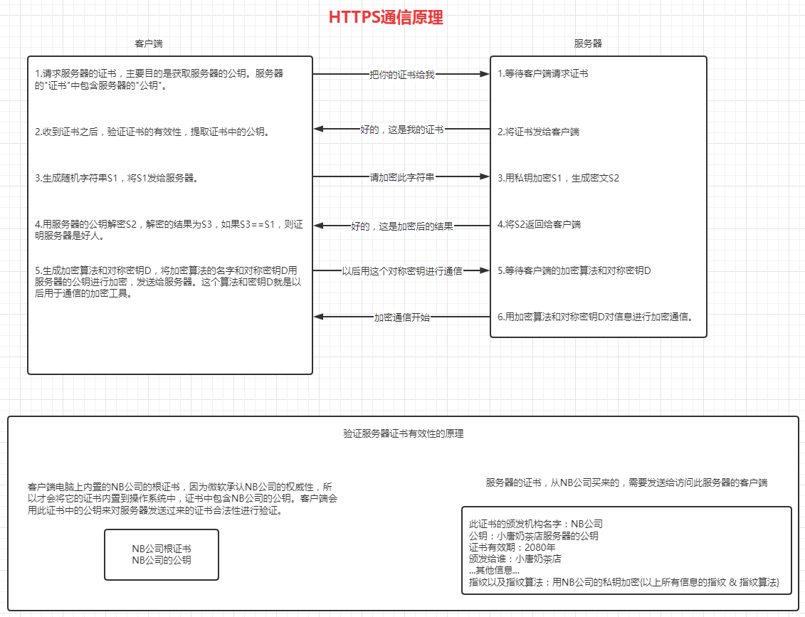

# TLS SSL HTTPS

**假设客户端拥有服务器的公钥：**

1. 客户端选择对称加密算法和对称加密密钥，将算法和密钥用服务器的公钥加密之后发送给服务器。
2. 服务器用自己的私钥解密出对称加密算法与对称加密密钥。
3. 此后服务器与客户端通过对称加密进行通信。

**上面是假设客户端拥有服务器的公钥，如何让客户端真的拥有服务器的公钥？**

- 通信之前先访问服务器获取服务器的公钥：不行，客户端怎么知道访问的是不是黑客？
- 客户端程序员去服务器公司，询问服务器的程序员公钥是什么，将服务器公钥手写在纸上拿回来，内置到客户端程序中：可以，但是太费程序员了！
- 通过证书来验证公钥的合法性：可以
