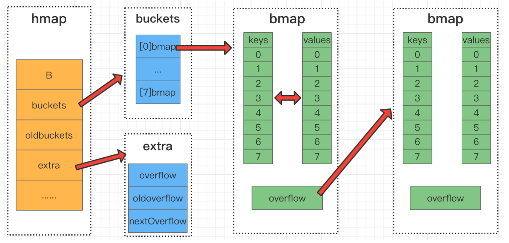

# ES

## ES写入过程

123

## ES查询过程

123

## MySQL数据导入ES

mysql binlog

# MYSQL

## mysql使用B+树的原因

减少树的层数，进而减少磁盘IO（非叶子节点不保存数据，可以保存更多的索引，同等数据量下减少树的层数）

可以范围查询（叶子节点时双向链表）

## mongodb使用B树的原因：

mongodb不需范围查找，人家设计的就是面向文档的

查询单个KEY，速度快于b+树，不用每次都查到叶子节点，有可能在半路就找到对象了

# REDIS

## REDIS持久化

AOF：

RDB：

## REDIS大KEY

危害：如果不小心读取了这个KEY，那么会非常耗时（CPU和宽带），同时阻塞住redis服务的其它操作。如果是集群架构，甚至可能造成故障切换。

解决：拆分大KEY，比如按照userid % 1024将大KEY拆分成1024个小KEY

## REDIS热KEY

123

## REDIS穿透

123

## REDIS雪崩

123

## REDIS过期删除策略

惰性删除+定期删除，定期删除的时间间隔通过配置项hz来设置。

惰性删除：数据被访问时（读写），查看此数据是否已经过期，如果过期了就删除。

定期删除：redis会定期遍历过期字典，每次随机挑选一部分数据进行过期检测，如果数据已过期，就会被删除掉。将hz设置为10，代表每秒执行10次扫描。

过期数据时保存在redisDb这个全局struct中的map字段中（redisDb.map称为过期字典）

## REDIS过期回调

1. 配置项notify-keyspace-events来开启过期回调
2. 订阅redis自带的频道，接收过期事件

注意：redis仅保证发送通知，不保证客户端有没有接收到

## REDIS内存满了删除策略

配置项maxmemory设置满内存删除策略

- noeviction：插入数据时直接返回错误，不淘汰任何已经存在的redis键
- volatile-ttl：删除快过期的redis键
- allkeys-random：随机删除redis键
- volatile-random：随机删除有过期时间的redis键
- allkeys-lru：所有的键使用lru算法进行淘汰
- volatile-lru：有过期时间的使用lru算法进行淘汰
- volatile-lfu：根据lfu算法从有过期时间的键删除
- allkeys-lfu：根据lfu算法从所有键删除

LRU：优先淘汰最旧的数据（关键时最旧）（map+双向链表）

LFU：优先淘汰最少使用的数据（关键时使用次数）（map+最小堆）

## redisObject

```c
typedef struct redisObject {
    unsigned type:4; 		// 类型 String List Hash Set ZSet
    unsigned notused:2; 	// 对齐位
    unsigned encoding:4;  	// 编码方式 Raw IntString 嵌入式字符串 ziplist skiplist
    unsigned lru:22;		// LRU 时间（相对于 server.lruclock）
    int refcount;			// 引用计数，用于自动内存管理(智能指针)，也用于小数据的共享
    void *ptr;				// 实际数据指针
} robj;
```

## redis所有数据类型

string：int、raw、embstr

list：quicklist

hash：ziplist、dict

set：ziplist、dict

sorted set：ziplist、skiplist

stream：

## redis所有编码格式

raw：动态字符串

- 拿到字符串指针，向低地址方向移动1byte，找到flag
- flag标识了字符串的类型sdshdr8 or sdshdr16 or sdshdr32...
- 知道了字符串的类型，就能将这部分内存解释成特定的struct
- struct中包含了len(字符串长度)和alloc(字符串容量)

```c
struct __attribute__ ((__packed__)) sdshdr5 {
    unsigned char flags; /* 3 lsb of type, and 5 msb of string length */
    char buf[];
};
struct __attribute__ ((__packed__)) sdshdr8 {
    uint8_t len; /* used */
    uint8_t alloc; /* excluding the header and null terminator */
    unsigned char flags; /* 3 lsb of type, 5 unused bits */
    char buf[];
};
struct __attribute__ ((__packed__)) sdshdr16 {
    uint16_t len; /* used */
    uint16_t alloc; /* excluding the header and null terminator */
    unsigned char flags; /* 3 lsb of type, 5 unused bits */
    char buf[];
};
struct __attribute__ ((__packed__)) sdshdr32 {
    uint32_t len; /* used */
    uint32_t alloc; /* excluding the header and null terminator */
    unsigned char flags; /* 3 lsb of type, 5 unused bits */
    char buf[];
};
struct __attribute__ ((__packed__)) sdshdr64 {
    uint64_t len; /* used */
    uint64_t alloc; /* excluding the header and null terminator */
    unsigned char flags; /* 3 lsb of type, 5 unused bits */
    char buf[];
};
```

int：long类型数字能表示的字符串

embstr：分配redisobject时顺便将str的数据空间一起分配出来（redisobject与数据在内从中是连续的），比raw少了一次内存分配，同理释放内存时也少了一次内存释放

quicklist：quicklist的每一个节点都是ziplist

ziplist越长，内存越连续，内存碎片越小，每次数据改动越要realloc

ziplist越短，内存碎片越多，但realloc的次数会减小

```
list-max-ziplist-size 10	// 每个quicklist节点上的ziplist长度为10
list-max-ziplist-size 20	// 每个quicklist节点上的ziplist长度为20
list-max-ziplist-size -1	// 每个quicklist节点上的ziplist的大小不能超过4 Kb
list-max-ziplist-size -2	// 每个quicklist节点上的ziplist的大小不能超过8 Kb
list-max-ziplist-size -3	// 每个quicklist节点上的ziplist的大小不能超过16 Kb

list-compress-depth 0	// 不压缩
list-compress-depth 1 	// quicklist两端各有1个节点不压缩，中间的节点压缩
list-compress-depth 2 	// quicklist两端各有2个节点不压缩，中间的节点压缩
list-compress-depth n 	// quicklist两端各有n个节点不压缩，中间的节点压缩
```

ziplist：连续内存块、变长数据（插入和修改都不友好，内存移动与拷贝），每个entry的长度都不一样

```
ziplist结构
<zlbytes><zltail><zllen><entry>...<entry><zlend>
zlbytes：ziplist的总长度  4byte
zltail：结尾的地址(指向zlend)  4byte
zllen：数据项的个数(entry的个数)  2byte
entry：数据项
zlend：结尾(FF)  1byte

entry结构
<prevrawlen><len><data>
prevrawlen：上一个数据的长度，1或5字节
len：解释如何翻译data的数据，分8种类型
data：数据
```

```
hash-max-ziplist-entries 512 // 当字典中的k-v个数超过512个时, 转变为ht编码格式
hash-max-ziplist-value 64    // 当k-v中任何一个数据的长度超过64时, 转变为ht编码格式
```

skiplist：

```
zset-max-ziplist-entries 128	// 当zset中数据个数超过128个时, 转变为skiplist编码格式
zset-max-ziplist-value 64		// 当任意一个数据的长度超过64byte时, 转变为skiplist编码格式
```

hashtable(dict)：

渐进重hash，dict扩容时，渐进式的搬运旧dict到新dict

intset：有序数组，可以二分查找，每个entry的长度一样，比dict省内存，查找没有dict快

```
<encoding><length><entry>...<entry>
encoding：每个entry占用几个字节
length：entry的个数
entry：数据int8 or int16 or int32 or int64
```


```
set-max-intset-entries 512
```

## 编码转换配置

```
hash-max-ziplist-entries 512
hash-max-ziplist-value 64
```

# GO

## GO如何限制协程数量

- 通过带缓冲的channel，在启动goroutine之前，向channel中发送一个数据，如果被阻塞住了，说明数量到达上限，就在这里阻塞着就好了，什么时候不阻塞了，什么时候在运行goroutine。goroutine结束时，记得从channel中读出一个数据，给其它goroutine机会来运行。
- 协程池(ants/)

## goroutine调度原理

GMP模型

## map扩容



## channel数据结构

```go
type hchan struct {
    qcount uint 		// 当前队列中剩余元素个数
    dataqsiz uint 		// 环形队列长度，即可以存放的元素个数
    buf unsafe.Pointer 	// 环形队列指针
    elemsize uint16		// 每个元素的大小
    closed uint32 		// 标识关闭状态
    elemtype *_type 	// 元素类型
    sendx uint 	// 队列下标，指示元素写入时存放到队列中的位置
    recvx uint 	// 队列下标，指示元素从队列的该位置读出
    recvq waitq // 等待读消息的goroutine队列
    sendq waitq // 等待写消息的goroutine队列
    lock mutex 	// 互斥锁，chan不允许并发读写
}
```


# 延时队列

## redis

实现方式：

1. 将延时数据放入zset中，score为未来的时间戳
2. 另一个服务循环执行`ZRANGEBYSCORE your_delay_zset [0 [当前时间戳 LIMIT 0 100`来获取已经到达执行时间的数据，并将这些数据从redis中删除，获取与删除必须时原子操作。
3. 处理获取到的任务，可以直接处理也可以将其发送到消息队列。

缺点：

延时队列的大小受redis限制，受限于物理机的内存条的大小

优点：

可以修改或删除已经存在的延时任务

```lua
local data = redis.call('ZRANGEBYSCORE', KEYS[1], 0, redis.call('TIME')[1], 'LIMIT', '0', '1000')
for _, v in pairs(data) do
	redis.call('ZREM',KEYS[1], v)
end
return data
```

## kafka

实现方式：

创建多个类型的topic，如1S、60S、10m、30m、1h、1d等等

事件产生时，根据需要延时的时长，放到对应的topic中

每个topic用一个循环线程来获取数据

# Kafka

数据文件结构

topic由多个partition组成，partition由多个segment组成（假如1个segment最大1G，那么如果partition大小为5G的话，就有5个segment），segment由000000000.index和00000000.log文件组成
